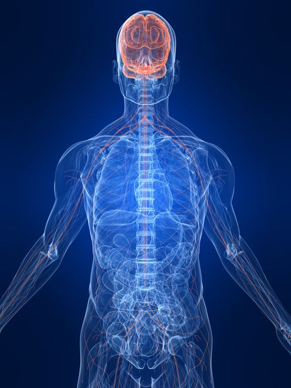

```{r setup, include=FALSE}
options(htmltools.dir.version = FALSE)
```

# Chapter 1:  Introduction

#### Introduction: What is Behavioral Neuroscience?
#### Biological Explanations of Behavior
#### Applications of Behavioral Neuroscience
#### Understanding Human Consciousness
#### Natural Selection and Evolution
#### Ethical Issues in Research with Animals


---

# Chapter 1:  Introduction

#### .bold[Introduction: What is Behavioral Neuroscience?]
#### .bold[Biological Explanations of Behavior]
#### .bold[Applications of Behavioral Neuroscience]
#### Understanding Human Consciousness
#### Natural Selection and Evolution
#### Ethical Issues in Research with Animals


---

# Introduction: What is Behavioral Neuroscience?

.pull-left[
| Normal |  |  Pathology |
|:--:|:--:|:--:|
|  sensation|  |  addiction|
|  motor activity|  |  neurodegenerative disorders|
|arousal	| |brain/spinal cord injury|
|motivation| 	|mood disorders|
|language|	|developmental disorders|
|socialization|	|cognitive aging|
|anxiety/fear| 	|psychiatric disorders|
|pain	| ||
|reproductive behavior| ||


]

.pull-right[
- study of physiological, evolutionary, & developmental mechanisms of behavior & experience
- focuses on functioning of  nervous system & reciprocal interactions with body to control behavior
- emphasis on both normal behaviors & pathology

.polaroid[
.rotate-right[

]
]
]

---

# Introduction: What is Behavioral Neuroscience?

#### Where do Behavioral Neuroscientists work?
- **University**: research and teaching
- **Research Institute**: research
- **Pharmaceutical/Biotechnology Industries**: research

#### What other disciplines contribute?
- **Basic Research**: Neuroanatomy, Neurochemistry, Electrophysiology, Developmental Biology, Molecular Biology
- **Preclinical/Clinical Research**: Neurology, Endocrinology, Psychiatry
- integrative function of Behavioral Neuroscience

.pull-left[]
.pull-right[]


---

# Introduction: What is Behavioral Neuroscience?

#### Methodological Approaches.
- **Simplification**: procedures to reduce complexity of experiments without altering level of analysis
- **Generalization**: general conclusions based on many observations  


---

# Biological Explanations of Behavior

#### Methodological Approaches.

**Reductionism**: shift in level of analysis from behaving organism to neuronal systems, circuits, cells & molecules
  
**Explanatory Reductionism**: understanding components of a system that will ultimately explain behavioral characteristics
  


---

# Biological Explanations of Behavior

.pull-left[
.content-box-gray[
#### Proximal Explanations
- **PHYSIOLOGICAL**: relationship between behavior and activity of brain/other organs
- **ONTOGENETIC**: development within individual (genes, nutrition, experience, etc.) 
]]
.pull-right[
.content-box-green[
#### Ultimate Explanations
- **FUNCTIONAL**:  purpose served by particular behavior (adaptation for survival)
- **PHYLOGENETIC**: evolutionary organization of the capacity for particular behavior
]]

.pull-right[]


---

# Applications of Behavioral Neuroscience

#### The Human Genome Project. 
- structure of DNA published April 25, 1953
- human genome completely sequenced April 14, 2003
- more than 99.99% accuracy
- highly contiguous
- only 1.1 – 1.4% of 3.2 billion base pairs encode proteins
- approximately 24,000 genes
- single nucleotide polymorphism (SNP)  .content-box-grey[
.font200[  ] .font200[` --> `] .font200[  ]]
- Behavioral Neuroscientists study functions of mapped genes and their products, interactions of resulting biochemistry with environmental events… as they relate to behavior.


---

# Applications of Behavioral Neuroscience

#### The Proteome and Connectome Projects. 
- genome project is just the blueprint
- new focus on functional impacts

.pull-left[]

.pull-right[]


--


---
# Image Credits
- slide 3:	 https://www.humanillnesses.com/Behavioral-Health-A-Br/The-Brain-and-Nervous-System.html
- slide 4: https://www.nih.gov ; https://www.nsf.gov
- slide 5:	photo from lab of D. Devine https://michaeljeffreys.wordpress.com/tag/addiction/
- slide 6:	photo from lab of D. Devine https://science.nationalgeographic.com/science/photos/brain/
	higheredbcs.wiley.com/legacy/college/tortora/0470565101/hearthis_ill/pap13e_ch12_illustr_audio_mp3_am/simulations/hear/neural_circuits.html  
	https://classconnection.s3.amazonaws.com/811/flashcards/141811/jpg/neuron21320853416098.jpg  
	www.publicdomainpictures.net/view-image.php?image=42718&picture=dna
- slide 7: https://www.123rf.com/stock-photo/birdsong.html
- slide 8: https://commons.wikimedia.org/wiki/File:Logo_HGP.jpg
- slide 9:	Jeong, H., Mason, S.P., Barabasi, A.L. and Oltavi, Z.N. (2001). Lethality and centrality in protein networks.  Nature 411, 41-42.  doi: 10.1038/35075138  	https://images.frompo.com/w/connectome


