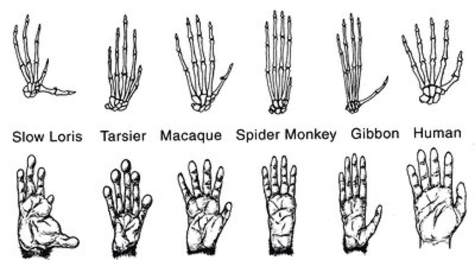

```{r setup, include=FALSE}
options(htmltools.dir.version = FALSE)
```

# Chapter 1:  Introduction

#### Introduction: What is Behavioral Neuroscience?
#### Biological Explanations of Behavior
#### Applications of Behavioral Neuroscience
#### Understanding Human Consciousness
#### .bold[Natural Selection and Evolution]
#### Ethical Issues in Research with Animals


---
name: 1-3-2
layout: true

# Natural Selection and Evolution


---
name: 1-3-3
layout: true

# Natural Selection and Evolution
### 5 Kingdoms of Living Organisms.
- animals are most recently evolved kingdom
- defined by evolution of neurons and muscles


---
name: 1-3-4
layout: true

# Natural Selection and Evolution
.pull-left[
### ~30 Animal Phyla.
- nervous system evolves:
- simple nerve net
- segmented ladder-like, cephalized system with bilateral symmetry
- ganglia and brain
- ventral nerve cord
- vertebrate n.s. with brain and spinal cord
]

---
name: 1-3-5
layout: true

# Natural Selection and Evolution
### Humans and Apes Evolved from Common Ancestors.
- chimpanzees/bonobos are our closest relatives

---
name: 1-3-6
layout: true

# Natural Selection and Evolution
### Humans and Apes Evolved from Common Ancestors.
- chimpanzees/bonobos are our closest relatives


- 98.6% in common with the human genome
- 35 million single nucleotide substitutions
- 5 million small insertions and deletions
- 1 chromosome fusion

---
name: 1-3-7
layout: true

# Natural Selection and Evolution
### Genetic Variation and Phenotypic Variation.
- dogs have approx 0.15% genomic variation but great phenotypic variation
- mus musculus and mus spretus have about the same difference as between humans and chimps, but very little phenotypic variation

---
name: 1-3-8
layout: true

# Natural Selection and Evolution
### Darwin’s Principles.
1. Organisms produce more progeny than can survive.
2. Sexual reproduction → biological variation (genotype)
3. Biological Variation → trait variation (phenotype)
4. Traits are inheritable.
5. The environment selects for particular traits.
6.  Different traits cause differential reproduction.

---
name: 1-3-9
layout: true

# Natural Selection and Evolution
.pull-left[
### Evolution is Random.
- genes that promote reproductive success are favored
- most mutations are not viable
]
.pull-right[
### Sickle Cell Anemia.
- disorder of red blood cells
- 1:375 African Americans
- prominent in Hispanic and Mediterranean populations
- survival advantage: increased resistance to malaria 
]

---
name: 1-3-10
layout: true

# Natural Selection and Evolution
### Types of Genetic Selection.
- stabilizing selection: eliminates extremes of trait
- directional selection: selects for extreme of particular trait
- divergent (or disruptive) selection: splits population into extremes, speciation (new species)

---
name: 1-3-11
layout: true

# Natural Selection and Evolution
### Types of Genetic Selection.
- convergent selection: shared pressures produce “mimicked” traits

---
name: 1-3-12
layout: true

# Natural Selection and Evolution
### Brain Evolution.
.pull-left[
- What’s the difference between brains?
- How did ancestral brain evolve to become modern human brain?
]

---
name: 1-3-13
layout: true

# Natural Selection and Evolution
### Brain Evolution - Brain Mass.
- massive increase in hominid brain size during the last 1.5 million years


---
name: 1-3-14
layout: true

# Natural Selection and Evolution
### Brain Evolution - Brain to Body Mass Ratio.
- largest brains in largest animals (elephant & blue whale)
- overall, mammals have larger brains per body mass
- modern man is at apex of brain to body mass ratio

---
name: 1-3-15
layout: true

# Natural Selection and Evolution
### Brain Evolution - Brain Maturation.
- neoteny: the slowing of maturation in a species
- skulls of fetal humans and chimps are similar
- skulls of adult humans and chimps are not
- human skull does not change much during development

---
name: 1-3-16
layout: true

# Natural Selection and Evolution
### Brain Evolution - Rostral Encephalization.
- important functions generally map onto larger areas of brain
- evolutionary expansion of rostral structures
- elaboration (not addition) of existing structures

---
name: 1-3-17
layout: true

# Natural Selection and Evolution
### Brain Evolution - Encephalization.
- neocortex occupies larger proportion of brain volume in humans than it does in any other species

---
name: 1-3-18
layout: true

# Natural Selection and Evolution
### Brain Evolution - Complex Cells.
- human cortex contains more complex cells (bigger and more branched), and more complex layers

---
name: 1-3-19
layout: true

# Natural Selection and Evolution
### Brain Evolution - Enhanced Learning Capacity.
- more complex brain = facilitated reversal learning


---
name: 1-3-20
layout: true

# Natural Selection and Evolution
.pull-left[
### Brain Evolution - Why Hominid Brain Became More Complex.
- major climate changes
- migrations isolate hominid populations
- foraging lifestyle, fruit diet
- eventual scavenging, hunting/gathering
- social lifestyle evolution
]
.pull-right[
Spider monkey  
`brain =` **107g**  
**72%** `fruit diet`  
`28% leaves`  
]
.pull-right[  
    
Howler monkey  
`brain =` **50g**  
**42%** `fruit diet`  
`58% leaves`  
]

---
name: 1-3-21
layout: true

# Natural Selection and Evolution
### Brain Evolution - Coordinate Evolution of Brain and Body.
- radiator hypothesis:  higher energy metabolism produces higher heat production, so brain size is limited by ability of organism to cool brain
- humans have greater blood flow through skull than *Australopithecus* did

---
name: 1-3-22
layout: true

# Natural Selection and Evolution
### Brain Evolution - Coordinate Evolution of Brain and Body.
- other bodily features correspond to evolutionary changes in brain
- in apes and early hominids bone structures suited to climbing
- in *homo sapiens* bone structures suited to striding/running and tool use

---
name: 1-3-23
layout: true

# Natural Selection and Evolution
### Brain Evolution - Coordinate Evolution of Brain and Body.
.pull-left[
- in apes and early hominids, high pharynx and larynx restricts range of sound production
- in apes, portions of brain associated with language less complex than in humans
]


---
name: 1-3-24
layout: true

# Image Credits

- slide 2:	https://www.flickr.com/photos/mysticpolitics/6333162973/
- slide 3:	http://www.biology.iupui.edu/biocourses/N100/images/5king.GIF
- slide 4:	 http://www.shmoop.com/taxonomy/questions.html
	http://sites.sinauer.com/animalphys3e/boxex15.01.html
- slide 5:	http://s2.hubimg.com/u/4290693_f520.jpg
- slide 6:	http://s2.hubimg.com/u/4290693_f520.jpg
	www.nature.com
- slide 7:	http://searchpp.com/great-dane-chihuahua/
	http://www.nanonewsnet.ru/news/2011/evropeiskie-myshi-zapoluchili-gen-ustoichivosti-k-yadu
- slide 8:	http://en.wikipedia.org/wiki/Charles_Darwin
- slide 9:	http://writingaboutnature.webs.com/adorathealbinoalligator.htm
	http://pixshark.com/pestilence-disease.htm
- slide 10:	http://thewarshawcurve.com/the-new-yorker-the-warshaw-curve/
- slide 11:	http://becuo.com/convergent-evolution-sharks-and-dolphins
	http://www.tedaltenberg.com/teacher/wms/science/unit3/10-evidence.shtml
- slide 12:	Pinel, J.P.J. (1997). Biopsychology,  Allyn and Bacon
	http://www.evolution-textbook.org/content/free/figures/25_EVOW_ART/11_  EVOW_CH25.jpg


---
name: 1-3-25
layout: true

# Image Credits

- slide 13:	Breedlove, S.M., Watson, N.V. (2013). Biological Psychology: An Introduction to Behavioral, Cognitive, and Clinical Neuroscience, 7th ed. Sinauer Associates, Inc.
- slide 14:	Breedlove, S.M., Watson, N.V. (2013). Biological Psychology: An Introduction to Behavioral, Cognitive, and Clinical Neuroscience, 7th ed. Sinauer Associates, Inc.
- slide 15:	Carlson, N.R. (2012). Physiology of Behavior, 11th ed. Pearson Publishing
- slide 16:	http://khakhalin.blogspot.com/2012/08/brain-evolution-tree.html
	http://www.brainspinehospitals.com/
	Breedlove, S.M., Watson, N.V. (2013). Biological Psychology: An Introduction to Behavioral, Cognitive, and Clinical Neuroscience, 7th ed. Sinauer Associates, Inc.
- slide 17:	Roberts, M., Hanaway, J., Morest, D.K. (1987) Atlas of the Human Brain in Section, 2nd ed. Philadephia: Lea & Febiger
	Breedlove, S.M., Watson, N.V. (2013). Biological Psychology: An Introduction to Behavioral, Cognitive, and Clinical Neuroscience, 7th ed. Sinauer Associates, Inc.
- slide 18:	adapted from Behavioral Evolution and Integrative Levels: The T.C. Schneirla Conference Series, Vol 1 (1984). Greenberg, G., Tobach, E. (Eds.), Psychology Press.
- slide 19:	http://nocarbdiets.atspace.eu/monkeys-diet.html
	http://www.chanatrek.com/howler-monkeys-are-cool/


---
name: 1-3-26
layout: true

# Image Credits

- slide 20:	http://pt.wikipedia.org/wiki/Australopithecus_afarensis
	http://en.wikipedia.org/wiki/Australopithecine
- slide 21:	http://elearning.la.psu.edu/anth/022/lesson_2/anatomical-features
	http://www.nap.edu/openbook.php?record_id=11876&page=34
- slide 22:	http://www.ling.upenn.edu/courses/Fall_2011/ling001/com_bio.html
	http://commons.wikimedia.org/wiki/File:Broca%27s_area_animation.gif


---
template: 1-3-2


---
template: 1-3-3


---
template: 1-3-4


---
template: 1-3-5


---
template: 1-3-6


.bolder.Large.red[]
.bolder.Large.red[]
.bolder.Large.red[]


---
template: 1-3-7


---
template: 1-3-8


---
template: 1-3-9


---
template: 1-3-10


---
template: 1-3-11


---
template: 1-3-12


---
template: 1-3-13


.red.bolder.Large[]
.red.bolder.Large[]

---
template: 1-3-14


---
template: 1-3-15


---
template: 1-3-16


---
template: 1-3-17


---
template: 1-3-18


---
template: 1-3-19


---
template: 1-3-20


---
template: 1-3-21


---
template: 1-3-22





---
template: 1-3-23


.bolder.large.red[]
.bolder.large.red[]

.bolder.large.red[]


---
template: 1-3-24

---
template: 1-3-25


---
template: 1-3-26

