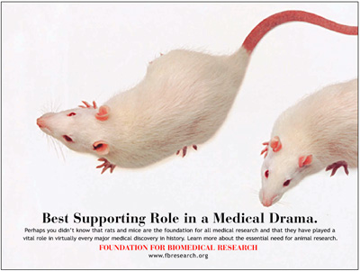

```{r setup, include=FALSE}
options(htmltools.dir.version = FALSE)
```

# Chapter 1:  Introduction

#### Introduction: What is Behavioral Neuroscience?
#### Biological Explanations of Behavior
#### Applications of Behavioral Neuroscience
#### Understanding Human Consciousness
#### Natural Selection and Evolution
#### .bold[Ethical Issues in Research with Animals]


---
name: 1-4-2
layout: true

# Ethical Issues in Research with Animals
### What is an Animal with Rights?
- Approximately 1 million species in 30 phyla of animal kingdom
- Divergent views on what constitutes an animal with rights
- Different people oppose different kinds of animal use

---
name: 1-4-3
layout: true

# Ethical Issues in Research with Animals
### How are Animals Used by Humans?
- Animals used by humans for food/clothing/protection since earliest recorded history
- Modern man uses animals for more purposes than ever
- Modern societies differ in their use of animals

---
name: 1-4-4
layout: true

# Ethical Issues in Research with Animals
.pull-left[
### How are Animals Used in Research?
- Health & well-being of both humans & animals benefit from study of physiology & behaviors of animals 
- Many questions cannot be answered by human experiments
- Animal research has led to development of conservation programs
]

---
name: 1-4-5
layout: true

# Ethical Issues in Research with Animals
### What are the Arguments Against Using Animals in Research?
.pull-left[
- Some claim that animals are too different from humans to yield useful biological information about human function and disease
- Some claim animal research has not cured disease and is therefore ineffective
]

---
name: 1-4-6
layout: true

# Ethical Issues in Research with Animals
### Animal Advocacy.
.pull-left[
- **Abolitionists**: demand total cessation of animal captivity, use of animals for food/work/ companionship/research
]
.pull-rigt[
- **Minimalists**: desire reduction in animal research and controls on type of research, distress to animals, and species used
]

---
name: 1-4-7
layout: true

# Ethical Issues in Research with Animals
### Animal Advocacy.
- Refinement: techniques to minimize potential pain/distress/discomfort to animals
- Reduction: methods to minimize number of animals
- Replacement: alternatives to use of live animals

---
name: 1-4-8
layout: true

# Ethical Issues in Research with Animals
### Guidelines and Legislation Governing Use of Animals in Research.

- Federal:
    - Animal Welfare Act
    - Health Research Extension Act
    - Guide for the Care and Use of Laboratory Animals
    - AALAC
    - OLAW
    - USDA
- University of Florida:
    - IACUC
- Funding agencies:
    - National Institutes of Health
    - National Science Foundation
    - Private Foundations
- Professional societies:
    - Society for Neuroscience
    - American Psychological Association
    - all scientific journals, etc….

---
name: 1-4-9
layout: true

# Ethical Issues in Research with Animals
### Conclusions.
.pull-left[
- Use of animals will continue for foreseeable future
- Ongoing efforts continue to assure humane treatment
- “Middle ground” can be found by reasonable people
- Greater dissemination of information by scientists will
  promote more informed public opinion
]


---
name: 1-4-10
layout: true

# Image Credits

- slide 2:	http://www.shmoop.com/taxonomy/questions.html
- slide 3:	http://stravaganzastravaganza.blogspot.com/2012/10/meat-animals-origin-and-domestication.html
	http://www.idsociety.org/Agriculture_policy/
	http://www.guidedogs.ie/iopen24/about-us-t-18.html#.VNeG0i78g-0
- slide 4:	http://www.docstoc.com/docs/82873846/Endengered-Species
- slide 5:	http://www.chm.bris.ac.uk/motm/thalidomide/first.html
- slide 6:	http://pixshark.com/pestilence-disease.htm
	http://newyork.cbslocal.com/2010/08/12/rats-its-an-invasion-in-manhattan/
	http://toplinepest.com/portfolio-view/house-rats/
	http://www.britannica.com/EBchecked/topic/275732/human-louse
- slide 7:	http://upload.wikimedia.org/wikipedia/commons/9/9f/Huntingdonmarch.jpg
	https://speakingofresearch.files.wordpress.com/2010/04/ryan-jones-pro-test-4.jpg
- slide 8:	http://www.theodora.com/rodent_laboratory/anesthesia_analgesia.html
	http://www.biochemia-medica.com/content/power-analysis-research
	http://blogs.nature.com/actionpotential/2012/01/patients-bring-alzheimers-to-the-dish.html


---
name: 1-4-11
layout: true

# Image Credits

- slide 9:	http://www.nap.edu/catalog/12910/guide-for-the-care-and-use-of-laboratory-animals-eighth
- slide 10:	http://www.swaebr.org/images/MedDramaPoster_lg.jpg
	http://ihm1.nlm.nih.gov/MediaManager/srvr?mediafile=/Size4/NLMNLM-1-NA/1195/A108866.jpg&userid=3&username=nlmadmin&resolution=4&servertype=JVA&cid=1&iid=NLMNLM&vcid=NA&usergroup=Images_from_the_History_of_Medicine-1-Admin&profileid=1


---
template: 1-4-2


---
template: 1-4-3


---
template: 1-4-4


---
template: 1-4-5


---
template: 1-4-6


---
template: 1-4-7


---
template: 1-4-8


---
template: 1-4-9



.bolder.large.red[]
.bolder.large.red[]
.bolder.large.red[]


---
template: 1-4-10

---
template: 1-4-11

