```{r setup, include=FALSE}
options(htmltools.dir.version = FALSE)
```

# .font80[Chapter 2:  Structure and Function of Cells of the Nervous System]

#### .bold[Cells of the Nervous System]
- #### Neurons
- #### .bolder[Glia]
  
#### Communication Within a Neuron
  
#### Communication Between Neurons


---
name: 2-2-2
layout: true

# Cells of the Nervous System
- two principal kinds of cells: neurons and glia

---
name: 2-2-3
layout: true

# Cells of the Nervous System
### Glia.
- variety of specialized functions
- insulation, protection, transport of nutrition/waste

---
name: 2-2-4
layout: true

# Cells of the Nervous System
### Glia.
- CNS ependymal cells: line the ventricles and central canal
- assist in formation and movement of CSF

---
name: 2-2-5
layout: true

# Cells of the Nervous System
### Glia.
- CNS oligodendrocytes: provide myelin for axons
- insulation and propagation of signals


---
name: 2-2-6
layout: true


# Cells of the Nervous System
### Glia.
- CNS astrocytes: 
    - regulate extracellular environment
    - surround synapses
    - surround Nodes of Ranvier
    - communicate between neuron & circulation


---
name: 2-2-7
layout: true


# Cells of the Nervous System
### Glia.
- CNS astrocytes: form blood-brain barrier

---
name: 2-2-8
layout: true

# Cells of the Nervous System
### Glia.
- CNS microglia: mobile phagocytic cells
- immune defenses, damage cleanup

---
name: 2-2-9
layout: true

# Cells of the Nervous System
### Glia.
- CNS radial glia: scaffold for migration of cortical
  cells in early development
  
---
name: 2-2-10
layout: true

# Cells of the Nervous System
### Glia.
- PNS satellite glial cells: surround soma of neurons
- functions similar to astrocytes

---
name: 2-2-11
layout: true

# Cells of the Nervous System
### Glia.

- PNS Schwann cells: provide myelin for axons
- insulation and propagation of signals

---
name: 2-2-12
layout: true


# Cells of the Nervous System
### Glia.

- PNS Schwann cells: guide regrowth of damaged axons


---
name: 2-2-13
layout: true

# Image Credits

- slide 2:	http://www.iricss.org/fa/NewsRelease/News/PublishingImages/1389_B/111289_Neuron_Glial _large.jpg
- slide 3:	http://en.wikipedia.org/wiki/Neuroglia#mediaviewer/File:Blausen_0870_TypesofNeuroglia.png
- slide 4:	https://howardhughes.trinity.duke.edu/uploads/assets/image/Lily%20Zerihun/Image%203.png
- slide 5:	http://wmaresh.wikispaces.com/file/view/oligo.gif/178971325/oligo.gif
- slide 6:	http://images.slideplayer.com/1/225187/slides/slide_13.jpg
	http://intranet.tdmu.edu.ua/data/kafedra/internal/histolog/classes_stud/en/stomat/ptn/1/10%20Nerve%20system.files/image011.jpg
- slide 7:	Carlson, N.R. (2012). Physiology of Behavior, 11th ed. Pearson Publishing
- slide 8:	Breedlove, S.M., Watson, N.V. (2013). Biological Psychology: An Introduction to Behavioral, Cognitive, and Clinical Neuroscience, 7th ed. Sinauer Associates, Inc.
- slide 9:	http://www.gnxp.com/blog/uploaded_images/bhg017f2-786597.jpeg
- slide 10:	http://medical-dictionary.thefreedictionary.com/_/viewer.aspx?path=MosbyMD&name= satellite _cells.jpg&url=http%3A%2F%2Fmedical-dictionary.thefreedictionary.com %2Fsatellite%2Bcells
- slide 11:	http://kvhs.nbed.nb.ca/gallant/biology/schwann_myelin.jpg
- slide 12:	http://www.hindawi.com/journals/bmri/2014/132350.fig.003.jpg
""


---
template: 2-2-2
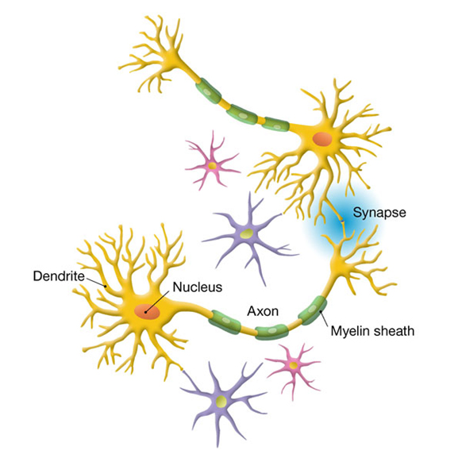


---
template: 2-2-3
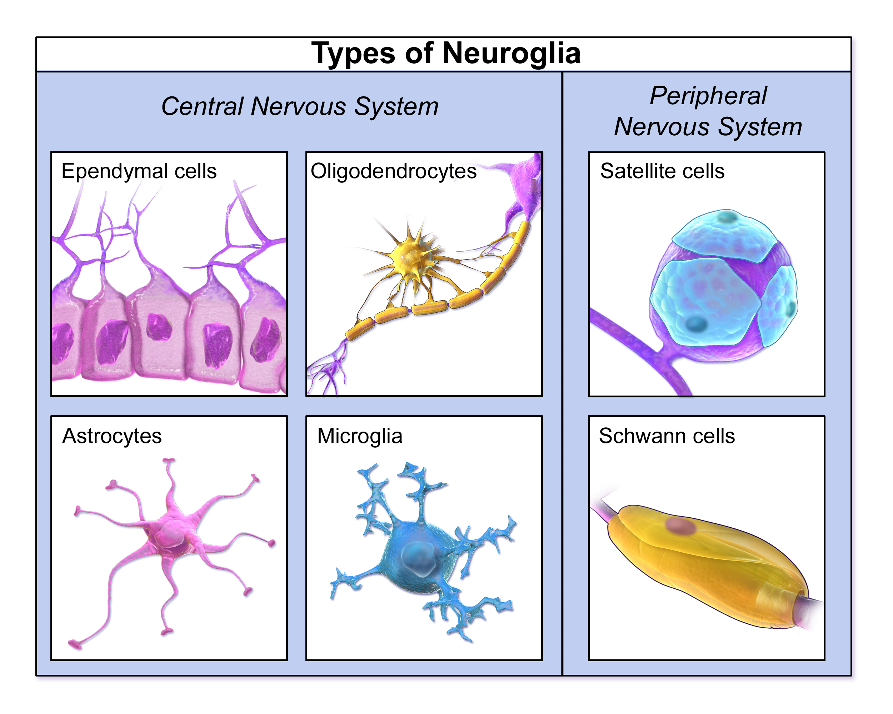


---
template: 2-2-4
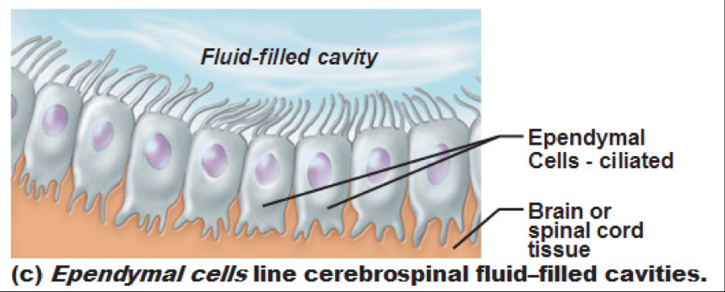


---
template: 2-2-5
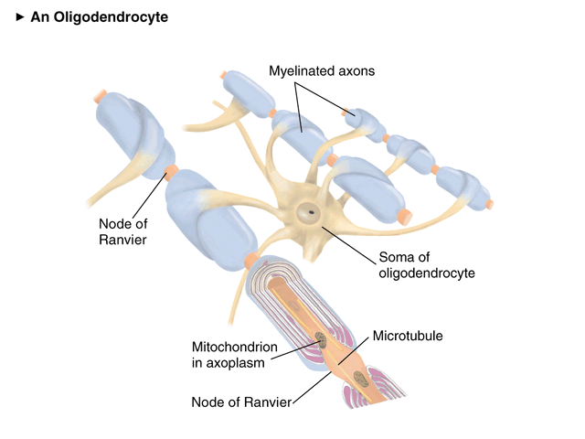


---
template: 2-2-6
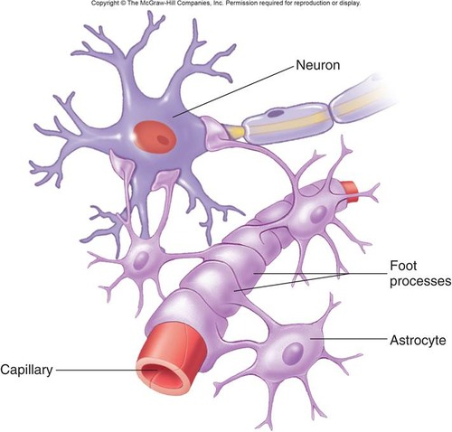

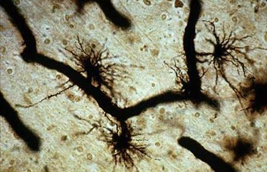


---
template: 2-2-7
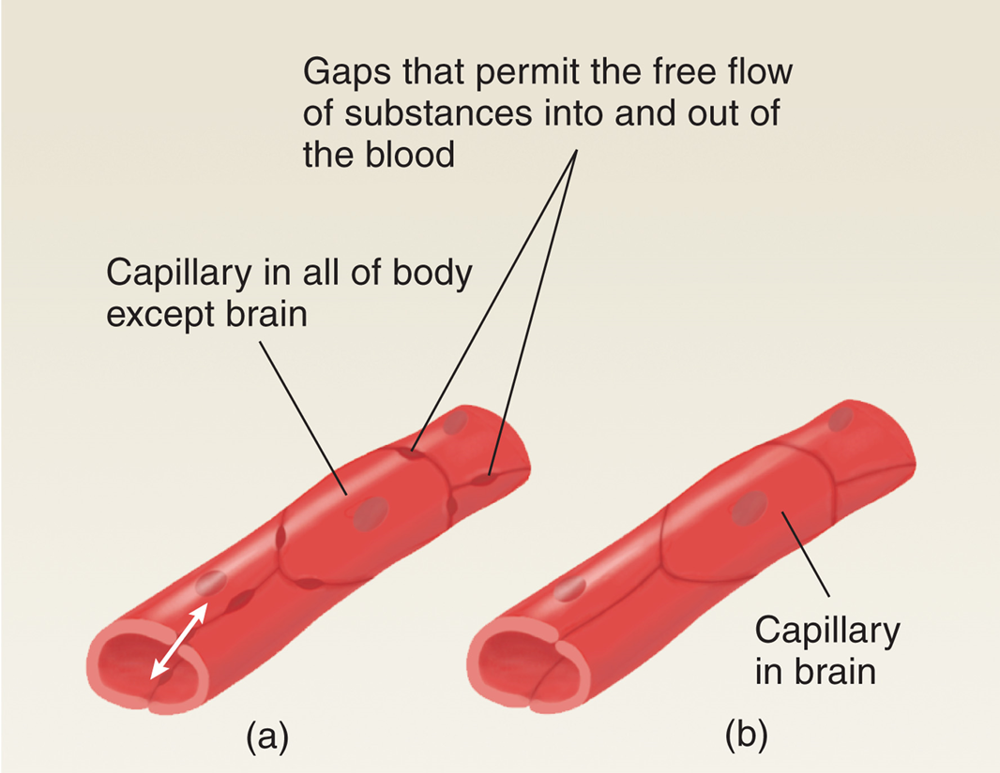

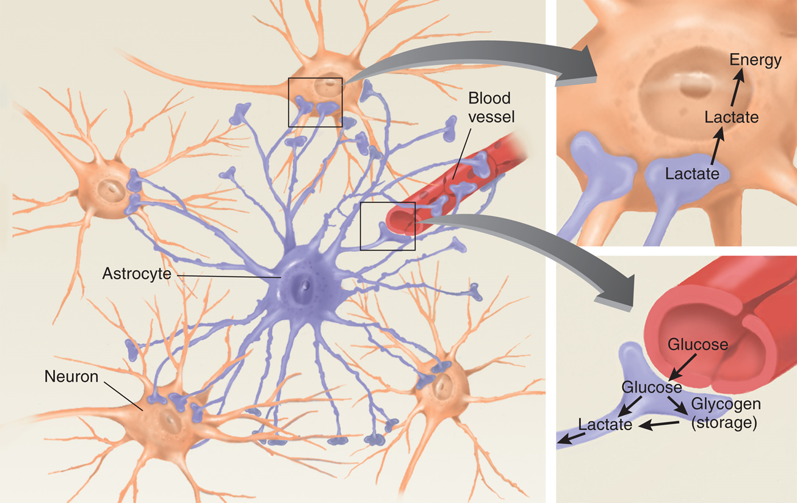


---
template: 2-2-8
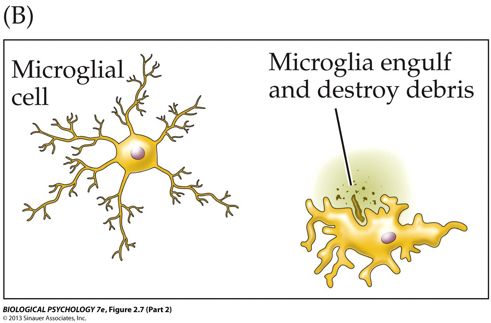


---
template: 2-2-9
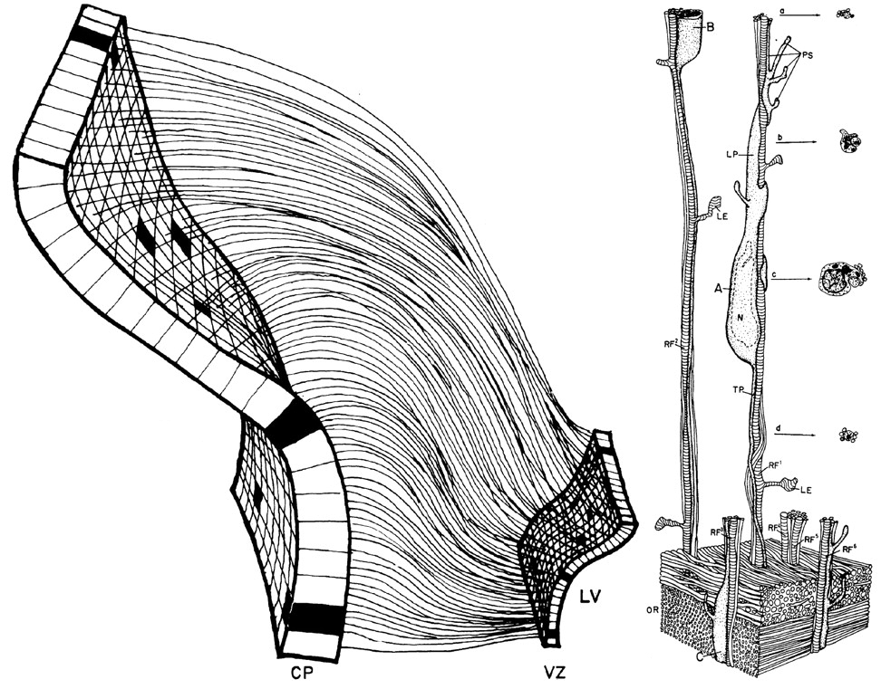


---
template: 2-2-10
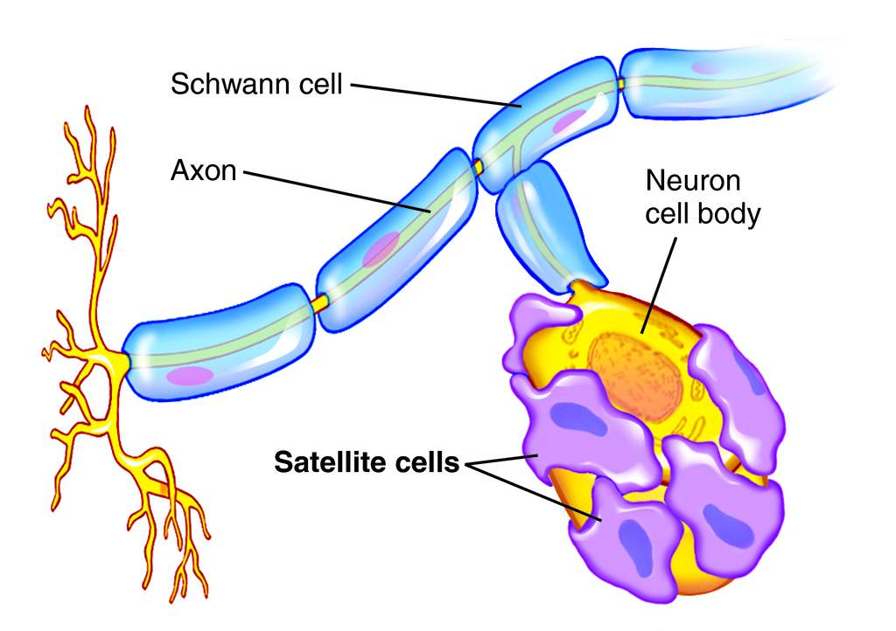


---
template: 2-2-11
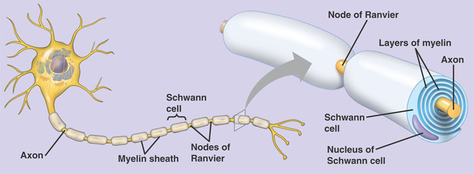


---
template: 2-2-12
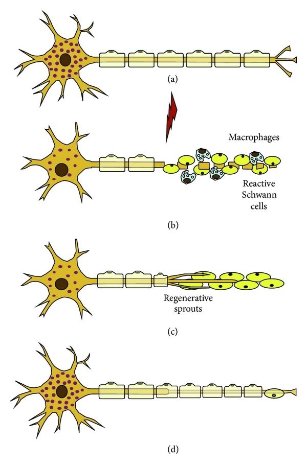

---
template: 2-2-13