```{r setup, include=FALSE}
options(htmltools.dir.version = FALSE)
```


# .font80[Chapter 2:  Structure and Function of Cells of the Nervous System]
  
### Cells of the Nervous System

### .bold[Communication Within a Neuron]
- #### .bolder[Local changes in membrane potential]
- #### The action potential  
  
### Communication Between Neurons


---
name: 2-3-2
layout: true

# Communication Within a Neuron
.pull-left[
### Basic Definitions.

- **Membrane potential**: 
    - stored source of energy across membrane 
    - *difference* in electrical charge 
        - from inside to outside of cell
- **Resting potential**: 
    - polarized potential 
    - approx. -70 mV in idealized neuron (varies)
]


---
name: 2-3-3
layout: true

# Communication Within a Neuron
### Basic Definitions.  
- **Graded potential**: small change in membrane potential due to small exchange of ions

.pull-left[  
- **Depolarization**: membrane potential changes to become less negative inside relative to the outside, decreases polarization toward neutrality
]

.pull-right[  
- **Hyperpolarization**: membrane potential changes to become more negative inside relative to the outside, increases polarization
]

---
name: 2-3-4
layout: true

# Communication Within a Neuron
.pull-left[
### Basic Definitions.
.small[ 
- **Action potential**: 
  - large depolarization & repolarization
  - conducted along axon to terminal region
  - initiated if stimulus is above threshold: * ≳ -55mV *
  - magnitude invariant: regardless of initiating stimulus
]
]

---
name: 2-3-5
layout: true

# Communication Within a Neuron
.pull-left[  
### Basic Definitions.
- **Concentration gradient** / **Force of diffusion**:
- molecules in constant motion, diffuse to minimize concentration gradient
- impermeable or semi-permeable membranes affect distribution of molecules
]

---
name: 2-3-6
layout: true

# Communication Within a Neuron
### Basic Definitions.

- **Voltage gradient** / **Electrostatic force**:
- electrolytes dissociate into ions in solution
- e.g. NaCl dissociates into Na+ and Cl-
- like forces repel, and opposite forces attract
- impermeable or semi-permeable membranes affect distribution of molecules

---
name: 2-3-7
layout: true

# Communication Within a Neuron
.pull-left[
### Basic Definitions.
- **Voltage gradient** / **Electrostatic force**:
- ions distributed across the membrane create a “cloud” of charge over the intracellular and extracellular surfaces
]

---
name: 2-3-8
layout: true

# Communication Within a Neuron
### The Membrane and Ion Distribution.

- **Cations**: Na+, K+, Ca2+;  anions: Cl-, proteins
- **Channel proteins**: allow controlled exchange of ions

---
name: 2-3-9
layout: true

# Communication Within a Neuron
### The Membrane and Ion Distribution.
- **Resting potential** (-70mV):
- .bolder.red[Na+] > 10x more concentrated in extracellular fluid
- .bolder.blue[K+] > 20x more concentrated in intracellular fluid
- .bolder.green[Cl-] concentrated in extracellular fluid
- .bolder[proteins] virtually absent in extracellular space


---
name: 2-3-10
layout: true

# Communication Within a Neuron
.pull-left[
### Sodium-Potassium Pump:
- **Na+**: 
    - Na+/K+ pump actively transports 3 Na+ out of cell
  
- **K+**: 
    - Na+/K+ pump actively transports 2 K+ into cell  
  
- *Extremely energy expensive*  
    - uses up to 40% of neurons energy resources
]

---
name: 2-3-11
layout: true

# Communication Within a Neuron
### Summary of Forces on Na+ at Resting Potential:
- concentration gradient pushes Na+ inward
- electrical gradient pushes Na+ inward
- BUT membrane is almost impermeable to Na+

---
name: 2-3-12
layout: true

# Communication Within a Neuron
### Summary of Forces on K+ at Resting Potential:
- concentration gradient pushes K+ outward
- membrane is semipermeable to K+, so some leaks out
- BUT electrical gradient keeps most K+ inside cell

---
name: 2-3-13
layout: true

# Communication Within a Neuron
### Summary of Forces on Cl- at Resting Potential:
- proteins tend to carry net negative charges
- proteins cannot passively move across membrane

---
name: 2-3-14
layout: true

# Communication Within a Neuron
### Summary of Forces on Organic Anions at Resting Potential:
- large anions like proteins are mostly within cells
- contribute to negative internal charge, cannot leave

---
name: 2-3-15
layout: true

# Communication Within a Neuron
### Summary of Forces on Ca2+ at Resting Potential:
- concentration gradient pushes Ca2+ inward
- electrical gradient pushes Ca2+ inward
- BUT membrane is almost impermeable to Na+
Ca2+
Ca2+

---
name: 2-3-16
layout: true

# Communication Within a Neuron
### Exchange of Ions Through Membrane Channels.
- ion channels can be closed or open, depending upon biochemical signals, membrane potential, etc.

---
name: 2-3-17
layout: true

# Communication Within a Neuron
### Exchange of Ions Through Membrane Channels.
- influx of Na+, Ca2+ = depolarization
- influx of Cl- or efflux of K+ = hyperpolarization


---
name: 2-3-18
layout: true

# Communication Within a Neuron
### Exchange of Ions Through Membrane Channels.
- influx of Na+, Ca2+ = depolarization
- influx of Cl- or efflux of K+ = hyperpolarization

---
name: 2-3-19
layout: true


# Communication Within a Neuron
### Exchange of Ions Through Membrane Channels.
- influx of Na+, Ca2+ = depolarization
- influx of Cl- or efflux of K+ = hyperpolarization


---
name: 2-3-20
layout: true

# Communication Within a Neuron
### Exchange of Ions Through Membrane Channels.
- influx of Na+, Ca2+ = depolarization
- influx of Cl- or efflux of K+ = hyperpolarization


---
name: 2-3-21
layout: true

# Image Credits

- slide 2:	http://o.quizlet.com/i/nMAKph_5pLP4uApk76lLRA_m.jpg
	http://www.ryanphotographic.com/images/JPEGS/Squid from kaikoura montage copy.jpg
- slide 3:	graphs of membrane potentials drawn by D. Devine
- slide 4:	http://hyperphysics.phy-astr.gsu.edu/hbase/biology/imgbio/actpot.gif
	http://www.nature.com/nmat/journal/v12/n2/fig_tab/nmat3524_F1.html
- slide 5:	http://solarwiki.ucdavis.edu/@api/deki/files/137/diffusion_1.png
	http://wps.prenhall.com/wps/media/objects/486/498392/FG04_10FR.jpg
- slide 6:	http://wps.prenhall.com/wps/media/objects/476/488316/Instructor_Resources/Chapter_13/ FG13_03.JPG
	http://www.mun.ca/biology/desmid/brian/BIOL2060/BIOL2060-13/13_04.jpg
- slide 7:	http://droualb.faculty.mjc.edu/Course%20Materials/Physiology%20101/Chapter%20Notes/ figure_04_02_labeled.jpg
- slides 8-9:	Carlson, N.R. (2012). Physiology of Behavior, 11th edition
- slide 10:	Carlson, N.R. (2012). Physiology of Behavior, 11th edition
- slides 11-15:	Carlson, N.R. (2012). Physiology of Behavior, 11th edition
- slide 16:	http://chsweb.lr.k12.nj.us/psidelsky/Chapter%204-5_files/image017.jpg
- slides 17-20:	http://www.chaz.org/Courses/Sapir_Whorf/Brain_language/sodium_ion-channel4.jpg
	graphs of membrane potentials drawn by D. Devine


---
template: 2-3-2

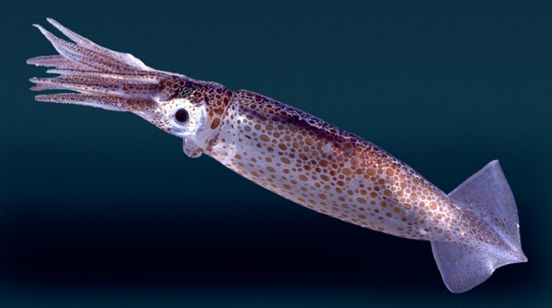

---
template: 2-3-2
count: false


.Large.bolder[]
.Large.bolder[]

---
template: 2-3-3
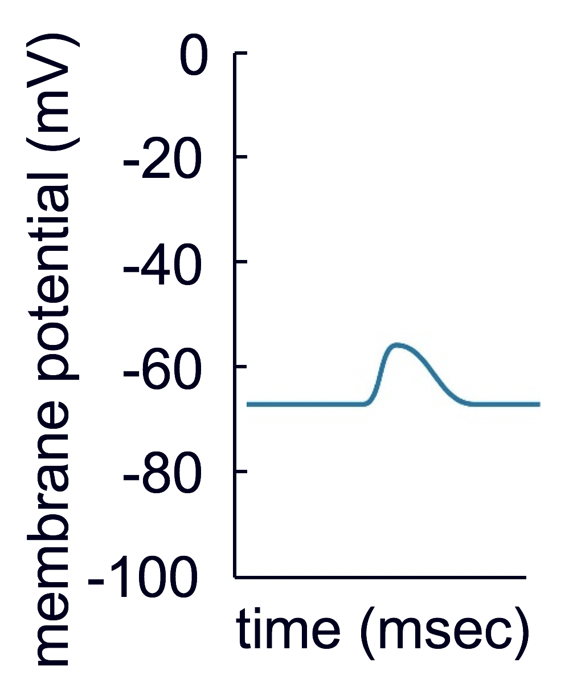

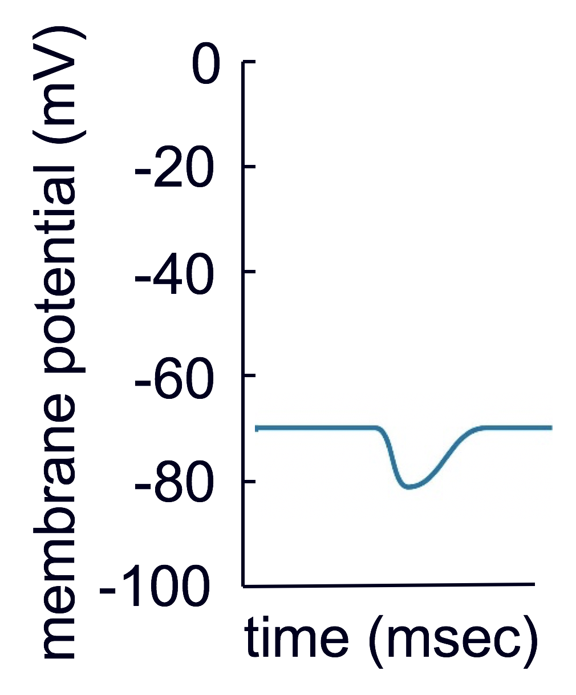


---
template: 2-3-4
background-image: url(image5_annot.gif)
background-size: 54%
background-position: 95% 40%

<!--

-->

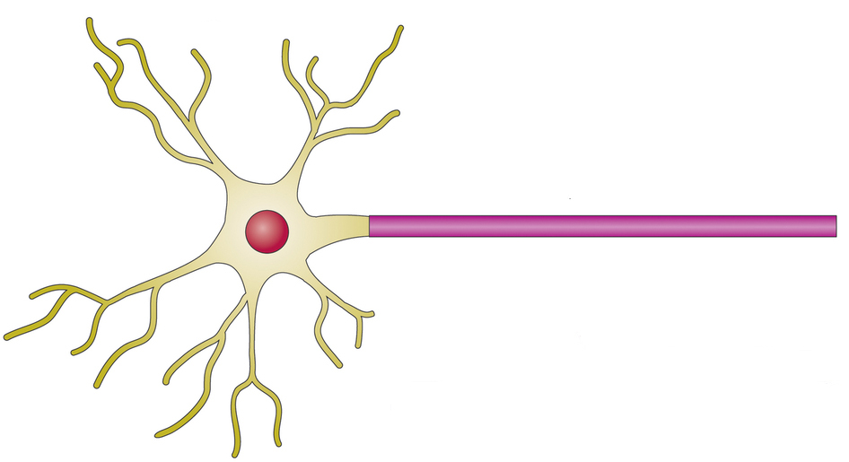


<!--
“all-or-none”
membrane potential (mV)
time (msec)

repolarization
depolarization
afterhyperpolarization
threshold
reverse
polarization
-->


---
template: 2-3-5

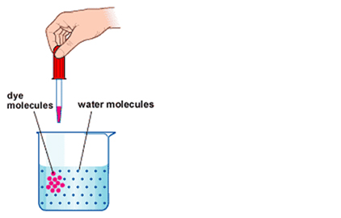

---
template: 2-3-5
count: false 

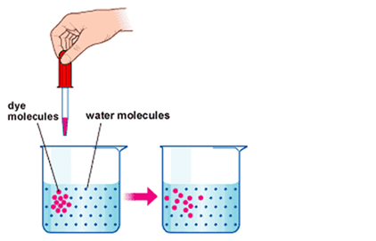


---
template: 2-3-5
count: false 


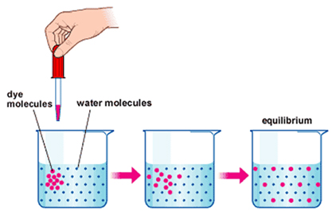


---
template: 2-3-5
count: false 


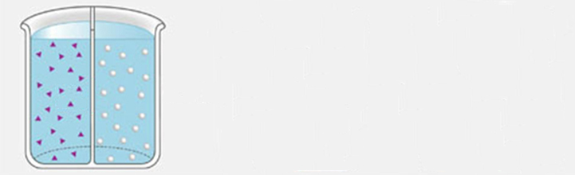

---
template: 2-3-5
count: false 


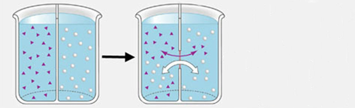

---
template: 2-3-5
count: false 


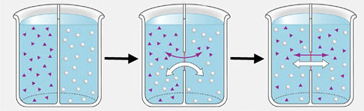


---
template: 2-3-6

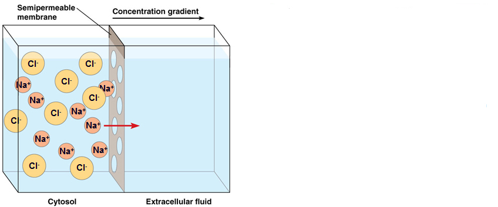

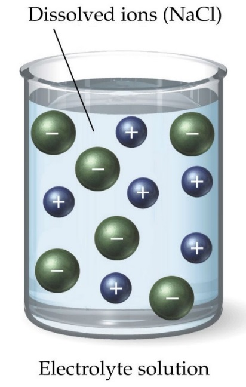

---
template: 2-3-6
count: false 

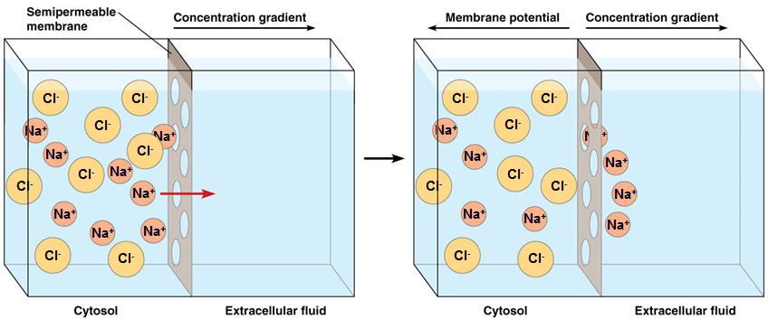


---
template: 2-3-7
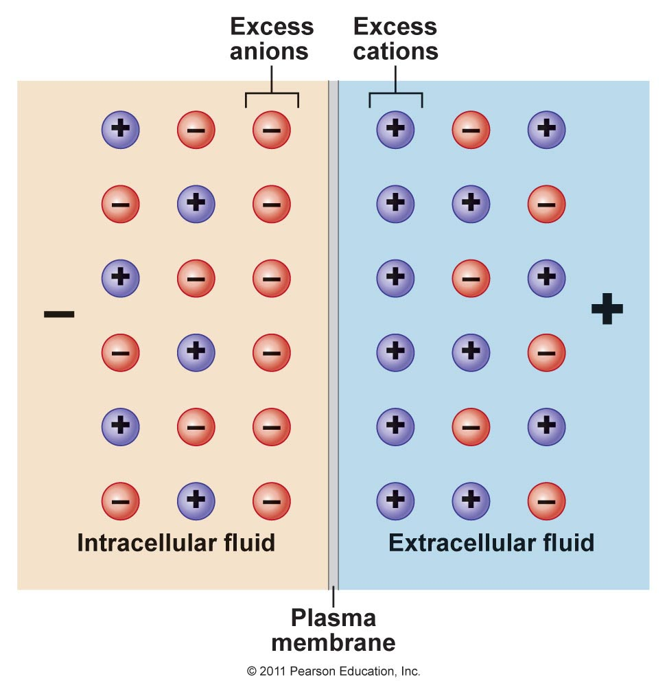


---
template: 2-3-8
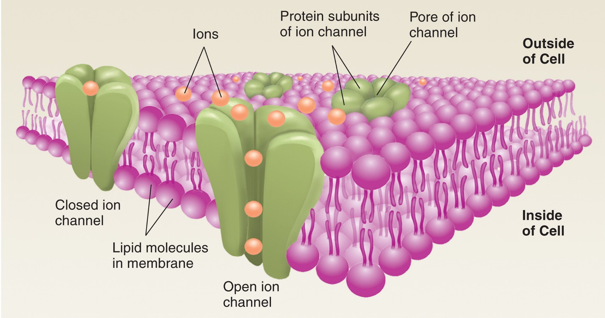


---
template: 2-3-9

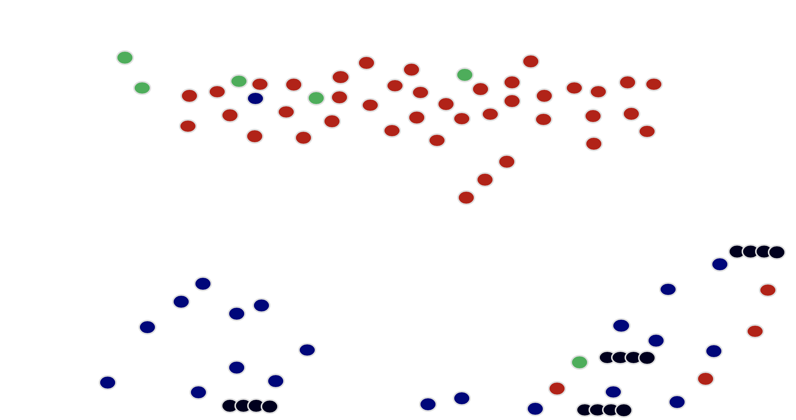
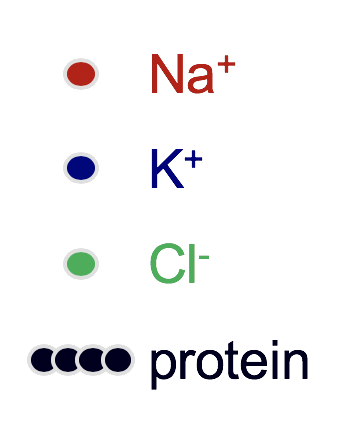

<!--
png_file<-"/Users/mears/Documents/Teaching/Spring2019/PSB3002/ch_slides/slide_text_img_ch/ch02/ch02_sect3/image18b.png"
img2<-magick::image_read(png_file)
img<-img2 %>%image_transparent("white",5)
png_file_out<-"/Users/mears/Documents/Teaching/Spring2019/PSB3002/ch_slides/slide_text_img_ch/ch02/ch02_sect3/image18b_trspnt.png"
image_write(img,png_file_out)
-->

---
template: 2-3-10

.pull-right[
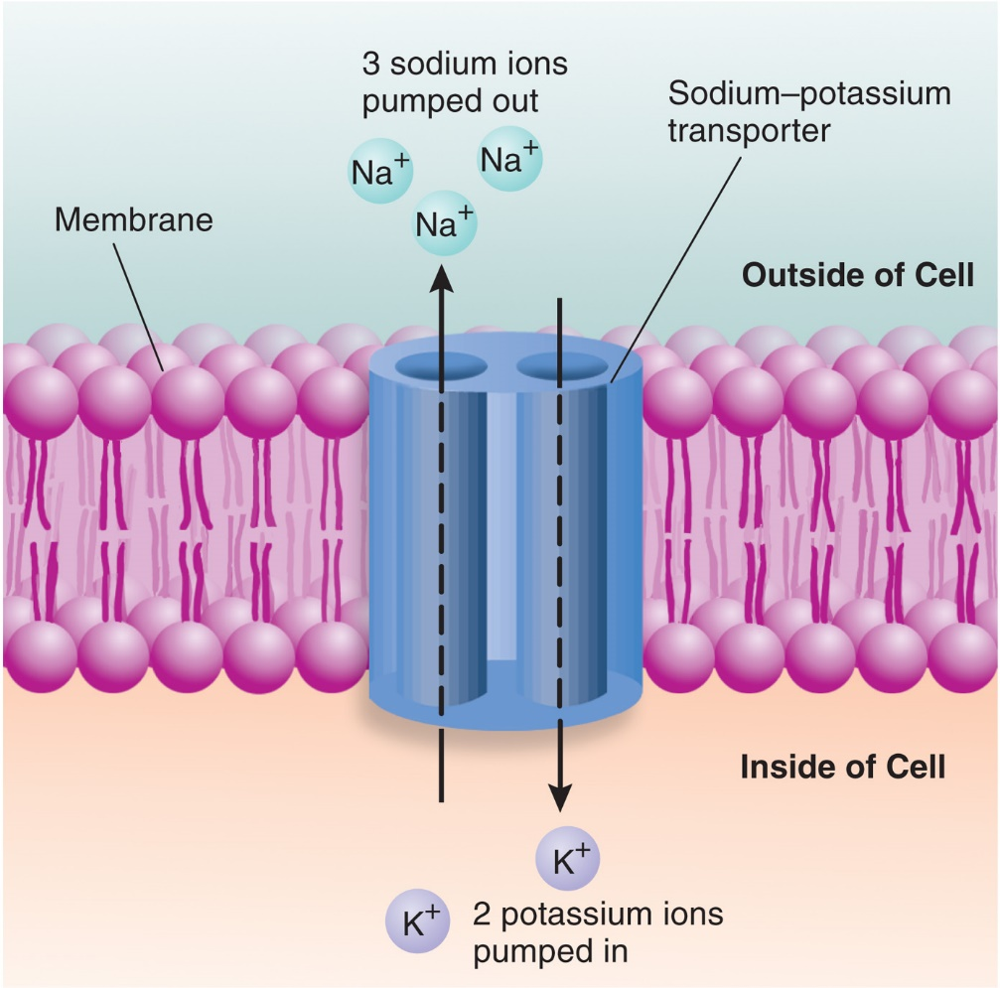
]

---
template: 2-3-11
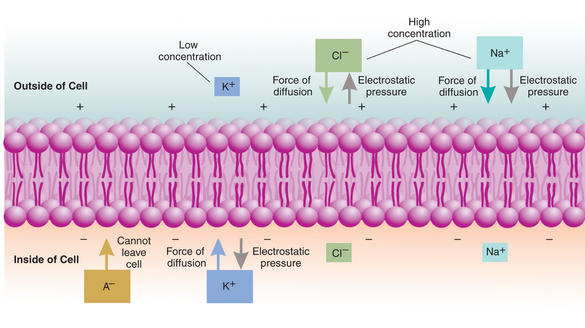
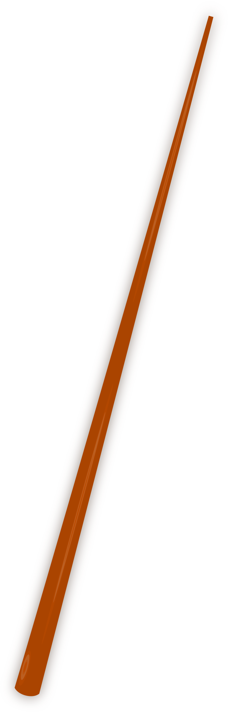

---
template: 2-3-12


---
template: 2-3-13


---
template: 2-3-14


---
template: 2-3-15


.bold.blue[]

---
template: 2-3-16
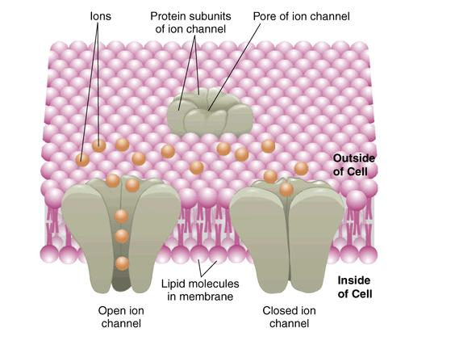


---
template: 2-3-17


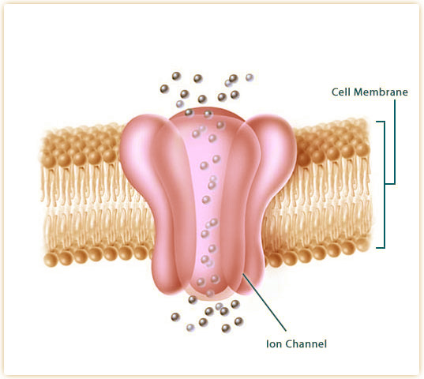

.Large.bolder[]


---
template: 2-3-18


.Large.bolder[]


---
template: 2-3-19


.Large.bolder[]

---
template: 2-3-20


.Large.bolder[]


---
template: 2-3-21

