```{r setup, include=FALSE}
options(htmltools.dir.version = FALSE)
```


# .font80[Chapter 2:  Structure and Function of Cells of the Nervous System]

#### Cells of the Nervous System
  
#### Communication Within a Neuron
  
#### Communication Between Neurons
- #### .bolder[Synaptic and non-synaptic communication]
- #### Neurotransmission across synapses
- #### Integration of synaptic inputs


---
name: 2-5-2
layout: true


# Communication Between Neurons
### Discovery of the Synapse - Descartes to Ramon y Cajal.
- Descartes (1596-1650) proposed neurons as tubes
- flow of spirits to swell muscles
- Galvani (1737-1798) identified that electricity causes nerve-muscle preparation to twitch
- “animal electricity”
- Ramon y Cajal (1852-1934) proposed gaps between neurons
- “neuron doctrine” vs. “protoplasmic network”

---
name: 2-5-3
layout: true


# Communication Between Neurons
### Discovery of the Synapse - Sir Charles Scott Sherrington.
- demonstrated gaps between neurons, behaviorally
- measured impulse transmission / distance
- pinched foot, measured delay until flexion
- found delay longer than expected
- reasoned delay at gaps between neurons
- called gaps “synapses” (after Cajal)


---
name: 2-5-4
layout: true


# Communication Between Neurons
### Discovery of the Synapse - Sir Charles Scott Sherrington.
.pull-left[
#### 3 Conclusions:  
**1)** Reflexes are slower than propagation along an axon. 
- Consequently, there must be some delay at synapses
]


---
name: 2-5-5
layout: true


# Communication Between Neurons
### Discovery of the Synapse - Sir Charles Scott Sherrington.
.pull-left[
#### 3 Conclusions:  
**2)** Several weak stimuli presented different times/locations produce stronger reflex than single stimulus.  
- Therefore, synapses must be able to summate stimuli.
]

---
name: 2-5-6
layout: true


# Communication Between Neurons
### Discovery of the Synapse - Sir Charles Scott Sherrington.
.pull-left[
#### 3 Conclusions:  
**3)** When one muscle set is excited, another set is relaxed.  
- Accordingly, input can simultaneously excite at some synapses while inhibiting at other synapses.
]


---
name: 2-5-7
layout: true


# Communication Between Neurons
### Discovery of Chemical Neurotransmission - Otto Loewi.
- acetylcholine released at synapses w/ heart


---
name: 2-5-8
layout: true


# Communication Between Neurons
### The Synapse.


---
name: 2-5-9
layout: true


# Communication Between Neurons
### Types of Synapses.
- axodendritic, axosomatic
- type 1 on dendritic spines/shafts
- asymmetric, EPSP
- type 2 primarily on soma
- symmetric, IPSP


---
name: 2-5-10
layout: true


# Communication Between Neurons
### Types of Synapses.
- axodendritic, axosomatic
- type 1 on dendritic spines/shafts
- asymmetric, EPSP
- type 2 primarily on soma
- symmetric, IPSP


---
name: 2-5-11
layout: true


# Communication Between Neurons
### Types of Synapses.
- axoaxonic mediate presynaptic
inhibition and presynaptic facilitation


---
name: 2-5-12
layout: true


# Communication Between Neurons
### Types of Synapses.
- dendrodendritic:
- different from traditional view of signaling down axon
- type 1 and type 2

---
name: 2-5-13
layout: true


# Communication Between Neurons
.pull-left[
### Types of Synapses.
- varicosities: beadlike swellings along axon where neurotransmitter (NT) is released
- may form synapse or leak NT to extracellular space
]


---
name: 2-5-14
layout: true


# Communication Between Neurons
### Types of Synapses.
- gap junctions (electrical synapses):
- channels communicate directly between cells
- common in invertebrates, less common in vertebrates
- fast signaling


---
name: 2-5-15
layout: true


# Communication Between Neurons
.pull-left[
### Types of Synapses.
- neuromuscular junction
- very highly specialized and very highly efficient synapse between a motor neuron and a muscle fiber
]

---
name: 2-5-16
layout: true


# Communication Between Neurons
### Non-Synaptic Chemical Communication.
- in addition to prototypical synaptic receptors, neurons have extra-synaptic membrane-bound receptors


---
name: 2-5-17
layout: true


# Communication Between Neurons
### Non-Synaptic Chemical Communication.
- in addition to prototypical synaptic receptors, neurons have extra-synaptic membrane-bound receptors


---
name: 2-5-18
layout: true


# Communication Between Neurons
### Non-Synaptic Chemical Communication.
- in addition to membrane-bound receptors, neurons also have cytosolic and nuclear receptors
- overall, non-synaptic receptors bind a variety of neurotransmitters, neuromodulators, and hormones


---
name: 2-5-19
layout: true


# Image Credits

- slide 2:	http://images-mediawiki-sites.thefullwiki.org/11/2/1/5/8418507132651016.gif
	http://en.wikipedia.org/wiki/Luigi_Galvani#mediaviewer/File:Galvani-frogs-legs-electricity.jpg
	https://embryology.med.unsw.edu.au/embryology/images/e/ef/1899_Cajal_04.jpg
- slide 3:	http://www.nobelprize.org/nobel_prizes/medicine/laureates/1932/sherrington-facts.html
	http://vetboss.co.uk/uploads/fig_6_spines.jpg
	schematic of neurons in reflex circuit drawn by D. Devine
- slide 4:	http://www.paulnussbaum.com/brain/synapse.jpg
	schematic of neurons in reflex circuit drawn by D. Devine
- slide 5:	http://vetboss.co.uk/uploads/fig_6_spines.jpg
	schematic of neurons in reflex circuit drawn by D. Devine
- slide 6:	https://classconnection.s3.amazonaws.com/492/flashcards/2304492/jpg/kneejerkreflex1355 63548873.jpg
	schematic of neurons in reflex circuit drawn by D. Devine
- slide 7:	 http://www.nobelprize.org/nobel_prizes/medicine/laureates/1936/loewi-bio.html
	Breedlove, S.M., Watson, N.V. (2013). Biological Psychology: An Introduction to Behavioral, Cognitive, and Clinical Neuroscience, 7th ed. Sinauer Associates, Inc.
- slide 8:	Breedlove, S.M., Watson, N.V. (2013). Biological Psychology: An Introduction to Behavioral, Cognitive, and Clinical Neuroscience, 7th ed. Sinauer Associates, Inc.


---
name: 2-5-20
layout: true


# Image Credits

- slide 9:	http://o.quizlet.com/i/Ay6H03vOR9dnownPJQ8ddg_m.jpg
	Breedlove, S.M., Watson, N.V. (2013). Biological Psychology: An Introduction to Behavioral, Cognitive, and Clinical Neuroscience, 7th ed. Sinauer Associates, Inc.
- slide 10:	http://o.quizlet.com/i/Ay6H03vOR9dnownPJQ8ddg_m.jpg
	http://synapses.clm.utexas.edu/atlas/1-6-12a.bmp
	http://synapses.clm.utexas.edu/atlas/1-6-12b.bmp
- slide 11:	Carlson, N.R. (2012). Physiology of Behavior, 11th ed. Pearson Publishing
	Breedlove, S.M., Watson, N.V. (2013). Biological Psychology: An Introduction to Behavioral, Cognitive, and Clinical Neuroscience, 7th ed. Sinauer Associates, Inc.
- slide 12:	https://ucsdneuro.files.wordpress.com/2012/09/maximovfigure.jpeg
	Breedlove, S.M., Watson, N.V. (2013). Biological Psychology: An Introduction to Behavioral, Cognitive, and Clinical Neuroscience, 7th ed. Sinauer Associates, Inc.
- slide 13:	http://pharmrev.aspetjournals.org/content/59/4/360/F1.large.jpg
	http://physrev.physiology.org/content/physrev/88/3/1183/F4.large.jpg
	http://vanat.cvm.umn.edu/neurHistAtls/pages/images/Neuron12.jpg
- slide 14:	http://www.mun.ca/biology/desmid/brian/BIOL2060/BIOL2060-13/13_15.jpg
	http://www.histology.leeds.ac.uk/cell/assets/gap_junction.gif


---
name: 2-5-21
layout: true


# Image Credits

- slide 15:	http://www.nvo.com/jin/nss-folder/scrapbookanatomy/neuromuscular%20junction.gif
	http://stevegallik.org/sites/histologyolm.stevegallik.org/images/motorendplates.jpg
	http://www.gflashcards.com/collections/44010-chapter-11-continued-human-anat/cards
- slide 16:	 http://pharmrev.aspetjournals.org/content/59/4/360/F1.large.jpg
	http://www.riken.jp/~/media/riken/research/rikenresearch/figures/hi_3437.jpg
- slide 16:	http://www.riken.jp/~/media/riken/research/rikenresearch/figures/hi_3437.jpg
- slide 18:	http://apbrwww5.apsu.edu/thompsonj/Anatomy%20&%20Physiology/2010/2010%20Exam% 20Reviews/Exam%205%20Final%20Review/steroid-receptor.Fig.17.2.jpg


---
template: 2-5-2
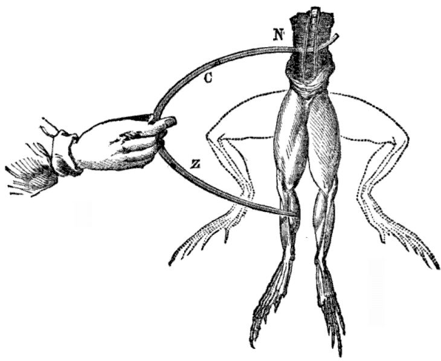

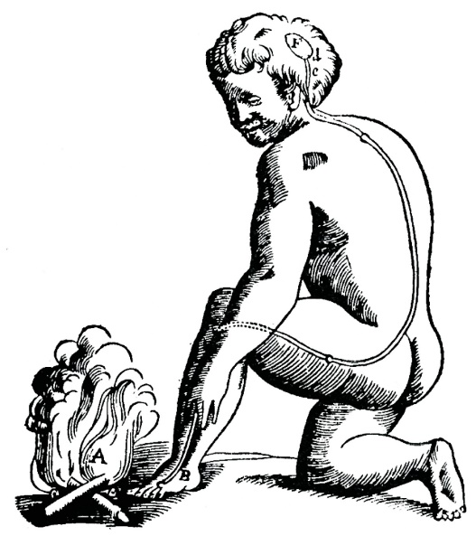

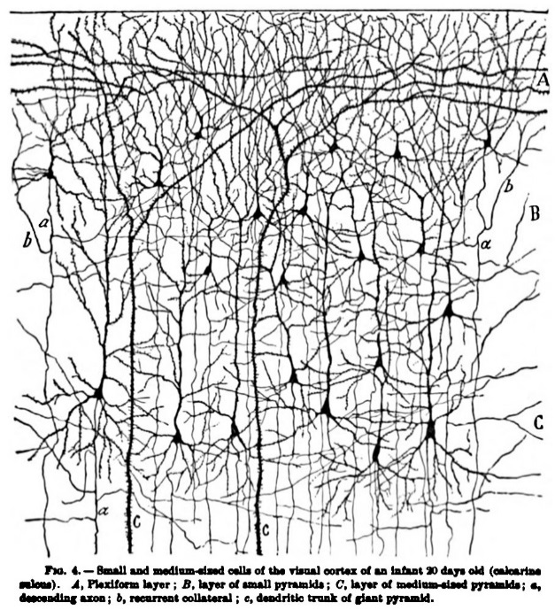


---
template: 2-5-3

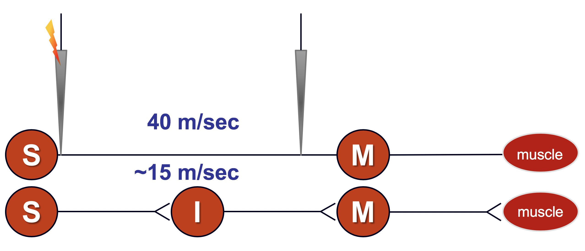
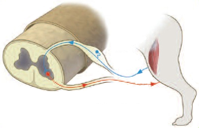
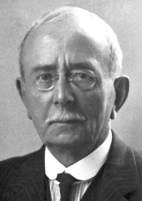

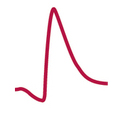


---
template: 2-5-4


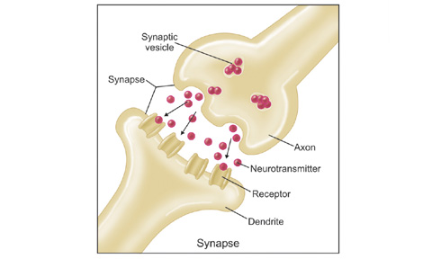


---
template: 2-5-5


---
template: 2-5-6
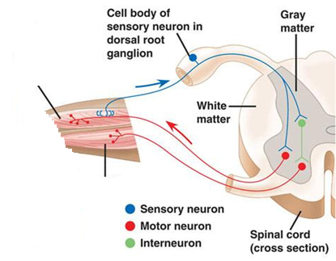


---
template: 2-5-7
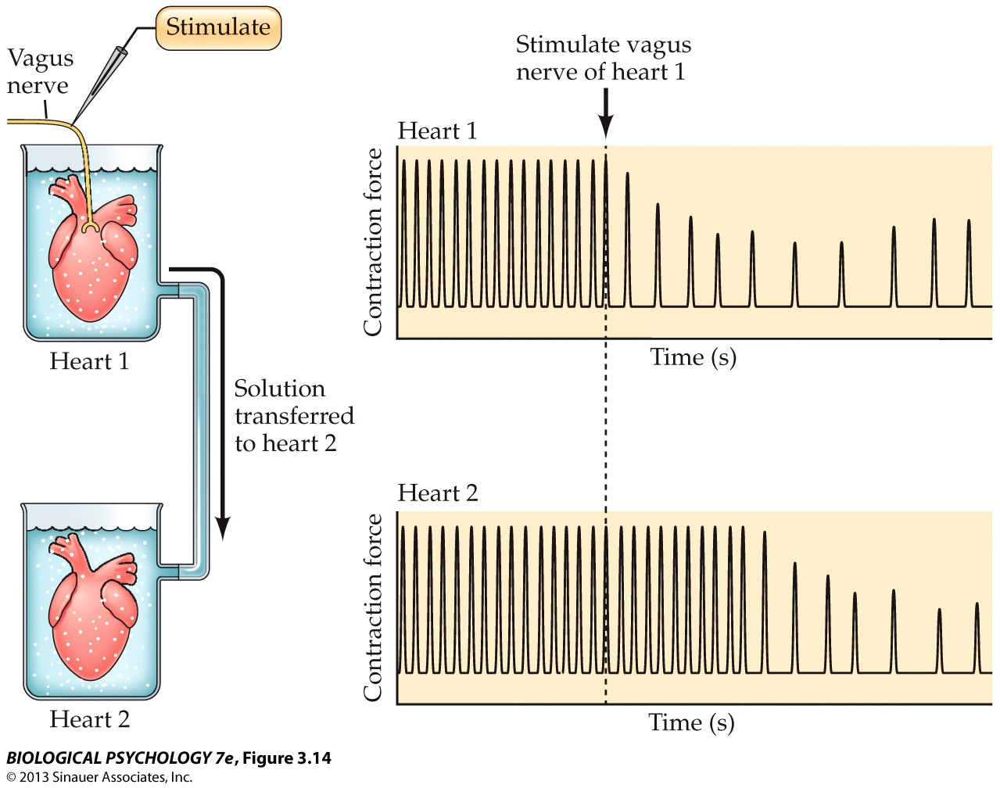

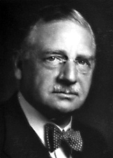


---
template: 2-5-8
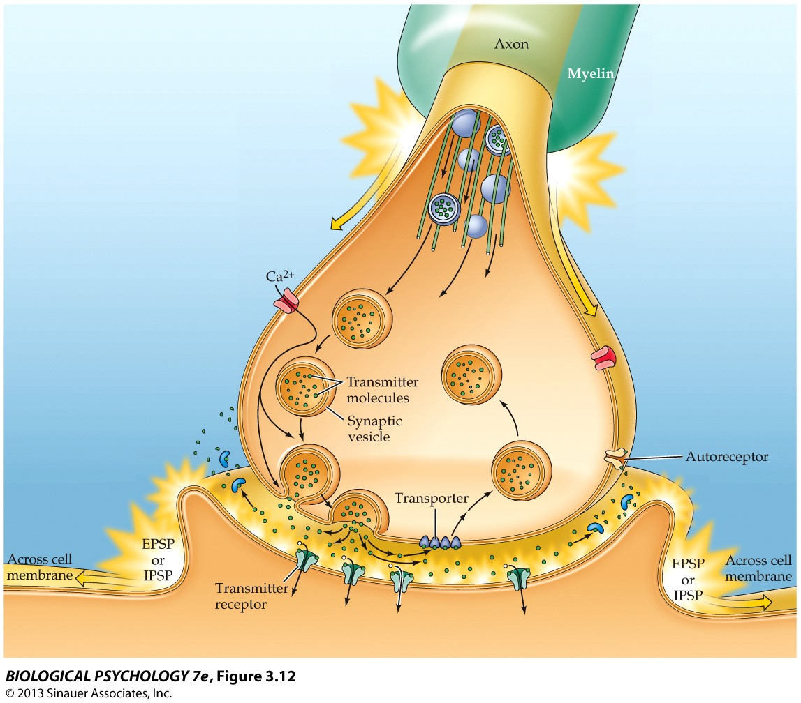


---
template: 2-5-9
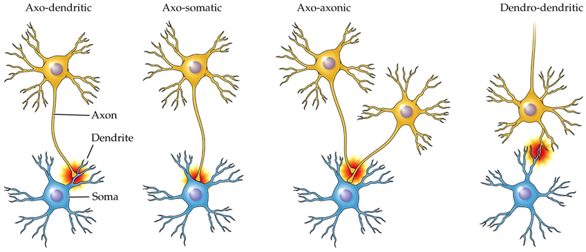

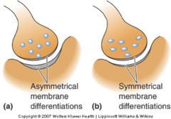


---
template: 2-5-10


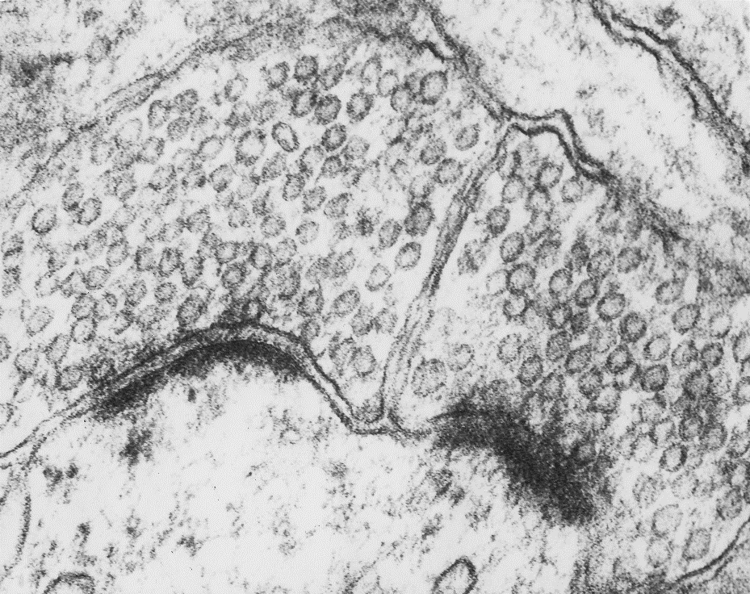

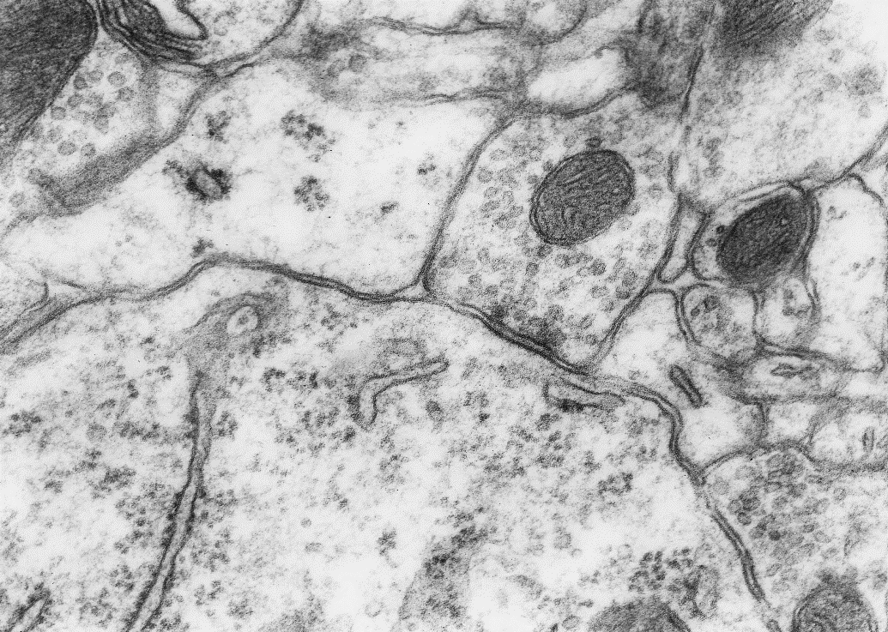


---
template: 2-5-11


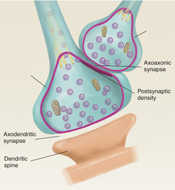


---
template: 2-5-12


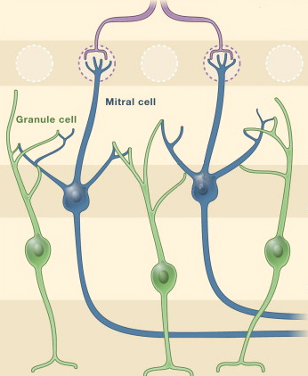


---
template: 2-5-13
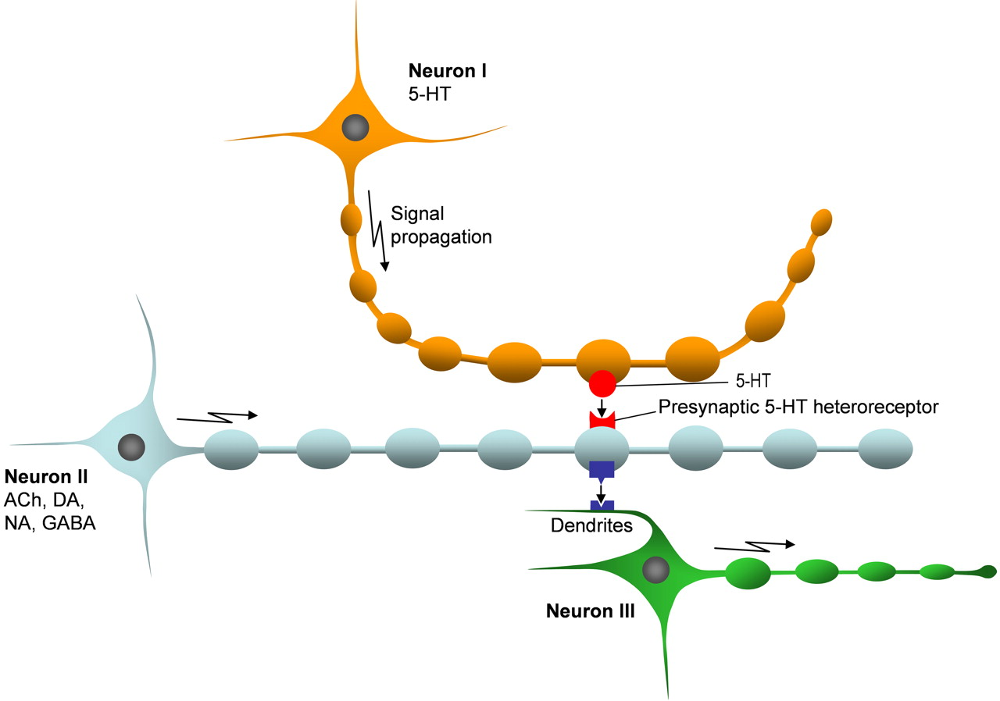

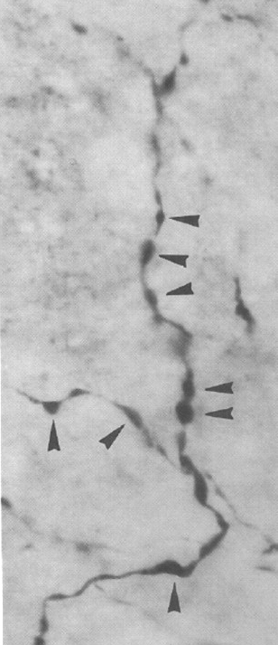

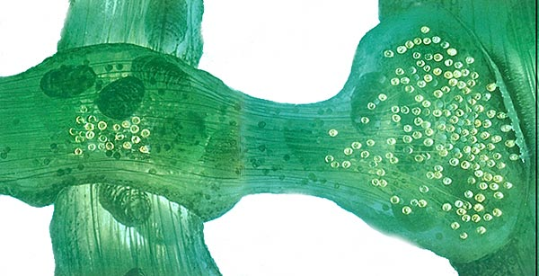


---
template: 2-5-14
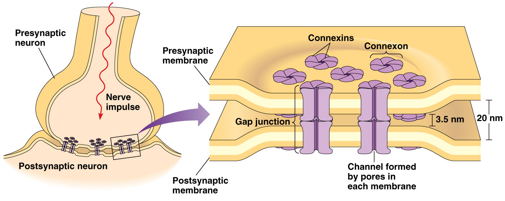
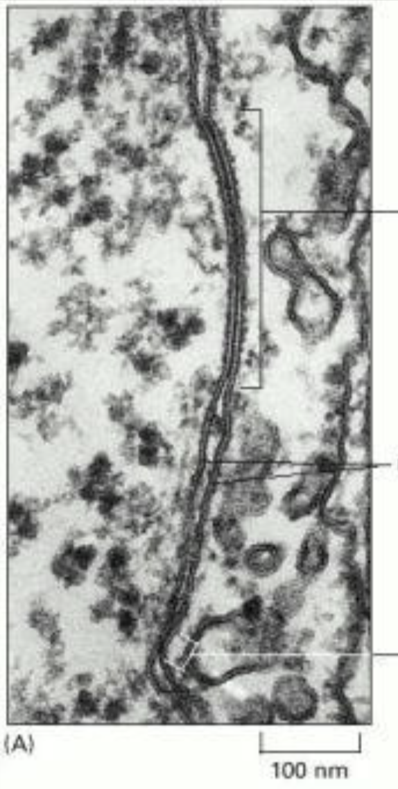


.large[]
.large[]

---
template: 2-5-15
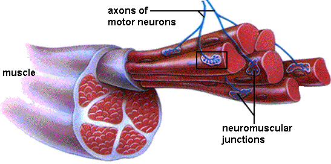

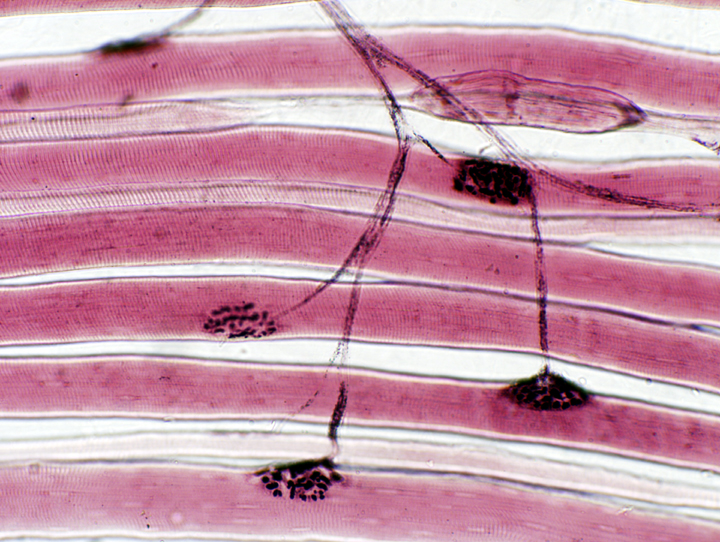

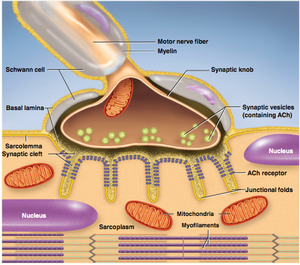


---
template: 2-5-16
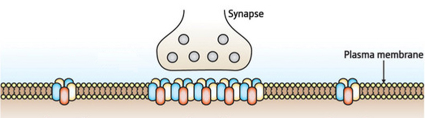

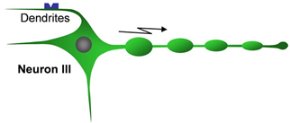


---
template: 2-5-17


---
template: 2-5-18
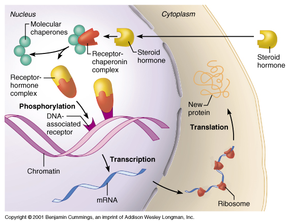

---
template: 2-5-19

---
template: 2-5-20

---
template: 2-5-21