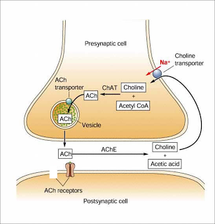

```{r setup, include=FALSE}
options(htmltools.dir.version = FALSE)
```

# .font80[Chapter 2:  Structure and Function of Cells of the Nervous System]

### Cells of the Nervous System
  
### Communication Within a Neuron
  
### .bold[Communication Between Neurons]
- #### Synaptic and non-synaptic communication
- #### .bolder[Neurotransmission across synapses]
- #### Integration of synaptic inputs


---
name: 2-6-2
layout: true

# Communication Between Neurons
### Seven Steps of Neurotransmission.

1. Synthesis
2. Packaging & Storage
3. Release
4. Binding to Autoreceptors
5. Binding to Postsynaptic Receptors
6. Reuptake
7. Enzymatic Inactivation
    
---
name: 2-6-3
layout: true

# Communication Between Neurons
### Steps of Neurotransmission - 1) Synthesis.
- peptide NTs synthesized from DNA template in soma
- precursors altered by enzymes after synthesis
- must be transported to axon terminal for release

---
name: 2-6-4
layout: true

# Communication Between Neurons
### Steps of Neurotransmission - 1) Synthesis.
- other neurotransmitters synthesized by modification of ingested substances in soma, dendrites, or axon terminal
- modifying enzymes made from DNA and transported, but neurotransmitter synthesis occurs near site of release

---
name: 2-6-5
layout: true

# Communication Between Neurons
### Steps of Neurotransmission - 2) Packaging and Storage.
- vesicular packaging in soma or terminal
- some vesicles further packaged into storage granules
- any leaked neurotransmitter destroyed by enzymes

---
name: 2-6-6
layout: true

# Communication Between Neurons
### Steps of Neurotransmission - 3) Release.
- vesicles migrate toward presynaptic membrane
- vesicles fuse with membrane
- vesicles open and NTs diffuse passively into synapse
- Ca2+-dependent processes
""
Ca2+

---
name: 2-6-7
layout: true

# Communication Between Neurons
### Steps of Neurotransmission - 3) Release.
- kiss and run, merge and recycle, bulk endocytosis

---
name: 2-6-8
layout: true

# Communication Between Neurons
### Steps of Neurotransmission - 3) Release.
- three pools of neurotransmitter vesicles
- readily releasable, recycling, and reserve pools

---
name: 2-6-9
layout: true

# Communication Between Neurons
### Steps of Neurotransmission - 4) Autoreceptors.
- binding to autoreceptors on presynaptic membrane inhibits further synthesis and/or release

---
name: 2-6-10
layout: true

# Communication Between Neurons
### Steps of Neurotransmission - 5) Postsynaptic Receptors.
- usually 2 molecules of neurotransmitter needed
- some degree of neurotransmitter → receptor selectivity
- postsynaptic response determined by receptor

---
name: 2-6-11
layout: true

# Communication Between Neurons
### Steps of Neurotransmission - 5) Postsynaptic Receptors.
- 2 main classes of neurotransmitter receptors
- ionotropic = direct ion exchange
- metabotropic = indirect ion exchange

---
name: 2-6-12
layout: true

# Communication Between Neurons
### Steps of Neurotransmission - 5) Postsynaptic Receptors.
- ionotropic receptors open ion channel when NT binds (usually 2 molecules)
- Na+ channels = EPSP
- Ca2+ channels = EPSP
- K+ channels = IPSP
- Cl- channels = IPSP


---
name: 2-6-13
layout: true

# Communication Between Neurons
.pull-left[
### Steps of Neurotransmission - 5) Postsynaptic Receptors.
- metabotropic receptors activate G protein or other biochemical signal
- opens ion channel or initiates changes in biochemical activity when NT binds
]

---
name: 2-6-14
layout: true

# Communication Between Neurons
### Steps of Neurotransmission - 5) Postsynaptic Receptors.
- metabotropic signaling
  amplifies impact of
  neurotransmitter
- most receptors are
  metabotropic
- all cystosolic and
  nuclear receptors are
  metabotropic

---
name: 2-6-15
layout: true

# Communication Between Neurons
### Steps of Neurotransmission - 5) Postsynaptic Receptors.
.pull-left[
- ionotropic = rapid onset, transient actions
- metabotropic = slow onset, enduring actions
]

---
name: 2-6-16
layout: true

# Communication Between Neurons
### Steps of Neurotransmission - 6) Reuptake.
- released neurotransmitters reuptaken into presynaptic neuron by transporter proteins (e.g. DAT, NET, SERT)
- no reuptake of peptide neurotransmitters

---
name: 2-6-17
layout: true

# Communication Between Neurons
### Steps of Neurotransmission - 7) Enzymatic Degradation.

- released neurotransmitters degraded by specific extracellular enzymes
- most excreted as waste products

---
name: 2-6-18
layout: true

# Image Credits

- slide 2:	http://losnuevosguerreros.org/mod/glossary/view.php?id=1&mode=letter&hook=S&sortkey= &sortorder=&fullsearch=0&page=-1
- slides 3 & 4:  http://www.biog1445.org/media/neurotransmittersynth.gif
- slide 5:	http://www.hhmi.org/sites/default/files/Bulletin/2014/Winter/Vesicle.gif
	http://1.bp.blogspot.com/_vB9Dtz6lD9Y/SBLileS_XZI/AAAAAAAAAIg/9sSzqfL4YIc/s320/S1,+L4,ACh+synthesis%26degradation.jpg
- slide 6:	Carlson, N.R. (2012). Physiology of Behavior, 11th ed. Pearson Publishing
	http://starklab.slu.edu/neuro/vesicle.jpg
	http://starklab.slu.edu/neuro/FF.jpg
- slide 7:	Carlson, N.R. (2012). Physiology of Behavior, 11th ed. Pearson Publishing
- slide 8:	http://www.nature.com/nrm/journal/v4/n2/images/nrm1016-f2.gif
- slides 9-10:  http://users.belgacom.net/neurobiology/images/0698nemeroff_transmitter.jpg
- slide 11:	 Breedlove, S.M., Watson, N.V. (2013). Biological Psychology: An Introduction to Behavioral, Cognitive, and Clinical Neuroscience, 7th ed. Sinauer Associates, Inc.
- slide 12:	http://droualb.faculty.mjc.edu/Course%20Materials/Physiology%20101/Chapter%20Notes/ Fall%202007/figure_05_12_labeled.jpg
	http://www.chaz.org/Courses/Sapir_Whorf/Brain_language/sodium_ion-channel4.jpg
	graphs of membrane potentials drawn by D. Devine


---
name: 2-6-19
layout: true

# Image Credits

- slide 13:	http://droualb.faculty.mjc.edu/Course%20Materials/Physiology%20101/Chapter%20Notes/ Fall%202007/figure_05_15_labeled.jpg
- slide 14:	Carlson, N.R. (2012). Physiology of Behavior, 11th ed. Pearson Publishing
- slide 15:	http://img.docstoccdn.com/thumb/orig/121996069.png
- slide 16:	http://www.biog1445.org/media/neurotransmittersynth.gif
- slide 17:	http://www.expertsmind.com/CMSImages/2067_Neurotransmitter%20inactivation.png


---
template: 2-6-2


---
template: 2-6-3


---
template: 2-6-4


---
template: 2-6-5



---
template: 2-6-6


---
template: 2-6-7


---
template: 2-6-8


---
template: 2-6-9


---
template: 2-6-10


---
template: 2-6-11


---
template: 2-6-12


---
template: 2-6-13


---
template: 2-6-14


---
template: 2-6-15


---
template: 2-6-16


---
template: 2-6-17


---
template: 2-6-18

---
template: 2-6-19