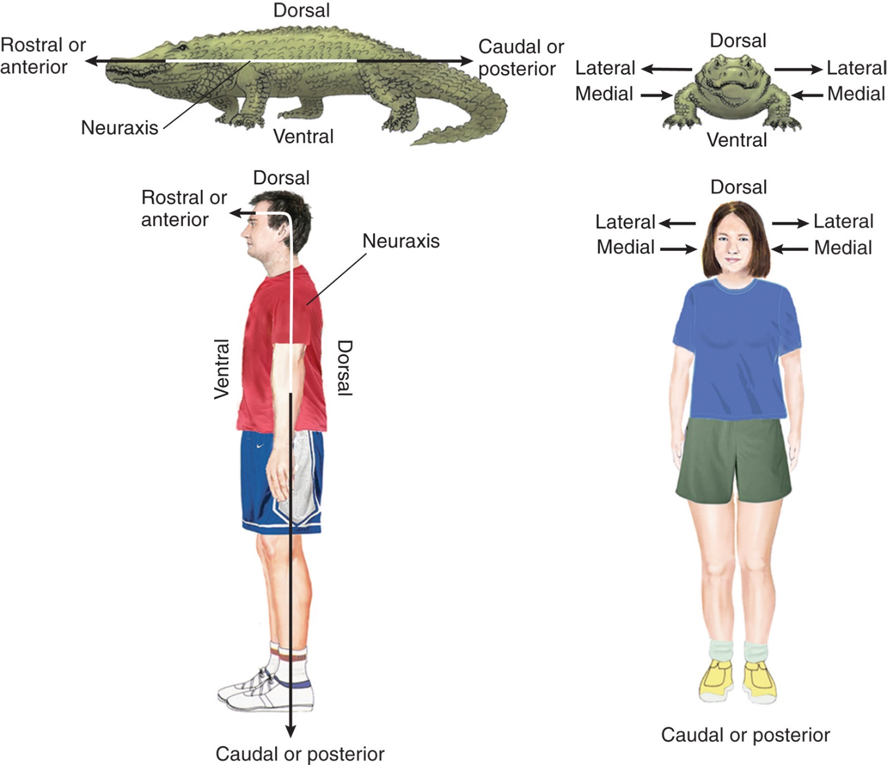
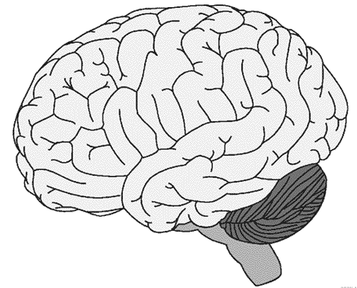

```{r setup, include=FALSE}
options(htmltools.dir.version = FALSE)
```
name: 3-1-1

# Chapter 3:  Structure of the Nervous System

#### Basic Features of the Nervous System
#### The Central Nervous System (CNS)
#### The Peripheral Nervous System (PNS)
#### Development of the Nervous System


---
name: 3-1-2

# Chapter 3:  Structure of the Nervous System

#### .bold[Basic Features of the Nervous System]
#### The Central Nervous System (CNS)
#### The Peripheral Nervous System (PNS)
#### Development of the Nervous System


<!---
I'm a comment
--->
<!---
Next we will have some hidden named slides that will be referenced and used later
--->

---
name: 3-1-3
layout: true

# Basic Features of the Nervous System
.pull-left[
### Anatomical Directions.
- rostral/anterior
- caudal/posterior
- dorsal/ventral
]

{{content}}

---
template: 3-1-3




---
name: 3-1-4
layout: true

# Basic Features of the Nervous System
.left-column[
### Anatomical Directions.
- ipsilateral/contralateral
- distal/proximal
- afferent/efferent...
]
.right-column[



]


---
name: 3-1-4
count: false


{{content}}


---
template: 3-1-4


---
template: 3-1-4
count: false


---
template: 3-1-4
count: false


---
template: 3-1-4
count: false


---
template: 3-1-4
count: false


