```{r setup, include=FALSE}
options(htmltools.dir.version = FALSE)
```
name: 3-1-1

# Chapter 3:  Structure of the Nervous System

#### Basic Features of the Nervous System
#### The Central Nervous System (CNS)
#### The Peripheral Nervous System (PNS)
#### Development of the Nervous System


---
name: 3-1-2

# Chapter 3:  Structure of the Nervous System

#### .bold[Basic Features of the Nervous System]
#### The Central Nervous System (CNS)
#### The Peripheral Nervous System (PNS)
#### Development of the Nervous System


<!---
I'm a comment
--->
<!---
Next we will have some hidden named slides that will be referenced and used later
--->

---
name: 3-1-3
layout: true

# Basic Features of the Nervous System
.pull-left[
### Anatomical Directions.
- rostral/anterior
- caudal/posterior
- dorsal/ventral
]

{{content}}

---
template: 3-1-3

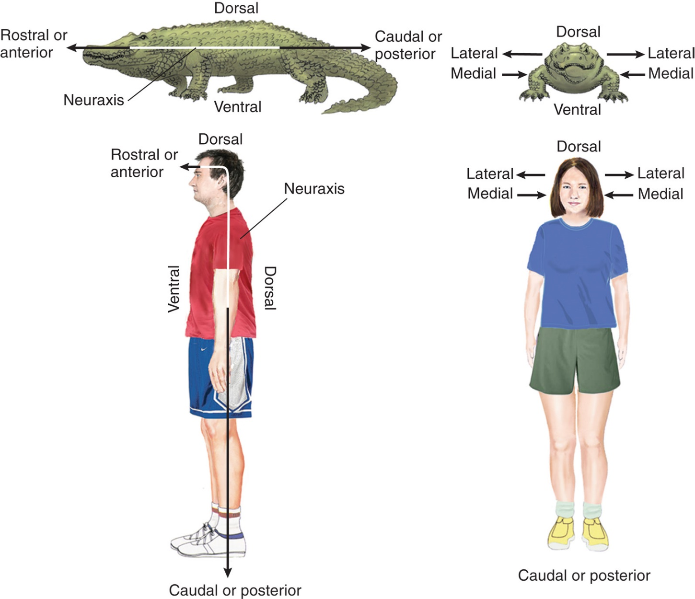


---
name: 3-1-4
layout: true

# Basic Features of the Nervous System
.left-column[
### Anatomical Directions.
- ipsilateral/contralateral
- distal/proximal
- afferent/efferent...
]
.right-column[
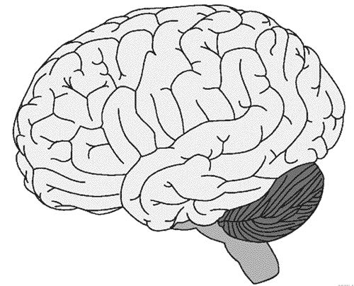

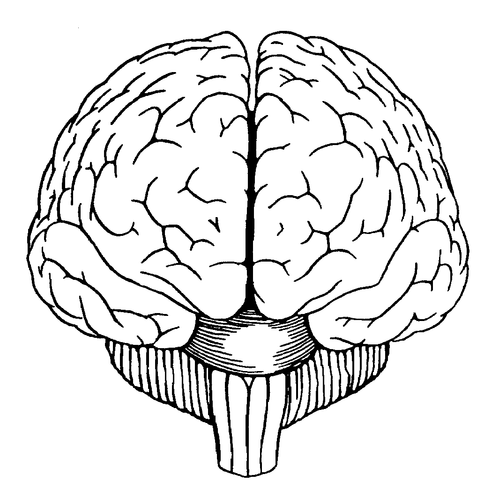
]


---
name: 3-1-4


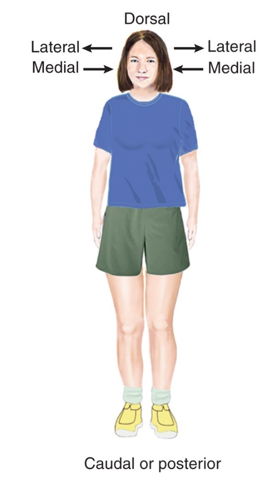

{{content}}


---
template: 3-1-4
count: false


---
template: 3-1-4
count: false


---
template: 3-1-4
count: false


<!---
slide 4 to 14?
--->

---
name: 3-1-5
layout: true


# Basic Features of the Nervous System
.pull-left[### Anatomical Planes of Section.
- rostral/anterior, caudal/posterior, dorsal, ventral, lateral…

]

---
name: 3-1-6
layout: true

# Basic Features of the Nervous System
.left-column[
### Major divisions of the nervous system.
- CNS/PNS, subdivisions of CNS and PNS…
]
.right-column[
{
{
{
{
{
{
PNS
autonomic ns
somatic ns
motor branch
somatosensory branch
parasympathetic ns
sympathetic ns
enteric ns
{
spinal cord
brain
hindbrain
midbrain
forebrain
cerebellum, pons, medulla
tectum, tegmentum
cortex, basal ganglia, hippocampus, 
amygdala, thalamus, hypothalamus
nervous
system
CNS
CNS
PNS

---
name: 3-1-7
layout: true

# Basic Features of the Nervous System
### The Meninges.
.pull-left[

## (brain)     

.bold[]
- Tough, flexible outermost meninx 
    - (i.e., toughest-outermost layer)
  
.bold[]  
- Middle layer of the meninges
  
.bold[]  
- Last layer of the meninges
- adheres to the surface of the brain
 ]   
 
---
name: 3-1-8
layout: true


# Basic Features of the Nervous System
### The Ventricular System of the Brain and Spinal Cord.
- interconnected lateral, third, and 
  fourth ventricles

---
name: 3-1-9
layout: true


# Basic Features of the Nervous System
### The Ventricular System of the Brain and Spinal Cord.
- CSF 
    - synthesized in choroid plexus
    - absorbed by arachnoid granulations

arachnoid
granulation
choroid
plexus


---
name: 3-1-10
layout: true


# Basic Features of the Nervous System
### Hydrocephalus.
- inability of CSF to drain


---
name: 3-1-11
layout: true


# Basic Features of the Nervous System
### Major divisions of the nervous system.
- CNS/PNS, subdivisions of CNS and PNS…
{
{
{
{
{
{
PNS
autonomic ns
somatic ns
motor branch
somatosensory branch
parasympathetic ns
sympathetic ns
enteric ns
{
spinal cord
brain
hindbrain
midbrain
forebrain
cerebellum, pons, medulla
tectum, tegmentum
cortex, basal ganglia, hippocampus, 
amygdala, thalamus, hypothalamus
nervous
system
CNS
CNS
PNS

---
name: 3-1-12
layout: true


# Basic Features of the Nervous System
### Major divisions of the nervous system.
- peripheral nervous system, spinal and cranial somatic nerves

---
name: 3-1-13
layout: true


# Basic Features of the Nervous System
### Major divisions of the nervous system.
- peripheral nervous system, spinal and cranial autonomic nerves

---
name: 3-1-14
layout: true

# Basic Features of the Nervous System
### Major divisions of the nervous system.
- peripheral nervous system, enteric nervous system


---
name: 3-1-15
layout: true

# Image Credits

- slide 3:	Carlson, N.R. (2012). Physiology of Behavior, 11th ed. Pearson Publishing
	http://1.bp.blogspot.com/-0na65G4PvBE/U_-xq3GZQqI/AAAAAAAAHG0/OvClI5MoUWE/s1600/compass _rose_by_draconicparagon-d6rjgqi.png
- slide 4:	Carlson, N.R. (2012). Physiology of Behavior, 11th ed. Pearson Publishing
	http://4.bp.blogspot.com/-uB1aRYFhZuE/UTZYERfPjAI/AAAAAAAAAWM/OM3c_wAseOo/s1600/brain  +frontal+view0.gif
- slide 5:	Carlson, N.R. (2012). Physiology of Behavior, 11th ed. Pearson Publishing
	http://fmri.mbi.ufl.edu/home_files/image003.jpg
	http://www.ajnr.org/content/34/6/1188/F1.large.jpg
- slide 6:	Breedlove, S.M., Watson, N.V. (2013). Biological Psychology: An Introduction to Behavioral, Cognitive, and Clinical Neuroscience, 7th ed. Sinauer Associates, Inc.
	nervous system schematic drawn by D.P. Devine
- slide 7:	http://img.tfd.com/mk/M/X2604-M-20A.png
	http://www.mayoclinic.org/~/media/kcms/gbs/patient consumer/images/2013/08/26/11/03/ds00901_ im03177_r7_ meningesthu_jpg.ashx
	http://faculty.spokanefalls.edu/InetShare/AutoWebs/GaryB/AP 242/Unit 4/Spinal cord and Brain strucutres_files/slide0013_image001.jpg
- slide 8:	http://upload.wikimedia.org/wikipedia/commons/5/54/Lateral_ventricle.gif
	Breedlove, S.M., Watson, N.V. (2013). Biological Psychology: An Introduction to Behavioral, Cognitive, and Clinical Neuroscience, 7th ed. Sinauer Associates, Inc.

	


---
name: 3-1-16
layout: true

# Image Credits

- slide 9:	http://upload.wikimedia.org/wikipedia/commons/6/6d/1317_CFS_Circulation.jpg
	http://www.thecni.org/features/by-condition-2/traumatic-brain-injury/ 
- slide 10:	http://www.mps1disease.com/~/media/MPSI/Images/Content/mps_pt_symptom_hydrocephalus_new .jpg?w=346&h=412&as=1
	http://www.loni.usc.edu/about_loni/education/edu_images/CNS072.jpg
	http://library.med.utah.edu/WebPath/jpeg5/CNS213.jpg
- slide 11:	Breedlove, S.M., Watson, N.V. (2013). Biological Psychology: An Introduction to Behavioral, Cognitive, and Clinical Neuroscience, 7th ed. Sinauer Associates, Inc.
	nervous system schematic drawn by D.P. Devine
- slide 12:	https://classconnection.s3.amazonaws.com/484/flashcards/1156484/jpg/reflex1342648013863.jpg
	http://bayareaneurosurgery.com/anatomy/anat_br_nerves.jpg
- slide 13:	http://classes.midlandstech.edu/carterp/Courses/bio210/chap14/210_figure_14_07_labeled.jpg
	http://bayareaneurosurgery.com/anatomy/anat_br_nerves.jpg
- slide 14:	http://jonlieffmd.com/wp-content/uploads/2012/11/NRM-Gut-brain-picture-2.jpg


---

template: 3-1-5


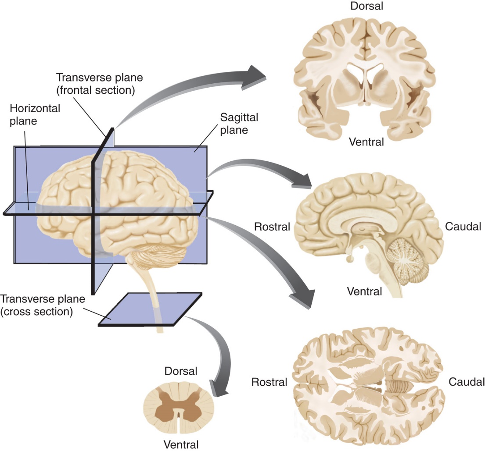
.pull-right[


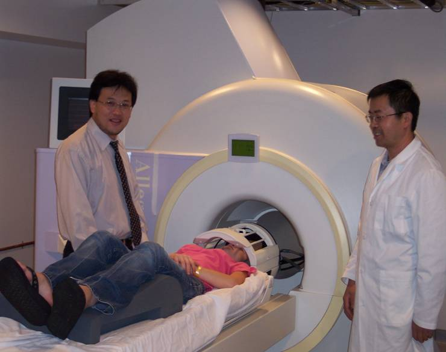

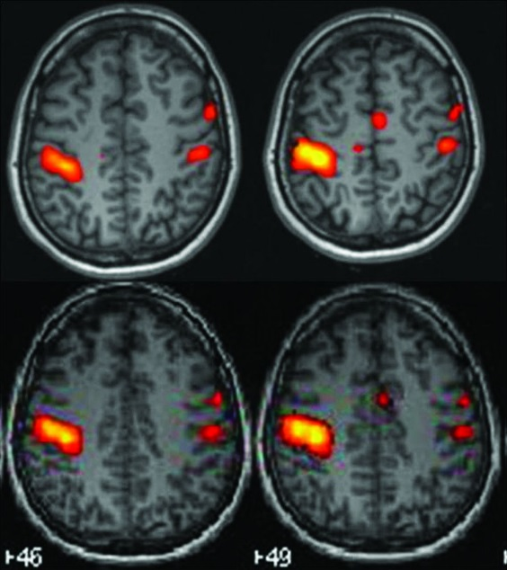
]

---
template: 3-1-6


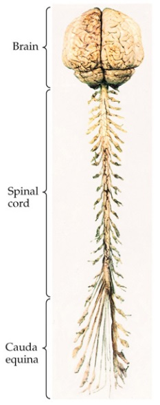


---
template: 3-1-7


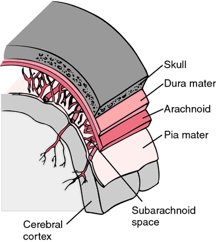


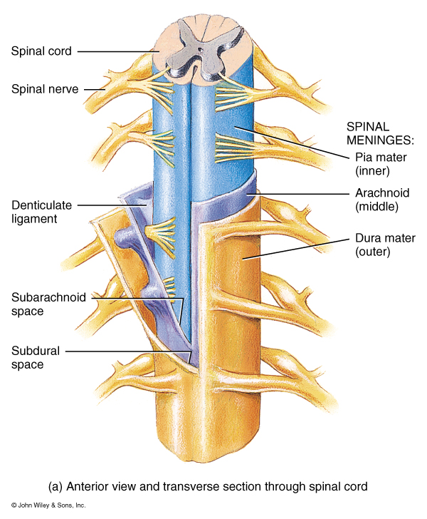


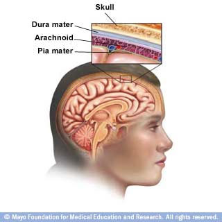


---

template: 3-1-8


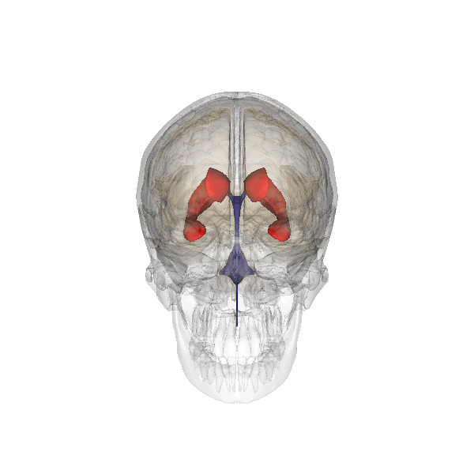


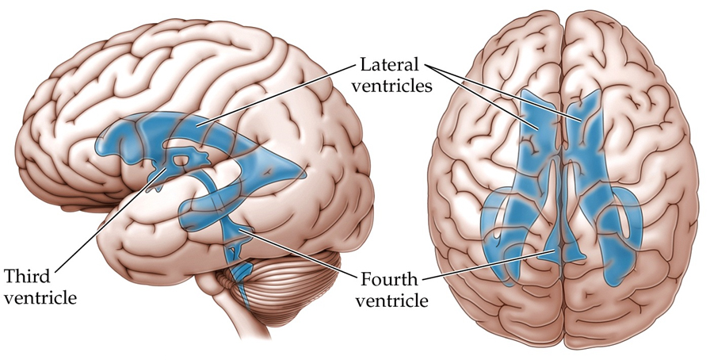


---

template: 3-1-9


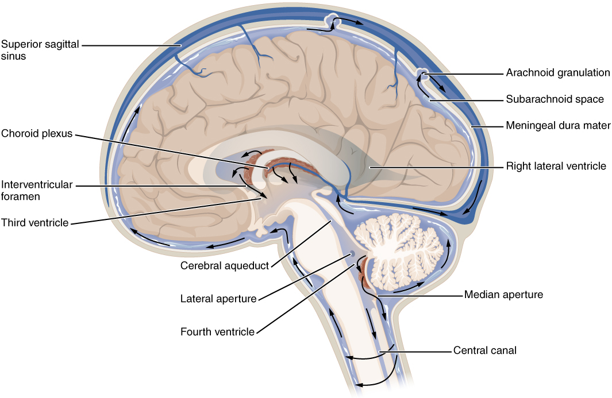


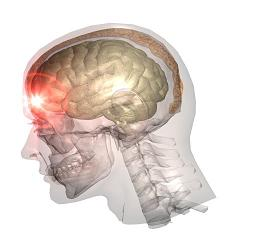


---
template: 3-1-10


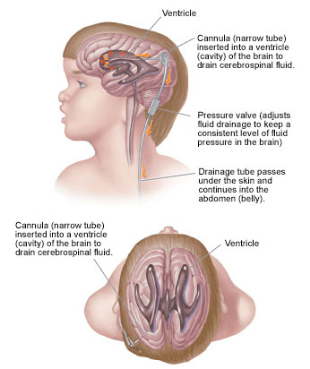


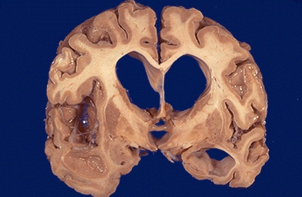


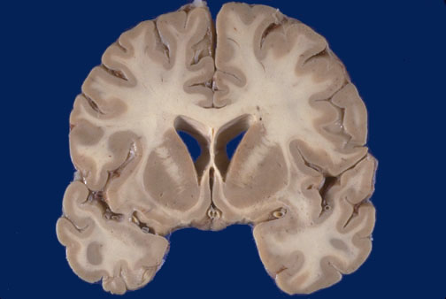

---
template: 3-1-11

---

template: 3-1-12


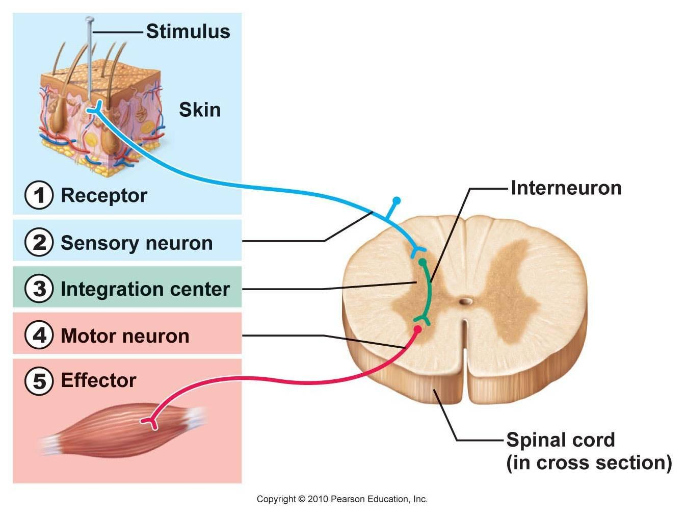


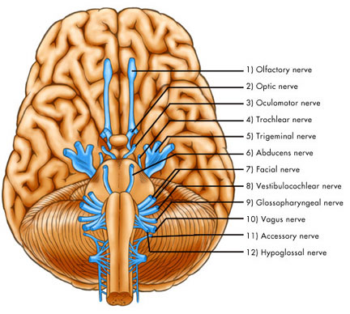


---
template: 3-1-13


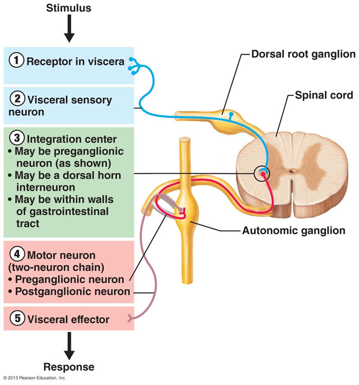


---
template: 3-1-14


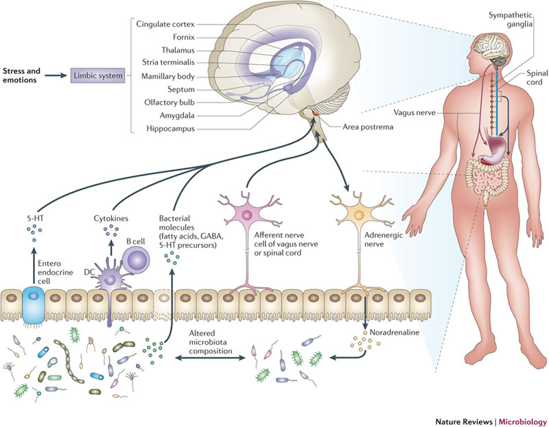


---
template: 3-1-15

---
template: 3-1-16
