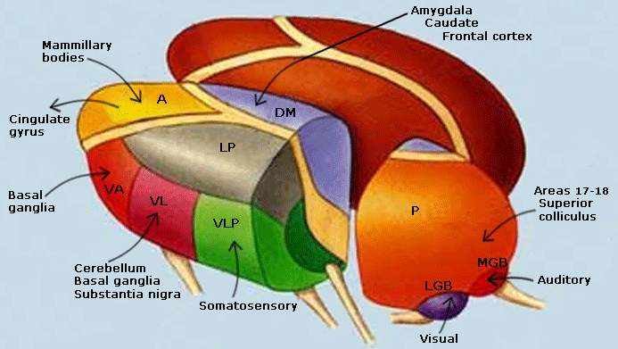
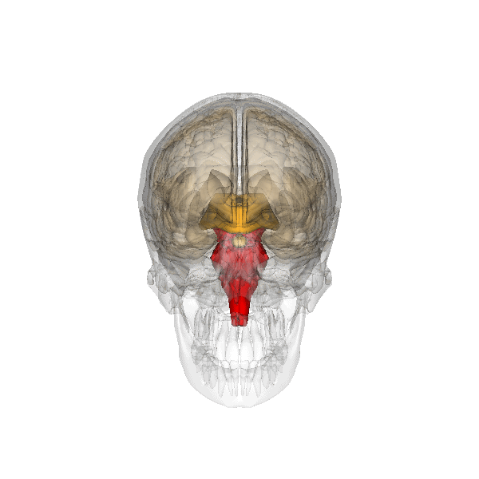

```{r setup, include=FALSE}
options(htmltools.dir.version = FALSE)
```


# Chapter 3:  Structure of the Nervous System

#### Basic Features of the Nervous System
#### .bold[The Central Nervous System (CNS)]
#### The Peripheral Nervous System (PNS)
#### Development of the Nervous System


---
name: 3-2-2
layout: true

# The Central Nervous System
.pull-left[
### Major Divisions of the Brain.
- .bold[]
- .bold[]
- .bold[]
]

---
name: 3-2-3
layout: true

# The Central Nervous System
.pull-left[
### Major Divisions of the Brain.
- Midsagittal section
]

---
name: 3-2-4
layout: true

# The Central Nervous System
.pull-left[
### .small[Major Divisions of the Brain - Forebrain.]
- gyri, sulci, fissures
- hemispheres
]

---
name: 3-2-5
layout: true

# The Central Nervous System
.pull-left[
### .small[Major Divisions of the Brain - Forebrain.]
- 4 lobes
]

---
name: 3-2-6
layout: true

# The Central Nervous System
.pull-left[
### .small[Major Divisions of the Brain - Forebrain.]
- frontal or coronal section
]

---
name: 3-2-7
layout: true

# The Central Nervous System
.pull-left[
### .small[Major Divisions of the Brain - Forebrain.]
- 6 layers of cortex
]

---
name: 3-2-8
layout: true

# The Central Nervous System
.pull-left[
### .small[Major Divisions of the Brain - Forebrain.]
- primary sensory and motor cortices
- sensory association cortices
- multimodal areas
]
---
name: 3-2-9
layout: true

# The Central Nervous System
.pull-left[
### .small[Major Divisions of the Brain - Forebrain.]
- primary somatosensory (S1) and motor (M1) cortices
]


---
name: 3-2-10
layout: true

# The Central Nervous System
.pull-left[
### .small[Major Divisions of the Brain - Forebrain.]
- primary somatosensory (S1) and motor (M1) cortices
]


---
name: 3-2-11
layout: true

# The Central Nervous System
.pull-left[
### .small[Major Divisions of the Brain - Forebrain.]
- Broca’s and Wernickes’ areas
]


---
name: 3-2-12
layout: true

# The Central Nervous System
.pull-left[
### .small[Major Divisions of the Brain - Forebrain.]
- thalamus
]

---
name: 3-2-13
layout: true

# The Central Nervous System
.pull-left[
### .small[Major Divisions of the Brain - Forebrain.]
- basal ganglia
]

---
name: 3-2-14
layout: true

# The Central Nervous System
.pull-left[
### .small[Major Divisions of the Brain - Forebrain.]
- limbic system
]

---
name: 3-2-15
layout: true

# The Central Nervous System
.pull-left[
### .small[Major Divisions of the Brain - Forebrain.]
- hypothalamus
]

---
name: 3-2-16
layout: true

# The Central Nervous System
.pull-left[
### .small[Major Divisions of the Brain - Forebrain.]
- pituitary gland, the “Master gland”
]

---
name: 3-2-17
layout: true

# The Central Nervous System
.pull-left[
### .small[Major Divisions of the Brain - Midbrain.]
- tectum and tegmentum
]

---
name: 3-2-18
layout: true

# The Central Nervous System
.pull-left[
### .medium[Major Divisions of the Brain - Hindbrain.]
- pons and medulla
]

---
name: 3-2-19
layout: true

# The Central Nervous System
.pull-left[
### .small[Major Divisions of the Brain - Hindbrain.]
- cerebellum
]

---
name: 3-2-20
layout: true

# The Central Nervous System
.pull-left[
### .small[The Spinal Cord.]
- cervical
- thoracic
- lumbar
- sacral
- coccygeal
]

---
name: 3-2-21
layout: true

# The Central Nervous System
.pull-left[
### .small[The Spinal Cord.]
- gray matter = soma of interneurons & motor neurons
- white matter = ascending/descending axonal tracts
- .bold.blue[dorsal (ascending)] = somatosensory 
- .bold.red[ventral (descending)] = motor
]


---
name: 3-2-22
layout: true

# Image Credits

- slide 2:	http://up.ejaaba.com/uploaded/20120515/U83U_1337060740.jpg
	http://commons.wikimedia.org/wiki/Brodmann_areas?uselang=it#mediaviewer/File:Brain_Brodmann_blend.gif
- slide 3:	http://upload.wikimedia.org/wikipedia/commons/9/99/Four_lobes_animation_small2.gif
	Breedlove, S.M., Watson, N.V. (2013). Biological Psychology: An Introduction to Behavioral, Cognitive, and Clinical Neuroscience, 7th ed. Sinauer Associates, Inc.
- slide 4:	http://www.thewellingtonneurosurgeryunit.com/images/cerebrum.jpg
	http://www.fullfrontalanatomy.com/images/F13/NS/Brain_SC/gyri_sulci2.jpg
	http://upload.wikimedia.org/wikipedia/commons/9/92/Corpus_callosum.gif
- slide 5:	http://upload.wikimedia.org/wikipedia/commons/9/99/Four_lobes_animation_small2.gif
	http://controlmind.info/images/stories/brainstructure.png
- slide 6:	https://new.coloradocollege.edu/dotAsset/454b53b7-cb30-4e92-9ade-4347201a0f43.jpg
	http://www.umich.edu/~lanp/coronal2.JPG
- slide 7:	http://what-when-how.com/wp-content/uploads/2012/04/tmp15F88.jpg
	http://upload.wikimedia.org/wikipedia/commons/5/5b/Cajal_cortex_drawings.png
- slide 8:	http://37.media.tumblr.com/9dbc910fdac9f0aeaa72e3550b1b8917/tumblr_mfoz0i1ZJd1rn6pqko1_ 1280.jpg


---
name: 3-2-23
layout: true

# Image Credits

- slide 9:	http://www.madscientistblog.ca/wp-content/uploads/2010/12/penfieldhomunculus.jpg
	http://www.bio.miami.edu/tom/courses/protected/ECK/CH08/figure-08-13d.jpg
	http://uc.exteenblog.com/highwind/images/Know/brain_homunculus1.jpg
	http://en.wikipedia.org/wiki/Postcentral_gyrus#mediaviewer/File:Postcentral_gyrus.gif
- slide 10:	http://www.madscientistblog.ca/wp-content/uploads/2010/12/penfieldhomunculus.jpg
	http://www.bio.miami.edu/tom/courses/protected/ECK/CH08/figure-08-13d.jpg
	http://uc.exteenblog.com/highwind/images/Know/brain_homunculus1.jpg
	http://commons.wikimedia.org/wiki/Brodmann_areas?uselang=it#mediaviewer/File:Brodmann_area_4_animation_small.gif
- slide 11:	http://my-ms.org/images/brain_functional_areas_600px.jpg
	http://thebrain.mcgill.ca/flash/d/d_10/d_10_cr/d_10_cr_lan/d_10_cr_lan_2a.jpg
	http://upload.wikimedia.org/wikipedia/commons/5/59/Brodmann_area_44_animation_small.gif
	http://upload.wikimedia.org/wikipedia/commons/a/ae/Brodmann_area_45_animation_small.gif
	http://upload.wikimedia.org/wikipedia/commons/b/b2/Wernicke%27s_area_animation.gif
- slide 12:	http://upload.wikimedia.org/wikipedia/commons/f/f1/Thalamus.gif
	http://www.glittra.com/yvonne/neuropics/thalconn.GIF
	http://iflmedicine.com/wp-content/uploads/2015/01/basal-ganglia-amygdala.jpg


---
name: 3-2-24
layout: true

# Image Credits

- slide 13:	http://upload.wikimedia.org/wikipedia/commons/4/41/Caudate_nucleus.gif
	http://upload.wikimedia.org/wikipedia/commons/1/18/Globus_pallidus.gif
	Breedlove, S.M., Watson, N.V. (2013). Biological Psychology: An Introduction to Behavioral, Cognitive, and Clinical Neuroscience, 7th ed. Sinauer Associates, Inc.
- slide 14:	http://en.wikipedia.org/wiki/Brodmann_area_32#mediaviewer/File:Brodmann_area_32_animation _small.gif
	http://upload.wikimedia.org/wikipedia/commons/9/99/Hippocampus.gif
	Breedlove, S.M., Watson, N.V. (2013). Biological Psychology: An Introduction to Behavioral, Cognitive, and Clinical Neuroscience, 7th ed. Sinauer Associates, Inc.
- slide 15:	http://images-mediawiki-sites.thefullwiki.org/01/3/5/6/0422297102130464.gif
	https://bhavanajagat.files.wordpress.com/2011/10/nuclei-of-hypothalamus.jpg
- slide 16:	http://droualb.faculty.mjc.edu/Course Materials/Physiology 101/Chapter Notes/Fall 2007/figure_06_03_labeled.jpg
	http://droualb.faculty.mjc.edu/Course Materials/Physiology 101/Chapter Notes/Fall 2007/figure_06_04_labeled.jpg
	http://upload.wikimedia.org/wikipedia/commons/2/2e/Pituitary_gland.gif
- slide 17:	http://upload.wikimedia.org/wikipedia/commons/6/63/Superior_colliculus.gif
	http://image.slidesharecdn.com/theanatomyofmidbrain-120615234825-phpapp01/95/the-anatomy-of-midbrain-8-728.jpg?cb=1339822198
	http://o.quizlet.com/d2sMhLOr98FgOTAsCLmK2Q_m.jpg


---
name: 3-2-25
layout: true

# Image Credits

- slide 18:	http://www.austincc.edu/apreview/NursingPics/CNSPics/Picture23.jpg
	http://upload.wikimedia.org/wikipedia/commons/0/08/Brainstem.gif
	http://image.slidesharecdn.com/theanatomyofmidbrain-120615234825-phpapp01/95/the-anatomy-of-midbrain-9-728.jpg?cb=1339822198
- slide 19:	http://upload.wikimedia.org/wikipedia/commons/f/fa/Cerebellum.gif
	http://image.slidesharecdn.com/5-cns1-111102120455-phpapp02/95/5-cns-1-26-728.jpg?cb=1320253591
	http://image.slidesharecdn.com/5-cns1-101007143826-phpapp01/95/5-cns-1-27-728.jpg?cb=1286481016
- slide 20:	http://upload.wikimedia.org/wikipedia/commons/7/74/Thoracic_vertebra_9_close-up_superior_surface_animation.gif
	http://www.buzzle.com/images/diagrams/nervous-system/spinal-cord-inside-the-vertebral-column.jpg
	http://upload.wikimedia.org/wikipedia/commons/8/88/Thoracic_vertebrae_-_close-up_-_animation.gif
	http://uhealthsystem.com/images/health-library/ei_2710.jpg
- slide 21:	http://apbrwww5.apsu.edu/thompsonj/Anatomy & Physiology/2010/2010 Exam Reviews/Exam 4 Review/12-32_SnsryMtrTrct.JPG
  https://commons.wikimedia.org/wiki/File:Spinal_cord_tracts_-_English.svg


---
template: 3-2-2


---
template: 3-2-3

  


---
template: 3-2-4


.right-column[

]


---
template: 3-2-5


---
template: 3-2-6


---
template: 3-2-7


---
template: 3-2-8


---
template: 3-2-9


---
template: 3-2-10


---
template: 3-2-11


---
template: 3-2-12





---
template: 3-2-13


---
template: 3-2-14


---
template: 3-2-15


---
template: 3-2-16


---
template: 3-2-17


---
template: 3-2-18



---
template: 3-2-19


---
template: 3-2-20


---
template: 3-2-21


---
template: 3-2-22

---
template: 3-2-23

---
template: 3-2-24

---
template: 3-2-25