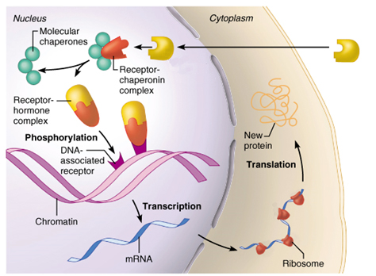
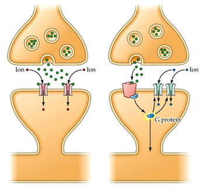
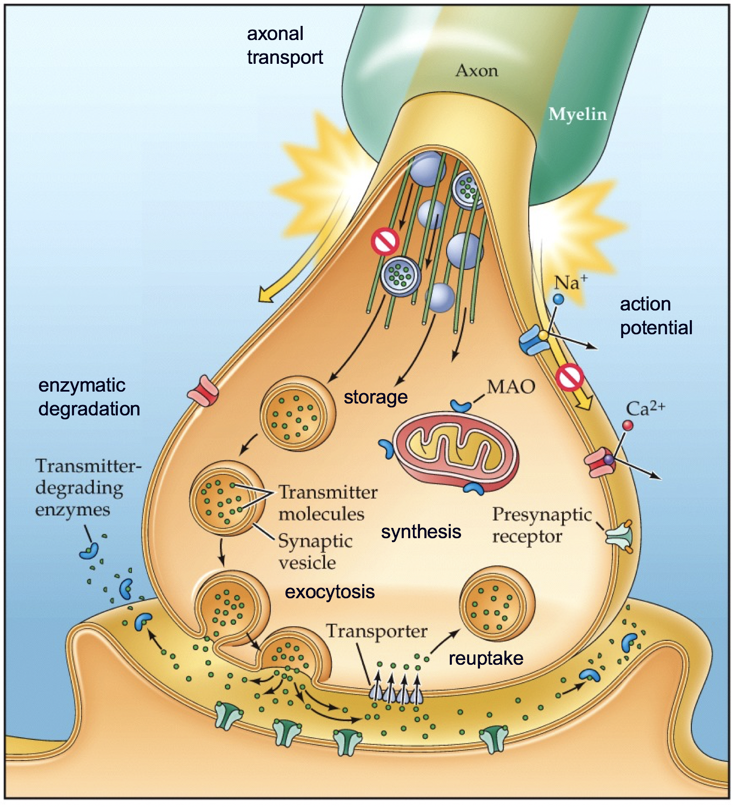
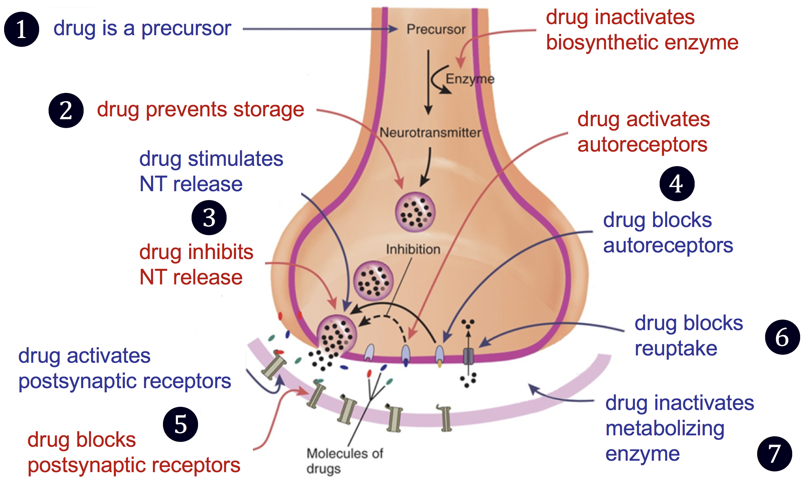

```{r setup, include=FALSE}
options(htmltools.dir.version = FALSE)
```


# Chapter 4:  Psychopharmacology

#### Principles of Psychopharmacology
#### .bold[Sites of Drug Action]
#### Neurotransmitters and Neuromodulators


---
name: 4-2-2
layout: true

# Sites of Drug Action
Receptor Mechanisms.
- drugs bind to and interact with receptors on or within cells

---
name: 4-2-3
layout: true

# Sites of Drug Action
Presynaptic Mechanisms.
- synthesis
- axonal transport
- storage
- action potential
- exocytosis
- reuptake
- enzymatic degradation


---
name: 4-2-4
layout: true


# Sites of Drug Action
Postsynaptic Mechanisms.
- receptor binding
- receptor modulation
- receptor expression
- second messengers


---
name: 4-2-5
layout: true

# Sites of Drug Actions
Summary of Agonist and Antagonist Actions.
- .blue[agonists] and .red[antagonists]


---
name: 4-2-6
layout: true

# Image Credits

- slide 2:	Breedlove, S.M., Watson, N.V. (2013). Biological Psychology: An Introduction to Behavioral, Cognitive, and Clinical Neuroscience, 7th ed. Sinauer Associates, Inc.
	http://apbrwww5.apsu.edu/thompsonj/Anatomy & Physiology/2010/2010 Exam Reviews/Exam 5 Final Review/steroid-receptor.Fig.17.2.jpg
- slide 3:	Breedlove, S.M., Watson, N.V. (2013). Biological Psychology: An Introduction to Behavioral, Cognitive, and Clinical Neuroscience, 7th ed. Sinauer Associates, Inc.
- slides 4:	Breedlove, S.M., Watson, N.V. (2013). Biological Psychology: An Introduction to Behavioral, Cognitive, and Clinical Neuroscience, 7th ed. Sinauer Associates, Inc.
- slide 5:	Carlson, N.R. (2012). Physiology of Behavior, 11th ed. Pearson Publishing 


---
template: 4-2-2





---
template: 4-2-3


<!--
axonal
transport
action
potential
enzymatic
degradation
storage
synthesis
exocytosis
reuptake

-->

---
template: 4-2-4


<!--
binding
second
messengers
modulation
expression
-->

---
template: 4-2-5


<!--
drug inactivates 
biosynthetic enzyme
drug is a precursor
drug prevents storage
drug activates
autoreceptors
drug stimulates 
NT release
drug blocks
autoreceptors
drug inhibits
NT release
drug blocks
reuptake
drug activates
postsynaptic receptors
drug inactivates 
metabolizing
enzyme
drug blocks
postsynaptic receptors
-->

---
template: 4-2-6

