```{r setup, include=FALSE}
options(htmltools.dir.version = FALSE)
```

# Chapter 4:  Psychopharmacology

#### Principles of Psychopharmacology
#### Sites of Drug Action
#### .bold[Neurotransmitters and Neuromodulators]
- #### classical neurotransmitters
- #### acetylcholine
- #### monoamines
- #### amino acids
- #### .bolder[peptides and unconventional neurotransmitters]


---
name: 4-6-2
layout: true

# Neurotransmitters and Neuromodulators
### Peptide Neurotransmitters.
.small[
- Opioid Peptides (END, ENK, DYN, N/OFQ) 
- Non-opioid Peptides (PYY, SP, CCK, and many others)
- manufactured from DNA template in soma
- transported to axon terminal
- short chains of amino acids cleaved from macroproteins
]


---
name: 4-6-3
layout: true

# Neurotransmitters and Neuromodulators
### Peptide Neurotransmitters.


---
name: 4-6-4
layout: true

# Neurotransmitters and Neuromodulators
### Peptide Neurotransmitters.
- stored in large dense core vesicles
- co-released with other neurotransmitters
- release from HFS or burst-firing APs
- inactivated by diffusion or enzymatic metabolism
- some products retain biological activity

---
name: 4-6-5
layout: true

# Neurotransmitters and Neuromodulators
### Opioid Peptides - Neuroanatomy.
- endorphins, enkephalins, dynorphins, N/OFQ
- fairly ubiquitous distribution

---
name: 4-6-6
layout: true

# Neurotransmitters and Neuromodulators
.pull-left[
### Opioid Peptides - Receptors and Functional Implications.
- binds to µ, δ, ĸ, NOP receptors
- negative link to adenylate cyclase
- analgesia, socialization, feeding, defense responses, anxiety, behavioral reinforcement, gastric motility
]


---
name: 4-6-7
layout: true

# Neurotransmitters and Neuromodulators
### Opioid Peptides - Agonists and Antagonists.


---
name: 4-6-8
layout: true

# Neurotransmitters and Neuromodulators
### Non-Opioid Peptides.
.pull-left[
- NPY, PYY, CCK: feeding, gastric motility, circadian rhythms, anxiety/stress responses
- SP: pain signaling, mood disorders, stress, nausea
- others: neurotensin, galanin, somatostatin, VIP, TRH, CRH, AGRP, bombesin, ghrelin, orexin, oxytocin, VP…
]


---
name: 4-6-9
layout: true

# Neurotransmitters and Neuromodulators
### Unconventional Neurotransmitters - Nitric Oxide
- NO is soluble gas, cannot be stored
- Ca2+-dependent activation of NO synthase 
- NO stimulates cGMP formation
- enhances presynaptic neurotransmitter release
- no known mechanism for inactivation
- CO and H2S also function as soluble gas neurotransmitters

---
name: 4-6-10
layout: true

# Neurotransmitters and Neuromodulators
### Unconventional Neurotransmitters - Endocannabinoids
.pull-left[
- 2 forms of eCBs: anandamide and 2-arachidonylglycerol
- Ca2+-dependent synthesis from lipid precursors
- eCBs diffuse to bind to presynaptic CB1Rs
- CB1Rs are negatively coupled to membrane Ca2+ channels
- decreases presynaptic Ca2+ influx and neurotransmitterrelease
]
X

---
name: 4-6-11
layout: true

# Neurotransmitters and Neuromodulators
### Unconventional Neurotransmitters - Nucleosides
- sugar + nucleotide, adenosine
- released by astrocytes causing vasodilation
- accumulates from neuronal metabolism of ATP
- binds to A1, A2A, A2B, A3 metabotropic receptors
- caffeine is antagonist

---
name: 4-6-12
layout: true

# Neurotransmitters and Neuromodulators
### Why Multiple Types of Neurotransmitters
- segregation of inputs to dendrites, soma, axon
- changes in firing rates/patterns recruits release of different types of neurotransmitters for a single neuron
- differing distances to travel
- simultaneous ionotropic and metabotropic stimulation
- release of one signal enhances response to other signal

---
name: 4-6-13
layout: true

# Image Credits
- slide 2:	http://www.biog1445.org/media/neurotransmittersynth.gif
- slide 3:	drawn by D. Devine
- slide 4:	http://synapses.clm.utexas.edu/anatomy/chemical/dcv.gif
	http://philschatz.com/anatomy-book/resources/1225_Chemical_Synapse.jpg
- slide 5:	http://physrev.physiology.org/content/physrev/89/4/1379/F1.large.jpg
	http://www.nature.com/mi/journal/v1/n5/images/mi200825f1.jpg
- slide 6:	http://www.abcam.com/ps/CMS/Images/066_12_KB-Opioid-Receptor2-400x300px.jpg
	http://trainheroic.com/wp-content/uploads/2013/12/lower-back-pain.jpg
	http://spi3uk.itvnet.lv/upload2/articles/74/744042/images/_origin_Kad-kakisi-paliek-dusmigi-1.jpg
- slide 7:	http://images.medscape.com/pi/features/drugdirectory/octupdate/PUR04150.jpg
	http://www.tagipharma.com/images/cont_naltrexone50mgtabs100_full.jpg
	http://fenwayfocus.org/wp-content/uploads/2015/01/stock-footage-close-up-of-man-filling-the-syringe-up-with-heroin.jpgProfessional
- slide 8:	http://thumbs.dreamstime.com/x/human-brain-structures-sagitall-view-19224051.jpg
	http://www.nature.com/mi/journal/v1/n5/images/mi200825f1.jpg
	http://www.growhotpeppers.com/wp-content/uploads/2012/12/pick_peppers.jpg
	http://img.medscape.com/article/750/118/750118-fig2.jpg
- slide 9:	http://www.cell.com/cms/attachment/2014555194/2035957008/gr3.jpg


---
name: 4-6-14
layout: true

# Image Credits
- slide 10:	http://www.neurology.org/content/vol69/issue3/images/large/13FF1.jpeg
	http://www.livescience.com/images/i/000/067/571/iFF/marijuana-smoking-131013.jpg?1403625412
- slide 11:	http://www.nature.com/nrn/journal/v6/n11/images/nrn1786-f3.jpg
- slide 12:	http://brainimmune.com/wp-content/themes/_arts-culture/timthumb.php?src=http://brainimmune.com/wp-content/uploads/2013/07/DA-and-GABA-new-630px.jpg&q=90&w=630&zc=1


---
template: 4-6-2

.center.bolder.Large[]
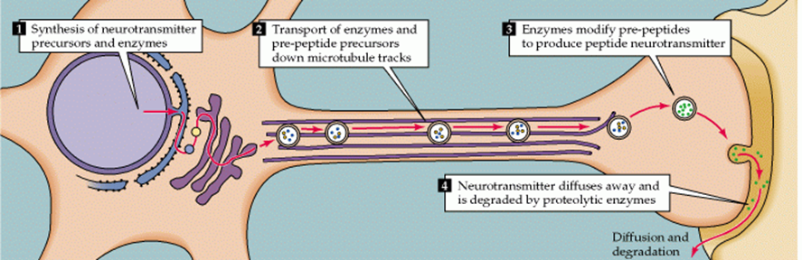

---
template: 4-6-3

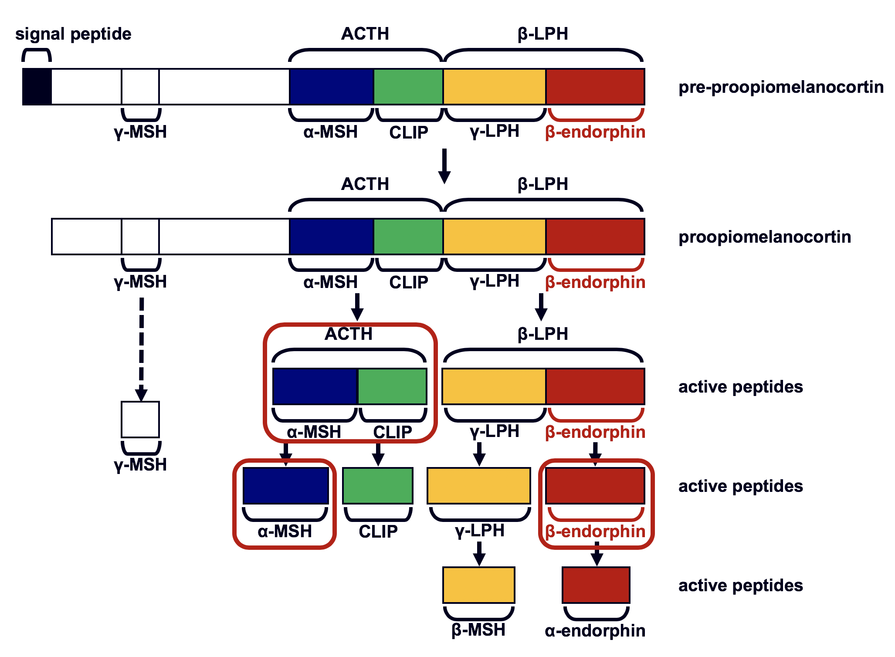

<!--
signal peptide
β-LPH


ACTH
γ-MSH
α-MSH
CLIP
γ-LPH
β-endorphin
pre-proopiomelanocortin

β-LPH


ACTH
α-MSH
CLIP
γ-LPH
β-endorphin
active peptides

β-LPH


ACTH
γ-MSH
α-MSH
CLIP
γ-LPH
β-endorphin
proopiomelanocortin

γ-MSH

α-MSH
CLIP

γ-LPH

β-endorphin
active peptides

β-MSH

α-endorphin
active peptides

-->

---
template: 4-6-4

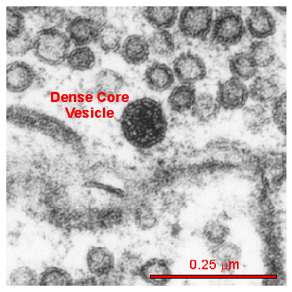

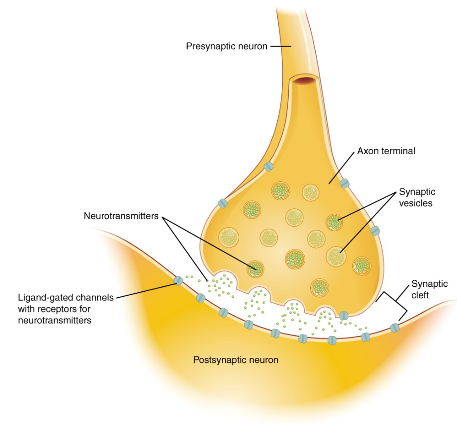


---
template: 4-6-5
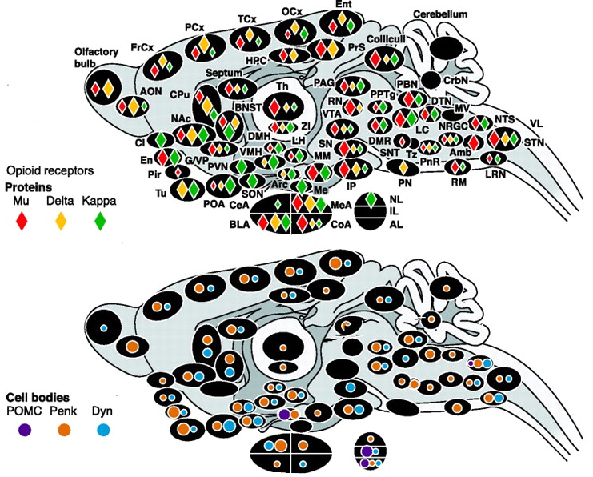

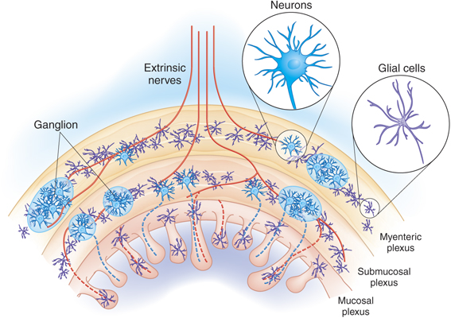


---
template: 4-6-6
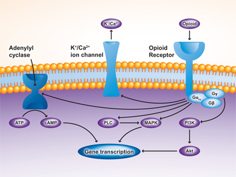


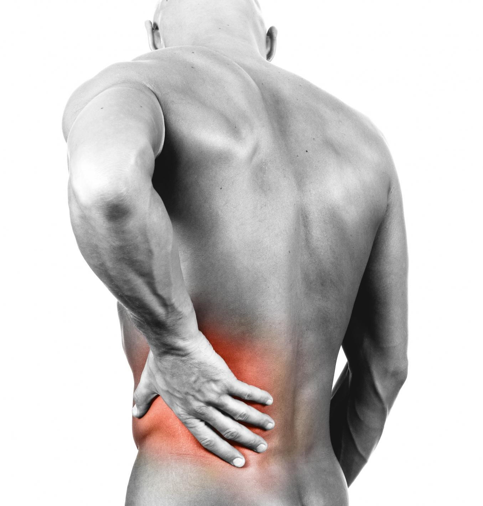


---
template: 4-6-7

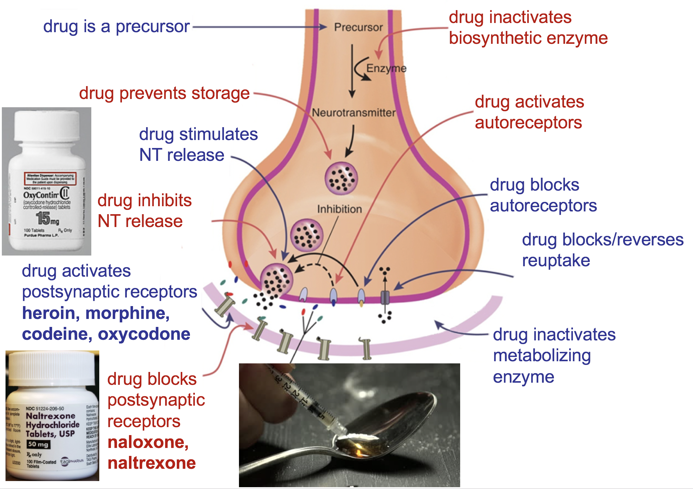

<!--
drug inactivates 
biosynthetic enzyme
drug is a precursor
drug prevents storage
drug activates
autoreceptors

drug stimulates 
NT release
drug blocks
autoreceptors
drug inhibits
NT release
drug blocks/reverses
reuptake
drug activates
postsynaptic receptors
heroin, morphine,
codeine, oxycodone
drug inactivates 
metabolizing
enzyme


drug blocks 
postsynaptic
receptors
naloxone,
naltrexone
-->

---
template: 4-6-8

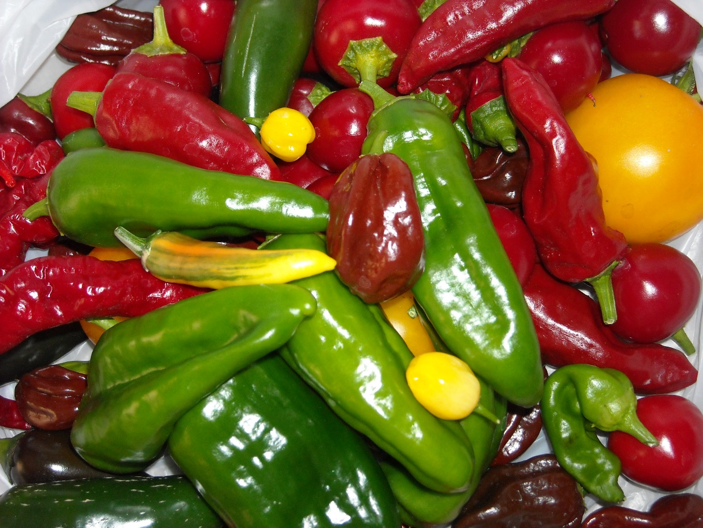

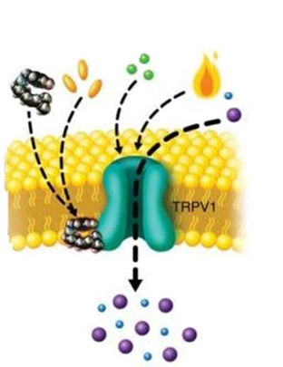


.bolder[]
.bolder[]
.bolder[]
.bolder[]
.bolder[]
.bolder[]
.bolder[]

<!--
endogenous agonists
heat
acid
capsaicin
Na+
Ca2+

-->

---

template: 4-6-9

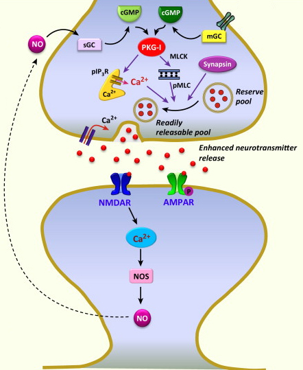


---
template: 4-6-10

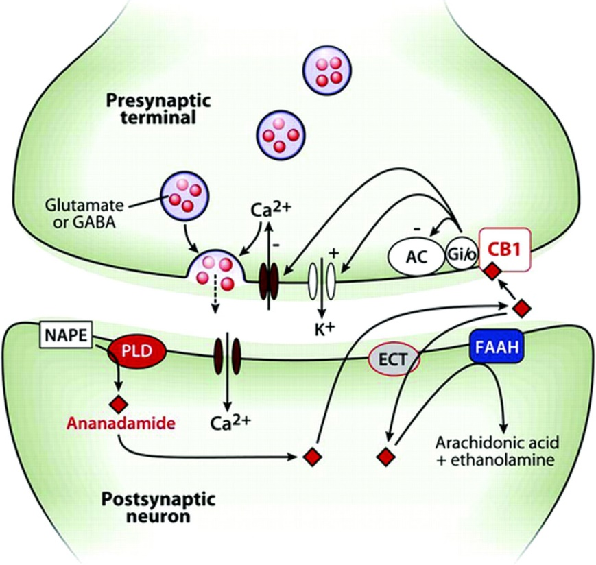


---
template: 4-6-11

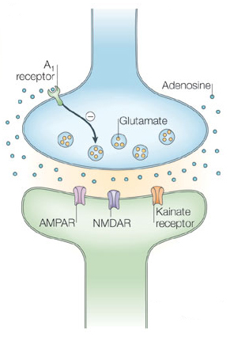

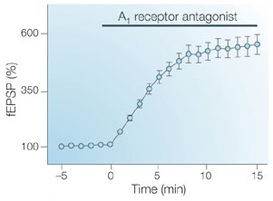


---
template: 4-6-12

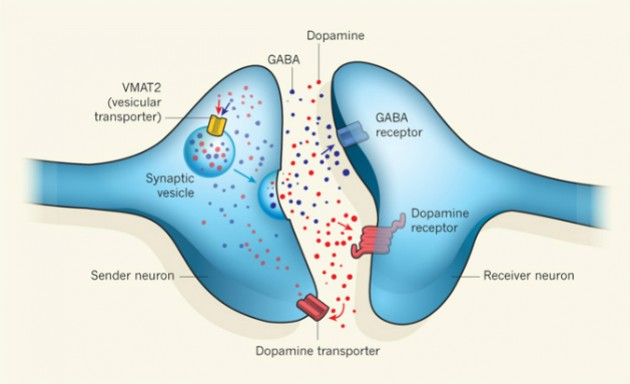


---
template: 4-6-13

---
template: 4-6-14
