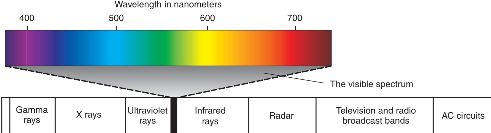
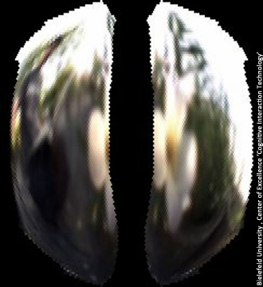
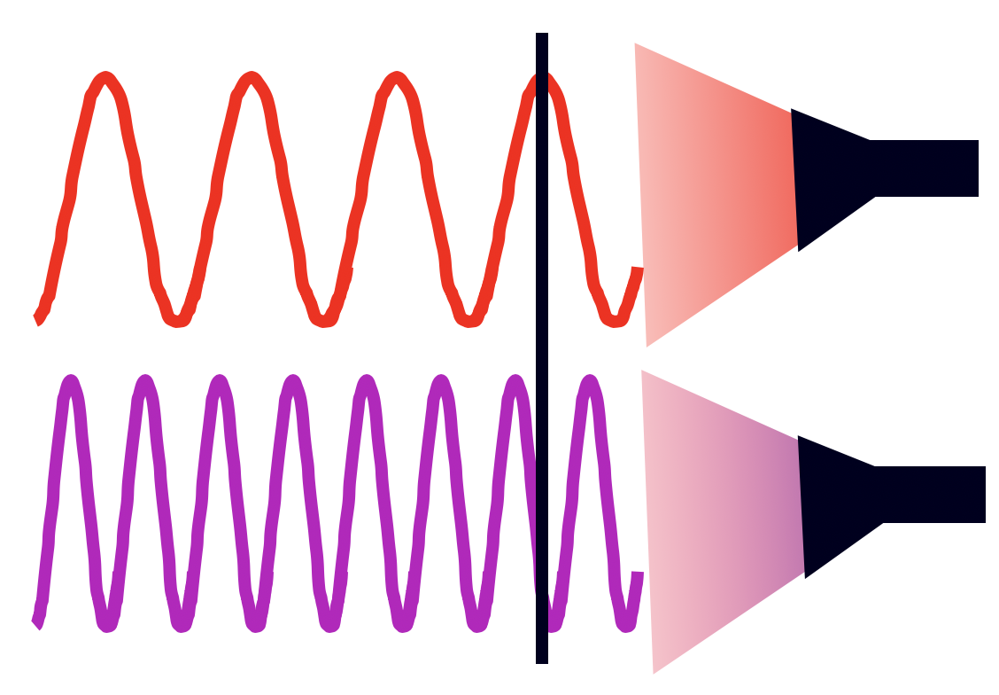
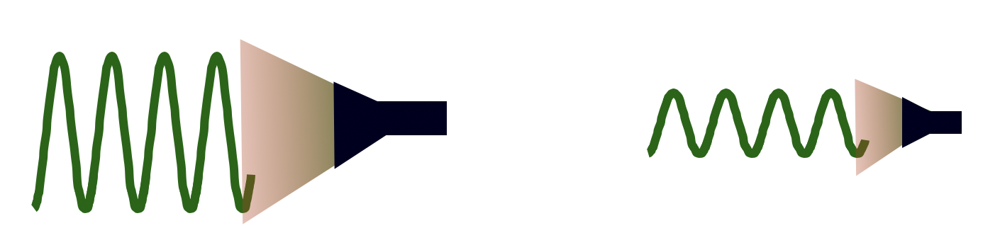
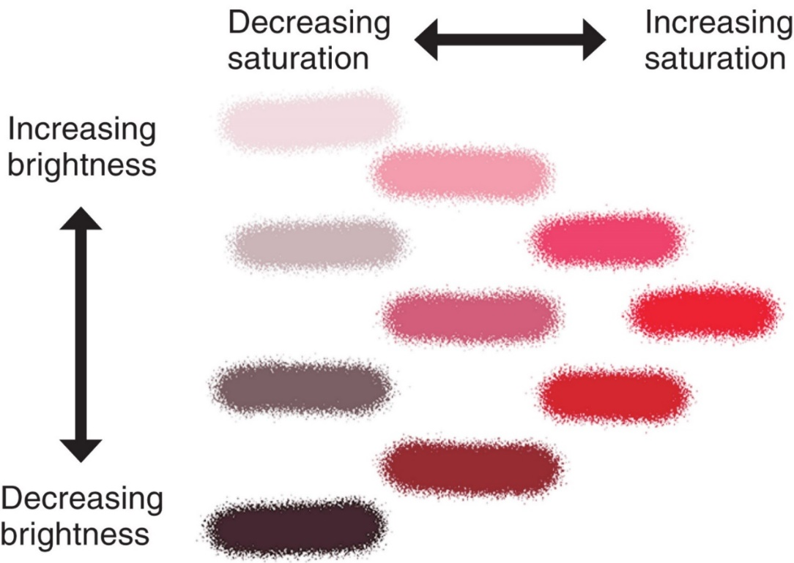

```{r setup, include=FALSE}
options(htmltools.dir.version = FALSE)
```


# Chapter 6:  Vision

#### General Principles of Sensory Processing
#### .bold[The Visual Stimulus]
#### The Anatomy of the Visual System
#### Coding of Light and Dark
#### Coding of Color
#### The Primary Visual Cortex
#### Perception of Visual Information


---
name: 6-2-2
layout: true

# The Visual Stimulus
### The Electromagnetic Spectrum. 
- light behaves both as particle and as wave
- focus on wave-like aspects of light
- visible light is small portion of electromagnetic spectrum
- human eyes not sensitive to electromagnetic radiation outside this narrow range


---
name: 6-2-3
layout: true

# The Visual Stimulus
### The Electromagnetic Spectrum. 
- honeybees can detect ultraviolet radiation

---
name: 6-2-4
layout: true


# The Visual Stimulus
### Color and Brightness. 

.pull-left[
- light travels at constant speed (186,000 miles/sec)
- so, single wavelengths strike surface at constant rate
- longer wavelengths strike less frequently
- shorter wavelengths strike more frequently
- wavelength encoded as color or hue
]

---
name: 6-2-5
layout: true

# The Visual Stimulus
.pull-left[
### Color, and Brightness and Purity. 
- if light contains fairly equal mixture of all wavelengths, it produces no sensation of hue, appears white
- if light contains only one wavelength, it is saturated
- if light contains mixture of wavelengths, dominant wavelength(s) will be perceived
]

---
name: 6-2-6
layout: true

# Image Credits

- slide 2:	Carlson, N.R. (2012). Physiology of Behavior, 11th ed. Pearson Publishing
- slide 3:	http://utahpests.usu.edu/htm/utah-pests-news/up-winter-2012/honey-bee-navigation
- slide 4:	image drawn by D.P. Devine
- slide 5:	Carlson, N.R. (2012). Physiology of Behavior, 11th ed. Pearson Publishing
	http://www.gamonline.com/catalog/colortheory/images/spectrum.gif


---
template: 6-2-2


.bolder[]
.bolder.Large[]

---
template: 6-2-3


---
template: 6-2-3


---
template: 6-2-4
.pull-right[

]
.column-right[
- magnitude or intensity of waves determines perception of brightness
]



---
template: 6-2-5

.pull-right[

]


---
template: 6-2-6