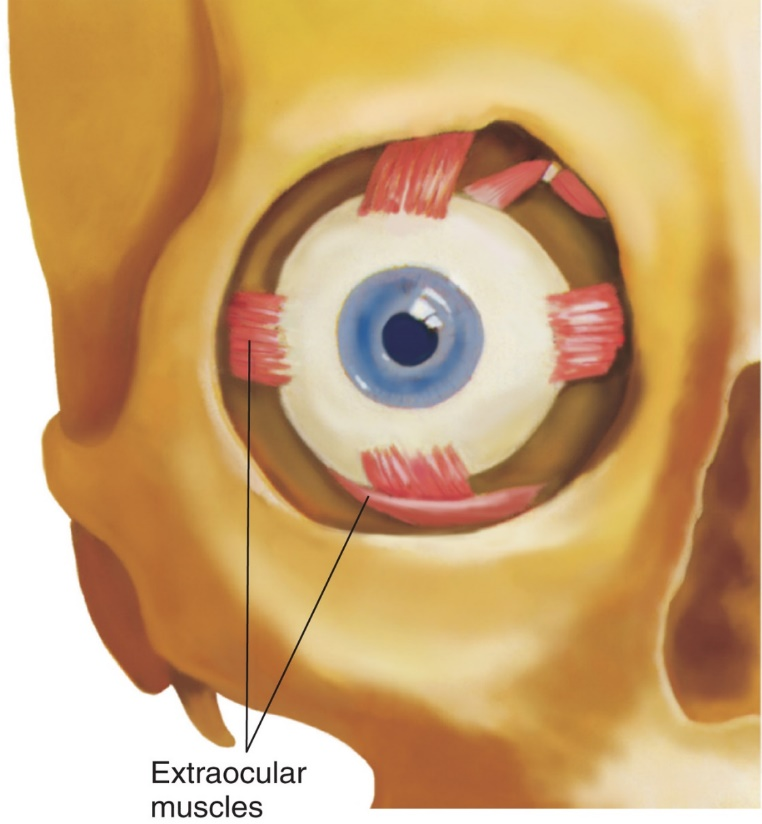
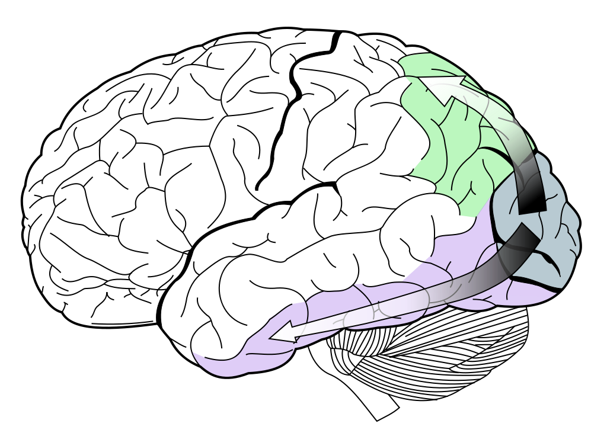

```{r setup, include=FALSE}
options(htmltools.dir.version = FALSE)
```


# Chapter 6:  Vision

#### General Principles of Sensory Processing
#### The Visual Stimulus
#### .bold[The Anatomy of the Visual System]
#### Coding of Light and Dark
#### Coding of Color
#### The Primary Visual Cortex
#### Perception of Visual Information


---
name: 6-3-2
layout: true


# The Anatomy of theVisual System
### The Human Eye. 
- light travels in straight lines
- amount of light controlled 
  by iris
- light focused on retina by 
  lens

- inverted upside-down image

- fovea: contains only cones
- mediates high acuity, 
  color vision


---
name: 6-3-3
layout: true

# The Anatomy of the Visual System
### The Human Eye - Eye Movements. 
- vergence: cooperative movements that keep both eyes fixed on target (i.e. keeps target fixed on fovea)
- saccades: scanning movements where gaze is abruptly shifted from one point to next
- pursuit: smooth tracking movements that keep object’s image fixed in place on fovea

---
name: 6-3-4
layout: true

# The Anatomy of the Visual System
### The Human Eye. 
- layers of the retina

---
name: 6-3-5
layout: true

# The Anatomy of the Visual System
### The Human Eye - Photoreceptors
- location at back of retina

---
name: 6-3-6
layout: true

#The Anatomy of the Visual System
### The Human Eye - Photoreceptors. 
- fovea

---
name: 6-3-7
layout: true

# The Anatomy of the Visual System
### The Human Eye - Photoreceptors. 
- photoreceptors at back of retina
- 120,000,000 rods (scotopic vision)
- 6,000,000 cones (photopic vison)

---
name: 6-3-8
layout: true


# The Anatomy of the Visual System
### The Human Eye - Photoreceptors. 
- low convergences in cone-fed circuits
- high convergence in rod-fed circuits

---
name: 6-3-9
layout: true

# The Anatomy of the Visual System
### The Human Eye
- high density of cones in fovea
- high acuity in bright light
- high density of rods outside fovea
- spatial summation in low light </br>with loss of precision and detail


---
name: 6-3-10
layout: true

# The Anatomy of the Visual System
### The Human Eye. 
- the optic disk = the blind spot

---
name: 6-3-11
layout: true


# The Anatomy of the Visual System
### The Primary Visual Pathway. 
- retinal ganglion cell axons </br> form optic nerves


---
name: 6-3-12
layout: true

# The Anatomy of the Visual System
.pull-left[
### The Primary Visual Pathway. 
- optic nerves join form x-shaped optic chiasm
- optic nerves to lateral geniculate nucleus of  thalamus
- lateral geniculate neurons send axons to primary visual (striate) cortex
]

---
name: 6-3-13
layout: true

# The Anatomy of the Visual System
### The Primary Visual Pathway.
4 Types of Retinal Ganglion Cells
- Parvocellular:
- small cell bodies, small receptive fields,
- originate mostly in fovea
- Magnocellular:
- larger cell bodies, larger 
  receptive fields
- originate throughout retina, 
  including periphery
- Koniocellular:
- small as dust
- very sparse, not well understood
- Photosensitive:
- giant cells containing melanopsin
- contribute to synchronization of daily rhythms, etc.

---
name: 6-3-14
layout: true

# The Anatomy of the Visual System
### The Primary Visual Pathway. 
- parvocellular, magnocellular, and koniocellular pathways from retina to LGN are distinct
- continue as distinct pathways from LGN to PVC

---
name: 6-3-15
layout: true

# The Anatomy of the Visual System
### The Primary Visual Pathway. 
- dorsal “where” pathway; ventral “what” pathway

---
name: 6-3-16
layout: true

# The Anatomy of the Visual System
### Additional Visual Pathways. 
- retino-suprachiasmatic hypothalamic pathway
- retino-tectal pathway

---
name: 6-3-17
layout: true

# Image Credits

- slide 2-3:	Breedlove, S.M., Watson, N.V. (2013). Biological Psychology: An Introduction to Behavioral, Cognitive, and Clinical Neuroscience, 7th ed. Sinauer Associates, Inc.
- slide 4-5:	Carlson, N.R. (2012). Physiology of Behavior, 11th ed. Pearson Publishing
- slide 6:	Breedlove, S.M., Watson, N.V. (2013). Biological Psychology: An Introduction to Behavioral, Cognitive, and Clinical Neuroscience, 7th ed. Sinauer Associates, Inc.
- slide 7:	http://www.ecse.rpi.edu/~schubert/Light-Emitting-Diodes-dot-org/chap16/F16-02 Photopic mesopic scotopic vision.jpg
	Breedlove, S.M., Watson, N.V. (2013). Biological Psychology: An Introduction to Behavioral, Cognitive, and Clinical Neuroscience, 7th ed. Sinauer Associates, Inc.
- slide 8:	Pinel, J.P.J. (1997). Biopsychology, 4th ed. Allyn and Bacon
- slide 9:	http://i.stack.imgur.com/POB6W.jpg
- slide 10:	Carlson, N.R. (2012). Physiology of Behavior, 11th ed. Pearson Publishing
- slide 11:	Breedlove, S.M., Watson, N.V. (2013). Biological Psychology: An Introduction to Behavioral, Cognitive, and Clinical Neuroscience, 7th ed. Sinauer Associates, Inc. slides 7:
- slide 12:	Carlson, N.R. (2012). Physiology of Behavior, 11th ed. Pearson Publishing
- slide 13:	http://www.rci.rutgers.edu/~uzwiak/AnatPhys/NPSpringLect4_files/image029.jpg
- slide 14:	Carlson, N.R. (2012). Physiology of Behavior, 11th ed. Pearson Publishing
- slide 15:	 http://en.wikipedia.org/wiki/Visual_cortex#/media/File:Ventral-dorsal_streams.svg


---
name: 6-3-18
layout: true

# Image Credits

- slide 16:	http://www.nature.com/nrneph/journal/v5/n7/images/nrneph.2009.88-f4.jpg
	http://webvision.med.utah.edu/imageswv/SauveFig21.jpg


---
template: 6-3-2


<!--
R

pupil

iris

lens
ciliary
muscles
optic
 disc
R
retina
fovea
-->

---
template: 6-3-3



---
template: 6-3-4


---
template: 6-3-5


---
template: 6-3-6


---
template: 6-3-7


---
template: 6-3-8


---
template: 6-3-9


---
template: 6-3-10


---
template: 6-3-11


---
template: 6-3-12

.pull-right[

]

---
template: 6-3-13


---
template: 6-3-14


---
template: 6-3-15


.bolder[]
.bolder.Large[]
.bolder.Large[]


---
template: 6-3-16


---
template: 6-3-17

---
template: 6-3-18
