```{r setup, include=FALSE}
options(htmltools.dir.version = FALSE)
```

# Chapter 6:  Vision

#### General Principles of Sensory Processing
#### The Visual Stimulus
#### The Anatomy of the Visual System
#### Coding of Light and Dark
#### Coding of Color
#### The Primary Visual Cortex
#### .bold[Perception of Visual Information]


---
name: 6-7-2
layout: true

# Perception of Visual Information
### Two Streams of Visual Analysis. 
.pull-left[
**Dorsal Stream** = * .bolder[Where?]*
- mostly magnocellular
- important in: 
    - identifying spatial location
    - organizing movement toward objects
  
**Ventral Stream** = * .bolder[What?]*
- mostly parvocellular
- important in: 
    - color vision in identifying forms 
    - features of objects
]


---
name: 6-7-3
layout: true


# Perception of Visual Information
### Dorsal Stream: Where?
- **occipital → parietal cortex**

---
name: 6-7-4
layout: true

# Perception of Visual Information
### Dorsal Stream: Where?
.pull-left[
- cells in **V5/MT** analyze
    - simple motion and direction
- cells detect movement
    - specific direction 
    - speed
- regardless of size, brightness, color, shape...
]


---
name: 6-7-5
layout: true

# Perception of Visual Information
### Dorsal Stream: Where?
.pull-left[
- **Medial superior temporal** cortex (area **MST**) 
- important for analysis of: 
    - complex circular motion
    - spiral motion
]

---
name: 6-7-6
layout: true

# Perception of Visual Information
### Dorsal Stream: Where?
- motion detection constructed in your brain

---
name: 6-7-7
layout: true
class: clear

---
name: 6-7-8
layout: true

# Perception of Visual Information
### Dorsal Stream: Where?
- area at junction of temporal and </br> parietal lobes stabilizes visual image
- area MSTd important for optic flow

---
name: 6-7-9
layout: true

# Perception of Visual Information
### Dorsal Stream: Where?
- depth perception analyzed by monocular/binocular cues
- **monocular** cues:
    - perspective
    - relative retinal size
    - loss of detail in distance
    - relative apparent movement </br>as you move your head
- **binocular** cues:
    - retinal disparity

---
name: 6-7-10
layout: true

# Perception of Visual Information
### Ventral Stream: What?
- **occipital → temporal**, and **temporal → frontal cortex**


---
name: 6-7-11
layout: true

# Perception of Visual Information
### Ventral Stream: What?
- complex recognition at higher (more frontal) levels
- posterior = general information about objects
- anterior = recognition of individual faces


---
name: 6-7-12
layout: true

# Perception of Visual Information
### Ventral Stream: What?
.pull-left[
- specific regions for recognition of specific classes of objects (e.g. fusiform cortex for facial recognition, extrastriate body area for body parts)
]

---
name: 6-7-13
layout: true

# Perception of Visual Information
### Higher Order Processing
.pull-left[
- more than 50% of 
  primate cortex 
  implicated in visual 
  processing and 
  associated functions
]

---
name: 6-7-14
layout: true

# Image Credits

- slide 2:	http://en.wikipedia.org/wiki/Visual_cortex#/media/File:Ventral-dorsal_streams.svg
- slide 3:	http://vision.ucsf.edu/hortonlab/images/V1.V2.pathway copy.jpg
	Carlson, N.R. (2012). Physiology of Behavior, 11th ed. Pearson Publishing 
- slide 4:	Carlson, N.R. (2012). Physiology of Behavior, 11th ed. Pearson Publishing
	drawn by D.P. Devine
	http://savecalifornia.com/blog/wp-content/uploads/glass-half-full.jpg
- slide 5:	http://www.moillusions.com/wp-content/uploads/2012/12/tech.gif
	https://alexshye.files.wordpress.com/2013/10/roller_coaster.jpg
- slide 6:	Carlson, N.R. (2012). Physiology of Behavior, 11th ed. Pearson Publishing
- slide 7:	http://www.top10tag.com/wp-content/uploads/2009/10/waterfall.gif
- slide 8:	http://i974.photobucket.com/albums/ae224/TheVagabondVoyage/Florida/BenHillGriffin Stadium atUniversityofFlorida-GainesvilleFlorida.jpg
- slide 9:	http://upload.wikimedia.org/wikipedia/commons/0/02/Ponzo_illusion.gif
	http://www.anopticalillusion.com/wp-content/uploads/2012/07/e-tower.jpg
	http://i974.photobucket.com/albums/ae224/TheVagabondVoyage/Florida/BenHillGriffin Stadium atUniversityofFlorida-GainesvilleFlorida.jpg
	http://vintage-visuals.com/images/retinal_disparity_stereo_283x329.jpg
- slide 10:	http://vision.ucsf.edu/hortonlab/images/V1.V2.pathway copy.jpg
	Carlson, N.R. (2012). Physiology of Behavior, 11th ed. Pearson


---
name: 6-7-15
layout: true

# Image Credits

- slide 11:	Carlson, N.R. (2012). Physiology of Behavior, 11th ed. Pearson Publishing
	http://upload.wikimedia.org/wikipedia/commons/4/4e/Fusiform_gyrus_animation.gif
- slide 12:	http://www.nature.com/neuro/journal/v7/n5/images/nn1224-F6.jpg
	Carlson, N.R. (2012). Physiology of Behavior, 11th ed. Pearson Publishing 	
- slide 13:	http://www.pc.rhul.ac.uk/staff/J.Zanker/PS1061/L2/PS 1061 lecture 2_files/brain_circuit.gif


---
template: 6-7-2

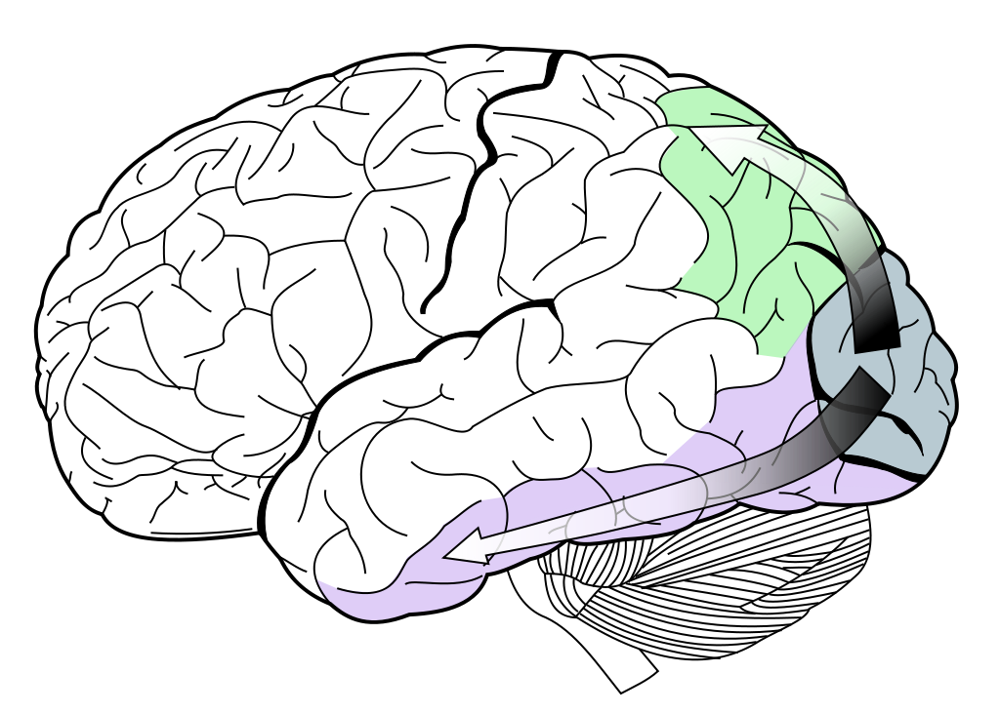

<!--
DORSAL STREAM
(magnocellular, “where”)

VENTRAL STREAM
(parvocellular, “what”)
-->

---
template: 6-7-3

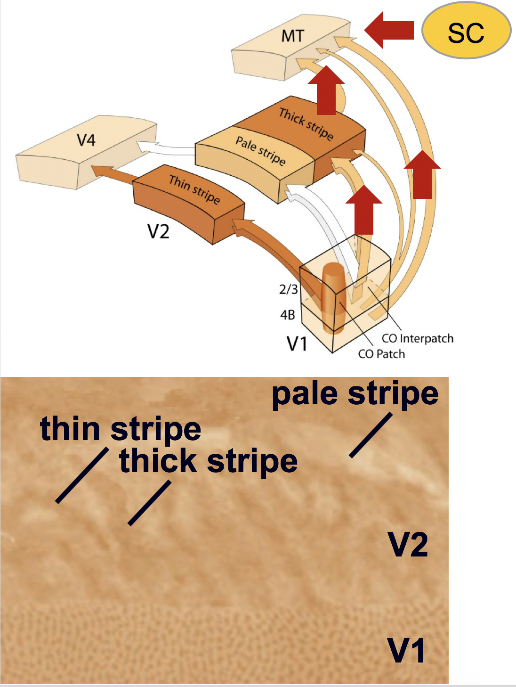

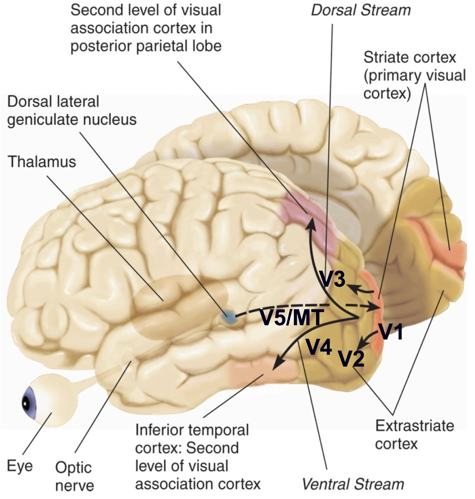

<!--
thin stripe
thick stripe
pale stripe

V5/MT
V4
V3
V2
V1
SC

V2
V1

-->

---
template: 6-7-4


<!--

V5/MT
V4
V3
V2
V1
-->

---
template: 6-7-5
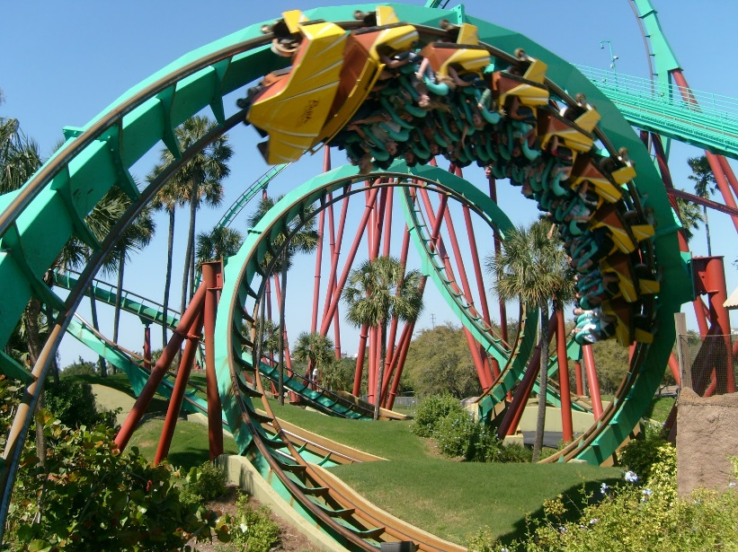


<!--
V5/MT
V4
V3
V2
V1
-->

---
template: 6-7-6
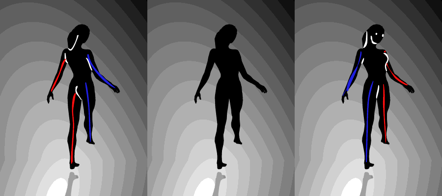


---
template: 6-7-7
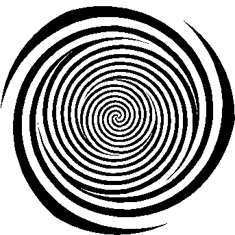


---
template: 6-7-8


---
template: 6-7-9

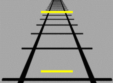

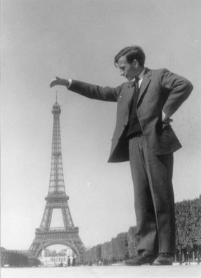

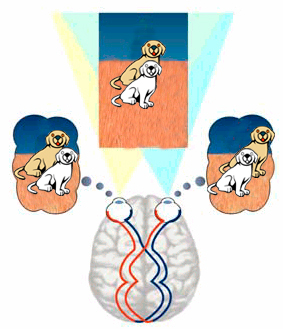


---
template: 6-7-10
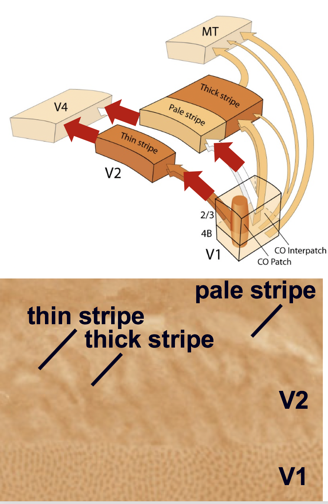


<!--
thin stripe
thick stripe
pale stripe

V2
V1

V5/MT
V4
V3
V2
V1

-->

---
template: 6-7-11
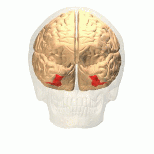


<!--
inferior temporal cortex

V5/MT
V4
V3
V2
V1
-->

---
template: 6-7-12
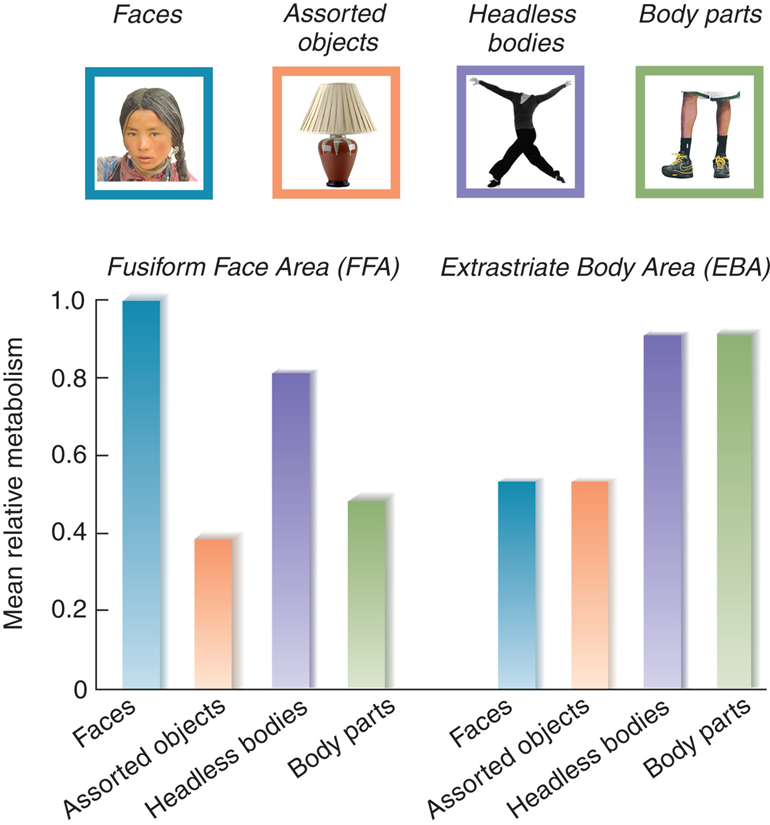

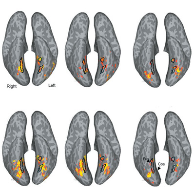

<!--

faces
birds
flowers

houses
guitars
cars

-->

---
template: 6-7-13
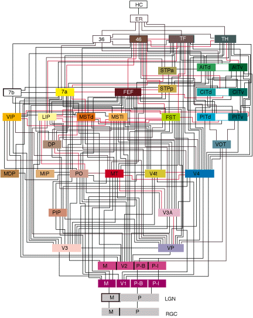


---
template: 6-7-14


---
template: 6-7-15

