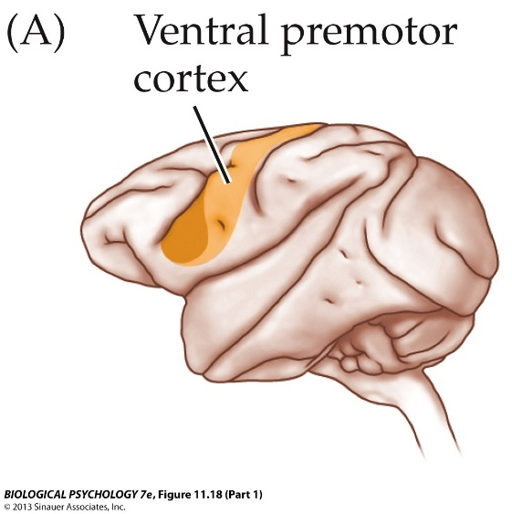
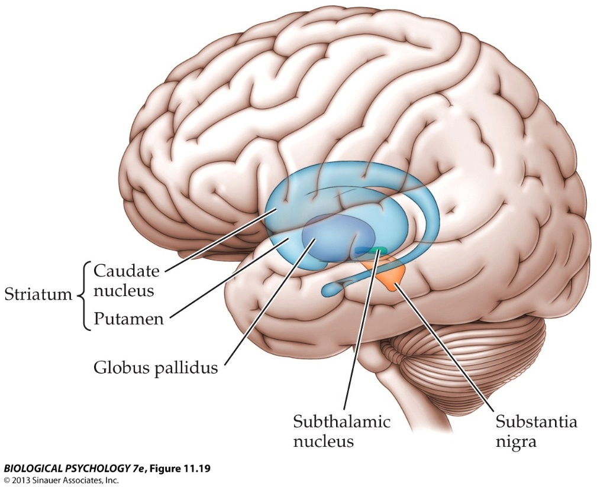

```{r setup, include=FALSE}
options(htmltools.dir.version = FALSE)
```


# Chapter 8:  Control of Movement

## General Principles of Motor Behavior  
## Skeletal Muscle Anatomy and Physiology  
## Proprioception and Reflexes  
## Control of Movement by the Brain  
## Movement Disorders  


---

# Chapter 8:  Control of Movement


## .bold[General Principles of Motor Behavior]
## Skeletal Muscle Anatomy and Physiology  
## Proprioception and Reflexes  
## Control of Movement by the Brain  
## Movement Disorders  


---

# General Principles of Motor Behavior

## Sensory Inputs Modulate Motor Behaviors. 

.pull-left[
- walking along bumpy road,
  posture easily adjusted 
  without thinking about it
- complex tasks require 
  sensory feedback
- sensation ≠ awareness
  
    


]
.pull-right[


]


---

# General Principles of Motor Behavior


.pull-left[
### Motor Plan. 
- complex set of motor
  commands prior to 
  start of behavior

]

.pull-right[

]


---

# General Principles of Motor Behavior

Speed-Accuracy Tradeoff. 
- higher speed = lower accuracy




---

# General Principles of Motor Behavior
.pull-left[
####Feedback Control of Movement. 
- closed loop systems:
- maximize accuracy
- continuous CNS and
  peripheral feedback 
  allow corrections to
  regulate and adjust behavior
  
  
- open loop systems:
- maximize speed
- no external feedback
- no corrections or adjustments
- behavior is pre-programmed
- ballistic movements
]
.pull-right[

  

]


---

# General Principles of Motor Behavior

.left-column[
Feedback Control of Movement. 
- combination of closed loop and open loop systems
]
.pull-right[

]


<span style="position:absolute; top:25%; left:91.8%;z-index:1; background-color:black;  opacity:0.75; font-size:1em; padding:0.05em;color:white">Sensory </br> inputs</span>

<span style="position:absolute; top:14.1%; left:44%;z-index:1;background-color:black; opacity:0.75; font-size:1em; padding:0.2em;color:white">Sensory </br> inputs</span>

<span style="position:absolute; top:65%; left:91.8%;z-index:1;background-color:black; opacity:0.75; font-size:1em; padding:0.2em;color:white">Sensory </br> inputs</span>


---

# General Principles of Motor Behavior

#### Motor Plan. 

.pull-left[
- complex set of motor commands
- prior to start of behavior
- feedback fine-tunes the plan


]

.pull-right[

]


---

#General Principles of Motor Behavior

Central Pattern Generators. 
- rhythmic activity initiated and modulated by brain
- rhythmic activity fine-tuned by sensory input


---

# General Principles of Motor Behavior

The Brain is a Sensorimotor Processor. 
- rhythmic activity initiated and modulated by brain
- rhythmic activity fine-tuned by sensory input





---

# Image Credits

- slide 3:	https://drgravesblog.files.wordpress.com/2014/03/ankle-sprain.gif
	http://pad1.whstatic.com/images/thumb/2/25/Play-Jazz-Piano-Step-3.jpg/670px-Play-Jazz-Piano-Step-3.jpg
	http://www.spincyclesports.com/bike-racing.jpg
- slide 4:	Breedlove, S.M., Watson, N.V. (2013). Biological Psychology: An Introduction to Behavioral, Cognitive, and Clinical Neuroscience, 7th ed. Sinauer Associates, Inc.
- slide 5:	http://thedailyblog.co.nz/wp-content/uploads/2014/10/whack_a_mole.jpg
- slide 6:	Breedlove, S.M., Watson, N.V. (2013). Biological Psychology: An Introduction to Behavioral, Cognitive, and Clinical Neuroscience, 7th ed. Sinauer Associates, Inc.
- slide 7:	http://o.quizlet.com/wRt1lkzTJfqh0EgcuW1n6Q.png
- slide 8:	Breedlove, S.M., Watson, N.V. (2013). Biological Psychology: An Introduction to Behavioral, Cognitive, and Clinical Neuroscience, 7th ed. Sinauer Associates, Inc.
- slide 9:	http://www.informrunning.com/wp-content/uploads/2013/12/crossed-extensor-reflex.jpg
- slide 10:	http://workinghandsproject.com/images/demo/Homunculus.jpg


