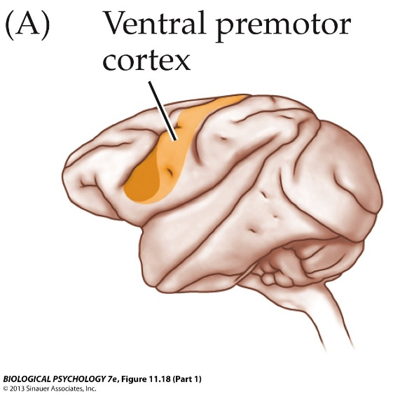
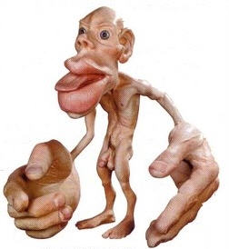

```{r setup, include=FALSE}
options(htmltools.dir.version = FALSE)
```


# Chapter 8:  Control of Movement

#### General Principles of Motor Behavior  
#### Skeletal Muscle Anatomy and Physiology  
#### Proprioception and Reflexes  
#### Control of Movement by the Brain  
#### Movement Disorders  


---
name: 8-4-2
layout: true

# Control of Movement by the Brain
### Prefrontal Cortex. 
- rostral to premotor cortex & supplementary motor area
- sensory inputs from temporal and parietal lobes
- important for organizing movement plans

---
name: 8-4-3
layout: true

# Control of Movement by the Brain
### Premotor Cortex and Supplementary Motor Area. 
- input from prefrontal, parietal & temporal cortices
- output to primary motor cortex
- important in planning 
    - complex, sequenced behaviors


---
name: 8-4-4
layout: true


# Control of Movement by the Brain
### Premotor Cortex and Supplementary Motor Area. 
- SMA lesion impairs initiation and sequencing of behavior
- premotor cortex lesion 
    - *impairs* stance, gait, limb coordination
    - *spares* fine motor function


---
name: 8-4-5
layout: true

# Control of Movement by the Brain
### Ventral Premotor Cortex. 
- mirror neurons

---
name: 8-4-6
layout: true

# Control of Movement by the Brain
### Primary Motor Cortex (M1). 
- precentral gyrus, rostral to central fissure


---
name: 8-4-7
layout: true

# Control of Movement by the Brain
### Primary Motor Cortex. 
- brief stimulation caused brief jerky movement
- prolonged stimulation caused complex movement

---
name: 8-4-8
layout: true

# Control of Movement by the Brain
### Primary Motor Cortex. 
- about ⅓ of M1 cells encode single muscle movement
- other M1 cells encode complex functions like direction

---
name: 8-4-9
layout: true

# Control of Movement by the Brain

### Primary Motor Cortex. 
- about ⅓ of M1 cells encode 
    - single muscle movement
- other M1 cells encode complex functions 
    - movement direction


---
name: 8-4-10
layout: true

# Control of Movement by the Brain
### Basal Ganglia. 
- interconnected subcortical ganglia
    - in diencephalon and mesencephalon
- activity of neurons correlate with movement
    - *striatum*
        - *caudate* and *putamen* (CPu)
    - *subthalamic nucleus* (STN)
    - *globus pallidus* (GPi, GPe)
    - *substantia nigra* (SNpc, SNpr)

---
name: 8-4-11
layout: true

# Control of Movement by the Brain
### Basal Ganglia. 
- extensive cortical inputs, many thalamic inputs
- focused inhibitory output to thalamus and brainstem
- organizing and production of movement
- inhibits excess motor activity

---
name: 8-4-12
layout: true

# Control of Movement by the Brain
### Basal Ganglia. 
- **indirect pathway**
    - cortex → caudate → Gpe → Gpi/SNr
- **direct pathway**
    - cortex → caudate → GPi/SNr
- **hyperdirect pathway**
    - cortex → STN → Gpe and Gpi/SNr


---
name: 8-4-13
layout: true

# Control of Movement by the Brain
### Cerebellum. 
- about 50 billion neurons (vs. 22 billion in neocortex)
- 2 hemispheres, cerebellar cortex, deep cerebellar nuclei
- cerebellar inputs provide joint angles, muscle loads, etc.
- cerebellar outputs influence motor systems
- cerebellum also implicated in non-motor functions 
    - (attention, executive control, language, working memory, </br>learning, pain, emotion, motivated behavior, addiction)

---
name: 8-4-14
layout: true

# Control of Movement by the Brain
### Cerebellum. 
- **medial cerebellum** (vermis) 
- receives vestibular/auditory/visual/somatosensory input
- outputs to:
    - fastigial nucleus → vestibular nucleus
    - fastigial nucleus → reticular formation
    - controls trunk and proximal limbs (posture, gait, and balance)


---
name: 8-4-15
layout: true

# Control of Movement by the Brain
### Cerebellum. 
- **intermediate cerebellum**
- input from motor cortex and somatosensory spinal cord
- outputs to interpositus nucleus
- interpositus nucleus → red nucleus
- interpositus nucleus → thalamus → motor cortex
- controls proximal limb movements


---
name: 8-4-16
layout: true


# Control of Movement by the Brain
### Cerebellum. 
- **lateral cerebellum**
- input from motor cortex and somatosensory spinal cord
- outputs to dentate nucleus
- dentate nucleus → red nucleus
- dentate nucleus → thalamus → motor cortex
- controls independent and rapid, skilled
  limb movements (ballistic movements)


---
name: 8-4-17
layout: true


# Control of Movement by the Brain
.pull-left[
### Cerebellum. 
- .bold.green[floculonodular lobe] (aka .green[vestibulocerebellum])
    - balance, eye movements
- .bold.blue[posterior lobe] (aka .blue[cerebrocerebellum])
    - voluntary activity, procedural memory
]
.pull-right[
- .bold.purple[anterior lobe] (aka .purple[spinocerebellum])
    - gait, coordination, skilled movements, regulation of muscle tone, coordination of skilled voluntary movement planning  and modulation of voluntary activity, storage of procedural memories maintenance of balance, control of eye movements
]


---
name: 8-4-18
layout: true

# Control of Movement by the Brain
### Descending Projections. 
- .bold.red[Lateral Tracts]:
- inputs from M1, and from nuclei that receive M1 inputs
- mostly control of distal portions of limbs
- .bold.red[Ventromedial Tracts]:
- inputs from midbrain/brainstem nuclei and from M1
- mostly control of trunk and proximal portions of limbs


---
name: 8-4-19
layout: true

# Control of Movement by the Brain
### Descending Projections - Lateral Tracts. 
1) **lateral corticospinal** (pyramidal) tract
- originate in finger, hand, arm
  regions of M1
- terminate in spinal cord
- controls fingers, hands, arms
- grasping and manipulating objects

2) **corticorubral-rubrospinal** tract
- originate in M1 and red nucleus
- terminate in spinal cord
- controls hands (not fingers), feet,
  distal portions of limbs
- independent limb movements

---
name: 8-4-20
layout: true

# Control of Movement by the Brain
### Descending Projections - Lateral Tracts. 
3) **corticobulbar tract**
- originate in face region of M1
- terminate in cranial nuclei
- control face and tongue movements

---
name: 8-4-21
layout: true

# Control of Movement by the Brain
### Descending Projections - Ventromedial Tracts. 
1) **tectospinal tract**
- originate in superior colliculus
- controls neck and trunk
- coordinates with eye movements

2) **vestibulospinal tract**
- originate in brainstem vestibular
  nuclei
- terminate in spinal cord
- controls trunk and legs, posture

3) **lateral and medial reticulospinal tracts**
- originate in reticular formation
- terminate in spinal cord
- control muscles of legs
- walking

---
name: 8-4-22
layout: true

# Control of Movement by the Brain
### Descending Projections - Ventromedial Tracts.
 
4) **ventral corticospinal tract**
- originate in trunk and proximal leg 
  region of M1
- terminate in spinal cord
- controls hands (not fingers), lower
  arms, feet, lower legs
- walking and posture

---
name: 8-4-23
layout: true

# Image Credits

- slide 2:	http://upload.wikimedia.org/wikipedia/commons/3/39/Prefrontal_cortex_(left)_animation.gif
	Carlson, N.R. (2012). Physiology of Behavior, 11th ed. Pearson Publishing
- slide 3-4:	http://upload.wikimedia.org/wikipedia/commons/7/7e/Brodmann_area_6_animation_small.gif
	Carlson, N.R. (2012). Physiology of Behavior, 11th ed. Pearson Publishing 
- slide 5:	Carlson, N.R. (2012). Physiology of Behavior, 11th ed. Pearson Publishing
- slide 6:	http://www.madscientistblog.ca/wp-content/uploads/2010/12/penfieldhomunculus.jpg
	http://www.bio.miami.edu/tom/courses/protected/ECK/CH08/figure-08-13d.jpg
	http://brainconnection.brainhq.com/wp-content/uploads/2013/03/1b.gif	
	http://commons.wikimedia.org/wiki/Brodmann_areas?uselang=it#mediaviewer/File:Brodmann_area_4_animation_small.gif
- slide 7:	Carlson, N.R. (2012). Physiology of Behavior, 11th ed. Pearson Publishing
- slide 8-9:	Breedlove, S.M., Watson, N.V. (2013). Biological Psychology: An Introduction to Behavioral, Cognitive, and Clinical Neuroscience, 7th ed. Sinauer Associates, Inc.
- slide 10:	http://upload.wikimedia.org/wikipedia/commons/4/41/Caudate_nucleus.gif
	http://upload.wikimedia.org/wikipedia/commons/1/18/Globus_pallidus.gif
	Breedlove, S.M., Watson, N.V. (2013). Biological Psychology: An Introduction to Behavioral, Cognitive, and Clinical Neuroscience, 7th ed. Sinauer Associates, Inc.


---
name: 8-4-24
layout: true

# Image Credits

- slide 11:	Kandel, E.R., Schwartz, J.H., Jessell, T.M., Seigelbaum, S.A., and Hudspeth, A.J. (2012). Principles of Neural Science, 5th ed. McGraw-Hill Professional
- slide 12:	Kandel, E.R., Schwartz, J.H., Jessell, T.M., Seigelbaum, S.A., and Hudspeth, A.J. (2012). Principles of Neural Science, 5th ed. McGraw-Hill Professional
	http://www.cse.emory.edu/sciencenet/undergrad/SURE/Posters/2004_chen_1.gif
- slide 13:	http://upload.wikimedia.org/wikipedia/commons/f/fa/Cerebellum.gif
	http://serendip.brynmawr.edu/exchange/files/authors/faculty/295/human brain  brainstem and cerebellum.jpg
	http://31.media.tumblr.com/tumblr_lk9u2mGA5X1qa6reco1_500.gif
- slide 14-16:	http://kin450-neurophysiology.wikispaces.com/file/view/Picture 4.jpg/393682712/Picture 4.jpg
	Breedlove, S.M., Watson, N.V. (2013). Biological Psychology: An Introduction to Behavioral, Cognitive, and Clinical Neuroscience, 7th ed. Sinauer Associates, Inc.
- slide 17:	http://image.slidesharecdn.com/5-cns1-111102120455-phpapp02/95/5-cns-1-26-728.jpg?cb=1320253591
	http://image.slidesharecdn.com/5-cns1-101007143826-phpapp01/95/5-cns-1-27-728.jpg?cb=1286481016
- slide 18:	http://apbrwww5.apsu.edu/thompsonj/Anatomy & Physiology/2010/2010 Exam Reviews/Exam 4 Review/12-32_SnsryMtrTrct.JPG
- slide 19-22:	Carlson, N.R. (2012). Physiology of Behavior, 11th ed. Pearson Publishing


---
template: 8-4-2


<!--
projections to subcortical
and spinal neurons
primary motor cortex (M1)
supplementary motor cortex

parietal cortex
premotor cortex

prefrontal cortex
occipital
cortex
temporal cortex
-->


---
template: 8-4-3


---
template: 8-4-4


---
template: 8-4-5





---
template: 8-4-6





<!--
primary
motor cortex
primary
somatosensory cortex
-->

---
template: 8-4-7


---
template: 8-4-8


---
template: 8-4-9


---
template: 8-4-10


---
template: 8-4-11


---
template: 8-4-12


---
template: 8-4-13


.Large.bolder[]
.Large.bolder[]

---
template: 8-4-14


.Large.bolder[]
.Large.bolder[]
.Large.bolder[]
.Large.bolder[]

---
template: 8-4-15


.Large.bolder[]
.Large.bolder[]
.Large.bolder[]
.Large.bolder[]

---
template: 8-4-16


.Large.bolder[]
.Large.bolder[]
.Large.bolder[]
.Large.bolder[]

---
template: 8-4-17


---
template: 8-4-18


.red.large.bolder[]
.red.large.bolder[]
.red.large.bolder[]

---
template: 8-4-19


---
template: 8-4-20


---
template: 8-4-21


---
template: 8-4-22


---
template: 8-4-23

---
template: 8-4-24