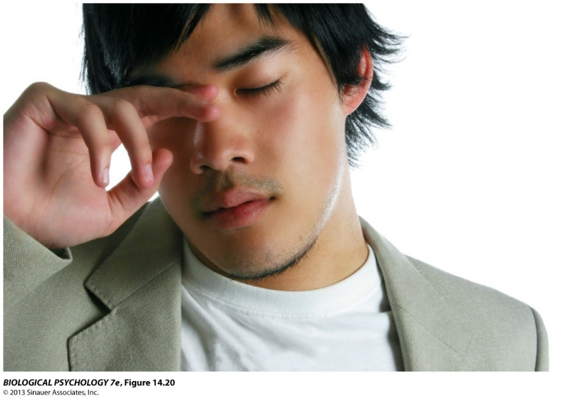

```{r setup, include=FALSE}
options(htmltools.dir.version = FALSE)
```

# Chapter 9:  Sleep and Biological Rhythms

#### Introduction - Physiology of Sleep</br>Why Do We Sleep??</br>The Role of Sleep in Learning and Memory</br>Sleep Across the Lifespan</br>Sensory Processing and Sleep</br>Mechanisms of Sleep</br>Biological Clocks</br>Dreaming</br>Sleep Disorders


---
name: 9-1-2
layout: true

# Chapter 9:  Sleep and Biological Rhythms

#### .bold[Introduction - Physiology of Sleep]</br>Why Do We Sleep??</br>The Role of Sleep in Learning and Memory</br>Sleep Across the Lifespan</br>Sensory Processing and Sleep</br>Mechanisms of Sleep</br>Biological Clocks</br>Dreaming</br>Sleep Disorders


---
name: 9-1-3
layout: true

# Introduction - Physiology of Sleep
### Endogenous Cycles. 

.pull-left[
**Circannual rhythms**
- preparation for annual events (migration, mating season, nesting…)
- inputs from sensory stimuli (light cycle, temperature…)
- additional endogenous rhythmicity
]

---
name: 9-1-4
layout: true

# Introduction - Physiology of Sleep
### Endogenous Cycles. 
.pull-left[
**Circadian rhythms**
- sleep/wakefulness, body temperature, some hormones
- varies by species, varies by individual, varies if artificially exposed to constant light or dark
- reset by exposure to light
]

---
name: 9-1-5
layout: true

# Introduction - Physiology of Sleep
### Free-Running Daily Rhythm. 
.pull-left[
- some slightly longer, some slightly shorter than 24hrs
- in absence of reset, endogenous cycles (e.g. sleep, body 
   temperature, hormones) may desynchronize
]

---
name: 9-1-6
layout: true


# Introduction - Physiology of Sleep
### Reset of Daily Rhythm. 
.pull-left[
- light is best cue, can be assisted by exercise, feeding times, etc.
]

---
name: 9-1-7
layout: true


# Introduction - Physiology of Sleep
### Free-Running Daily Rhythm. 
- slightly longer than 24 hrs in humans
- approximately 25 hrs on average in 
  absence of reset

---
name: 9-1-8
layout: true


# Introduction - Physiology of Sleep
### Stages of Sleep. 
- **electroencephalography** (EEG)
    - records mostly cortical pyramidal cells
- **electromyography** (EMG)
    - muscle contraction
- **electrooculography** (EOG)
    - eye movements


---
name: 9-1-9
layout: true

# Introduction - Physiology of Sleep
### Stages of Sleep. 
.pull-left[
- **Electroencephalography**

- **synchrony** = **high 
  voltage** 
      - neurons fire 
  together

- **desynchrony** = **low 
  voltage**
      - neurons fire 
  independently (more 
  active processing)
]

<!--  
Awake
Alpha Activity
Beta Activity
Stage 1 sleep
Theta Activity
Stage 2 sleep
Sleep
Spindle
seconds
K Complex
Stage 3 sleep
Delta Activity

Stage 4 sleep
Delta activity
REM sleep
Theta Activity
Beta Activity
-->


---
name: 9-1-10
layout: true


# Introduction - Physiology of Sleep
### Stages of Sleep. 
.pull-left[
- **beta** rhythm
     - desynchronous, small 
  amplitude, VHF
     - 13-30 Hz = arousal
- **alpha** rhythm
    - partially synchronous, 
  jagged, HF
    - 8-12 Hz = relaxation

- **theta** rhythm
    - partially synchronous, 
  large amplitude, SF
    - 5-8 Hz = transition from 
  wakefulness to sleep 
  and to deeper sleep
]

<!--  
Awake
Alpha Activity
Beta Activity
Stage 1 sleep
Theta Activity
Stage 2 sleep
Sleep
Spindle
seconds
K Complex
Stage 3 sleep
Delta Activity
Stage 4 sleep
Delta activity
REM sleep
Theta Activity
Beta Activity
-->


---
name: 9-1-11
layout: true


# Introduction - Physiology of Sleep
### Stages of Sleep. 
.pull-left[
- **delta** rhythm
    - synchronous, very large
  amplitude, SF
    - 1-4 Hz = SWS

- **sleep spindles**
    - short bursts of 12-14 Hz
    - associated with memory
  consolidation

- **K complexes**
    - sudden sharp wave forms
    - promote deeper sleep
]

<!--  
Awake
Alpha Activity
Beta Activity
Stage 1 sleep
Theta Activity
Stage 2 sleep
Sleep
Spindle
seconds
K Complex
Stage 3 sleep
Delta Activity
Stage 4 sleep
REM sleep
Theta Activity
Beta Activity
-->


---
name: 9-1-12
layout: true


# Introduction - Physiology of Sleep
### Stages of Sleep. 
.pull-left[
- **4 stages** of sleep + REM in humans

- **stage 1**
    - theta activity
    - average about 10 min
    - random thoughts, no 
  dreams

- **stage 2**
    - theta activity, sleep 
  spindles, K complexes
    - average about 15 min
    - sleeping soundly, but 
  may report still awake
]

<!--  
Awake
Alpha Activity
Beta Activity
Stage 1 sleep
Theta Activity
Stage 2 sleep
Sleep
Spindle
seconds
K Complex
Stage 3 sleep
Delta Activity
Stage 4 sleep
Delta activity
REM sleep
Theta Activity
Beta Activity
-->


---
name: 9-1-13
layout: true


# Introduction - Physiology of Sleep
### Stages of Sleep. 
.pull-left[
- **stage 3**
    - theta and 20-50% delta 
  activity
    - average about 20 min
    - little sensory input, deep
  sleep

- **stage 4**
    - more than 50% delta
  activity
    - average about 45 min
    - difficult to arouse, and if
  aroused may be 
  confused/disoriented
]

<!--  
Awake
Alpha Activity
Beta Activity
Stage 1 sleep
Theta Activity
Stage 2 sleep
Sleep
Spindle
seconds
K Complex
Stage 3 sleep
Delta Activity
Stage 4 sleep
Delta activity
REM sleep
Theta Activity
Beta Activity
-->


---
name: 9-1-14
layout: true


# Introduction - Physiology of Sleep
### Stages of Sleep. 
.pull-left[
- *successive steps* = slower
  heart rate/breathing, 
  slower and higher 
  amplitude EEG activity
]

<!--  
Awake
Alpha Activity
Beta Activity
Stage 1 sleep
Theta Activity
Stage 2 sleep
Sleep
Spindle
seconds
K Complex
Stage 3 sleep
Delta Activity
Stage 4 sleep
Delta activity
REM sleep
Theta Activity
Beta Activity
-->


---
name: 9-1-15
layout: true


# Introduction - Physiology of Sleep
### Stages of Sleep. 
.pull-left[
- **REM** or **paradoxical sleep**
    - rapid eye movements
    - postural muscles paralyzed, loss of tone
    - higher rates of breathing, heart rate
    - higher levels of desynchronous EEG
    - most dreaming and most vivid dreaming
    - generally easier to arouse and will be alert if aroused
]


<!--
Awake
Alpha Activity
Beta Activity
Stage 1 sleep
Theta Activity
Stage 2 sleep
Sleep
Spindle
seconds
K Complex
Stage 3 sleep
Delta Activity
Stage 4 sleep
Delta activity
REM sleep
Theta Activity
Beta Activity
-->


---
name: 9-1-16
layout: true


# Introduction - Physiology of Sleep
### Nightly Progress of Sleep. 
- first 60-90 min, cycle *1-2-3-4* in order
- at end of 60-90 min, rapidly cycle *4-3-2-REM*
- sequence repeats every 60-90 min: 
- *early* in night, 3 and 4 predominate
- *later* in night, 2 and REM increase


---
name: 9-1-17
layout: true


# Introduction - Physiology of Sleep
### Nightly Progress of Sleep. 
- if sleep deprived, will sleep few additional hours, so only  small portion of deficit is made up
- but % recovery of lost sleep is not equal across stages:
- 7% of stage 1 replaced;	
    - 7% of stage 2 replaced
- 68% of stage 4 replaced; 	
    - 53% of REM


---
name: 9-1-18
layout: true

# Image Credits

- title slide:	Breedlove, S.M., Watson, N.V. (2013). Biological Psychology: An Introduction to Behavioral, Cognitive, and Clinical Neuroscience, 7th ed. Sinauer Associates, Inc
- slide 3:	https://s-media-cache-ak0.pinimg.com/236x/a8/8c/a7/a88ca73a19d97f7af24c82b051d152f2 .jpg
	http://www.bio.miami.edu/dana/pix/rutting.jpg
	http://upload.wikimedia.org/wikipedia/commons/5/51/Turdus_merula_Nesting.jpg
- slide 4:	http://data.integrativepro.com/images/circadian-rhythm-cortisol.png
	http://eb-blog-blog.s3.amazonaws.com/wp-content/uploads/sleep-on-books-1.10.12.jpg
	http://ideviate.org/wp-content/uploads/2010/02/body-temperature-sleep-cylce.jpg
- slide 5:	Breedlove, S.M., Watson, N.V. (2013). Biological Psychology: An Introduction to Behavioral, Cognitive, and Clinical Neuroscience, 7th ed. Sinauer Associates, Inc.
- slide 6:	Pinel, J.P.J. (1997). Biopsychology, 4th ed. Allyn and Bacon
- slide 7:	Breedlove, S.M., Watson, N.V. (2013). Biological Psychology: An Introduction to Behavioral, Cognitive, and Clinical Neuroscience, 7th ed. Sinauer Associates, Inc.
- slide 8-15:	Carlson, N.R. (2012). Physiology of Behavior, 11th ed. Pearson Publishing
- slide 16-17:	Breedlove, S.M., Watson, N.V. (2013). Biological Psychology: An Introduction to Behavioral, Cognitive, and Clinical Neuroscience, 7th ed. Sinauer Associates, Inc.


---
template: 9-1-2



---
template: 9-1-3


---
template: 9-1-4


---
template: 9-1-5


---
template: 9-1-6


---
template: 9-1-7


---
template: 9-1-8


---
template: 9-1-9


---
template: 9-1-10


---
template: 9-1-11


---
template: 9-1-12


---
template: 9-1-13


---
template: 9-1-14


---
template: 9-1-15


---
template: 9-1-16


---
template: 9-1-17


---
template: 9-1-18


