```{r setup, include=FALSE}
options(htmltools.dir.version = FALSE)
```

name: 9-2-1
layout: true

# Chapter 9:  Sleep and Biological Rhythms

#### Introduction - Physiology of Sleep</br>.bold[Why Do We Sleep??]</br>The Role of Sleep in Learning and Memory</br>Sleep Across the Lifespan</br>Sensory Processing and Sleep</br>Mechanisms of Sleep</br>Biological Clocks</br>Dreaming</br>Sleep Disorders


---
name: 9-2-2
layout: true

# Why Do We Sleep?
### Universal Need for Sleep. 
- recognized in popular culture
- hemispheric sleep in marine 
  mammals 

---
name: 9-2-3
layout: true

# Why Do We Sleep??
### Repair and Restoration Theory. 
- enable body and (especially) brain to repair/replenish
- sleep deprivation = dizziness, impaired concentration, tremors, hallucinations, irritability… 
- fatal familial insomnia
- body function not impaired by deprivation
- SWS duration not increased by physical activity, only by intense mental/cognitive activity

---
name: 9-2-4
layout: true

# Why Do We Sleep??
### Repair and Restoration Theory. 
- after deprivation, recovery does not make up for deficit
- some stages recover more, at expense of other stages


<!--
stages of sleep
during recovery
stages 1 & 2
SWS 3 & 4
REM
500
400
300
200
100
0
night 1        night 2        night 3        night 8
time (min)
-->


---
name: 9-2-5
layout: true

# Why Do We Sleep??
### Evolutionary/Circadian Theory. 
- conserving energy and avoiding predation
- foragers sleep at night; predators sleep in day; herbivores are brief intermittent sleepers
- however, sleep deprivation does produce impairment


---
name: 9-2-6
layout: true

# Why Do We Sleep??
### Evolutionary/Circadian Theory. 
- herbivore body mass negative correlation with sleep time
- carnivores sleep more, no relation to body mass

<!--
carnivore
herbivore
-->

---
name: 9-2-7
layout: true


# Why Do We Sleep??
### Evolutionary/Circadian Theory. 
- however, evolutionary theory is also not entirely satisfactory
- sleep deprivation does produce impairment

---
name: 9-2-8
layout: true

# Why Do We Sleep??
### Circadian/Recuperation Synthesis. 
- evolutionary survival factors (energy conservation, niche adaptation) and restorative functions probably combine to determine our need for sleep and our sleep patterns

---
name: 9-2-9
layout: true

# Why Do We Sleep??
### Circadian/Recuperation Synthesis. 
- evolutionary factors and restorative functions combine to determine our need for sleep and our sleep patterns

---
name: 9-2-10
layout: true

# Image Credits

- title slide:	http://www.alquranclasses.com/wp-content/uploads/2014/05/M_Id_401088_Kids_Sleep.jpg
- slide  2:	http://vignette1.wikia.nocookie.net/memoryalpha/images/9/94/Borg_7of9_Regenerating_in_her _alcove.jpg/ revision/latest?cb=20091128031517&path-prefix=en
	Breedlove, S.M., Watson, N.V. (2013). Biological Psychology: An Introduction to Behavioral, Cognitive, and Clinical Neuroscience, 7th ed. Sinauer Associates, Inc.
- slide  3:	Pinel, J.P.J. (1997). Biopsychology, 4th ed. Allyn and Bacon
- slide  4:	Breedlove, S.M., Watson, N.V. (2013). Biological Psychology: An Introduction to Behavioral, Cognitive, and Clinical Neuroscience, 7th ed. Sinauer Associates, Inc.
	http://www.scienceworld.ro/pictures/2012/08/08/851.gif
- slide  5:	http://topicstock.pantip.com/wahkor/topicstock/2009/07/X8048369/X8048369-21.jpg
- slide  6:	Breedlove, S.M., Watson, N.V. (2013). Biological Psychology: An Introduction to Behavioral, Cognitive, and Clinical Neuroscience, 7th ed. Sinauer Associates, Inc.
- slide  7-9:	Pinel, J.P.J. (1997). Biopsychology, 4th ed. Allyn and Bacon
- slide  10:	http://blog.lib.umn.edu/paldr001/myblog/learn_sleep_0.jpg
	http://www.noeticscience.co.uk/wp-content/uploads/2012/05/sleep-big.jpg


---
template: 9-2-1


---
template: 9-2-2

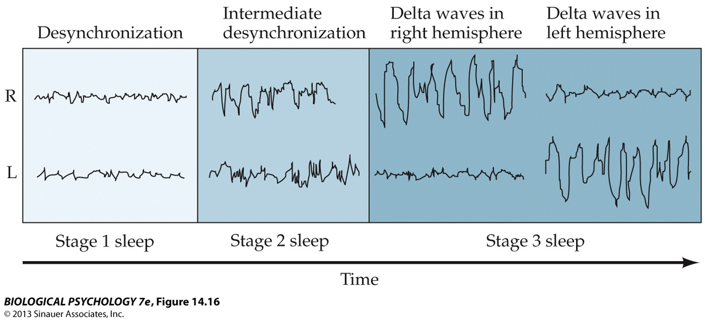

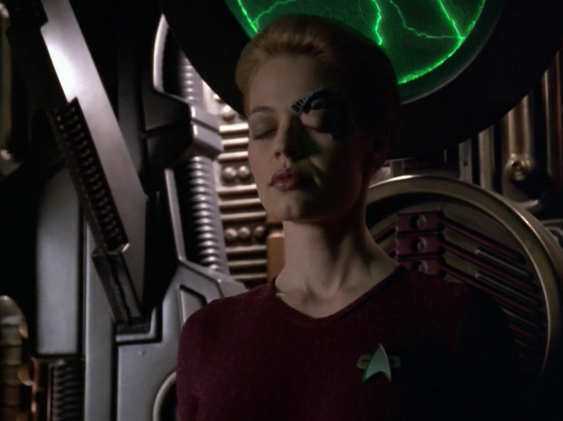


---
template: 9-2-3

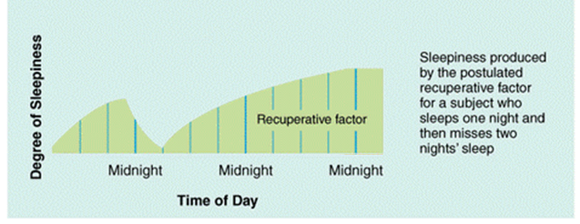


---
template: 9-2-4

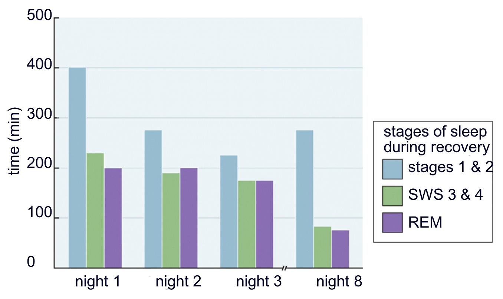
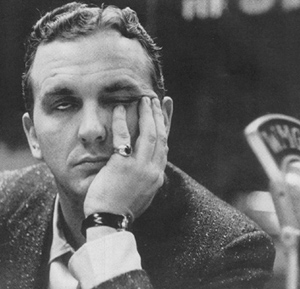


---
template: 9-2-5

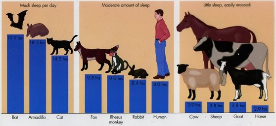


---
template: 9-2-6

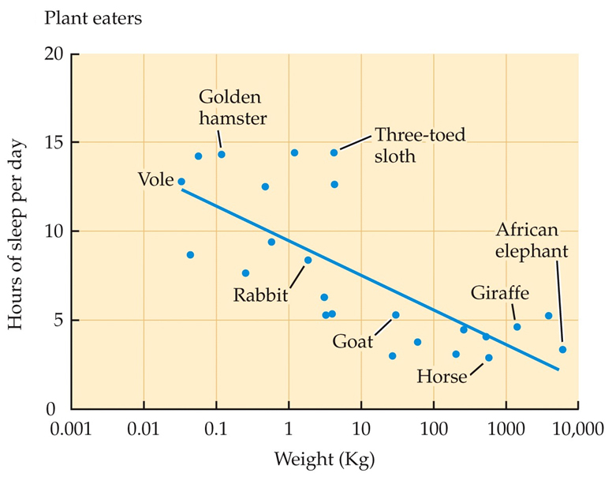

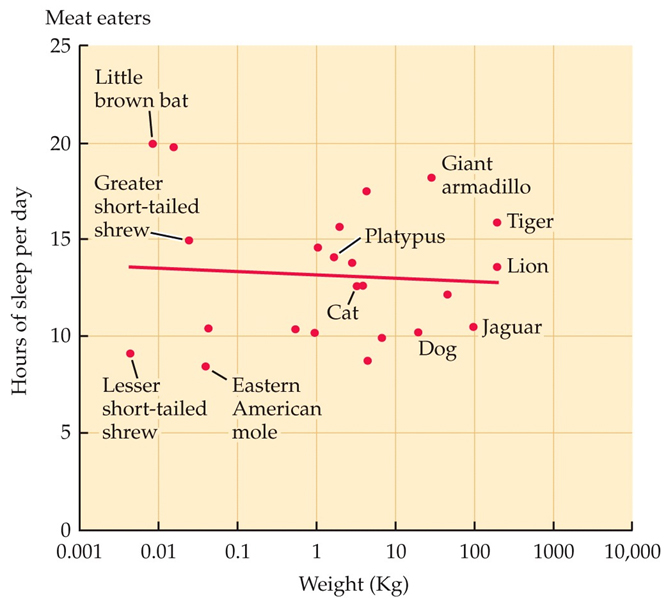


---
template: 9-2-7

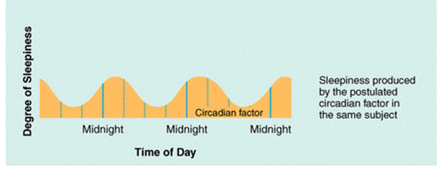


---
template: 9-2-8


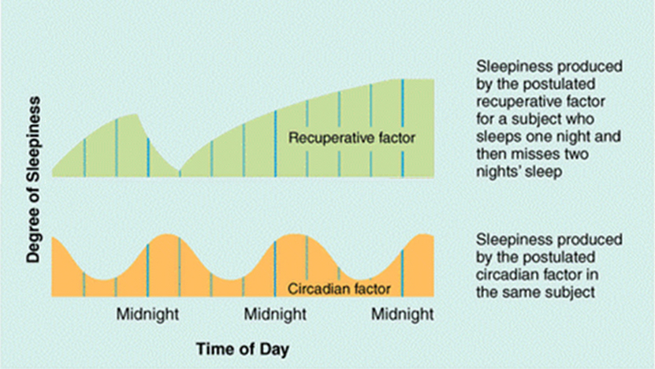


---
template: 9-2-9


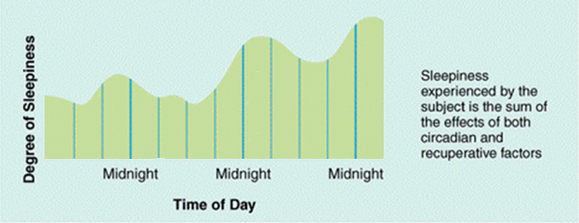
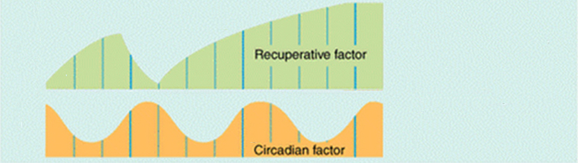

---
template: 9-2-10