```{r setup, include=FALSE}
options(htmltools.dir.version = FALSE)
```

name: 9-4-1
layout: true

# Chapter 9:  Sleep and Biological Rhythms

#### Introduction - Physiology of Sleep</br>Why Do We Sleep??</br>The Role of Sleep in Learning and Memory</br>Sleep Across the Lifespan</br>Sensory Processing and Sleep</br>.bold[Mechanisms of Sleep]</br>Biological Clocks</br>Dreaming</br>Sleep Disorders


---
name: 9-4-2
layout: true


# Mechanisms of Sleep
### Chemical Control of Arousal. 
.pull-left[
**Acetylcholine**:
- stimulation of cholinergic projections from pons 
   and nucleus basalis induce cortical desynchrony
- cholinergic projections from septum regulate hippocampal arousal

- cholinergic agonists 
  increase arousal
- cholinergic antagonists 
  decrease arousal
]

---
name: 9-4-3
layout: true

# Mechanisms of Sleep
### Chemical Control of Arousal. 
.pull-left[
**Acetylcholine**:
- extracellular [ACh] in cortex and hippocampus
- high in quiet waking, awake, and REM
- low in SWS
]

---
name: 9-4-4
layout: true


# Mechanisms of Sleep
### Chemical Control of Arousal. 
.pull-left[
**Norepinephrine**:
- stimulation of noradrenergic projections induces wakefulness
- inhibition of noradrenergic projections decreased wakefulness and increased SWS
]

---
name: 9-4-5
layout: true

# Mechanisms of Sleep
### Chemical Control of Arousal. 
.pull-left[
**Norepinephrine**:
- noradrenergic firing activity is highest in wakefulness, low in SWS, and almost zero in REM sleep
- increases dramatically within seconds of waking
- amphetamine and other catecholamine agonists increase arousal/vigilance
]

---
name: 9-4-6
layout: true


# Mechanisms of Sleep
### Chemical Control of Arousal. 
.pull-left[
**Serotonin**:
- stimulation of serotonergic projections from raphe to thalamus, hypothalamus, basal ganglia, hippocampus, neocortex induces cortical desynchrony
]

---
name: 9-4-7
layout: true

# Mechanisms of Sleep
### Chemical Control of Arousal. 
.pull-left[
**Serotonin**:
- serotonergic firing rate is highest in wakefulness, low in SWS, and almost zero in REM sleep
- increases transiently within seconds of end of REM
- PCPA (blocks 5HT synthesis) decreases cortical arousal
]

---
name: 9-4-8
layout: true

# Mechanisms of Sleep
### Chemical Control of Arousal. 
.pull-left[
**Histamine**:
- stimulation of histaminergic tuberomammillary neurons to thalamus, other hypothalamic neurons, basal ganglia, basal forebrain, cortex induces desynchrony
- some effects mediated directly by histamine to cortex
- some effects mediated indirectly through activation of pontine and basal forebrain cholinergic inputs
]

---
name: 9-4-9
layout: true


# Mechanisms of Sleep
### Chemical Control of Arousal. 
.pull-left[
**Histamine**:
- activity of histaminergic tuberomammillary neurons is highest in wakefulness, low in SWS, and REM sleep
-  antihistamines increase drowsiness by blocking 
   H1 histamine receptors
]

---
name: 9-4-10
layout: true

# Mechanisms of Sleep
### Chemical Control of Arousal. 
.pull-left[
**Orexin** (hypocretin):
- stimulation of orexinergic projections from LH to virtually every part of brain 
    - including LC, pons, basal forebrain, where interactions with adrenergic and cholinergic projections 
    - induces excitation
]

---
name: 9-4-11
layout: true

# Mechanisms of Sleep
### Chemical Control of Arousal. 
.pull-left[
**Orexin** (hypocretin):
- activity of orexinergic LH neurons is highest in alert wakefulness, low in quiet relaxation, and very low in SWS and REM sleep
-  modafinil (stimulates release of orexin) 
    - used to treat narcolepsy
]

---
name: 9-4-12
layout: true

# Mechanisms of Sleep
### Chemical Control of Arousal. 
.pull-left[
**Adenosine** (byproduct of energy metabolism):
- wakefulness increases extracellular adenosine in brain
- adenosine exerts inhibitory actions through ARs
- genetic differences in adenosine metabolizing enzymes may influence individual differences in sleep duration
]

---
name: 9-4-13
layout: true

# Image Credits

- title slide:	http://www.efficientlifeskills.com/wp-content/uploads/2013/08/getting-proper-sleep-is-essential-to-health.jpg
- slide 2:	Breedlove, S.M., Watson, N.V. (2013). Biological Psychology: An Introduction to Behavioral, Cognitive, and Clinical Neuroscience, 7th ed. Sinauer Associates, Inc.
- slide 3:	Carlson, N.R. (2012). Physiology of Behavior, 11th ed. Pearson Publishing
- slide 4:	Breedlove, S.M., Watson, N.V. (2013). Biological Psychology: An Introduction to Behavioral, Cognitive, and Clinical Neuroscience, 7th ed. Sinauer Associates, Inc.
- slide 5:	Carlson, N.R. (2012). Physiology of Behavior, 11th ed. Pearson Publishing
- slide 6:	Breedlove, S.M., Watson, N.V. (2013). Biological Psychology: An Introduction to Behavioral, Cognitive, and Clinical Neuroscience, 7th ed. Sinauer Associates, Inc.
- slide 7:	Carlson, N.R. (2012). Physiology of Behavior, 11th ed. Pearson Publishing
- slide 8:	http://img.medicalxpress.com/newman/gfx/news/hires/2014/histaminecon.jpg
- slide 9:	Carlson, N.R. (2012). Physiology of Behavior, 11th ed. Pearson Publishing
- slide 10:	http://www.nature.com/nrn/journal/v8/n3/images/nrn2092-f1.jpg
- slide 11:	Carlson, N.R. (2012). Physiology of Behavior, 11th ed. Pearson Publishing
- slide 12:	http://s2.hubimg.com/u/11575329_f520.jpg
	Carlson, N.R. (2012). Physiology of Behavior, 11th ed. Pearson Publishing


---
template: 9-4-1

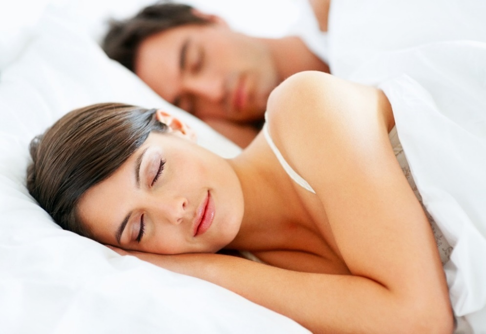


---
template: 9-4-2

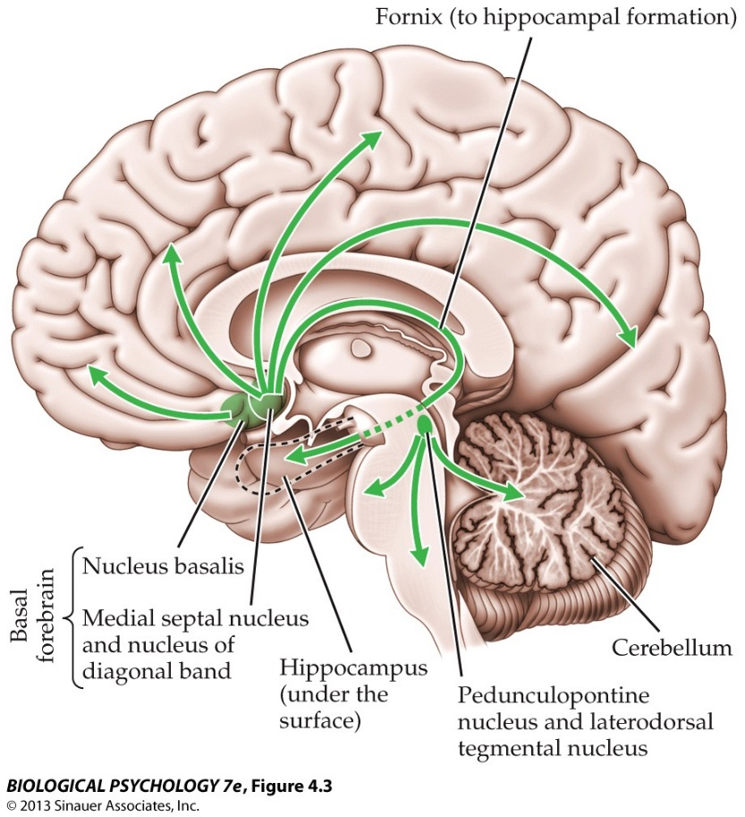


---
template: 9-4-3

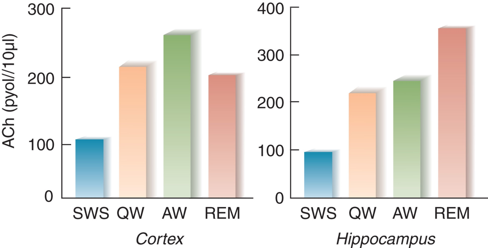


---
template: 9-4-4

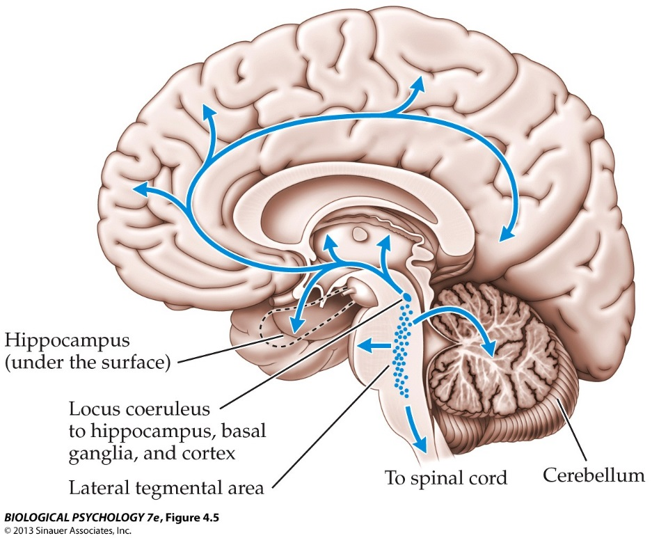


---
template: 9-4-5

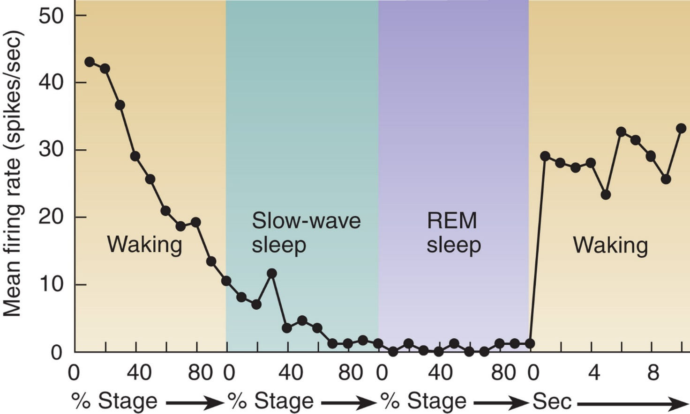


---
template: 9-4-6

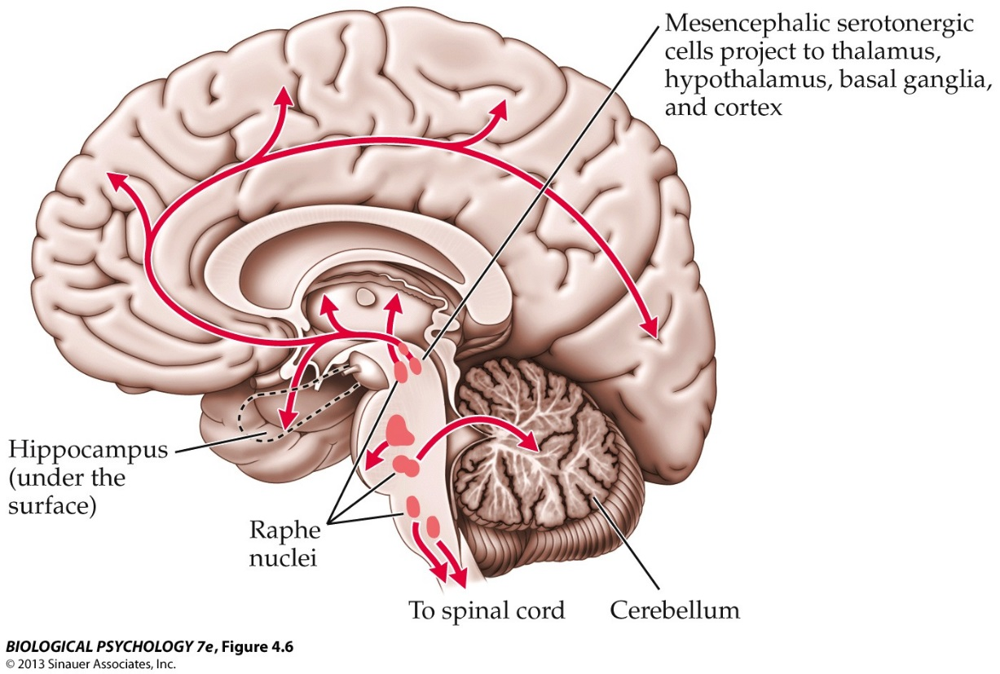


---
template: 9-4-7

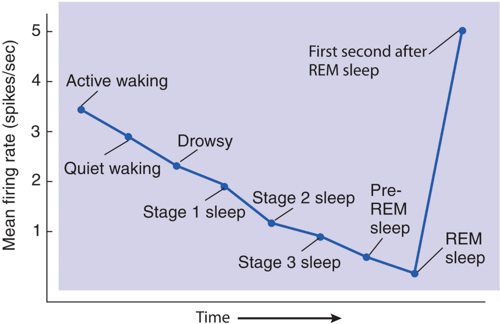


---
template: 9-4-8

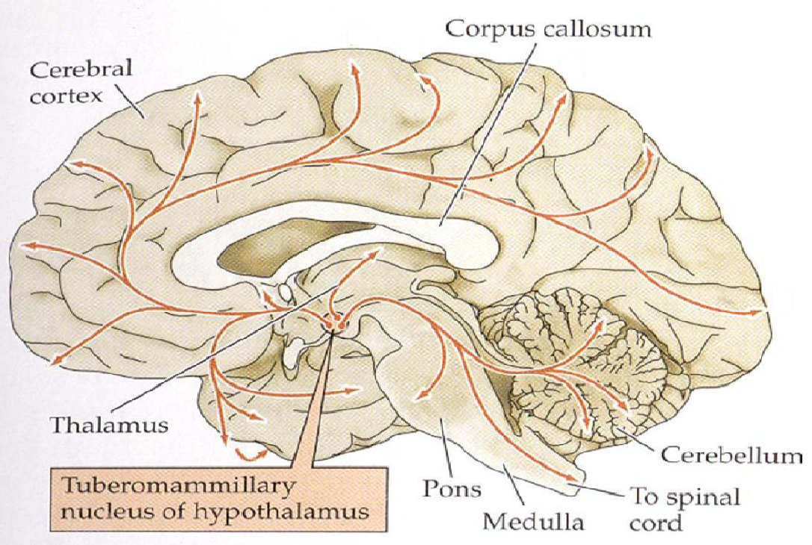


---
template: 9-4-9

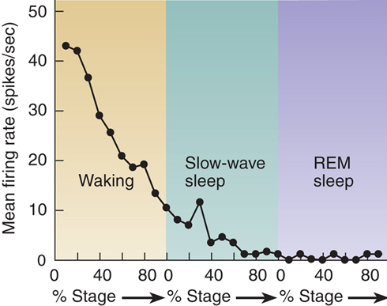


---
template: 9-4-10

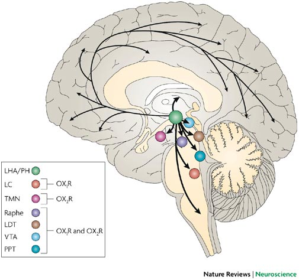


---
template: 9-4-11

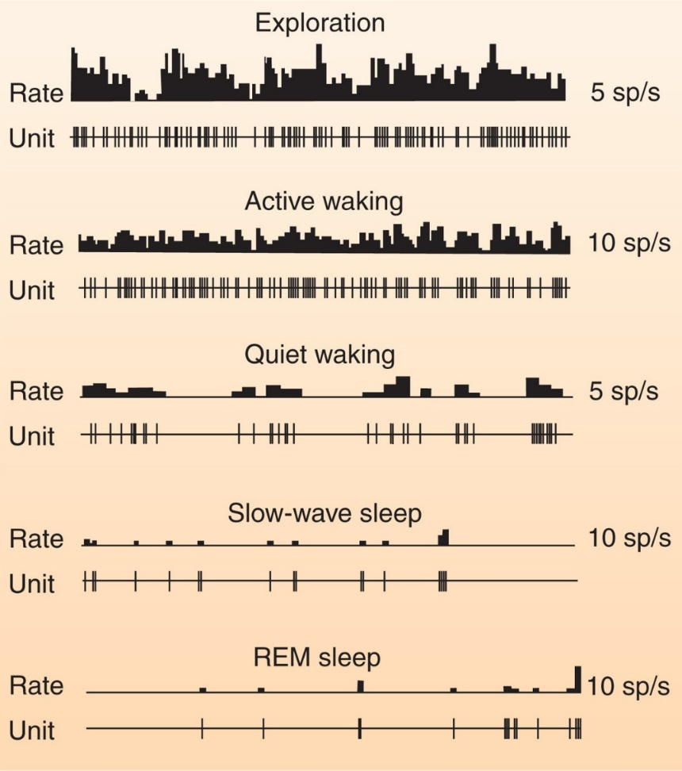


---
template: 9-4-12


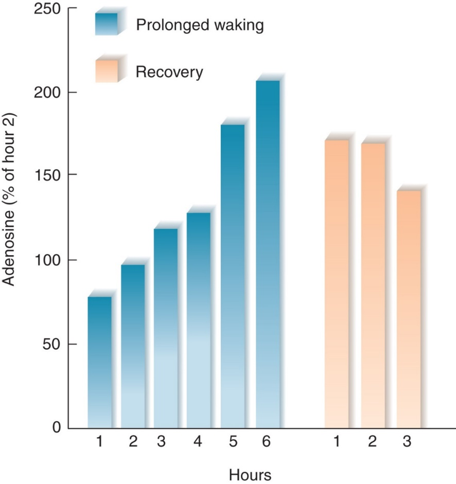

---
template: 9-4-13
