```{r setup, include=FALSE}
options(htmltools.dir.version = FALSE)
```

# Chapter 10:  Reproductive Behavior

### Sexual Development
### Hormonal Control of Sexual Behavior
### Neural Control of Sexual Behavior
### Pair Bonding and Parental Behavior


---

# Chapter 10:  Reproductive Behavior

### .bold[Sexual Development]
### Hormonal Control of Sexual Behavior
### Neural Control of Sexual Behavior
### Pair Bonding and Parental Behavior


---
name: 10-1-3
layout: true


# Sexual Development 
### The Roles of Genes.
.pull-left[
- **anatomical** sex: physical characteristics

- **chromosomal** sex = XX or XY

- **gonadal** sex: presence of testes
  or ovaries

- **gender role** = typical dimorphic 
  sets of behaviors
  
- **gender identity** = sense of 
  belonging to male or female sex
  
- **sexual orientation** = attraction 
  to same or opposite sex, or
  both
  
- .large[*gender identity can be </br>distinct 
  from sexual orientation*]
]

---
name: 10-1-4
layout: true


# Sexual Development 
### The Roles of Genes.
- some sex differences arise from
  genes on the sex chromosomes
- others from expression of genes 
  on the autosomal chromosomes

<!--
male
female
-->

---
name: 10-1-5
layout: true

# Sexual Development 
### Development of the Sex Organs - Gonads. 
- until end of first trimester, undifferentiated gonads  
- **Male** 
    - SRY induces differentiation </br>to testes
    - secrete testosterone and </br>Müllerian Inhibiting hormone  
- **Female** 
    - default pattern
    - differentiation to ovaries

<!--
Testes
SRY
TDF
-->

---
name: 10-1-6
layout: true

# Sexual Development
### Development of the Sex Organs - Internal Ducts. 
.pull-left[
- 2 sets of ducts
- **Male**:
    - testosterone induces Wollfian ducts to differentiate into male internal reproductive system
    - MIH actively breaks
  down Müllerian ducts
- **Female**:
    - default pattern, Müllerian ducts differentiate into female internal reproductive system
]

<!--
sexually undifferentiated
gonads
kidney
ureter
Wollfian ducts
Müllerian ducts
kidney
ureter
degenerated
Wollfian ducts
Wollfian
ducts
urinary
bladder
Müllerian
ducts
degenerated
Müllerian ducts
uterus
urethra
urethra
vagina
female
male
-->

---
name: 10-1-7
layout: true

# Sexual Development 
### Development of the Sex Organs - External Genitalia.
.pull-left[
- 1 pluripotential anlage for external organs  
**Male**
- dihydrotestosterone 
  induces pluripotential
  genitalia to differentiate
  into penis and scrotum  
**Female**
- default pattern, 
  pluripotential genitalia
  differentiate into labia, 
  clitoris and outer 1/3
    of vagina
]
<!--
sexually undifferentiated
partially differentiated
differentiated
female
male
-->


---
name: 10-1-8
layout: true

# Sexual Development 
### Sexual Differentiation.

<!--
Müllerian system
degenerates
MIH
defeminization
testes determining
factor
male
Wollfian system
develops into vas
deferens, seminal
vesicles, prostate
gonads
develop into
testes
XY
testosterone
masculinization
external genitalia
develop into penis
and scrotum
dihydrotestosterone
Müllerian system
develops into fimbriae,
fallopian tubes, uterus,
inner 2/3 vagina

no
hormones
required
female
gonads
develop into
ovaries
XX
Wollfian system
fails to develop
external genitalia 
develop into clitoris,
labia, outer 1/3 vagina
-->


---
name: 10-1-9
layout: true


# Sexual Development 
### Sexual Differentiation.
- masculinization and defeminization of the reproductive structures are hormonally-driven actions
- female follows default genetic program in absence of gonadal hormones

---
name: 10-1-10
layout: true


<!--
sensitive
period
sensitive
period
male
testosterone concentration
sensitive
period
sensitive
period
female
childhood
conception
birth
-->

# Sexual Development 
### Sexual Differentiation.
- masculinization of brain mechanisms are also hormonally-driven actions
- female follows default genetic program in absence of gonadal hormones

---
name: 10-1-11
layout: true


# Sexual Development 
### Gonadal and Adrenal Hormones. 
- Steroids, derived from cholesterol
- lipophillic
- actions mostly through intracellular receptors

<!--
Cholesterol
Progesterone
Testosterone
aromatase
5αReductase
Estradiol
5αDihydrotestosterone (DHT)
-->

---
name: 10-1-12
layout: true

# Sexual Development 
### Gonadal and Adrenal Hormones. 
- **Testosterone** (androgen)
- some effects mediated through testosterone itself
- some effects mediated through 5α-dihydrotestosterone
- some effects mediated through estradiol

---
name: 10-1-13
layout: true

# Sexual Development 
### Gonadal and Adrenal Hormones. 
- so, why aren’t female fetuses masculinized by estradiol?
- extracellular estradiol bound by α-fetoprotein
- extracellular androgens not bound by α-fetoprotein

---
name: 10-1-14
layout: true

# Sexual Development 
### Masculinization and Defeminization. 
- Meiotic nondisjunction
- Turner, Klinefelter, and Triple X syndromes

---
name: 10-1-15
layout: true

# Sexual Development 
### Masculinization and Defeminization. 
**Complete Androgen Insensitivity Syndrome** (CAIS)
- XY; testes
- non-functioning androgen receptor
- feminized physical appearance and brain
- gender identity = female
- sexual partner preference = male


---
name: 10-1-16
layout: true

# Sexual Development 
### Masculinization and Defeminization. 
**Congenital Adrenal Hyperplasia** (CAH)
- XX; ovaries
- defect in glucocorticoid (cortisol) synthesis
- excess androstenedione
- variable degrees of masculinization
- gender identity = female or male
- sexual partner preference = female or male

---
name: 10-1-17
layout: true

# Sexual Development 
### Sexual Maturation - Puberty. 
- Hypothalamic surges of GnRH and CRH
- stimulates FSH, LH, ACTH → steroid hormones
- androgens/estrogens → secondary sex characteristics
- gonadal steroids (T, DHT, P, E) 
- adrenal steroids (androstenedione)

---
name: 10-1-18
layout: true

# Image Credits

- slide 3:	Carlson, N.R. (2012). Physiology of Behavior, 11th ed. Pearson Publishing
- slides 4:	https://pastorchrisjackson.files.wordpress.com/2014/06/kids-sword-fighting.jpg
	http://www.plioz.com/wp-content/images/glamour-dollhouse-can-become-your-little-girls-most-favorite-playing-mate1.jpg
	http://www.vysa.com/imgs/Kids-Playing-Having-Fun.jpg
	http://health.hawaii.gov/genetics/files/2013/05/xy.gif
- slide 5:	https://online.science.psu.edu/sites/default/files/biol011/Fig-10-18-SRY-Role.jpg
- slide 6:	http://img3.douban.com/view/page_note/large/public/p26613778-1.jpg
- slide 7-8:	Carlson, N.R. (2012). Physiology of Behavior, 11th ed. Pearson Publishing
- slide 9:	https://embryology.med.unsw.edu.au/embryology/images/7/7c/Male_testosterone_and_AMH _level_graph.jpg
- slide 10:	drawn by D.P. Devine
- slide 11:	Breedlove, S.M., Watson, N.V. (2013). Biological Psychology: An Introduction to Behavioral, Cognitive, and Clinical Neuroscience, 7th ed. Sinauer Associates, Inc.
	http://what-when-how.com/wp-content/uploads/2011/05/tmp863_thumb1.jpg
- slide 12:	http://www.nature.com/nrurol/journal/v3/n12/images/ncpuro0650-f2.gif
	Breedlove, S.M., Watson, N.V. (2013). Biological Psychology: An Introduction to Behavioral, Cognitive, and Clinical Neuroscience, 7th ed. Sinauer Associates, Inc.


---
name: 10-1-19
layout: true

# Image Credits

- slide 13:	http://www.medicine.mcgill.ca/physio/vlab/Other_exps/endo/images/HCGlevels.gif
	Breedlove, S.M., Watson, N.V. (2013). Biological Psychology: An Introduction to Behavioral, Cognitive, and Clinical Neuroscience, 7th ed. Sinauer Associates, Inc.
- slide 14:	http://bioserv.fiu.edu/~walterm/GenBio2004/new_chap13_inheritance/f13-37_how_nondisjuncti_c.jpg
	http://blogs.evergreen.edu/claremakes/files/2015/02/Turner_Syndrome-1-300x300.jpg
	https://shsgdp.wikispaces.com/file/view/klinefelter_1.jpg/133031455/375x444/klinefelter_1.jpg
- slide 15:	http://drugdiscovery.com/upimages/1381594373_androgen insensitivity syndrome.jpg
- slide 16:	https://visualsonline.cancer.gov/details.cfm?imageid=4355
	https://classconnection.s3.amazonaws.com/485/flashcards/2882485/png/congenital_adrenal_hyperplasia_gross_image1367099254134.png
- slide 17:	drawn by D.P. Devine
	Carlson, N.R. (2012). Physiology of Behavior, 11th ed. Pearson Publishing


---
template: 10-1-3

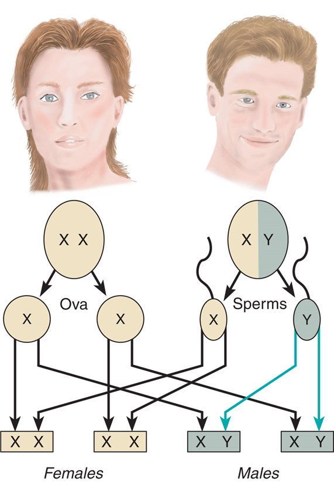


---
template: 10-1-4


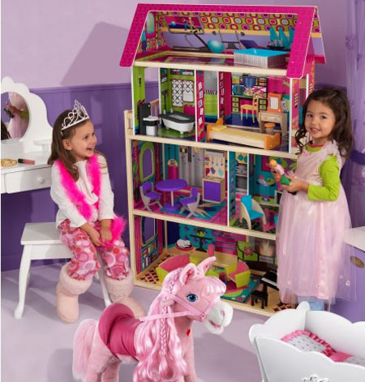


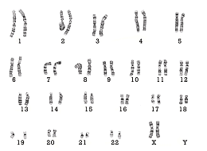

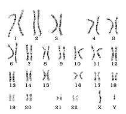


---
template: 10-1-5

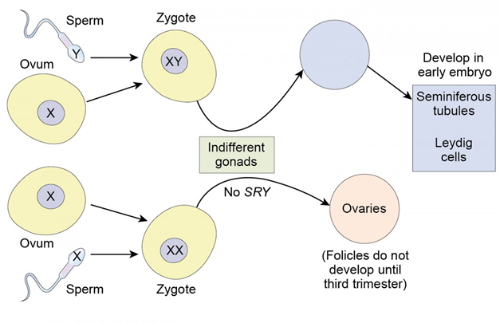


---
template: 10-1-6


---
template: 10-1-7

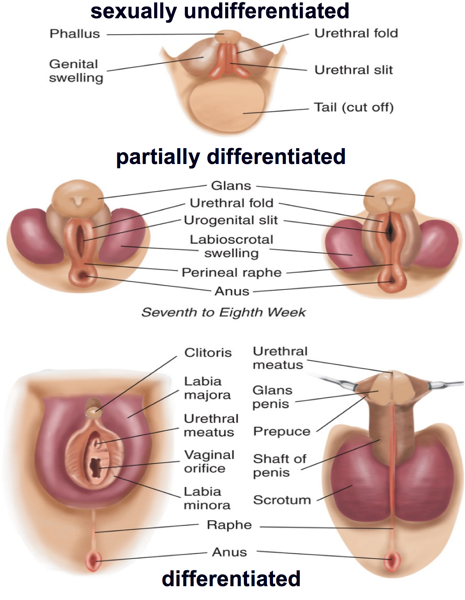

---
template: 10-1-8

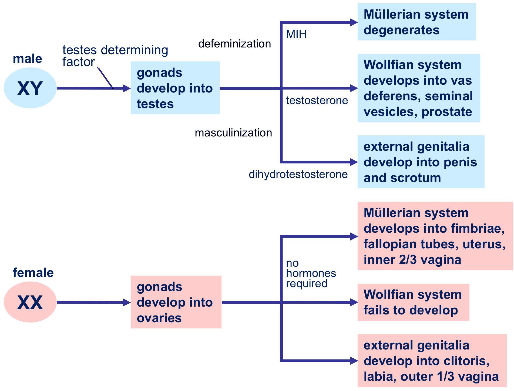

---
template: 10-1-9

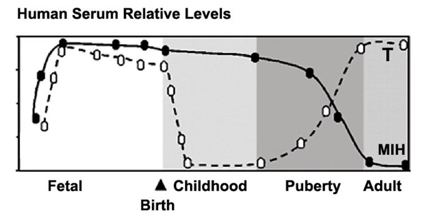


---
template: 10-1-10

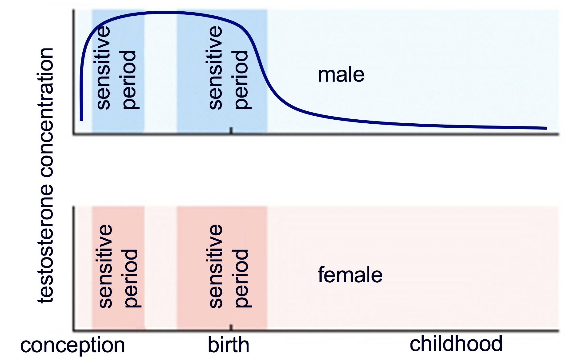


---
template: 10-1-11

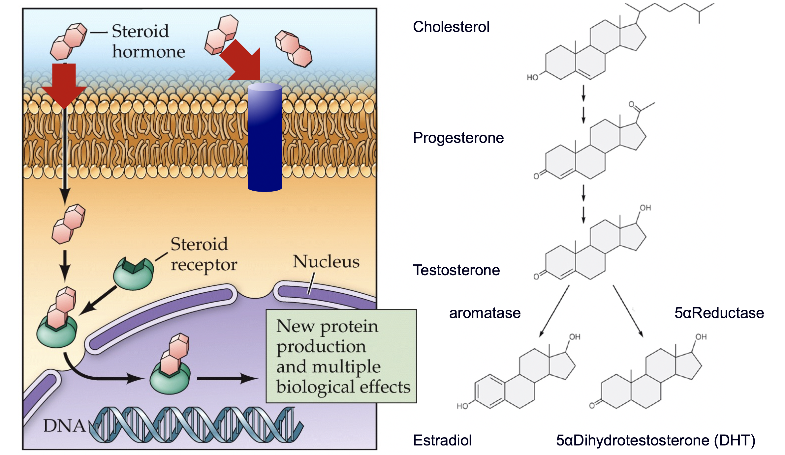


---
template: 10-1-12


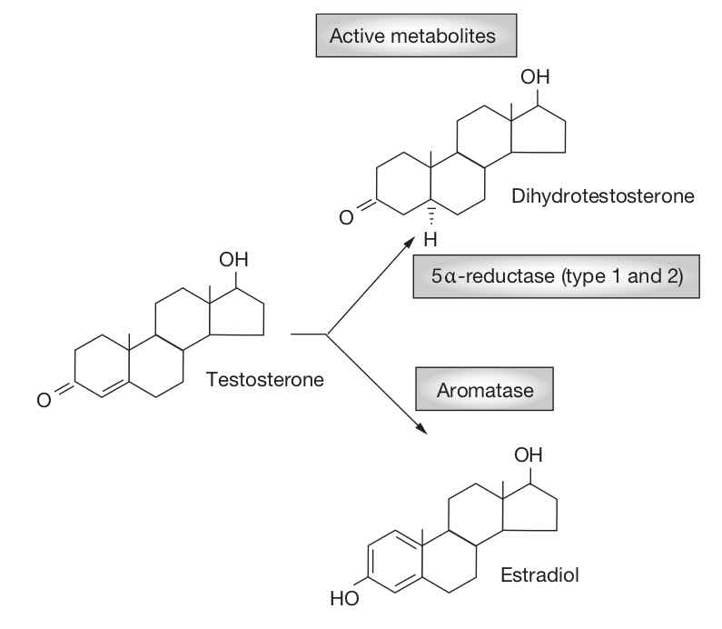


---
template: 10-1-13


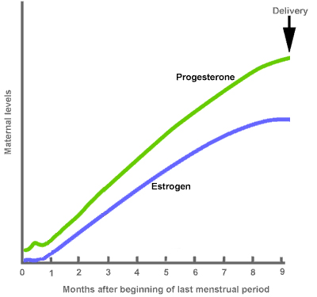

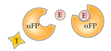

---
template: 10-1-14

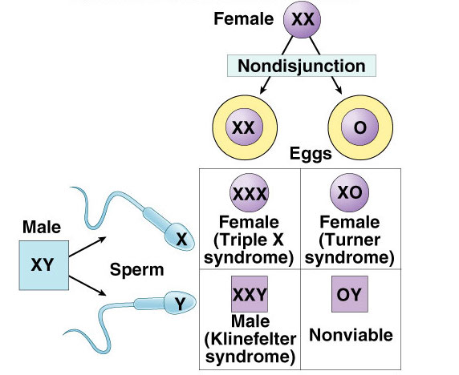

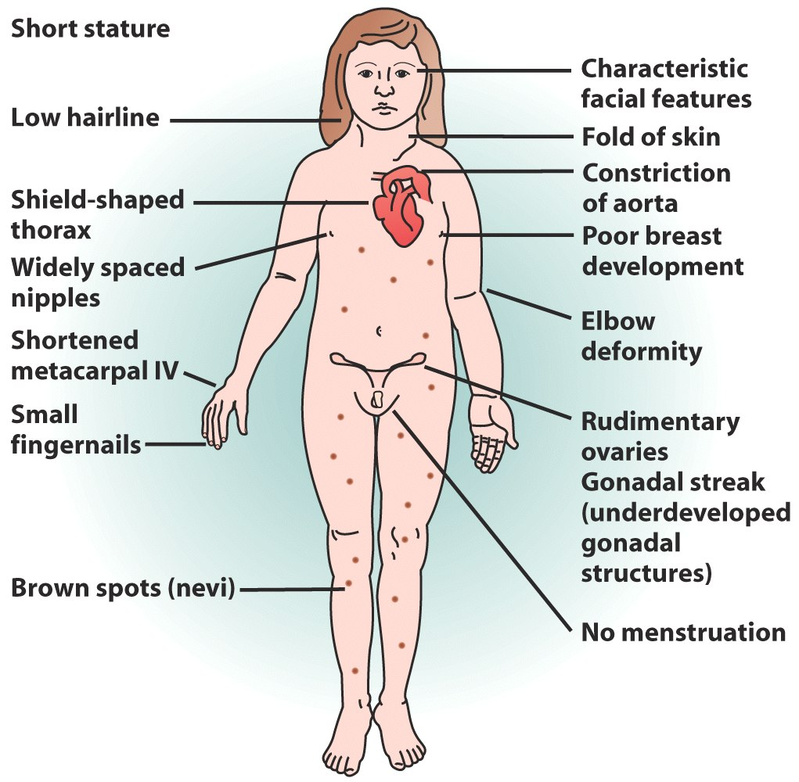

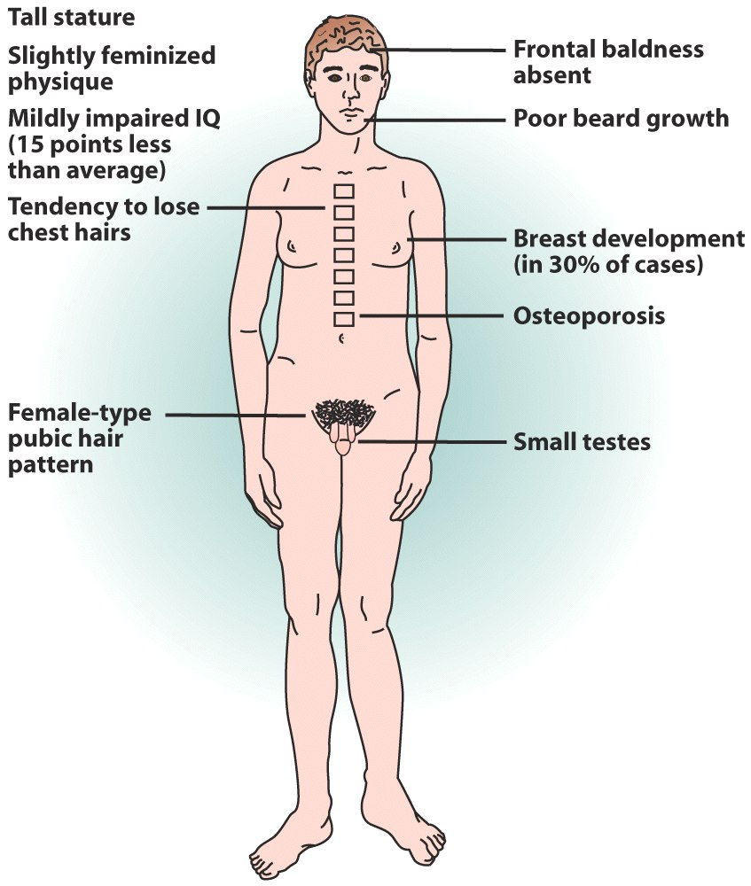


---
template: 10-1-15


---
template: 10-1-16

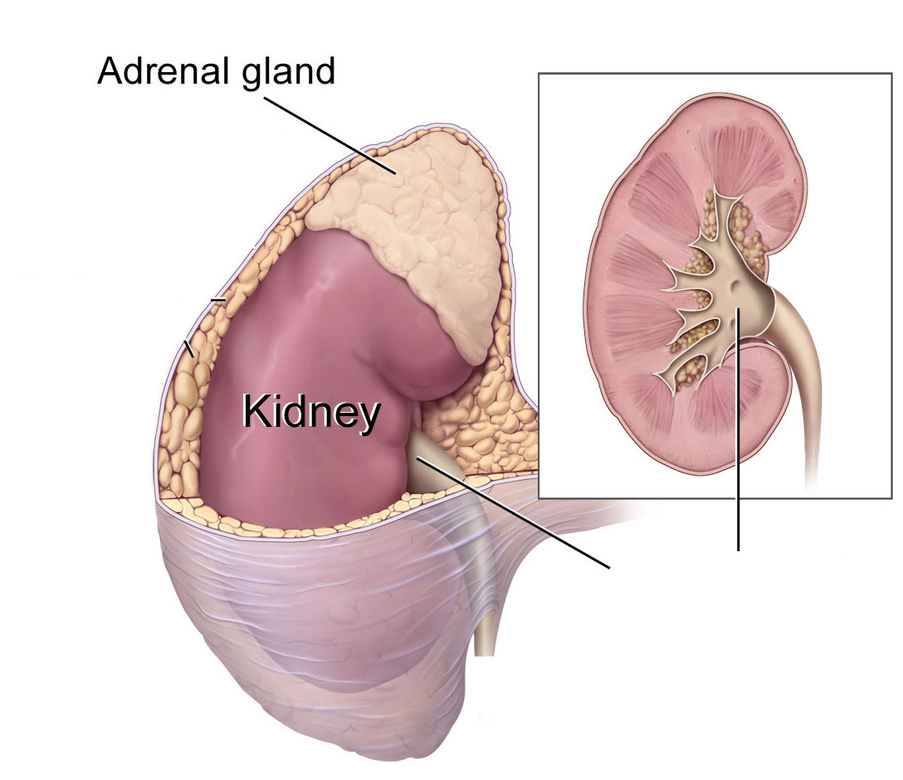

---
template: 10-1-17

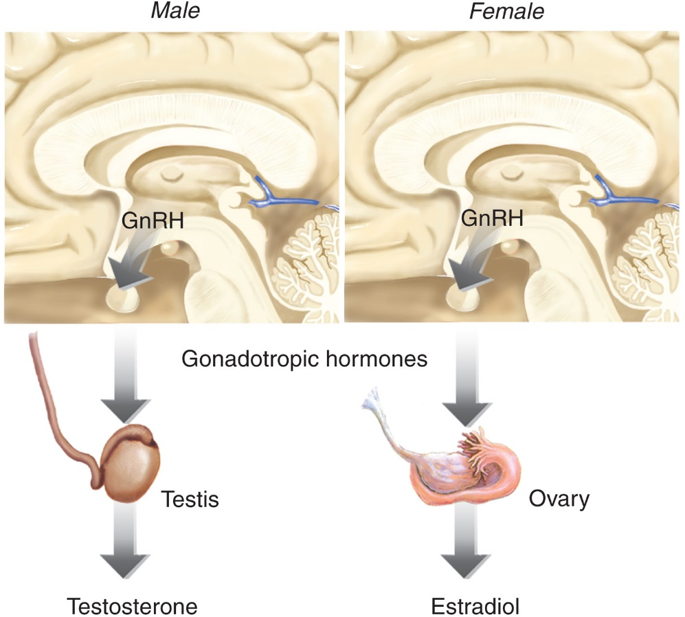

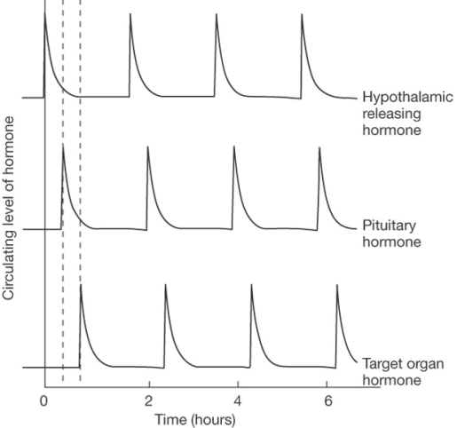


---
template: 10-1-18


---
template: 10-1-19

