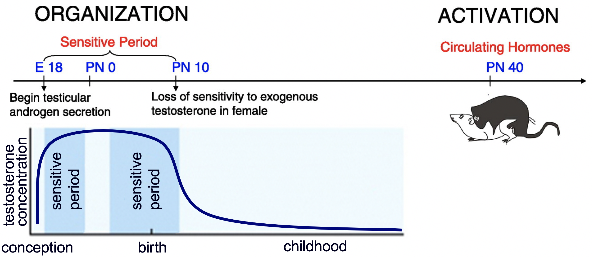
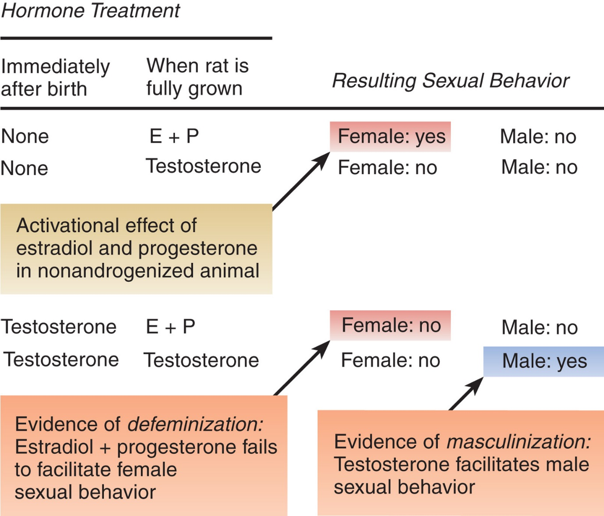
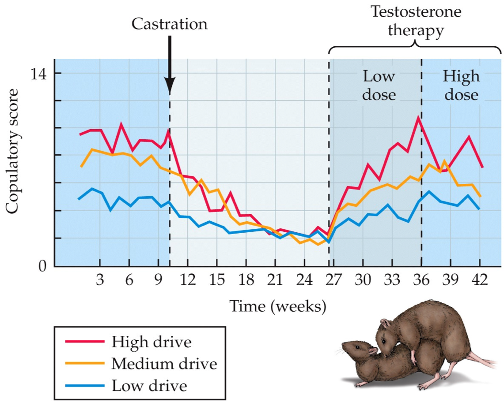
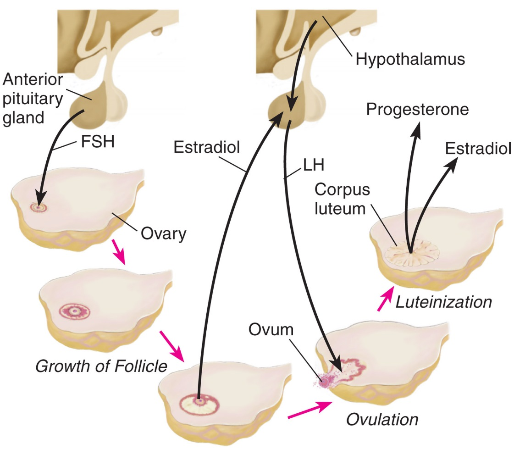
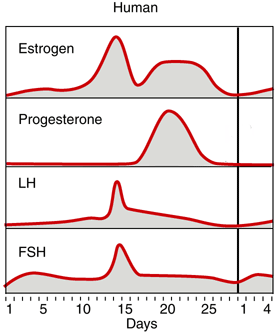
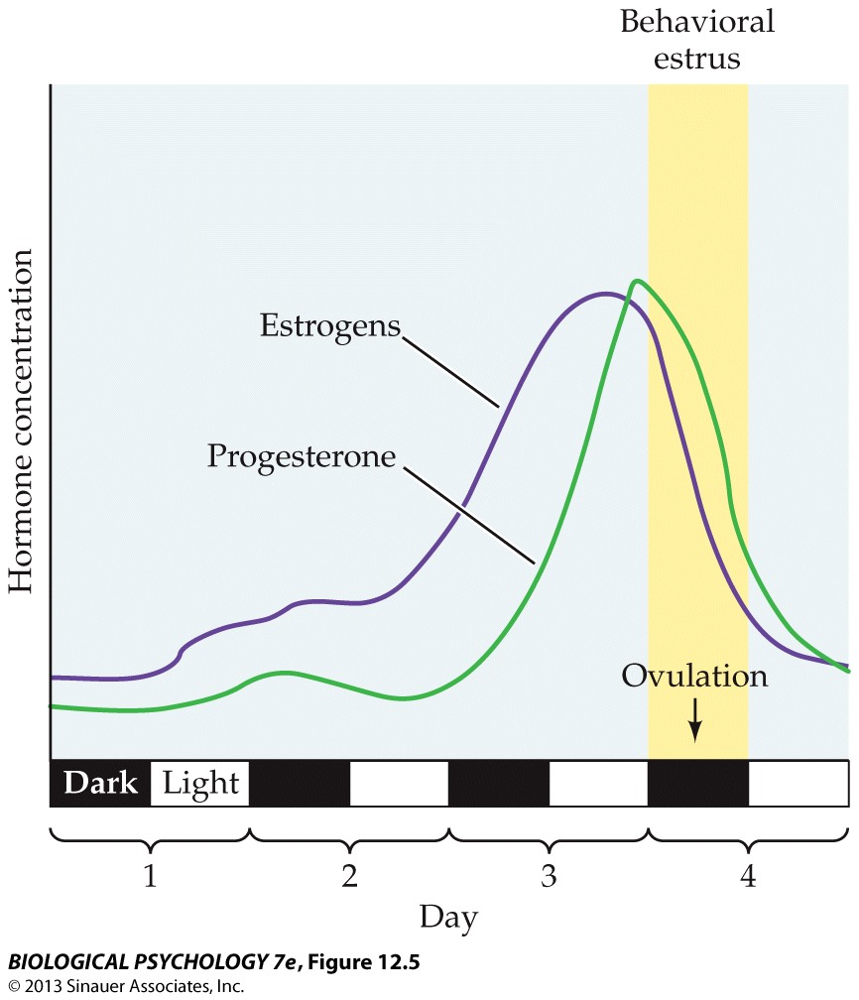
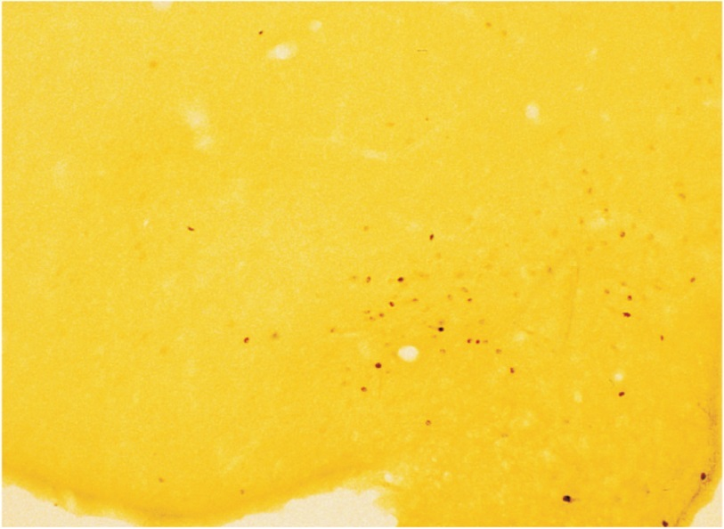
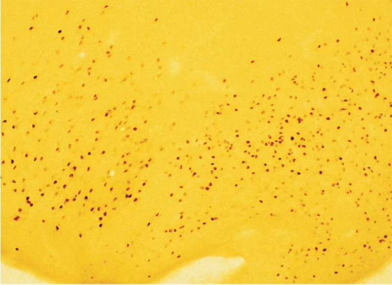
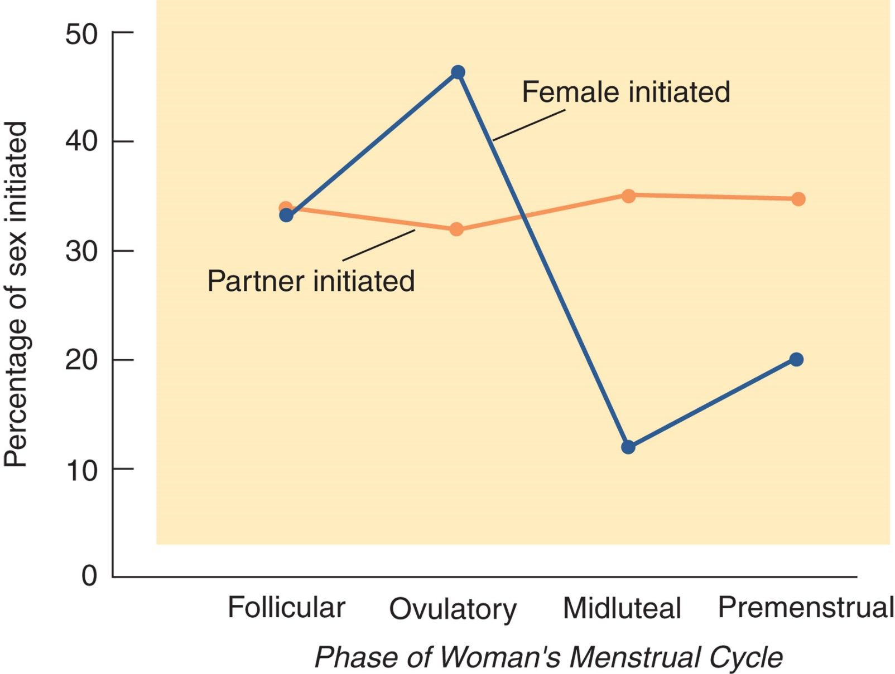

```{r setup, include=FALSE}
options(htmltools.dir.version = FALSE)
```


# Chapter 10:  Reproductive Behavior

### Sexual Development
### .bold[Hormonal Control of Sexual Behavior]
### Neural Control of Sexual Behavior
### Pair Bonding and Parental Behavior


---
name: 10-2-2
layout: true

# Hormonal Control of Sexual Behavior 
### Organizing and Activating Effects of Hormones. 
.pull-left[
**Organizing effects**: 
- relatively permanent effects
    - depends on hormone expression
    - sensitive periods: embryonic/fetal/puberty
]
.pull-right[
**Activating effects**: 
- immediate, temporary effects on organized structures coinciding with presence or absence of hormone
]
<!--
sensitive
period
sensitive
period
testosterone
concentration
childhood
conception
birth
-->

---
name: 10-2-3
layout: true

# Hormonal Control of Sexual Behavior 
### Male Sexual Behavior. 
- Organizing effects
- Activating effects

---
name: 10-2-4
layout: true

# Hormonal Control of Sexual Behavior 
### Male Sexual Behavior. 


---
name: 10-2-5
layout: true

# Hormonal Control of Sexual Behavior 
### Female Sexual Behavior. 

- FSH stimulates follicles → follicles secrete E
- E causes surges of LH → LH induces ovulation
- corpus luteum secretes E + P
- P promotes pregnancy


---
name: 10-2-6
layout: true

# Hormonal Control of Sexual Behavior 
### Female Sexual Behavior. 

- surge of estradiol followed by surge of </br>progesterone at ovulation primes female receptivity

---
name: 10-2-7
layout: true

# Hormonal Control of Sexual Behavior 
### Female Sexual Behavior. 

- primates less dependent upon </br>E-P than rodents are

---
name: 10-2-8
layout: true

# Image Credits

- slide 2:	http://physrev.physiology.org/content/physrev/88/1/91/F2.large.jpg
	drawn by D.P. Devine
- slide 3:	Carlson, N.R. (2012). Physiology of Behavior, 11th ed. Pearson Publishing
- slide 4:	Breedlove, S.M., Watson, N.V. (2013). Biological Psychology: An Introduction to Behavioral, Cognitive, and Clinical Neuroscience, 7th ed. Sinauer Associates, Inc.
- slide 5:	http://fb.ru/misc/i/gallery/23327/561971.gif 
	Carlson, N.R. (2012). Physiology of Behavior, 11th ed. Pearson Publishing
- slide 6:	Breedlove, S.M., Watson, N.V. (2013). Biological Psychology: An Introduction to Behavioral, Cognitive, and Clinical Neuroscience, 7th ed. Sinauer Associates, Inc.
	Carlson, N.R. (2012). Physiology of Behavior, 11th ed. Pearson Publishing
- slide 7:	Carlson, N.R. (2012). Physiology of Behavior, 11th ed. Pearson Publishing


---
template: 10-2-2




---
template: 10-2-3



---
template: 10-2-4



---
template: 10-2-5







---
template: 10-2-6








---
template: 10-2-7


---
template: 10-2-8
