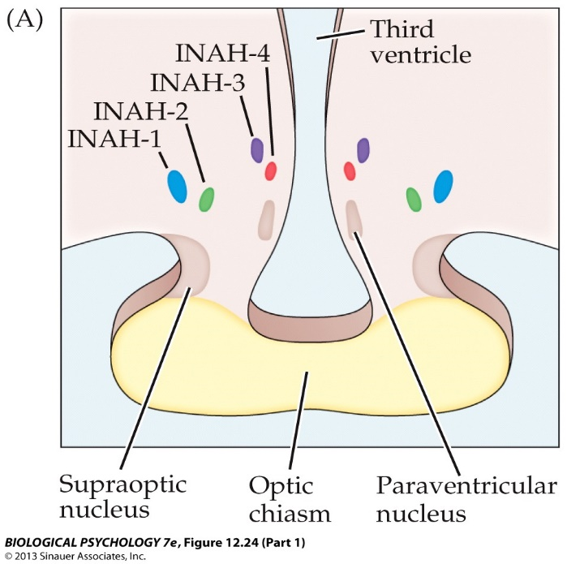
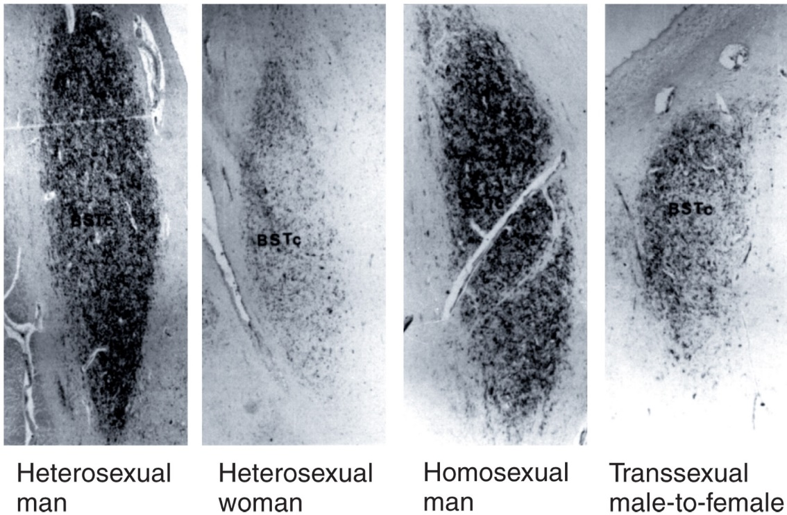

```{r setup, include=FALSE}
options(htmltools.dir.version = FALSE)
```

# Chapter 10:  Reproductive Behavior

#### Sexual Development
#### Hormonal Control of Sexual Behavior
#### .bold[Neural Control of Sexual Behavior]
#### Pair Bonding and Parental Behavior


---
name: 10-3-2
layout: true

# Neural Control of Sexual Behavior
### Sex Differences in Brain Structures. 
.pull-left[
- sex differences in behaviors may arise from differences in brain structures/mechanisms, in combination with social/environmental experience
- includes contributions of genetic and hormonal factors
]

---
name: 10-3-3
layout: true

# Neural Control of Sexual Behavior
### Sexually Dimorphic CNS Structures. 
- sexually dimorphic nucleus of the 
  medial preoptic area (SDN-POA)

---
name: 10-3-4
layout: true


# Neural Control of Sexual Behavior
### Sexually Dimorphic CNS Structures. 
- Interstitial Nucleus of the Anterior
  Hypothalamus 3 (INAH3)

---
name: 10-3-5
layout: true

# Neural Control of Sexual Behavior
### Sexually Dimorphic CNS Structures. 
- spinal nucleus of the bulbocavernosus (SNB)

---
name: 10-3-6
layout: true

# Neural Control of Sexual Behavior
### Sexually Dimorphic CNS Structures. 
- bed nucleus of stria terminalis

---
name: 10-3-7
layout: true

# Neural Control of Sexual Behavior
### Sexually Dimorphic CNS Structures. 
- medial amygdala

---
name: 10-3-8
layout: true

# Neural Control of Sexual Behavior
### Sexual Behavior in the Adult Male Rat. 
- overall testosterone level is important in sexual behavior
- castration of adult male rat eliminates sexual behavior

---
name: 10-3-9
layout: true

# Neural Control of Sexual Behavior
### Sexual Behavior in the Adult Male Rat. 
- olfactory bulb and vomeronasal organ activate MeA
- MeA and genitals (via CTF) activate MPOA
- MPOA regulates descending control of mounting behavior and ejaculation


---
name: 10-3-10
layout: true

# Neural Control of Sexual Behavior
### Sexual Behavior in the Adult Male Rat. 
- injection of testosterone into MPOA, MeA, or CTF  reinstates copulation in castrated rats
- destruction of the MPOA, MeA, or connections from CTF to MPOA each reduce/eliminate mounting

---
name: 10-3-11
layout: true


# Neural Control of Sexual Behavior
### Sexual Behavior in the Adult Female Rat. 
- surge of estradiol followed by surge of progesterone at </br> ovulation primes female receptivity
- ovariectomy in female rat eliminates sexual behaviour
- estradiol + progesterone injection prime sexual behavior

---
name: 10-3-12
layout: true

# Neural Control of Sexual Behavior
### Sexual Behavior in the Adult Female Rat. 
.pull-left[
- olfactory bulb and vomeronasal organ activate MeA
- MeA and input from genitals activate VMH
- VMH regulates descending control of lordosis behavior
]

---
name: 10-3-13
layout: true

# Neural Control of Sexual Behavior
### Sexual Behavior in the Adult Female Rat. 
.pull-left[
- sequential injection of estradiol and progesterone into VMH facilitates sexual behavior in ovarectomized rat
- destruction of the VMH reduces/eliminates lordosis
]

---
name: 10-3-14
layout: true

# Image Credits

- slide 2:	Kandel, E.R., Schwartz, J.H., Jessell, T.M., Seigelbaum, S.A., and Hudspeth, A.J. (2012). Principles of Neural Science, 5th ed. McGraw-Hill Professional
- slide 3:	Breedlove, S.M., Watson, N.V. (2013). Biological Psychology: An Introduction to Behavioral, Cognitive, and Clinical Neuroscience, 7th ed. Sinauer Associates, Inc.
	Carlson, N.R. (2012). Physiology of Behavior, 11th ed. Pearson Publishing
- slide 4:	Breedlove, S.M., Watson, N.V. (2013). Biological Psychology: An Introduction to Behavioral, Cognitive, and Clinical Neuroscience, 7th ed. Sinauer Associates, Inc.
	Kandel, E.R., Schwartz, J.H., Jessell, T.M., Seigelbaum, S.A., and Hudspeth, A.J. (2012). Principles of Neural Science, 5th ed. McGraw-Hill Professional
- slide 5:	Breedlove, S.M., Watson, N.V. (2013). Biological Psychology: An Introduction to Behavioral, Cognitive, and Clinical Neuroscience, 7th ed. Sinauer Associates, Inc.
- slide 6:	http://upload.wikimedia.org/wikipedia/en/b/b1/Amygdalofugal_Pathway_(green)_and_Stria _Terminalis(red).png
	http://cal.vet.upenn.edu/projects/neurology/lab9/images/ns_075-BNST.jpg
	Carlson, N.R. (2012). Physiology of Behavior, 11th ed. Pearson Publishing
- slide 7:	Carlson, N.R. (2012). Physiology of Behavior, 11th ed. Pearson Publishing
	https://www.msu.edu/~bjlab/_files/images/figures/mea1.jpg


---
name: 10-3-15
layout: true

# Image Credits

- slide 8-13:	Breedlove, S.M., Watson, N.V. (2013). Biological Psychology: An Introduction to Behavioral, Cognitive, and Clinical Neuroscience, 7th ed. Sinauer Associates, Inc.
	Carlson, N.R. (2012). Physiology of Behavior, 11th ed. Pearson Publishing


---
template: 10-3-2


---
template: 10-3-3


---
template: 10-3-4




---
template: 10-3-5


---
template: 10-3-5
count: false


---
template: 10-3-5
count: false


---
template: 10-3-6




---
template: 10-3-7


---
template: 10-3-8


---
template: 10-3-9


---
template: 10-3-10


---
template: 10-3-11


---
template: 10-3-12


---
template: 10-3-13


---
template: 10-3-14


---
template: 10-3-15