```{r setup, include=FALSE}
options(htmltools.dir.version = FALSE)
```

name: 11-1-1
layout: true

# Chapter 11:  Emotion

#### Emotions as Response Patterns
#### Fear and Anxiety
#### Anger, Aggression, and Impulse Control
#### Communication of Emotions
#### Feelings of Emotion


---
name: 11-1-2
layout: true

# Chapter 11:  Emotion

#### .bold[Emotions as Response Patterns]
#### Fear and Anxiety
#### Anger, Aggression, and Impulse Control
#### Communication of Emotions
#### Feelings of Emotion


---
name: 11-1-3
layout: true


<!--
somatic
nervous
system

behavior


autonomic
nervous
system

autonomic

response


neuro-
endocrine
system

endocrine

response
-->


# Emotions as Response Patterns
### 3 Components of Emotional Responses. 
.pull-left[
- behavioral
- autonomic
- endocrine


- sensory inputs
  activate limbic
  structures

- limbic structures
  activate somatic,
  autonomic, and
  endocrine
  activities
]

<!--
Emotionally-salient event

sensory inputs
brain
-->

---
name: 11-1-4
layout: true

# Emotions as Response Patterns
### Basic Emotions - Behavioral Responses. 
.pull-left[
- Darwin theorized that emotions are biologically determined, and serve important survival functions
- behavior communicates what an animal will do next
- if behavior promotes survival, expression will evolve
- original behavioral function may be lost
- opposite messages often signaled by opposite behavior
]


---
name: 11-1-5
layout: true


# Emotions as Response Patterns
### Basic Emotions - Autonomic Responses. 
.pull-left[
- anticipatory changes in heartbeat, respiration, perspiration, glucose release
- changes in digestion
- changes in circulation

- limbic structures innervate 
  portions of pons and medulla to 
  activate or inhibit autonomic 
  responses through spinal 
  efferents
]

---
name: 11-1-6
layout: true

# Emotions as Response Patterns
### Basic Emotions - Endocrine Responses. 
- changes in release of cortisol from adrenal cortex
- changes in release of EPI/nor-EPI from adrenal medulla

- limbic structures innervate
  hypothalamus, which 
  regulates pituitary

- limbic structures regulate
  autonomic control of 
  endocrine glands

---
name: 11-1-7
layout: true


<!--
Emotionally-salient event
sensory inputs
brain
somatic
nervous
system
behavior
autonomic
nervous
system
autonomic
response
neuro-
endocrine
system
endocrine
response
-->

# Emotions as Response Patterns
### Basic Emotions - Immune Responses. 
- a fourth component if emotional challenges persist
- changes in cytokine signaling
- immunosuppression

<!--
cytokine
response
immune
system
-->

---
name: 11-1-8
layout: true

<!--
  anger      sadness    happiness      fear

disgust       surprise    contempt  embarrass-
                                                     ment
-->

# Emotions as Response Patterns
### Basic Emotions. 


---
name: 11-1-9
layout: true

# Emotions as Response Patterns
### Basic Emotions. 

- volunteers “truly, deeply, madly in love” provided photos of loved one and 3 sex- and age-matched 3 friends

<!--
↑
↓
↑
anterior
cingulate
cortex
posterior
cingulate
cortex
anterior
cingulate
cortex
orbitofrontal region
of prefrontal cortex
↓
amygdala
↑
insula
-->

---
name: 11-1-10
layout: true


# Emotions as Response Patterns
### Basic Emotions. 

- subjects asked to recall experiences that made them sad, happy, fearful, or angry

 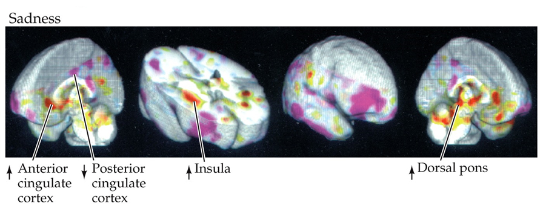

---
name: 11-1-11
layout: true

# Emotions as Response Patterns
### Basic Emotions. 

- subjects asked to recall experiences that made them sad, happy, fearful, or angry

 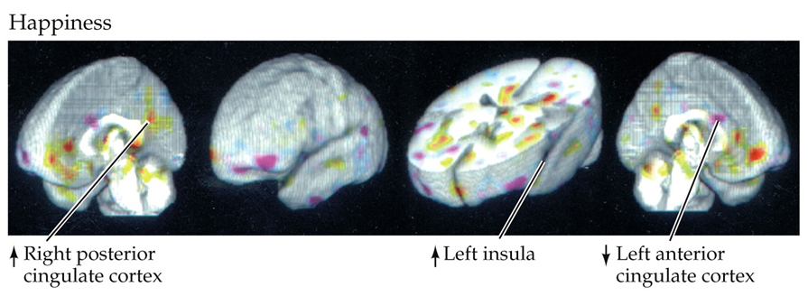
 
---
name: 11-1-12
layout: true

# Emotions as Response Patterns
### Basic Emotions. 

- subjects asked to recall experiences that made them sad, happy, fearful, or angry

 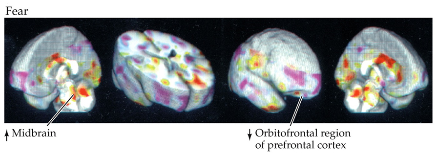

---
name: 11-1-13
layout: true


# Emotions as Response Patterns
### Basic Emotions. 

- subjects asked to recall experiences that made them sad, happy, fearful, or angry

 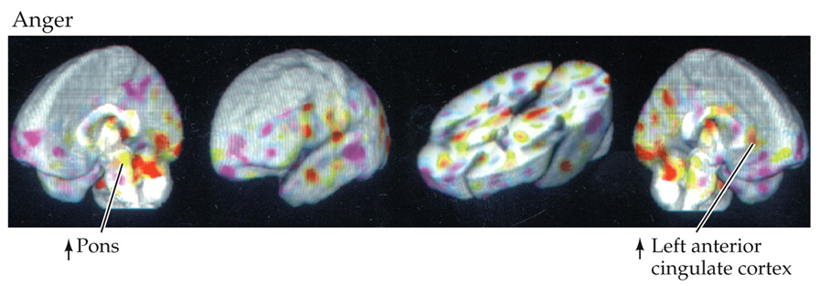

- different regions active during different emotional experiences
- roles of specific regions needs to be investigated further

---
name: 11-1-14
layout: true

# Image Credits

- title slides:	https://bessemeropinions.files.wordpress.com/2009/10/dctrip20091561.jpg
- slide 3:	http://www.wired.com/wp-content/uploads/2014/07/brain1.jpg
	schematic drawn by D.P. Devine
- slide 4:	http://www.gutenberg.org/files/1227/1227-h/1227-h.htm#linkimage-0004
	http://www.gutenberg.org/files/1227/1227-h/1227-h.htm#linkimage-0005
- slide 5:	http://www.merckmanuals.com/media/home/figures/NEU_autonomic_nervous_system.gif
- slide 6:	http://www.50symptomsgone.com/wp-content/uploads/2014/09/hpa-axis.gif
- slide 7:	schematic drawn by D.P. Devine
	http://www.niaid.nih.gov/SiteCollectionImages/topics/immunesystem/organsImmuneSystem.jpg
- slide 8-13:	Breedlove, S.M., Watson, N.V. (2013). Biological Psychology: An Introduction to Behavioral, Cognitive, and Clinical Neuroscience, 7th ed. Sinauer Associates, Inc.


---
template: 11-1-1


---
template: 11-1-2


---
template: 11-1-3

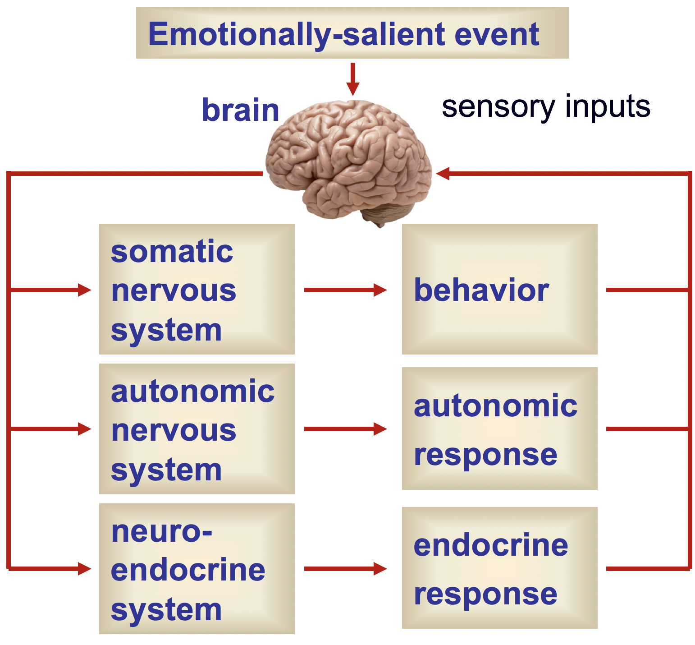

---
template: 11-1-4

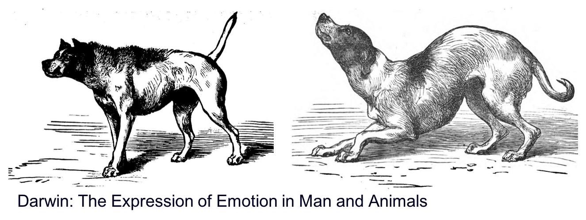

<!--

-->

---
template: 11-1-5

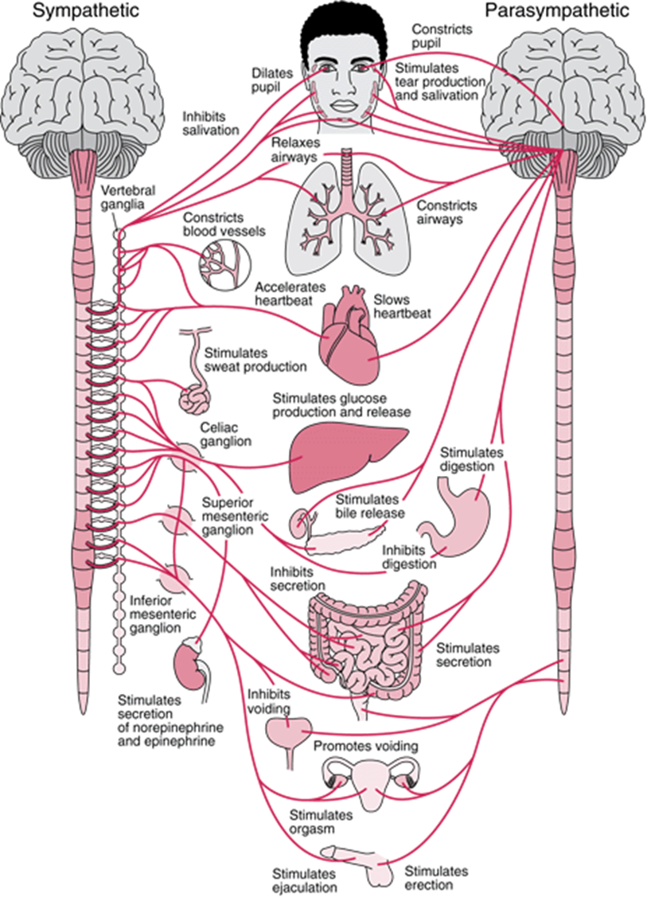


---
template: 11-1-6

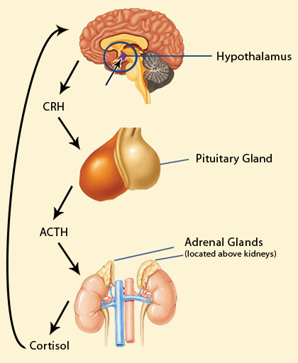


---
template: 11-1-7

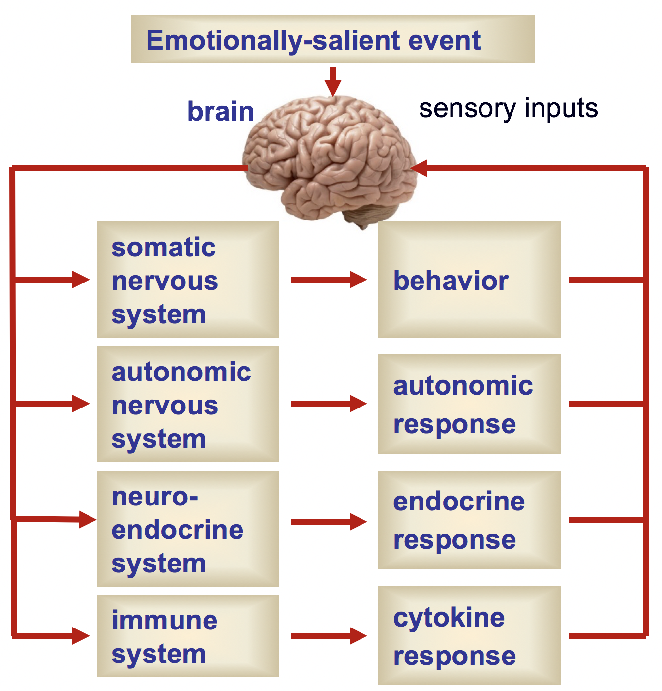

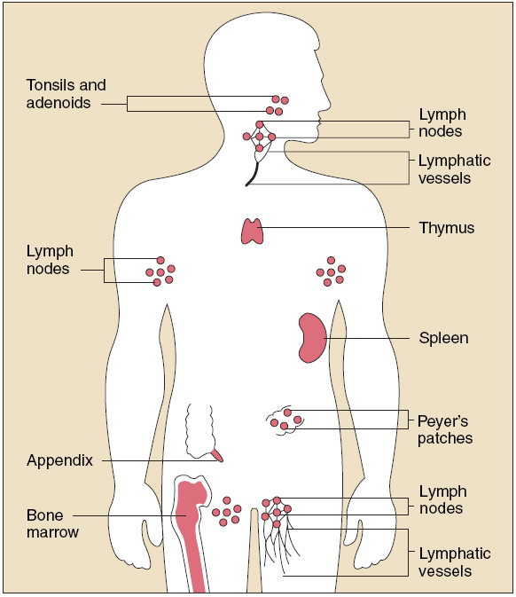


---
template: 11-1-8

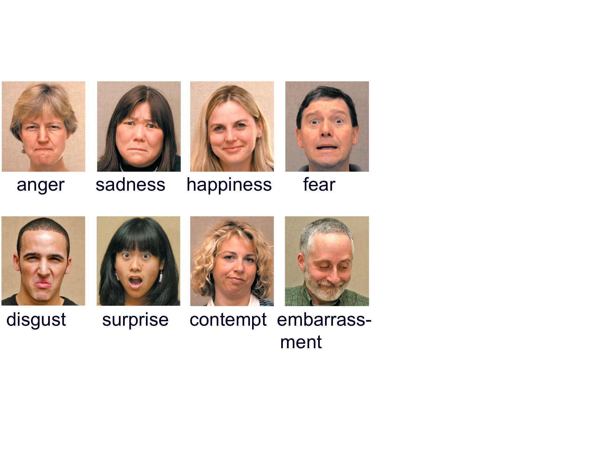

---
template: 11-1-8
count: false


---
template: 11-1-8
count: false

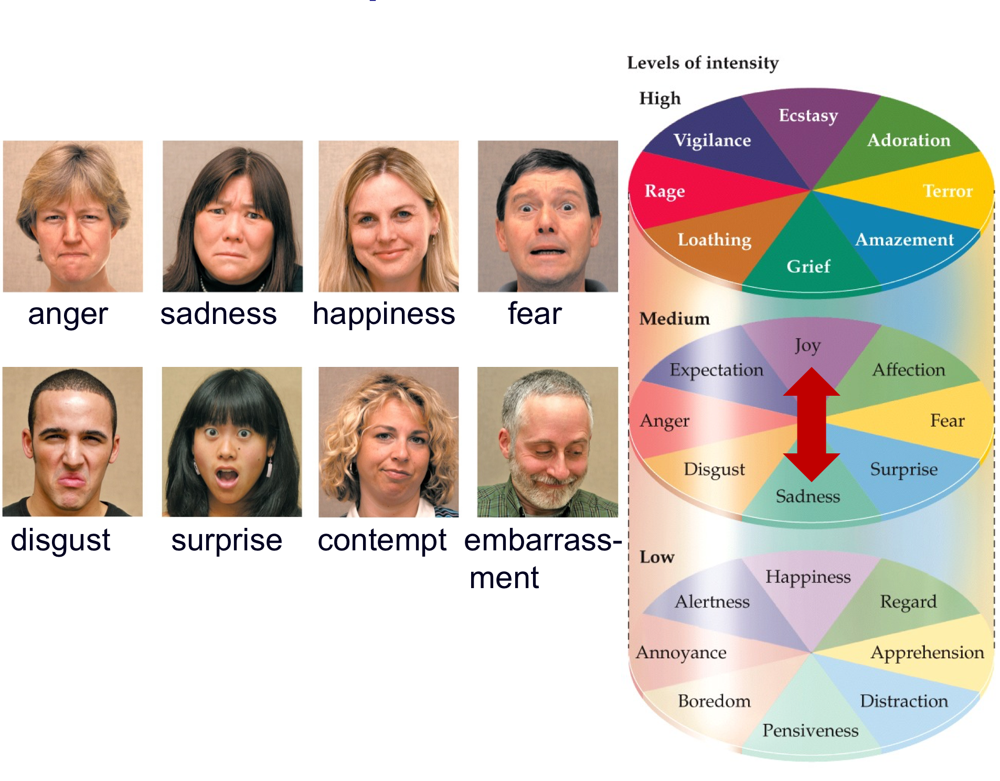

---
template: 11-1-8
count: false

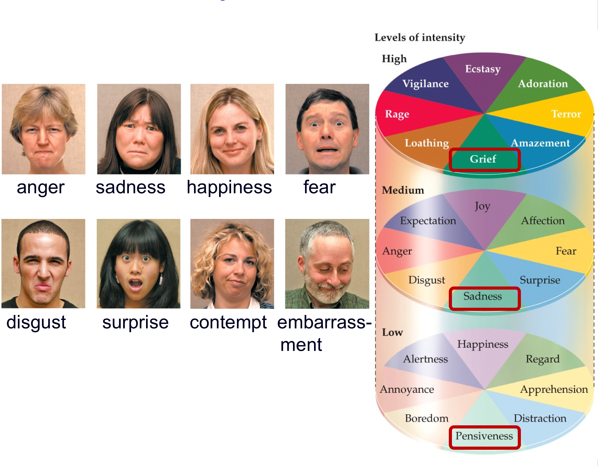

---
template: 11-1-8
count: false

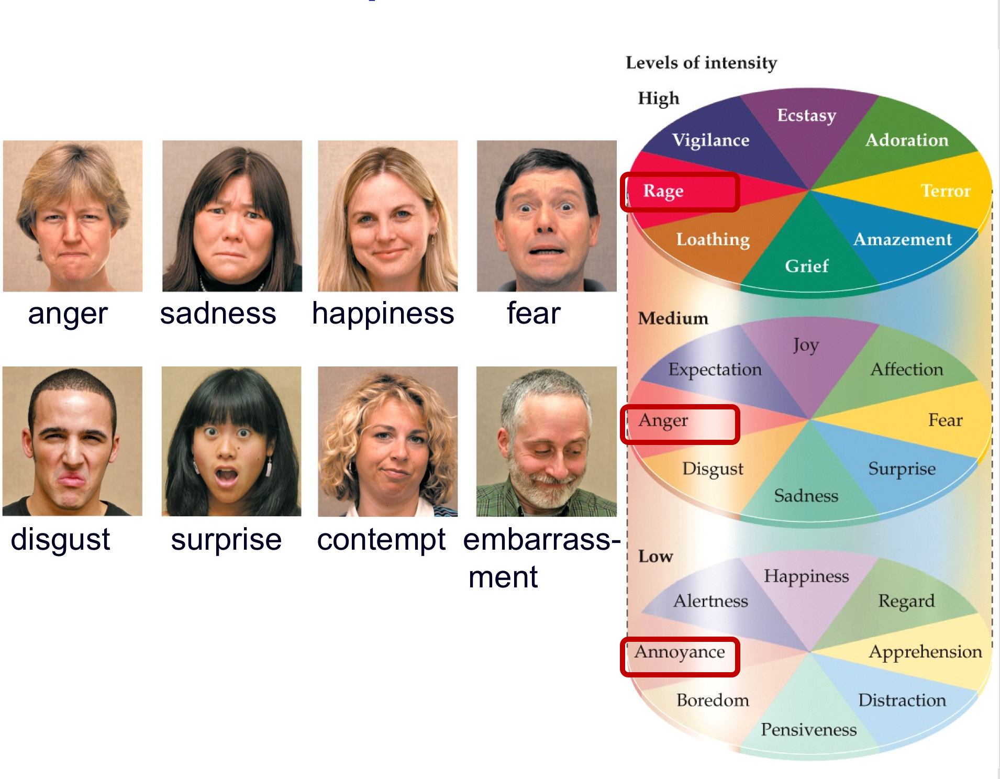

---
template: 11-1-8
count: false

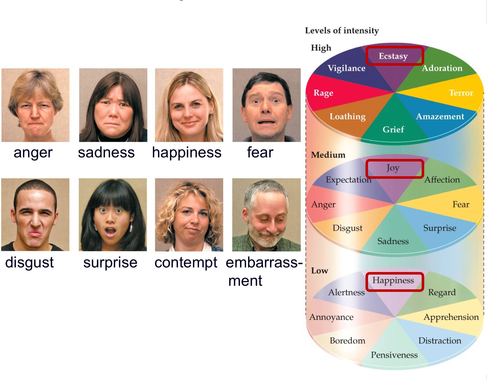

---
template: 11-1-8
count: false

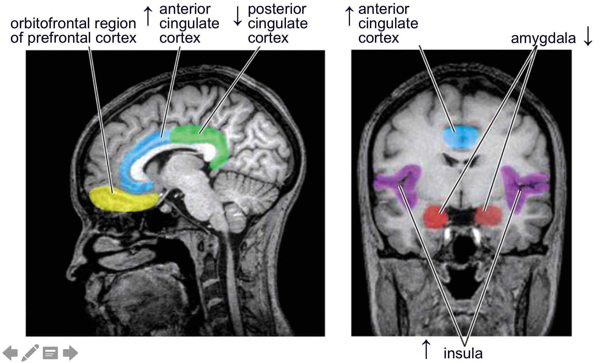


---
template: 11-1-9

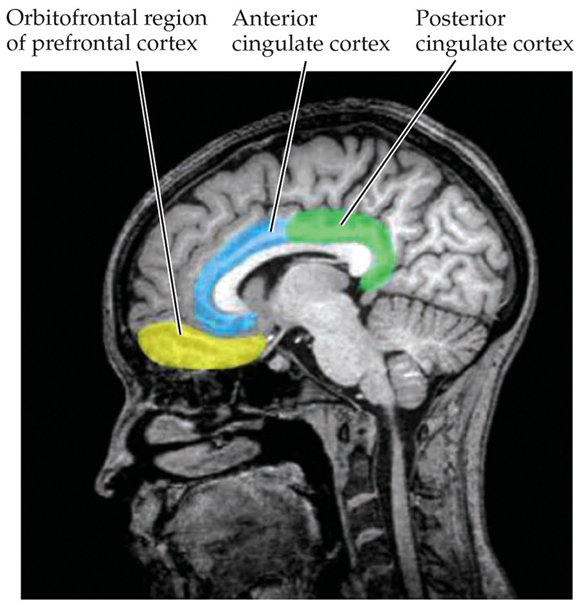

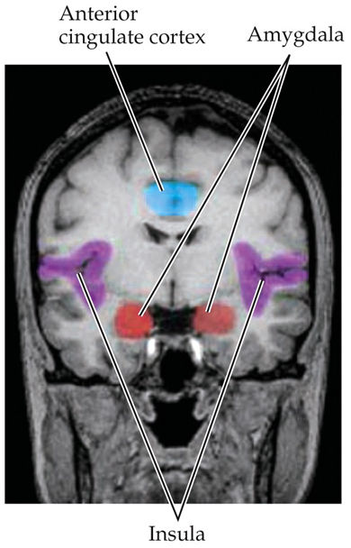


---
template: 11-1-10

<!--

-->

---
template: 11-1-11

<!--

-->

---
template: 11-1-12

<!--

-->

---
template: 11-1-13

<!--

-->

---
template: 11-1-14
