```{r setup, include=FALSE}
options(htmltools.dir.version = FALSE)
```

# Chapter 11:  Emotion

#### Emotions as Response Patterns
#### .bold[Fear and Anxiety]
#### Anger, Aggression, and Impulse Control
#### Communication of Emotions
#### Feelings of Emotion


---
name: 11-2-2
layout: true

# Fear and Anxiety
### Behavioral Tests. 

- anxiety-related behavior
- fear-inducing-stimuli

---
name: 11-2-3
layout: true

# Fear and Anxiety
### Behavioral Tests - Anxiety-Related Behavior. 

<!--
Open Field
Elevated Plus Maze
Dark/Light Emergence
-->

---
name: 11-2-4
layout: true

# Fear and Anxiety
### Behavioral Tests - Fear-Conditioned Behavior. 
- **associative (contextual)** fear conditioning


<!--
home
cage
habituation
noxious stimulation
exposure to context
without stimulation
-->


---
name: 11-2-5
layout: true

# Fear and Anxiety
### Behavioral Tests - Fear-Conditioned Behavior. 

- **associative (cued)** fear conditioning

---
name: 11-2-6
layout: true

# Fear and Anxiety
### Behavioral Tests - Fear-Conditioned Behavior. 

- **extinction** of associative (cued) fear conditioning

---
name: 11-2-7
layout: true

# Fear
### Neural Circuitry of Fear. 

- sensory input for fear-inducing stimulus to thalamus
- “**low road**” to amygdala
- “**high road**” to sensory cortex, hippocampus, amygdala


---
name: 11-2-8
layout: true

# Fear
### Neural Circuitry of Fear. 

- **lateral** amygdala (LA): 
- receives input from neocortex (especially sensory cortices and ventromedial prefrontal cortex, or vmPFC), thalamus, and hippocampus
- innervates **basal** amygdala, **central** amygdala, Nacc, dorsomedial thalamus (which innervates vmPFC)

---
name: 11-2-9
layout: true

# Fear
### Neural Circuitry of Fear. 

- **lateral amygdala** (LA): 
- neuroplasticity underlying fear conditioning includes changes in responses of LA neurons to sensory inputs
- additional changes occur in other brain regions

---
name: 11-2-10
layout: true

# Fear
### Neural Circuitry of Fear. 

- **basal amygdala** (BA): 
- receives input from lateral amygdala
- innervates central amygdala, vmPFC

---
name: 11-2-11
layout: true

# Fear
### Neural Circuitry of Fear. 

- **central amygdala** (CeA): 
- receives input from lateral and
  basal amygdala
- innervates hypothalamus, 
  midbrain, pons, medulla


---
name: 11-2-12
layout: true

# Fear
### Neural Circuitry of Fear. 

- **central amygdala** (CeA): 
- damage to CeA reduces or eliminates fear responses
- stimulation of CeA elicits fear
- chronic stimulation of CeA causes stress-linked disorders

---
name: 11-2-13
layout: true

# Fear
### Extinction of Fear. 

- **ventromedial prefrontal cortex**
  (vmPFC): 
- extinction ≠ forgetting
- active learning that CS no
  longer predicts US
- memory not erased, but 
  responses are inhibited

---
name: 11-2-14
layout: true

# Image Credits

- slide 2:	http://consonantlyspeaking.com/sites/consonantlyspeaking.com/files/images/anxiety-symptoms-cartoon.png
	https://lh3.ggpht.com/aIrpJa5-CgUrOfWcwwrgYrxOPT-ffgRLrXGap-gkYi8S8lORrdzsn6AqgIJ 4KiMMIwE=w300
- slide 3:	http://www.nature.com/nrd/journal/v4/n9/images/nrd1825-f4.jpg
- slide 4:	http://www.nature.com/nrn/journal/v9/n1/fig_tab/nrn2297_F2.html
- slide 5-7:	http://www.mindsmachine.com/asf/11/11.01.01.jpg
- slide 8-11:	Carlson, N.R. (2012). Physiology of Behavior, 11th ed. Pearson Publishing
- slide 12:	http://www.surgicalneurologyint.com/articles/2013/4/1/images/SurgNeurolInt_2013_4_1_75_ 112825_f3.jpg
- slide 13:	Carlson, N.R. (2012). Physiology of Behavior, 11th ed. Pearson Publishing


---
template: 11-2-2
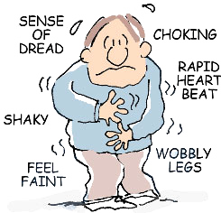
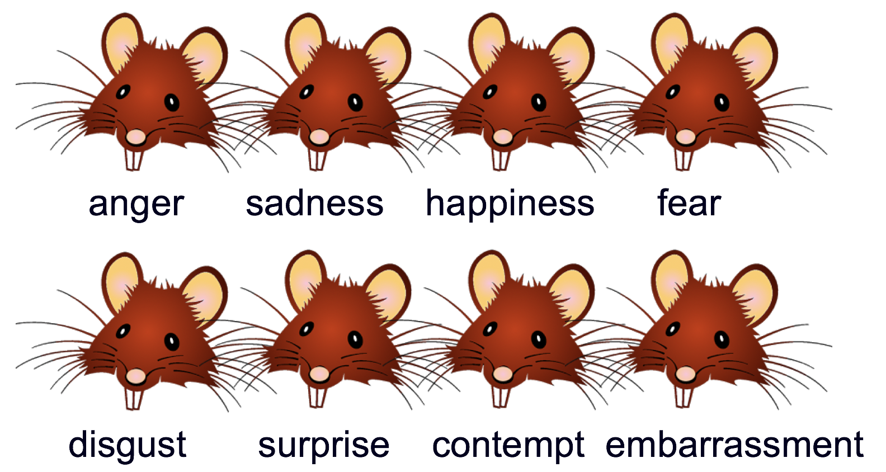

---
template: 11-2-3

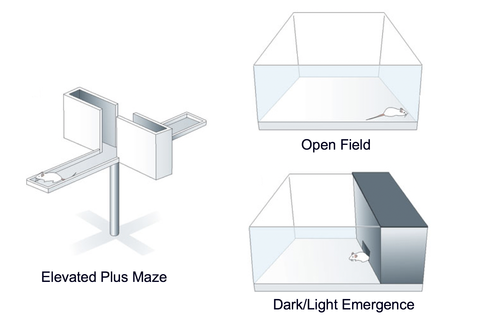


---
template: 11-2-4

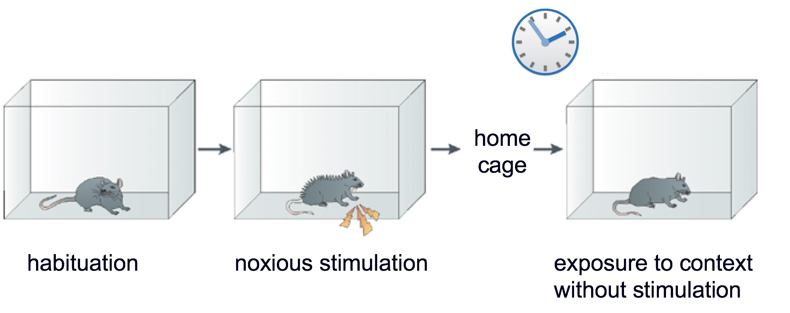


---
template: 11-2-5

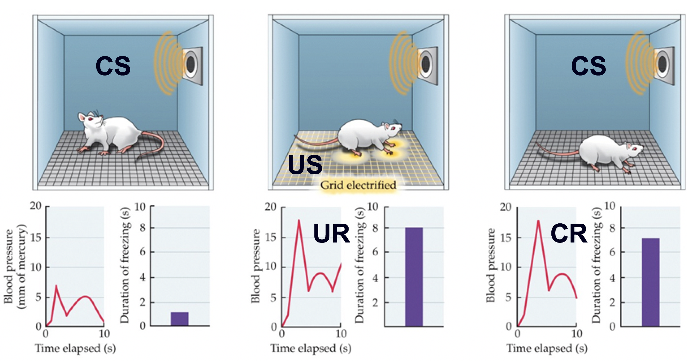


---
template: 11-2-6

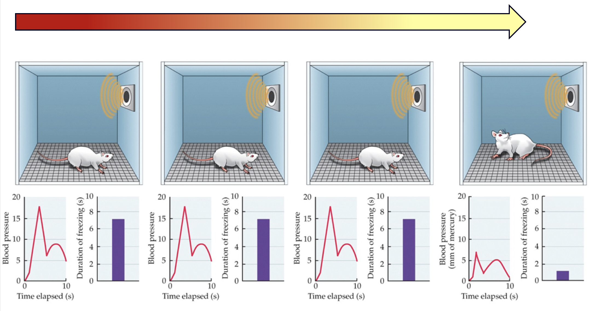


---
template: 11-2-7

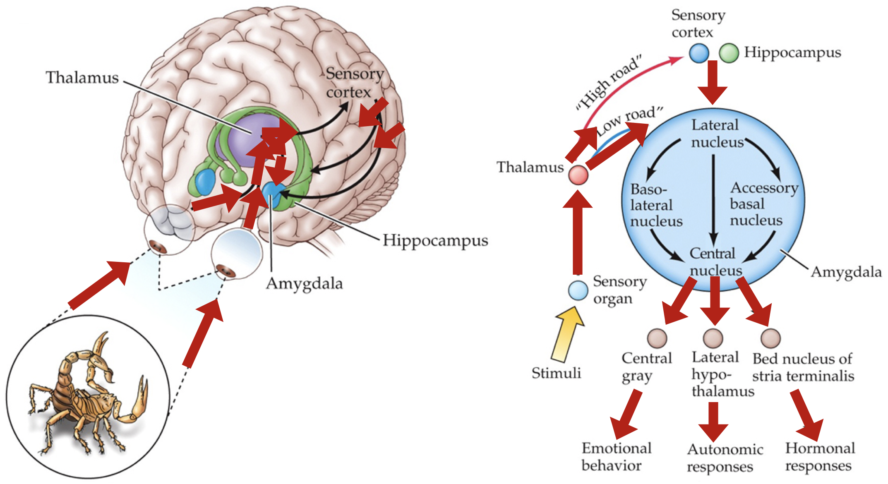


---
template: 11-2-8

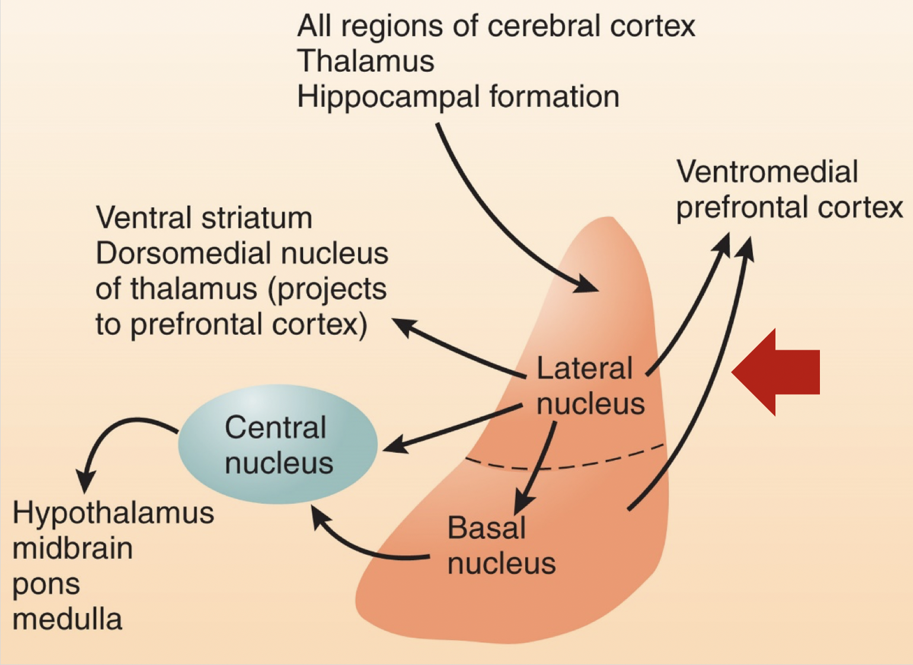


---
template: 11-2-9


---
template: 11-2-10

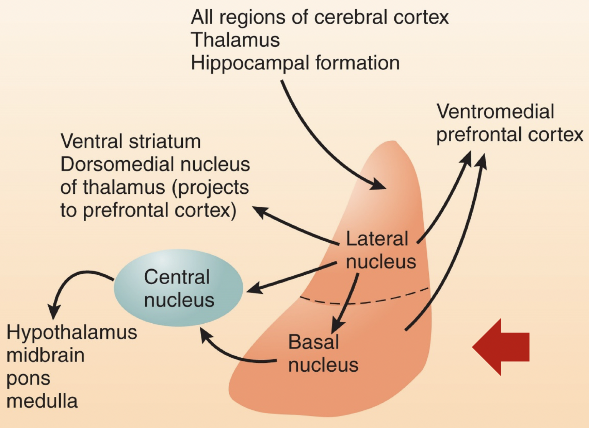


---
template: 11-2-11

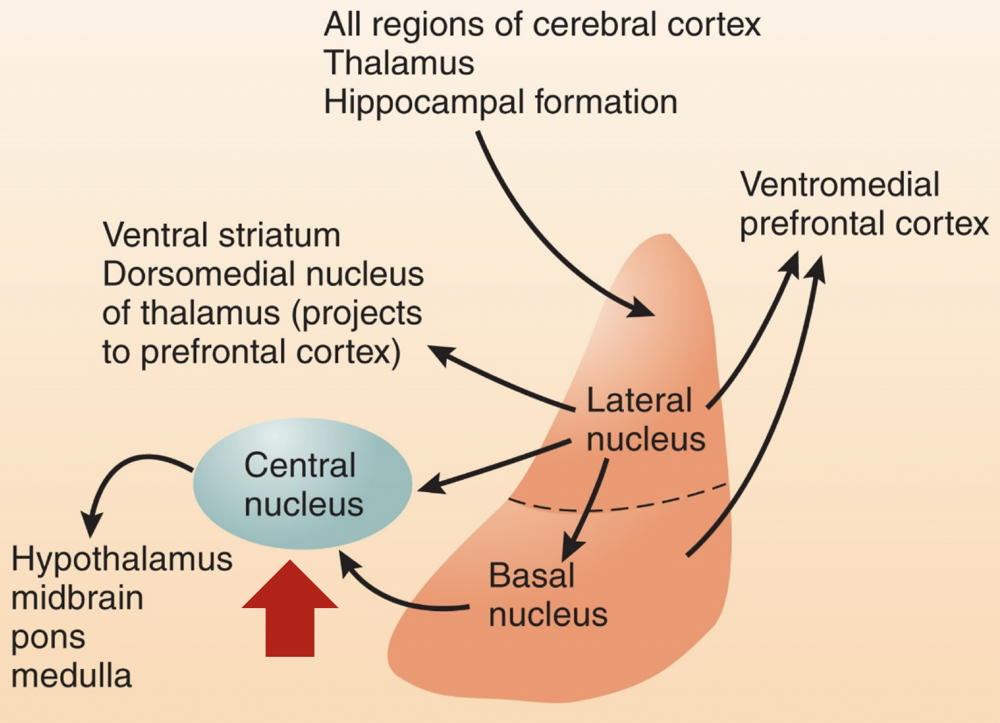

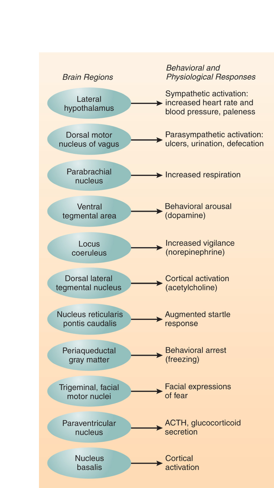

---
template: 11-2-11
count: false


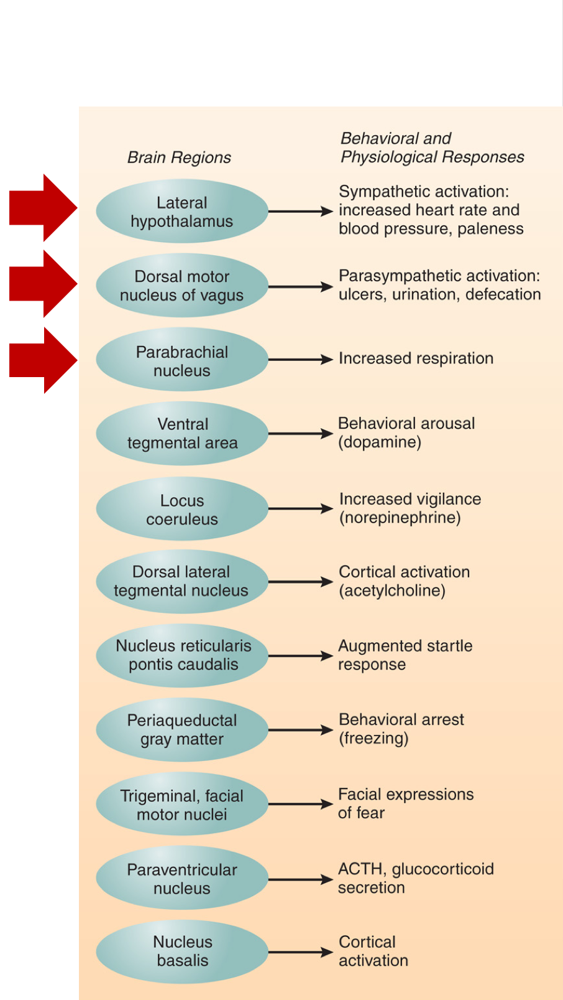

---
template: 11-2-11
count: false


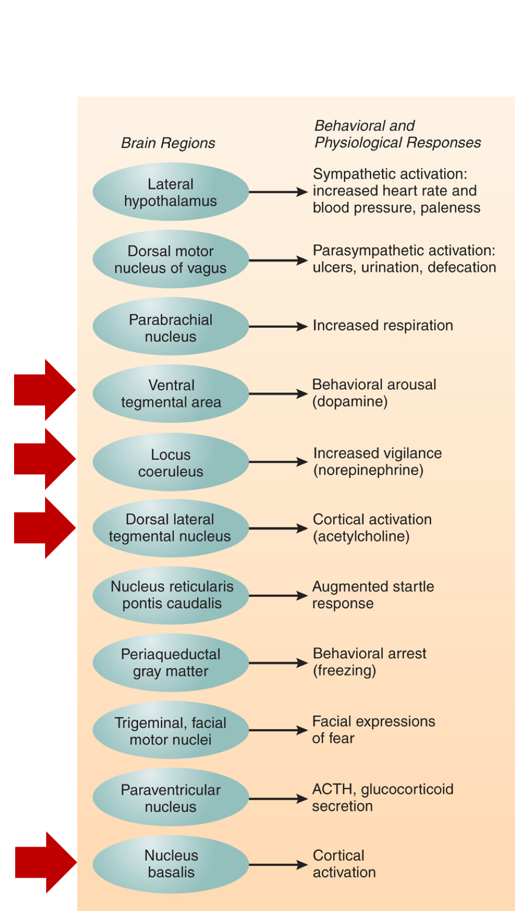

---
template: 11-2-11
count: false


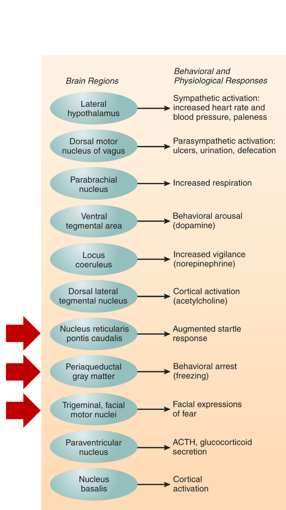

---
template: 11-2-11
count: false


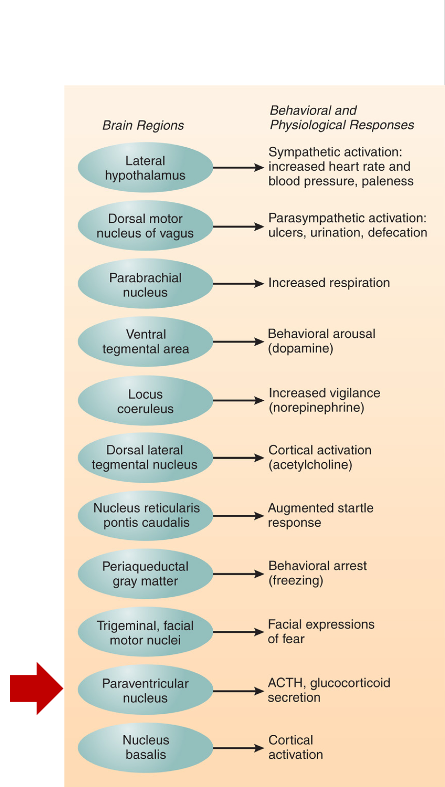

---
template: 11-2-12

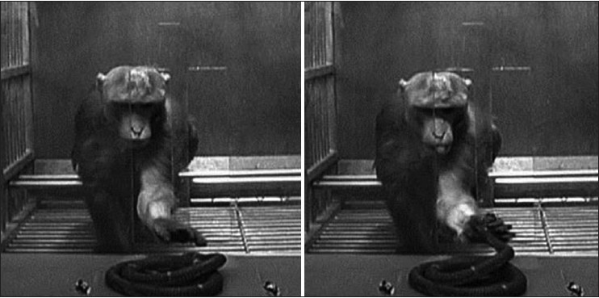


---
template: 11-2-13

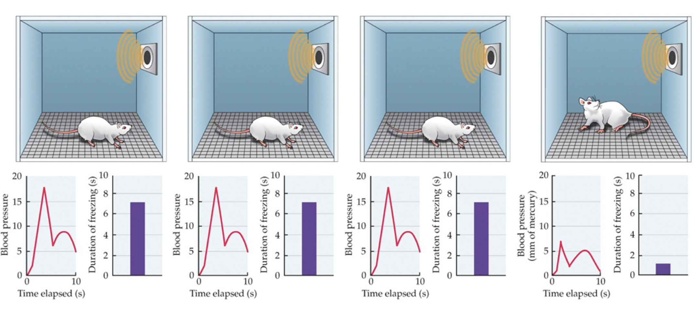

.Large.bolder[

]
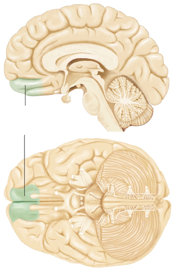


---
template: 11-2-14
