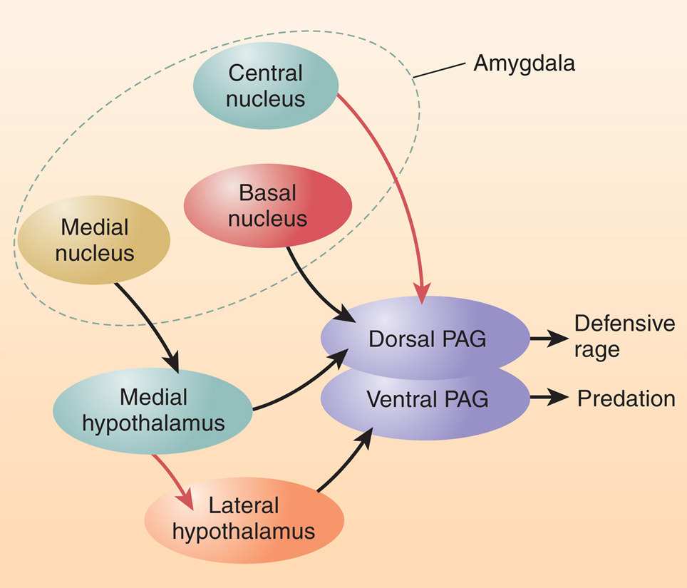
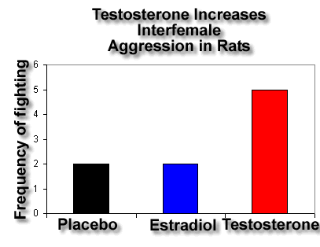

```{r setup, include=FALSE}
options(htmltools.dir.version = FALSE)
```

# Chapter 11:  Emotion

#### Emotions as Response Patterns
#### Fear and Anxiety
#### .bold[Anger, Aggression, and Impulse Control]
#### Communication of Emotions
#### Feelings of Emotion


---
name: 11-3-2
layout: true

# Anger, Aggression, and Impulse Control
### Elements of Aggressive Behavior. 
- emotional aggression occurs in context of reproduction, territorial defense, self-defense
- threat behaviors elicit flight, submission, defensive attack

<!--
mandible
engagement
mandible
spreading
antenna
fencing
winner
loser
-->

---
name: 11-3-3
layout: true

# Anger, Aggression, and Impulse Control
### Elements of Aggressive Behavior. 
- predatory aggression lacks emotional and SNS arousal

---
name: 11-3-4
layout: true

# Anger, Aggression, and Impulse Control
### Elements of Aggressive Behavior. 

- multiple parts of the brain contribute to organization of aggressive behavior

---
name: 11-3-5
layout: true

# Anger, Aggression, and Impulse Control
### Neural Circuitry of Aggressive Behavior. 
- subregions of hypothalamus and amygdala regulate defensive attack and predation, through inputs to PAG

---
name: 11-3-6
layout: true

# Anger, Aggression, and Impulse Control
### Serotonin, Aggression, and Impulse Control. 

- serotonergic activity inhibits aggression
- low CSF 5-HIAA associated with increased aggressive behavior and risk-taking in juvenile monkeys

---
name: 11-3-7
layout: true

# Anger, Aggression, and Impulse Control
### Hormonal Control of Aggression. 
- testosterone linked to male reproductive behavior
- aggression linked to male reproductive behavior
- testosterone linked to aggression
   - reduced testosterone = reduced aggression in rodents


---
name: 11-3-8
layout: true

# Anger, Aggression, and Impulse Control
### Hormonal Control of Aggression. 

- testosterone replacement induced aggression in castrated rodents

---
name: 11-3-9
layout: true

# Anger, Aggression, and Impulse Control
### Hormonal Control of Aggression. 

- testosterone can also increase inter-female aggression

---
name: 11-3-10
layout: true

# Anger, Aggression, and Impulse Control
### Hormonal Control of Aggression - Humans. 

- male children are more aggressive than female children
- some evidence - testosterone increases dominance
- however, correlations between testosterone and aggression are not as clear in humans

---
name: 11-3-11
layout: true

# Anger, Aggression, and Impulse Control
### Anger, Aggression and Impulse Control. 

- interaction between testosterone and alcohol, increasing aggression in dominant monkeys
- especially in mating season

---
name: 11-3-12
layout: true

# Anger, Aggression, and Impulse Control
### Anger, Aggression and Impulse Control - Human Studies. 

- greater concordance for antisocial behavior in monozygotic human  twins than dizygotic twins
- low CSF 5-HIAA associated with antisocial behavior
- fluoxetine (SSRI) decreased pathological irritability in a controlled test in subjects with antisocial personality

---
name: 11-3-13
layout: true

# Anger, Aggression, and Impulse Control

### .small[Anger, Aggression and Impulse Control - Role of vmPFC.]
.pull-left[
- vmPFC implicated in inhibition of emotional responses
- inputs from:
    - dorsomedial thalamus, temporal cortex, VTA, olfactory system, amygdala
- outputs to 
    - cingulate cortex, hippocampal formation, temporal cortex, lateral hypothalamus, amygdala, other parts of PFC
]

---
name: 11-3-14
layout: true

# Anger, Aggression, and Impulse Control
### .small[Anger, Aggression and Impulse Control - Role of vmPFC.]
- serotonergic inputs to vmPFC 
    - particularly important in decision-making, </br> impulse control, & decreased aggression
- vmPFC lesion impairs decision-making, impulse control
    - deficits in frustration tolerance, emotional stability
    - excess anxiety and irritability


---
name: 11-3-15
layout: true

# Anger, Aggression, and Impulse Control
### Anger, Aggression and Impulse Control - Role of vmPFC. 
- patients with vmPFC lesions show high endorsement of questionable moral decisions, and fail to exhibit physiological response when endorsing those decisions


---
name: 11-3-16
layout: true

# Anger, Aggression, and Impulse Control
### Anger, Aggression and Impulse Control - Role of vmPFC. 
- Phineas Gage (1823 - 1860, injured 1848)
- prefrontal cortical damage
- flat, shallow affect and indifference
- inability to organize and execute plans
- died after series of seizures

---
name: 11-3-17
layout: true

# Anger, Aggression, and Impulse Control
### Anger, Aggression and Impulse Control - Role of vmPFC. 
.pull-left[
- Antonio Egas Moniz (1874-1955)
- invented prefrontal leucotomy, 
    - based upon flat emotional responses of 
  monkeys after prefrontal damage
]

---
name: 11-3-18
layout: true

# Anger, Aggression, and Impulse Control
### Anger, Aggression and Impulse Control
- Walter Jackson Freeman (1895-1972)
- 3,439 lobotomies
- approx. 2500 “icepick” procedure
- 19 minors, including 4 year old child
- surgery conducted in“lobotomobile”

---
name: 11-3-19
layout: true

# Image Credits

- slide 2:	http://www.nerdist.com/wp-content/uploads/2014/02/Bighorns-IN-POST.jpg
	https://ajpetsupplies.files.wordpress.com/2011/10/fight.jpg
	https://student.societyforscience.org/sites/student.societyforscience.org/files/main/articles/a1868_1524.jpg
	http://www.frontiersin.org/files/Articles/23148/fnins-06-00118-HTML/image_m/fnins-06-00118-g002.jpg
- slide 3:	http://utilitarian-essays.com/Leopard_kill_-_KNP_-_001.jpg
	http://www.centertao.org/media/Self-Predation-zebra.jpg
	http://webneel.com/daily/sites/default/files/images/daily/06-2013/predator%20vs%20prey.jpg
	http://trttemperaterainforest.weebly.com/uploads/1/7/3/7/17371767/201265912.jpg?409
	http://static01.nyt.com/images/2013/01/30/science/30cats-span/30cats-span-videoLarge.jpg
- slide 4:	http://www.haciendapub.com/sites/default/files/Figure13Part2Psychosurgery.jpg
	http://www.haciendapub.com/sites/default/files/Figure14Part2Psychosurgery.jpg
- slide 5-6:	Carlson, N.R. (2012). Physiology of Behavior, 11th ed. Pearson Publishing 
- slide 7-8:	Breedlove, S.M., Watson, N.V. (2013). Biological Psychology: An Introduction to Behavioral, Cognitive, and Clinical Neuroscience, 7th ed. Sinauer Associates, Inc.
- slide 9:	http://www.flyfishingdevon.co.uk/salmon/year2/aggression/testosterone_aggression_female.gif
- slide 10:	http://api.ning.com/files/iRGkQSu08csxh23h2V0RpUCNeVPS6tn03OYKcl227MVo7nNRs3U OwZZ60FW8rBixz8tPiqHl4su9phWKqraAmDvwv339uXDI/iStock_000002686434_Large.jpg
- slide 11:	Carlson, N.R. (2012). Physiology of Behavior, 11th ed. Pearson Publishing 


---
name: 11-3-20
layout: true

# Image Credits


- slide 12:	http://blogs.scientificamerican.com/scicurious-brain/files/2012/11/ssri-action.png
- slide 13-14:	Carlson, N.R. (2012). Physiology of Behavior, 11th ed. Pearson Publishing
- slide 15:	Carlson, N.R. (2012). Physiology of Behavior, 11th ed. Pearson Publishing
- slide 16:	http://upload.wikimedia.org/wikipedia/commons/5/54/Frontal_lobe_animation.gif
	https://boeatau.files.wordpress.com/2012/05/phineas-gage.jpg
	http://upload.wikimedia.org/wikipedia/commons/8/8c/Phineas_Gage_GageMillerPhoto2010-02-17_Unretouched_Color_Cropped.jpg
- slide 17:	http://upload.wikimedia.org/wikipedia/commons/thumb/c/c2/Moniz.jpg/180px-Moniz.jpg
	http://www.gutsandgore.co.uk/wp-content/uploads/2013/09/A-diagram-from-Freemans-book-with-Watts-Transorbital-Lobotomy.jpg
	http://upload.wikimedia.org/wikipedia/commons/thumb/f/fe/Lobotomy_1.jpg/170px-Lobotomy_1.jpg
- slide 18:	http://www.bravofact.com/wp-content/uploads/2011/09/Lobotomobile-3.jpg
	http://i.livescience.com/images/i/000/004/598/i02/070606_generic_anger_02.jpg?1296082 940
	


---
template: 11-3-2


---
template: 11-3-3


---
template: 11-3-4


---
template: 11-3-5




---
template: 11-3-6


---
template: 11-3-7


---
template: 11-3-8


---
template: 11-3-9




---
template: 11-3-10


---
template: 11-3-11


---
template: 11-3-12


---
template: 11-3-13


---
template: 11-3-14


---
template: 11-3-15


---
template: 11-3-16


---
template: 11-3-17


17


---
template: 11-3-18


---
template: 11-3-19

---
template: 11-3-20

