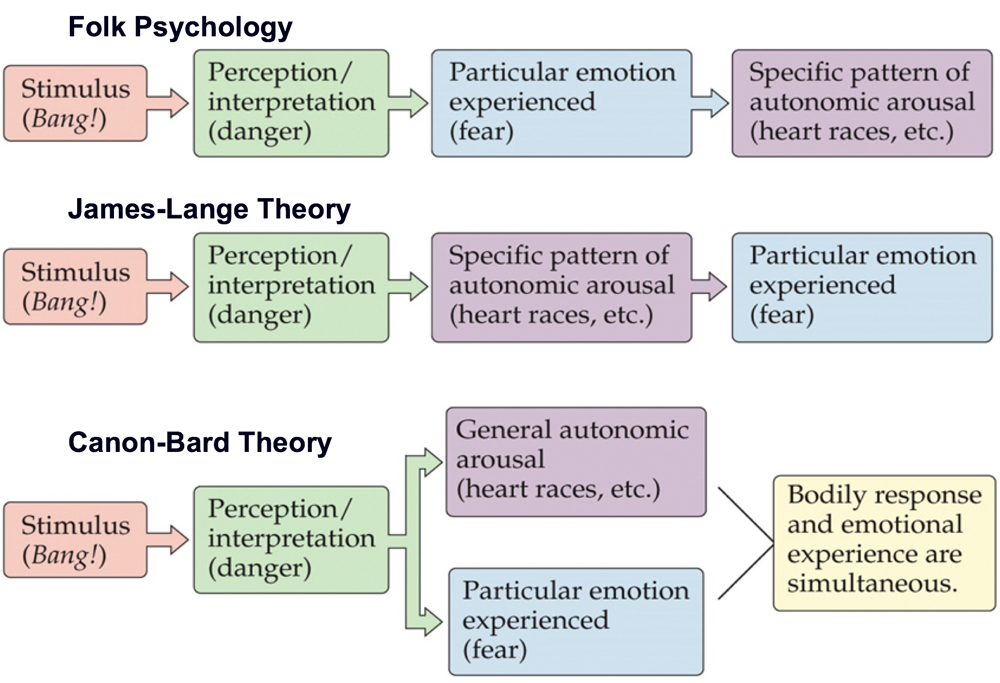
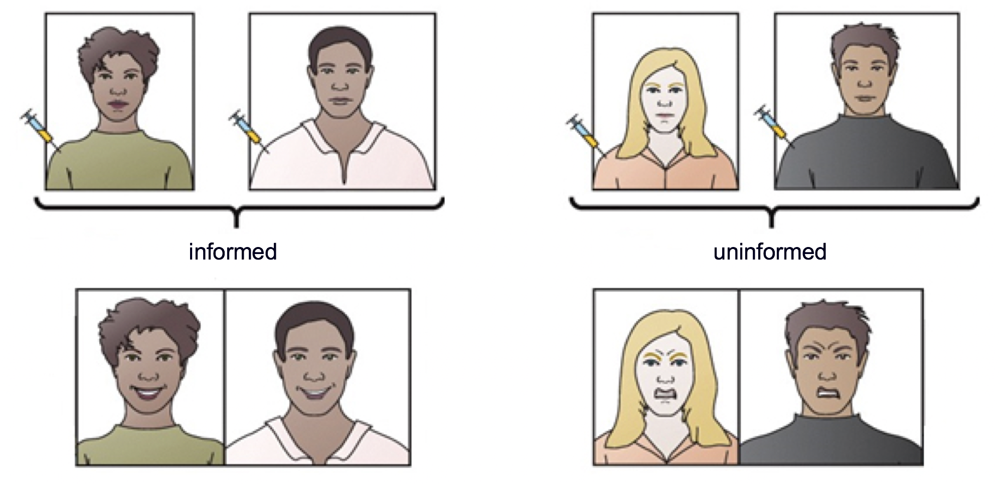
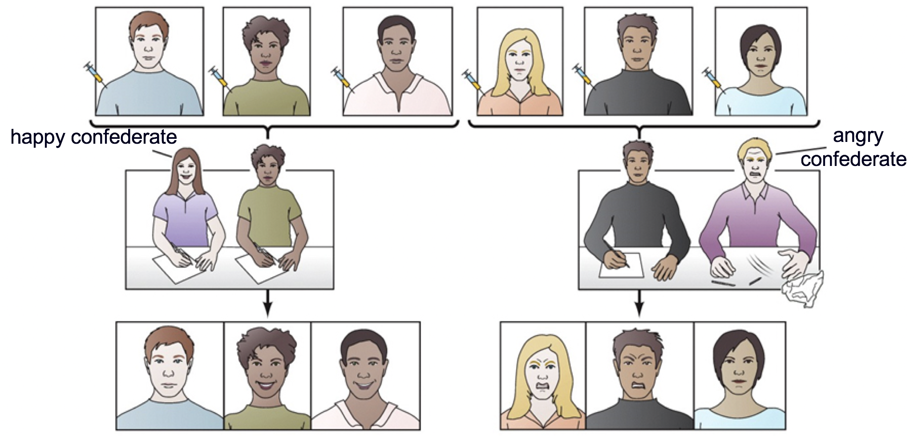
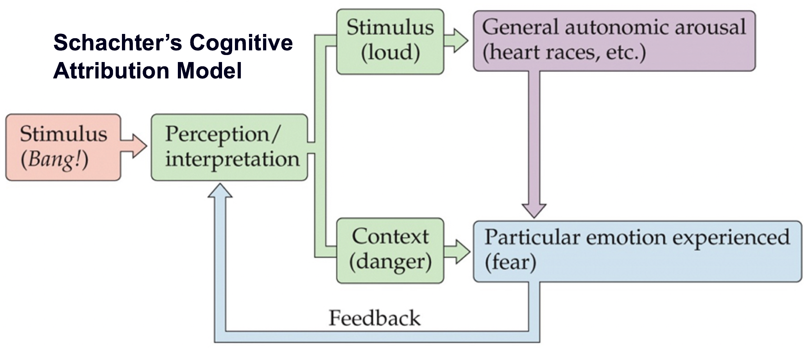
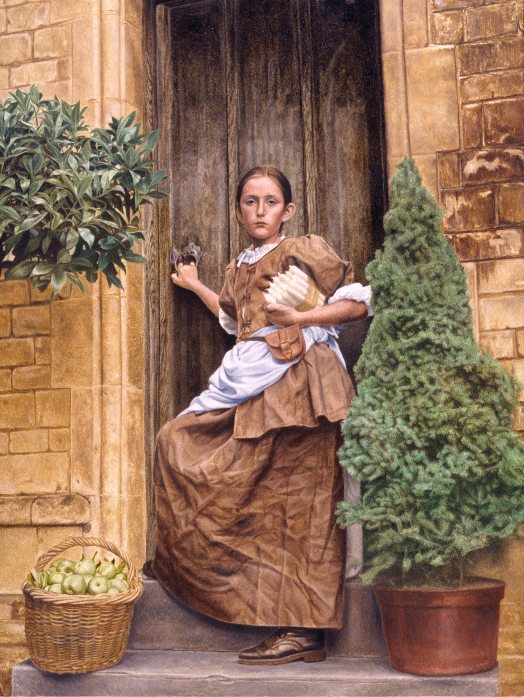
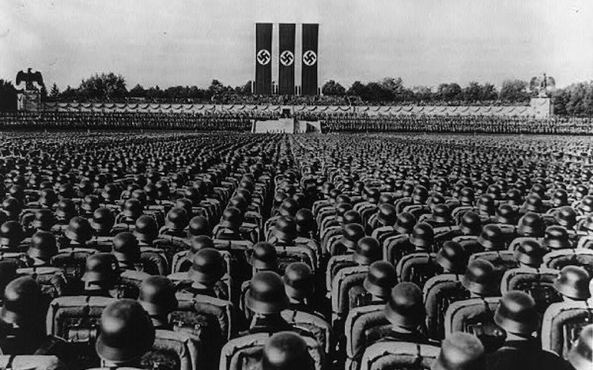

```{r setup, include=FALSE}
options(htmltools.dir.version = FALSE)
```


# Chapter 11:  Emotion

#### Emotions as Response Patterns
#### Fear and Anxiety
#### Anger, Aggression, and Impulse Control
#### Communication of Emotions
#### .bold[Feelings of Emotion]


---
name: 11-5-2
layout: true

# Feelings of Emotions
### Folk Psychology/James-Lange/Canon-Bard Theories. 


---
name: 11-5-3
layout: true

# Feelings of Emotions
### Schachter-Singer Experiments. 
- subjects injected with epinephrine
- told heart would race or not told anything
- informed subjects had no emotional response
- uninformed subjects experienced emotional distress


---
name: 11-5-4
layout: true

# Feelings of Emotions
### Schachter-Singer Experiments. 
- uninformed subjects injected with epinephrine
- in room with happy or angry confederate
- emotion matched confederate model


---
name: 11-5-5
layout: true


# Feelings of Emotions
###Schachter-Singer (or two-factor) Theory. 
- arousing stimulus perceived/interpreted by brain
- produces changes in general autonomic arousal
- nature/context of stimulus determines emotion
- level of autonomic arousal may influence intensity emotion

---
name: 11-5-6
class: clear
layout: true

---
name: 11-5-7
class: clear
layout: true

---
name: 11-5-8
layout: true

# Image Credits

- slide 2-5:	Breedlove, S.M., Watson, N.V. (2013). Biological Psychology: An Introduction to Behavioral, Cognitive, and Clinical Neuroscience, 7th ed. Sinauer Associates, Inc.
- slide 6:	https://clivewilkins.files.wordpress.com/2012/11/citna2010.jpg
- slide 7:	http://d.ibtimes.co.uk/en/full/426840/nazi-war-machine-relied-boy-scouts-plan-sea-lion-invasion-britain.jpg


---
template: 11-5-2




---
template: 11-5-3



---
template: 11-5-4



---
template: 11-5-5



---
template: 11-5-6



---
template: 11-5-7


---
template: 11-5-8
