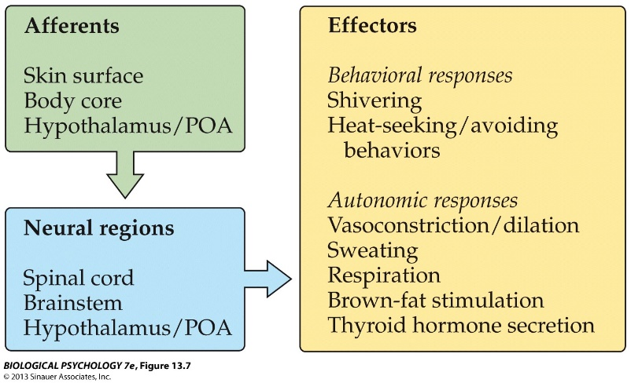

```{r setup, include=FALSE}
options(htmltools.dir.version = FALSE)
```


# Chapter 12:  Ingestive Behavior

#### Physiological Regulatory Mechanisms
#### Fluid Regulation
#### Nutrition and Metabolism
#### Obesity and Anorexia / Bulimia


---

# Chapter 12:  Ingestive Behavior

#### .bold[Physiological Regulatory Mechanisms]
#### Fluid Regulation
#### Nutrition and Metabolism
#### Obesity and Anorexia / Bulimia


---
name: 12-1-3
layout: true


# Physiological Regulatory Mechanisms
### Homeostasis. 

.pull-left[

> “any self-regulating process by which biological systems tend to maintain stability while adjusting to [constantly changing] conditions” (Encyclopedia Britannica)

]

<!--

ingestive behavior
(correctional mechanism 1)
feedback
detector
output
(correctional mechanism 2)
system variable
-->

---
name: 12-1-4
layout: true

# Physiological Regulatory Mechanisms
### Homeostasis. 
.pull-left[
- **set point**: optimum value of a system variable under homeostatic regulation
- **set range**: tolerable variability around the set point
]

---
name: 12-1-5
layout: true

# Physiological Regulatory Mechanisms
### Homeostasis. 
- **set point**: optimum value of a system variable under homeostatic regulation
- **set range**: tolerable variability around the set point
- **anticipation**: typically, physiological regulation does not wait until physiological deficits are experienced
- regulation is enacted in anticipation of future needs

<!--

104
102
100
98
96
40
39
38
37
36
°F
°C

hardexercise
hard work
emotion
normal
early
morning
-->

---
name: 12-1-6
layout: true

# Physiological Regulatory Mechanisms
### Physiological and Behavioral Homeostasis. 
- bidirectional physiological sensing and physiological response

---
name: 12-1-7
layout: true


# Physiological Regulatory Mechanisms
### Physiological and Behavioral Homeostasis. 
- bidirectional physiological sensing and behavioral response

---
name: 12-1-8
layout: true

# Physiological Regulatory Mechanisms
### Physiological and Behavioral Homeostasis. 
- redundancy: multiple monitors and correction mechanisms, attests to importance of homeostasis

---
name: 12-1-9
layout: true

# Physiological Regulatory Mechanisms
### Homeostasis. 
- regulatory systems for nutrition and hydration
- thirst and hunger: motivational systems, trigger intake
- satiety mechanisms: monitor correction behavior, not system variable, anticipate replenishment after delay

---
name: 12-1-10
layout: true

# Image Credits

- slide 3:	Kandel, E.R., Schwartz, J.H., Jessell, T.M., Seigelbaum, S.A., and Hudspeth, A.J. (2012). Principles of Neural Science, 5th ed. McGraw-Hill Professional
- slide 4:	Breedlove, S.M., Watson, N.V. (2013). Biological Psychology: An Introduction to Behavioral, Cognitive, and Clinical Neuroscience, 7th ed. Sinauer Associates, Inc.
- slide 5:	http://upload.wikimedia.org/wikipedia/commons/thumb/0/05/Body_Temp_Variation.png/250px -Body_Temp_Variation.png
- slide 6-8:	Breedlove, S.M., Watson, N.V. (2013). Biological Psychology: An Introduction to Behavioral, Cognitive, and Clinical Neuroscience, 7th ed. Sinauer Associates, Inc.
- slide 9:	Carlson, N.R. (2012). Physiology of Behavior, 11th ed. Pearson Publishing


---
template: 12-1-3


---
template: 12-1-3
count: false 


---
template: 12-1-3
count: false 


---
template: 12-1-3
count: false 


---
template: 12-1-4


---
template: 12-1-5


---
template: 12-1-6


---
template: 12-1-7


---
template: 12-1-8




---
template: 12-1-9


---
template: 12-1-10