```{r setup, include=FALSE}
options(htmltools.dir.version = FALSE)
```

name: 12-2-1
layout: true

# Chapter 12:  Ingestive Behavior

#### Physiological Regulatory Mechanisms
#### .bold[Fluid Regulation]
#### Nutrition and Metabolism
#### Obesity and Anorexia / Bulimia


---
name: 12-2-2
layout: true


# Drinking
### Body Fluids. 

> "- “Water, water, everywhere, </br>And all the boards did shrink;</br>Water, water, everywhere, </br> Nor any drop to drink."</br> - Samuel Taylor Coleridge


seawater [salt] = *3.5%*  
body [salt] = *0.9%*


---
name: 12-2-3
layout: true

# Drinking
### Body Fluids. 
- **hypertonic**: high salt concentration
    - will draw fluid out of cells
- **isotonic**: equal in osmotic pressure to contents of cells
    - cells neither gain or lose H2O
- **hypotonic**: low salt concentration
    - cells will absorb H2O by osmosis

---
name: 12-2-4
layout: true

# Drinking
### Body Fluids.
- loss of H2O through evaporation, perspiration, excretion
- usually, replacement with excess H2O and NaCl

<!--
H2O is lost by
evaporation
concentration 
of interstitial
fluid increases
capillaries lose
H2O by osmosis
cells lose H2O
by osmosis
-->

---
name: 12-2-5
layout: true

# Drinking
### Body Fluids.
.pull-left[
- water deficit can impair circulation, and interfere with normal chemical reactions in cells
- water excess (rare) could increase circulatory pressure and rupture cell membranes
]

---
name: 12-2-6
layout: true


# Drinking
### Osmotic and Hypovolemic Thirst. 
.pull-left[
**Hypovolemic (volumetric) thirst**:
- loss of fluid volume
  
**Osmotic (osmometric) thirst**:
- increased extracellular solute concentration 
]


---
name: 12-2-7
layout: true

# Drinking
### Osmotic and Hypovolemic Thirst. 
**Osmotic (osmometric) thirst**:
- increased extracellular solute concentration
- draws H2O out of cells
- detected by specialized neurons
    - known as osmoreceptors


---
name: 12-2-8
layout: true

# Drinking
### Osmotic and Hypovolemic Thirst. 
**Osmotic (osmometric) thirst**:
- osmoreceptors in OVLT and SFO (hypothalamus near 3rd ventricle)

<!--
SFO (subfornical organ)
SFO
OVLT (organum
vasculosum of
lamina terminalis)
OVLT
-->

---
name: 12-2-9
layout: true

# Drinking
### Osmotic and Hypovolemic Thirst. 
.pull-left[
**Osmotic (osmometric) thirst**:
- osmoreceptors in SON (hypothalamus, </br>projecting to posterior pituitary)
]

<!--
PVN (paraventricular nucleus)
SON (supraoptic
nucleus)
secretion of
vasopressin (ADH)
-->

---
name: 12-2-10
layout: true

# Drinking
### Osmotic and Hypovolemic Thirst. 
**Osmotic (osmometric) thirst**:
- shrinkage increases firing of action potentials


---
name: 12-2-11
layout: true

# Drinking
### Osmotic and Hypovolemic Thirst. 
.pull-left[
**Hypovolemic (volumetric) thirst**:
- loss of fluid isotonic volume
- loss of vascular fluid does not affect the </br>intracellular fluid compartment
]


---
name: 12-2-12
layout: true

# Drinking
### Osmotic and Hypovolemic Thirst. 
**Hypovolemic (volumetric) thirst**:
- kidneys detect decreases in vascular flow
    - secrete renin
- splits </br>angiotensinogen → angiotensin I → angiotensin II

<!--
hypovolemia
reduced flow of
blood to kidneys
renin
angiotensinogen
angiotensin I
angiotensin II
retention of Na+
retention of H2O
vasoconstriction
Na+ appetite
thirst
-->

---
name: 12-2-13
layout: true


# Drinking
### Neural Mechanisms of Thirst. 
- osmoreceptors in SON, OVLT and SFO
- angiotensin receptors in SFO
- OVLT/SFO → median preoptic
  hypothalamus
- SON → posterior pituitary, to 
  release AVP

<!--
SFO

median
preoptic
nucleus
OVLT
-->

---
name: 12-2-14
layout: true

# Drinking
### Neural Mechanisms of Thirst. 
- circumventricular organs indirectly trigger activity of anterior cingulate cortex → sensation of thirst
- adequate drinking = immediate decrease activity of ACC and decrease in thirst
- activity remains elevated in neurons of OVLT and SFO
  until water is absorbed

---
name: 12-2-15
layout: true

# Image Credits

- title slide:	http://worldleaderproposal.com/images/larson_camel.jpg
- slide 2:	http://upload.wikimedia.org/wikipedia/commons/2/26/Rime_of_the_Ancient_Mariner-Albatross-Dore.jpg
	Carlson, N.R. (2012). Physiology of Behavior, 11th ed. Pearson Publishing
- slide 3-4:	Breedlove, S.M., Watson, N.V. (2013). Biological Psychology: An Introduction to Behavioral, Cognitive, and Clinical Neuroscience, 7th ed. Sinauer Associates, Inc.
- slide 4:	Carlson, N.R. (2012). Physiology of Behavior, 11th ed. Pearson Publishing
- slide 5:	http://s648.photobucket.com/user/monous/media/overworked-staff-repercussions.jpg.html
- slide 6-7:	Breedlove, S.M., Watson, N.V. (2013). Biological Psychology: An Introduction to Behavioral, Cognitive, and Clinical Neuroscience, 7th ed. Sinauer Associates, Inc.
- slide 8:	Carlson, N.R. (2012). Physiology of Behavior, 11th ed. Pearson Publishing
- slide 9:	http://what-when-how.com/wp-content/uploads/2012/04/tmp3632_thumb1.jpg
- slide 10:	http://jasn.asnjournals.org/content/18/12/3056/F1.large.jpg
- slide 11:	Breedlove, S.M., Watson, N.V. (2013). Biological Psychology: An Introduction to Behavioral, Cognitive, and Clinical Neuroscience, 7th ed. Sinauer Associates, Inc.
- slide 12-13:	Carlson, N.R. (2012). Physiology of Behavior, 11th ed. Pearson Publishing
- slide 14:	Breedlove, S.M., Watson, N.V. (2013). Biological Psychology: An Introduction to Behavioral, Cognitive, and Clinical Neuroscience, 7th ed. Sinauer Associates, Inc.


---
template: 12-2-1

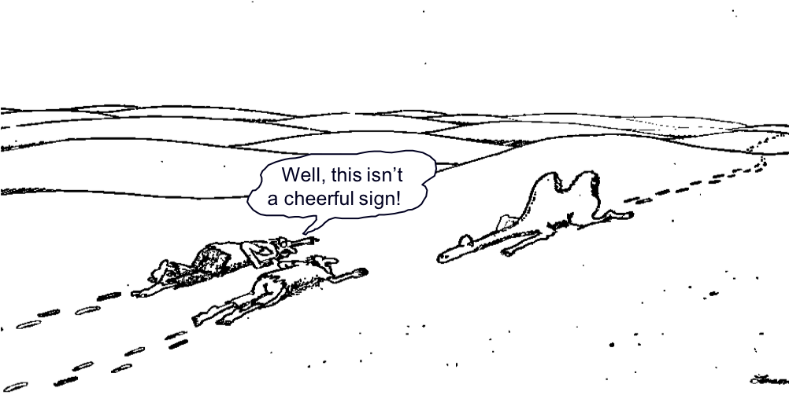


---
class: clear
template: 12-2-2


---
class: clear
template: 12-2-2
count: false


---
template: 12-2-3

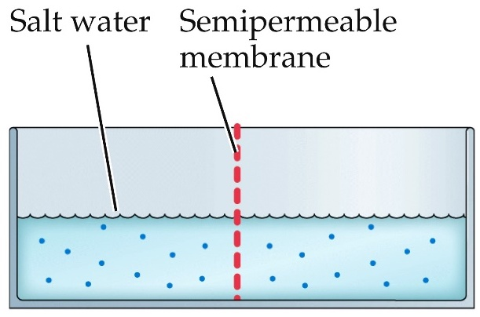


---
template: 12-2-3
count: false

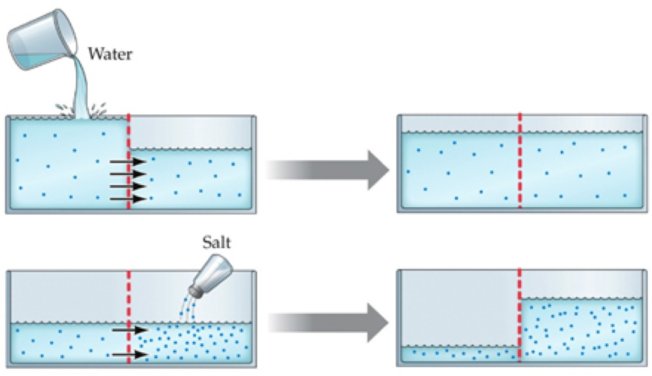


---
template: 12-2-4


---
template: 12-2-5

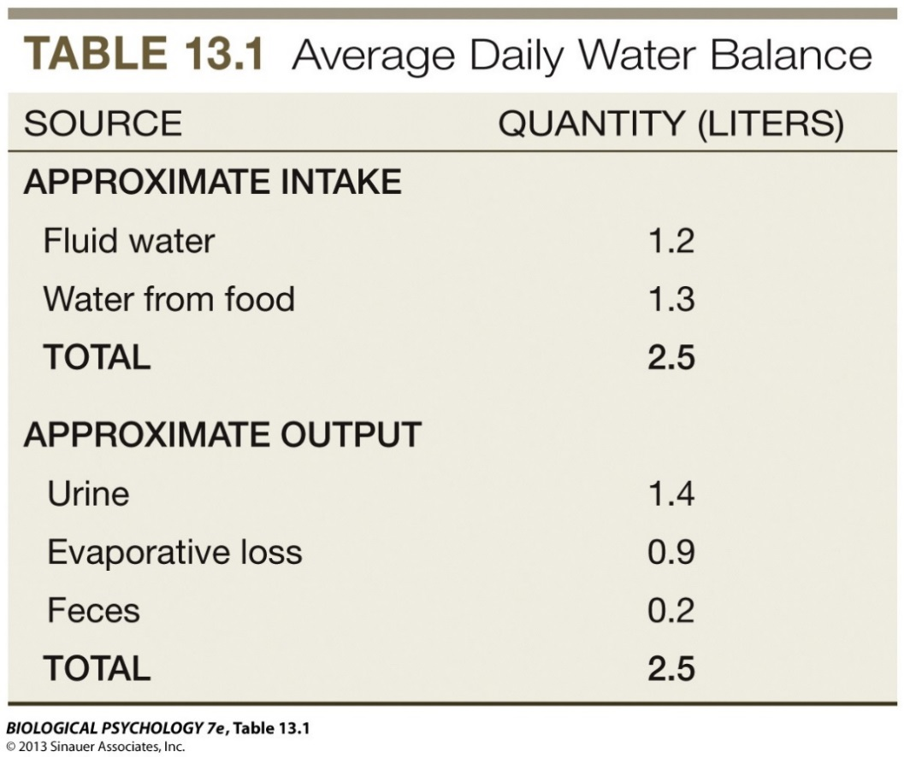


---
template: 12-2-6

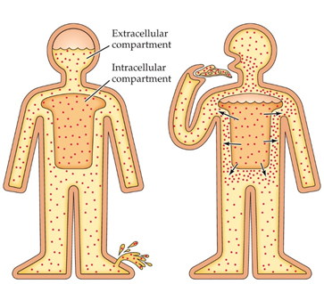

.bold[]
.bold[]
.bold[]

---
template: 12-2-7


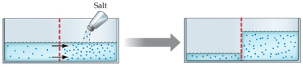

.bold[]
.bold[]
.bold[]


---
template: 12-2-8
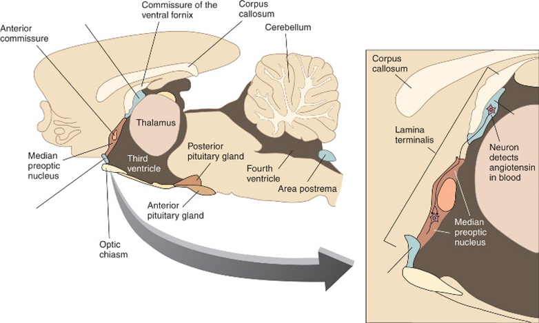


---
template: 12-2-9
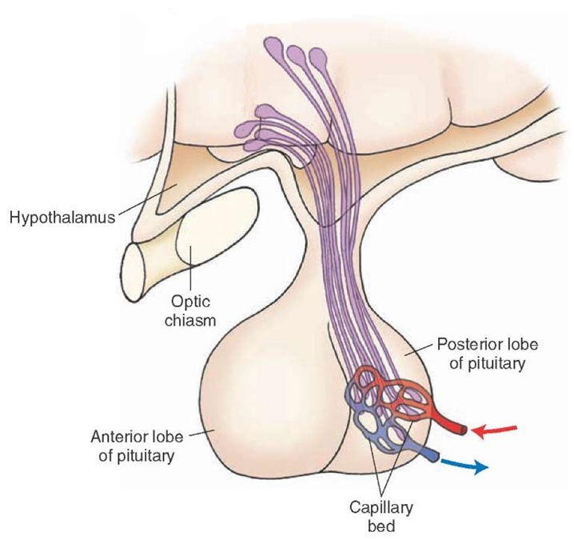


---
template: 12-2-10

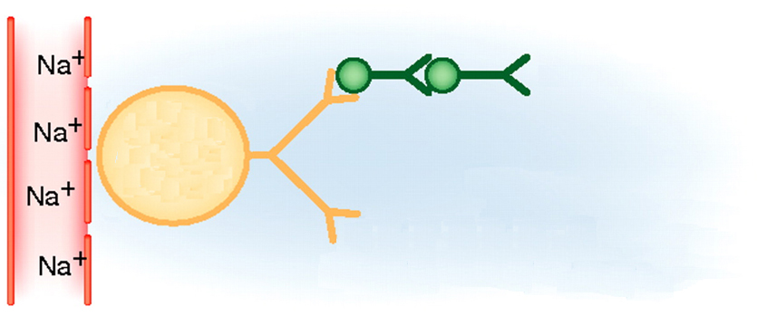

.bold[]
.bold[]

---
template: 12-2-10
count: false

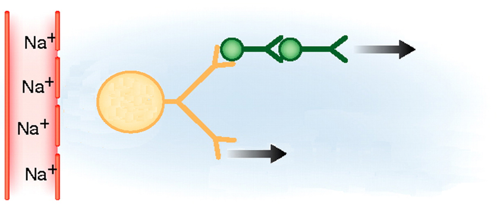

.bold[]
.bold[]
.bold[]
.bold[]


---
template: 12-2-11


---
template: 12-2-11
count: false

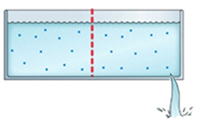


.bold[]
.bold[]
.bold[]

---
template: 12-2-12

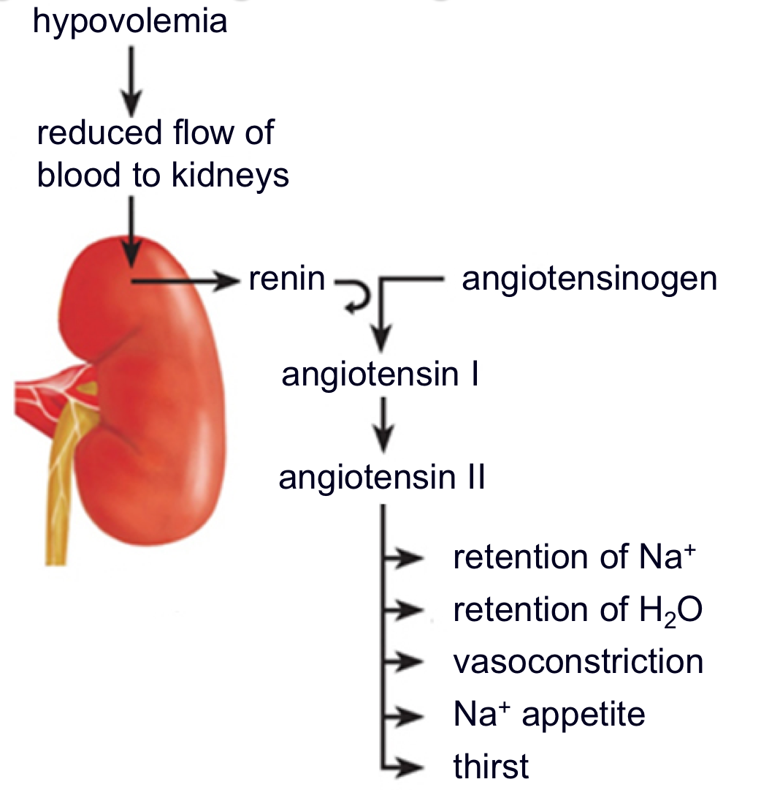


---
template: 12-2-13


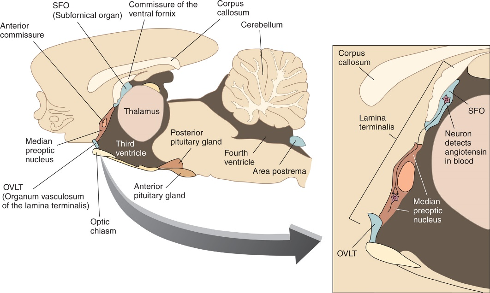


---
template: 12-2-14


---
template: 12-2-15
