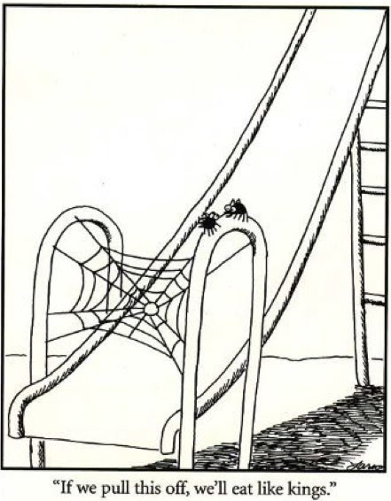
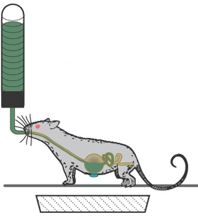

```{r setup, include=FALSE}
options(htmltools.dir.version = FALSE)
```


name: 12-3-1
layout: true

# Chapter 12:  Ingestive Behavior

#### Physiological Regulatory Mechanisms
#### Fluid Regulation
#### .bold[Nutrition and Metabolism]
##### .bold[metabolism]
##### .bold[hunger and satiety]
##### neural mechanisms
#### Obesity and Anorexia / Bulimia


---
name: 12-3-2
layout: true

# Nutrition and Metabolism
### Metabolism. 
- **fluid homeostasis** = regulation of H2O and NaCl
- **nutritional homeostasis** = regulation of carbohydrates, </br>fats, amino acids, vitamins, and minerals
- foods serve 2 purposes:
    - building blocks for </br>repair and maintenance
    - energy metabolism

---
name: 12-3-3
layout: true

# Nutrition and Metabolism
### Metabolism. 
- **short-term storage** = glycogen
- **long-term** = fat (triglycerides)

<!--
insulin
glucagon
Triglyceride
fatty acids

glycerol
-->

---
name: 12-3-4
layout: true

# Nutrition and Metabolism
### Metabolism - absorptive and fasting phases. 
- **absorptive phase** = nutrients absorbed from digestion
- glucose and AAs are principal sources of energy

---
name: 12-3-5
layout: true

# Nutrition and Metabolism
### Metabolism - absorptive and fasting phases. 
- **fasting phase** = nutrients not available from digestion
- glucose, AAs, FFAs from glycogen, protein, triglycerides

---
name: 12-3-6
layout: true

# Nutrition and Metabolism
### Hunger - What starts a meal?
- environmental cues
- sights and smells of appetizing food
- social cues and conventions
- habit

.pull-left[
- **caloric homeostasis model**: 
    - hunger is consequence of </br>gradual depletion of </br>satiety signals generated</br> by previous meal
]

---
name: 12-3-7
layout: true

# Nutrition and Metabolism
### Hunger - What starts a meal?
- gastric, hormonal, and nutrient cues
- increases in plasma ghrelin
- glucoprivation/lipoprivation

<!--
stomach
upper
intestine
-->

---
name: 12-3-8
layout: true

# Nutrition and Metabolism
### Hunger - What starts a meal?
- gastric, hormonal, and nutrient cues
- increases in plasma ghrelin
- glucoprivation/lipoprivation

---
name: 12-3-9
layout: true

# Nutrition and Metabolism
### Hunger - What starts a meal?
- gastric, hormonal, and nutrient cues
- increases in plasma ghrelin
- glucoprivation/lipoprivation

---
name: 12-3-10
layout: true

# Nutrition and Metabolism
### What stops a meal - satiety signals.
- short-term satiety signals:
- meals end before absorption of nutrients, anticipation
- head, gastric, intestinal, liver, and pancreatic factors
- long-term satiety signals:
- adipose signals

---
name: 12-3-11
layout: true

# Nutrition and Metabolism
### What stops a meal: short-term satiety signals.
- head factors (sight, smell, taste, texture of food) play a minor and </br> very short-term role
- animal with gastric fistula will eat continuously


---
name: 12-3-12
layout: true

# Nutrition and Metabolism
### What stops a meal: short-term satiety signals.
- stomach (gastric) factors (monitoring nutritional content)
- rat feeds freely, food removed from stomach, rat returns to eat almost exact same quantity of food
- not just distension, effect persists if rat is infused with non-nutritive saline solution

---
name: 12-3-13
layout: true

# Nutrition and Metabolism
### What stops a meal: short-term satiety signals.
- intestinal factors (monitoring nutritional content of food)
- as food enters duodenum, ghrelin release suppressed
- duodenum senses fat content, releases CCK causing gall bladder to release bile (breaks down fat)
- CCK inhibits gastric transit of food, suppresses eating
- small intestine secretes PYY, induces satiety

<!--
liver
hepatic
ducts
stomach
common
bile duct
gall
bladder
pancreas
bile
pancreatic
duct
small
intestine
duodenum
-->

---
name: 12-3-14
layout: true

# Nutrition and Metabolism
### What stops a meal: short-term satiety signals.
- liver factors (monitoring absorption of nutrients)
- infusion of glucose, fructose, or lipids into hepatic portal vein induces satiety (prolongs satiety that was initiated by gastric, and duodenal/intestinal factors) 

<!--
liver
hepatic
ducts
stomach
common
bile duct
gall
bladder
pancreas
bile
pancreatic
duct
small
intestine
duodenum
-->

---
name: 12-3-15
layout: true

# Nutrition and Metabolism
### What stops a meal: short-term satiety signals.
- insulin released by β-cells of islets of Langerhans 
- most body cells respond by:
- stopping glucogenesis and lypolysis
- starting protein, fat, and glycogen synthesis
- mobilizing glucose transporters
- also increase influx of amino acids and other nutrients

<!--
insulin
liver
-s-s-
α
α
hepatic
ducts
s-s-
-s-s
glucose

β
β
cell membrane
stomach
common
bile duct

tyr kinase
tyr kinase
gall
bladder
lipolysis

insulin receptor substrates
phosphorylation of enzymes

glucogenesis
pancreas
bile

fat
synthesis
cell growth and 
gene expression
pancreatic
duct

glucose
transporters
protein
synthesis
glycogen
synthesis
small
intestine
duodenum
-->

---
name: 12-3-16
layout: true

# Nutrition and Metabolism
### What stops a meal: short-term satiety signals.
- insulin released by β-cells of islets of Langerhans 
- most CNS neurons intake glucose without insulin
- some hypothalamic neurons have insulin receptors
- insulin transported across BBB to trigger satiety

<!--
satiety

insulin
-s-s-
α
α
s-s-
-s-s
glucose

β
β

cell membrane

tyr kinase
tyr kinase
lipolysis
insulin receptor substrates
phosphorylation of enzymes

glucogenesis

fat
synthesis
cell growth and 
gene expression

glucose
transporters
protein
synthesis
glycogen
synthesis
-->

---
name: 12-3-17
layout: true

# Nutrition and Metabolism
### What stops a meal: short-term satiety signals.
- insulin released by β-cells of islets of Langerhans 
- release starts with sight, smell, taste of food
- increases during meal
- highly elevated in GI and absorption phase

<!--
absorptive phase
cephalic
phase
substrate
phase

fasting
GI phase

plasma insulin concentration
eating
subject sees, smells, tastes food
-->

---
name: 12-3-18
layout: true

# Nutrition and Metabolism
### What stops a meal: long-term satiety signals.
- very tight regulation
- rebound after changes in body mass

<!--
force-fed
or food
restricted
-->

---
name: 12-3-19
layout: true


# Nutrition and Metabolism
### What stops a meal: long-term satiety signals.
- adipose and leptin
- ob/ob mice has low metabolism, overeats, and is obese
- develops diabetes in adulthood
- lacking leptin, normally released by adipose cells

---
name: 12-3-20
layout: true

# Image Credits

- title slide:	https://p.gr-assets.com/540x540/fit/hostedimages/1380360920/711839.jpg
- slide 2:	https://visualsonline.cancer.gov/retrieve.cfm?imageid=2397&dpi=300&fileformat=jpg
- slide 3:	Carlson, N.R. (2012). Physiology of Behavior, 11th ed. Pearson Publishing
	http://upload.wikimedia.org/wikipedia/en/b/b9/Eie-TRIGLYCERIDE.jpg
- slide 4-5:	Carlson, N.R. (2012). Physiology of Behavior, 11th ed. Pearson Publishing
- slide 6:	http://www.restaurantginger.ro/images/416_1zinc.jpg
	http://miniclips.phillipmartin.info/clock/06_30_xl.gif
- slide 7:	Carlson, N.R. (2012). Physiology of Behavior, 11th ed. Pearson Publishing
	http://www.scripps.org/encyclopedia/graphics/images/en/8940.jpg
	http://www.nature.com/gim/journal/v14/n1/images/gim0b013e31822bead0f1.gif
- slide 8:	http://en.wikipedia.org/wiki/Hypothalamus#/media/File:Hypothalamus_small.gif
	http://www.upright-health.com/images/Hypothalamus-pituitry2.jpg
- slide 9:	Carlson, N.R. (2012). Physiology of Behavior, 11th ed. Pearson Publishing 
- slide 10:	https://waitingforbabybird.files.wordpress.com/2014/01/food-scraps.jpg
- slide 11-12:	Zigmond, M.J., Bloom, F.E., Landis, S.C. Roberts, J.L., and Squire, L.R. (1999).  Fundamental Neuroscience., Academic Press.


---
name: 12-3-21
layout: true

# Image Credits

- slide 13-14:	Carlson, N.R. (2012). Physiology of Behavior, 11th ed. Pearson Publishing 
	http://intranet.tdmu.edu.ua/data/kafedra/internal/policlin/classes_stud/en/med/lik/ptn/ INTERNAL MEDICINE IN FAMILY MEDICINE/6/10. Diagnostic and treatment of hepatic and biliary system diseases.files/image110.jpg
- slide 15	drawn by D.P. Devine
	http://intranet.tdmu.edu.ua/data/kafedra/internal/policlin/classes_stud/en/med/lik/ptn/internal medicine in family medicine/6/10. Diagnostic and treatment of hepatic and biliary system diseases.files/image110.jpg
- slide 16:	drawn by D.P. Devine
	http://www.nanowerk.com/spotlight/id19339_1.jpg
- slide 17:	Zigmond, M.J., Bloom, F.E., Landis, S.C. Roberts, J.L., and Squire, L.R. (1999).  Fundamental Neuroscience., Academic Press.
- slide 18:	http://upload.wikimedia.org/wikipedia/commons/0/0b/Fatmouse.jpg
- slide 19:	Carlson, N.R. (2012). Physiology of Behavior, 11th ed. Pearson Publishing 


---
template: 12-3-1



<!--
“If we pull this off, we’ll eat like kings.”
-->

---
template: 12-3-2


---
template: 12-3-3


---
template: 12-3-4


---
template: 12-3-5


---
template: 12-3-6


---
template: 12-3-7


---
template: 12-3-8


---
template: 12-3-9


---
template: 12-3-10


---
template: 12-3-11


---
template: 12-3-12





---
template: 12-3-13


---
template: 12-3-14


---
template: 12-3-15


---
template: 12-3-16


---
template: 12-3-17


---
template: 12-3-17


---
template: 12-3-18


---
template: 12-3-19


---
template: 12-3-20

---
template: 12-3-21