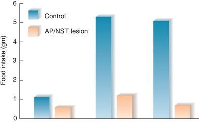
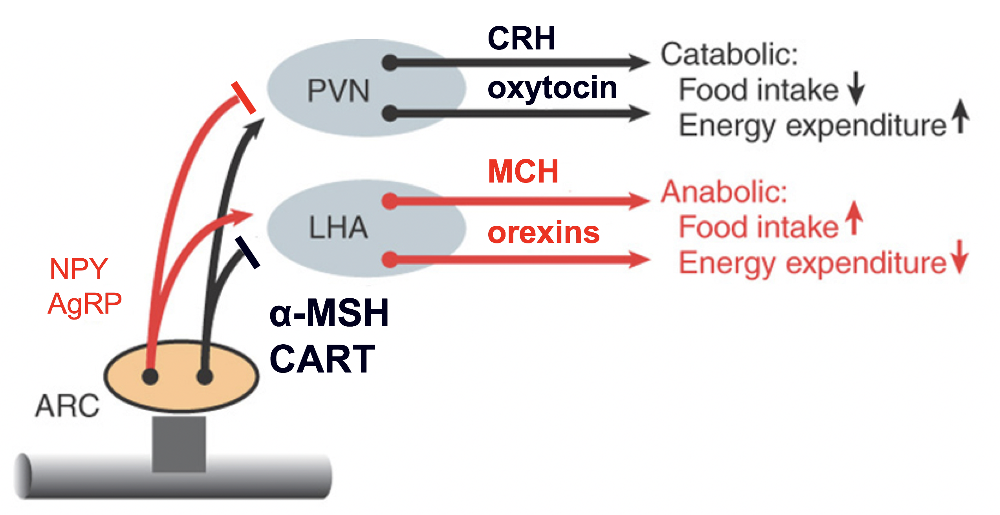

```{r setup, include=FALSE}
options(htmltools.dir.version = FALSE)
```


# Chapter 12:  Ingestive Behavior

#### Physiological Regulatory Mechanisms
#### Fluid Regulation
#### Nutrition and Metabolism
##### metabolism
##### hunger and satiety
##### .bold[neural mechanisms]
#### Obesity and Anorexia / Bulimia


---
name: 12-4-2
layout: true

# Nutrition and Metabolism
### Neural Mechanisms of Feeding - Brainstem. 
- basic mechanisms of feeding in brainstem
- demonstrated by eating in decerebrate rat
- consumes sweet or slightly salty, rejects bitter
- adjust responses after deprivation or supplementation
- area postrema and nucleus of solitary tract

<!--
control
lipo-
privation
gluco-
privation
-->

---
name: 12-4-3
layout: true

# Nutrition and Metabolism
### Neural Mechanisms of Feeding - Hypothalamus. 
.pull-left[
- neurons in medulla and hypothalamic arcuate nucleus release neuropeptide Y (NPY) during fasting
- arcuate also releases agouti-related protein (AgRP)
- very powerfully stimulates feeding (orexigenic)

- medulla 
  projections to 
  arcuate
- arcuate 
  projections to 
  LH and PVN
]
<!--
ghrelin
NPY
NPY/AgRP
-->

---
name: 12-4-4
layout: true

# Nutrition and Metabolism
### Neural Mechanisms of Feeding - Hypothalamus. 
.pull-left[
- NPY/AgRP activate LH neurons to release melanin concentrating hormone (MCH) and orexin during fasting
- stimulates feeding (orexigenic)

- projections to 
  cortex, PAG, RF,
  thalamus, LC
]
---
name: 12-4-5
layout: true

# Nutrition and Metabolism
### Neural Mechanisms of Feeding - Hypothalamus. 
.pull-left[
- NPY/AgRP inhibit PVN neurons to suppress release of corticotropin releasing hormone (CRH) and oxytocin during fasting
- removes (anorexigenic) inhibition of feeding
]

---
name: 12-4-6
layout: true

# Nutrition and Metabolism
### Neural Mechanisms of Satiety - Hypothalamus. 
.pull-left[
- leptin binds to receptors on NPY/AgRP neurons and inhibits them (anorexigenic)
]

---
name: 12-4-7
layout: true

# Nutrition and Metabolism
### Neural Mechanisms of Satiety - Hypothalamus. 
.pull-left[
- arcuate neurons release α-melanocyte stimulating hormone (α-MSH) and cocaine and amphetamine-regulated transcript (CART) after feeding
- blocks feeding (anorexigenic)

- projections to
  LH and PVN
]

---
name: 12-4-8
layout: true

# Nutrition and Metabolism
### Neural Mechanisms of Feeding - Hypothalamus. 
.pull-left[
- α-MSH and CART activate PVN neurons to release corticotropin releasing hormone (CRH) and oxytocin after feeding (anorexigenic)

- projections to 
  pituitary (CRH) 
  and various brain
  sites (oxytocin)
]

---
name: 12-4-9
layout: true

# Nutrition and Metabolism
### Neural Mechanisms of Feeding - Hypothalamus. 
.pull-left[
- α-MSH and CART inhibit LH neurons to suppress release of melanin concentrating hormone (MCH) and orexin after feeding (anorexigenic)
]

---
name: 12-4-10
layout: true

# Nutrition and Metabolism
### Neural Mechanisms of Feeding / Satiety - Hypothalamus. 
.pull-left[
- arcuate release of NPY/AgRP during fasting
- stimulates LH release of MCH and orexin (orexigenic)
- inhibits PVN release of CRH and oxytocin
]

<!--
CRH

oxytocin

MCH
orexins

  NPY
  AgRP 
α-MSH
CART
-->

---
name: 12-4-11
layout: true

# Nutrition and Metabolism
### Neural Mechanisms of Feeding / Satiety - Hypothalamus. 
.pull-left[
- arcuate release of α-MSH/CART 
- stimulates PVN release of CRH/oxytocin (anorexigenic)
- inhibits LH release of MCH and orexin
]

<!--
CRH
oxytocin

MCH
orexins

  NPY
  AgRP 
α-MSH
CART
-->

---
name: 12-4-12
layout: true

# Image Credits
- slide 2-9:	Carlson, N.R. (2012). Physiology of Behavior, 11th ed. Pearson Publishing
- slide 10-11: Zigmond, M.J., Bloom, F.E., Landis, S.C. Roberts, J.L., and Squire, L.R. (1999).  Fundamental Neuroscience., Academic Press.


---
template: 12-4-2





---
template: 12-4-3


---
template: 12-4-4


---
template: 12-4-5


---
template: 12-4-6


---
template: 12-4-7


---
template: 12-4-8


---
template: 12-4-9


---
template: 12-4-10


---
template: 12-4-11


---
template: 12-4-12

