```{r setup, include=FALSE}
options(htmltools.dir.version = FALSE)
```


# Chapter 12:  Ingestive Behavior

#### Physiological Regulatory Mechanisms
#### Fluid Regulation
#### Nutrition and Metabolism
#### .bold[Obesity and Anorexia / Bulimia]


---
name: 12-5-2
layout: true

# Obesity
### Epidemic in United States. 
.pull-left[
- 67% of adult males; 62% of adult females are overweight
- BMI over 30 = obese
- risk of cardiovascular disease, diabetes, stroke, arthritis, some forms of cancer
]

---
name: 12-5-3
layout: true

# Obesity
### Epidemic in United States. 
- difference between calories consumed and expended
- inexpensive, convenient, high-fat food
- sedentary lifestyle
- individual differences in metabolic efficiency
- gut microbiota firmicutes may also contribute

<!--
food intake    change in body mass
- energy output =
-->

---
name: 12-5-4
layout: true

# Nutrition and Metabolism
### Epidemic in United States. 
- difference between calories consumed and expended
- individual differences in metabolic efficiency

<!--
CRH
oxytocin
MC4R
MCH
orexins
  NPY
  AgRP 
α-MSH
CART
-->

---
name: 12-5-5
layout: true

# Nutrition and Metabolism
### Epidemic in United States. 
- difference between calories consumed and expended
- co-morbid health problems and medications

---
name: 12-5-6
layout: true

# Nutrition and Metabolism
### Epidemic in United States. 
- difference between calories consumed and expended
- gut microbiota, firmicutes may also contribute

---
name: 12-5-7
layout: true

# Obesity
### Treatments. 
- leptin replacement for treatment of leptin deficiency
- rare, most obese people have high levels of leptin

- obese individuals may have resistance to leptin and insulin

---
name: 12-5-8
layout: true

# Obesity
### Treatments. 
- serotonin agonists and a cannabinoid inverse agonist suppress eating, but drugs withdrawn by FDA due to cardiac problems (fenfluramine) and affective disorders (rimonobant)
- amphetamines (Phendimetrazine) have addiction liability, and numerous side effects


---
name: 12-5-9
layout: true

# Obesity
### Challenges of dieting.
- set point for adiposity is defended
- obese subjects restricted to</br> 13% of baseline food intake
- basal metabolism declined by 15%
- subjects only lost 6% of body weight

---
name: 12-5-10
layout: true

# Obesity
### Benefits of healthy weight.
- food restriction improves long-term health outcomes
- 20 years moderate calorie restriction in rhesus monkeys
- significant reductions in age-related disease and mortality

---
name: 12-5-11
layout: true

# Anorexia Nervosa
### Characteristics. 
.pull-left[
- rituals to restrict food intake, obsession with thinness, stimulant use, distorted self-image, increased exercise regimen, sometimes binging/purging or self-injury
- highly heritable
- co-morbidity with other 
  psychiatric disorders, 
  especially depression
- high levels of ghrelin, no 
  loss of appetite
]

---
name: 12-5-12
layout: true

# Anorexia Nervosa
### Complications. 
.pull-left[
- osteoporosis, bone fractures
- loss of brain tissue
- 5-10% of people with anorexia nervosa die
- physical complications or suicide

- difficult to study because 
  complications of starvation
  obscure underlying causes
- brain changes
- personality changes
- obsession/compulsions
]

---
name: 12-5-13
layout: true

# Anorexia Nervosa
### Treatment. 
**Cognitive Behavior Therapy**
- success rate < 50%, with 22% relapse within one year
- no successful pharmacotherapy

---
name: 12-5-14
layout: true

# Image Credits

- slide 2:	http://upload.wikimedia.org/wikipedia/commons/thumb/0/08/Obesity-waist_circumference.svg/1163px-Obesity-waist_circumference.svg.png
	Breedlove, S.M., Watson, N.V. (2013). Biological Psychology: An Introduction to Behavioral, Cognitive, and Clinical Neuroscience, 7th ed. Sinauer Associates, Inc.
- slide 3:	http://www.nutriwellcoaching.com/wp-content/uploads/2012/09/Childhood-Obesity-Facts.jpg
	https://queenprocrastinator.files.wordpress.com/2010/09/couch-potato.png
- slide 4: 	Zigmond, M.J., Bloom, F.E., Landis, S.C. Roberts, J.L., and Squire, L.R. (1999).  Fundamental Neuroscience., Academic Press.
- slide 5:	http://almost.thedoctorschannel.com/wp-content/uploads/2014/03/tumblr_ lyq13yRBiM1qk queuo1_500.jpg
	http://csrf.net/wp-content/uploads/2013/06/boy-normal-and-with-cushings.jpg
- slide 6:	http://www.frontiersin.org/files/Articles/57724/fnint-07-00070-r4/image_m/fnint-07-00070-g001.jpg
- slide 7:	Carlson, N.R. (2012). Physiology of Behavior, 11th ed. Pearson Publishing
- slide 8:	http://www.leanbodylook.com/wp-content/uploads/2013/12/Rimonabant1.jpg
	http://online.wsj.com/media/Fenphen_art_257_20080512165009.jpg
	http://www.dietpill.us/wp-content/uploads/2012/05/bontril.jpg


---
name: 12-5-15
layout: true

# Image Credits

- slide 9-10:	Breedlove, S.M., Watson, N.V. (2013). Biological Psychology: An Introduction to Behavioral, Cognitive, and Clinical Neuroscience, 7th ed. Sinauer Associates, Inc.
- slide 11:	http://b1969d.medialib.glogster.com/media/48787814c82d9accd5799bfe013215ffb36f1252ba 430f7ef77e6f9c4e4a7bef/anorexia-nervosa-image.jpgx 
- slide 12:	http://i.ytimg.com/vi/1keyUptzf9g/maxresdefault.jpg
- slide 13:	http://in8.uk.com/wp-content/uploads/sites/20/2013/05/CBT-image.png


---
template: 12-5-2

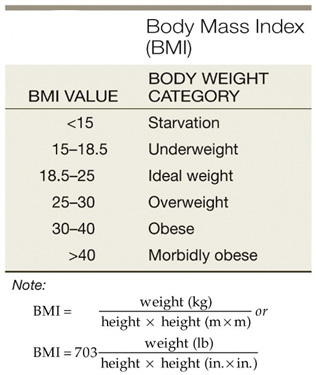

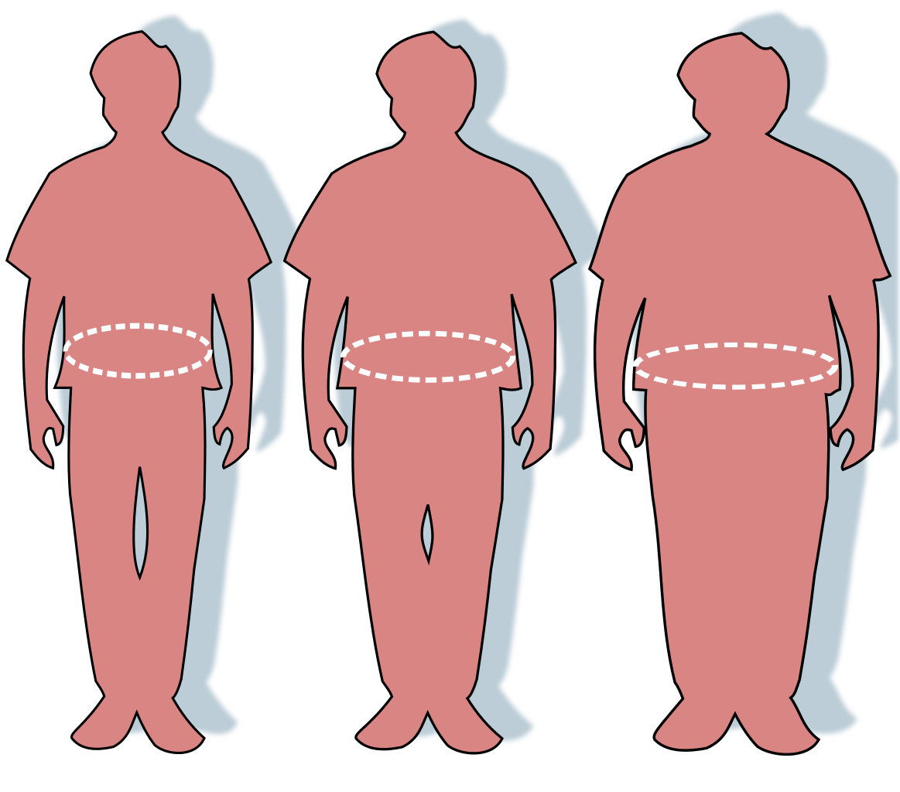


---
template: 12-5-3
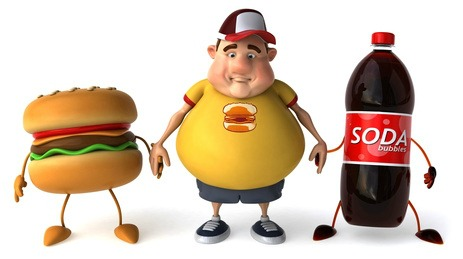

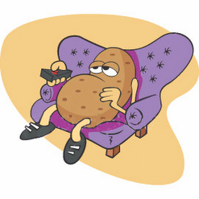


---
template: 12-5-4

.Large.bold.blue[]
.Large.bold.red[]
.Large.bold.red[]
.Large.bold.orange[]
.Large.bold.orange[]
.Large.bold.black[]
.Large.bold.black[]
.Large.bold.black[]
.Large.bold.red[]

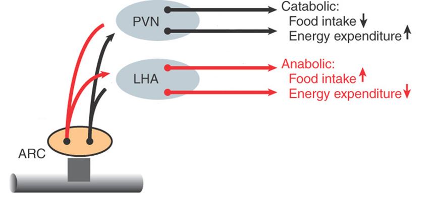

---
template: 12-5-4
count: false

.Large.bold.blue[]
.Large.bold.blue[]
.Large.bold.red[]
.Large.bold.red[]
.Large.bold.orange[]
.Large.bold.orange[]
.Large.bold.black[]
.Large.bold.black[]
.Large.bold.black[]
.Large.bold.red[]


---
template: 12-5-5

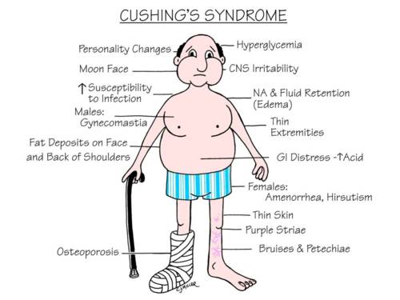

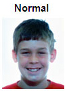

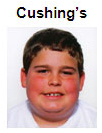


---
template: 12-5-6
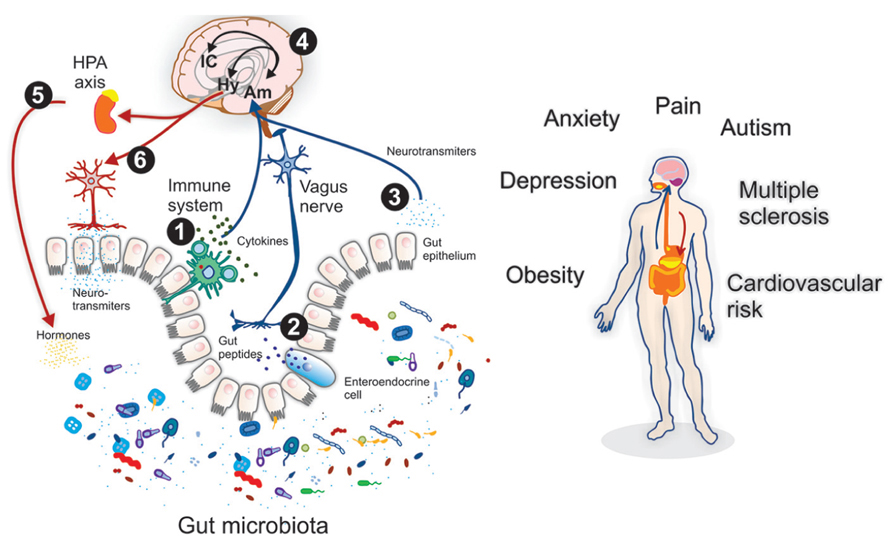


---
template: 12-5-7
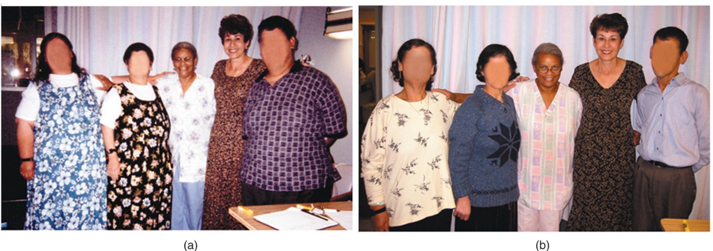


---
template: 12-5-8


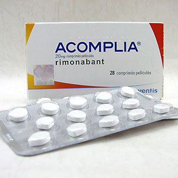

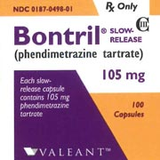


---
template: 12-5-9

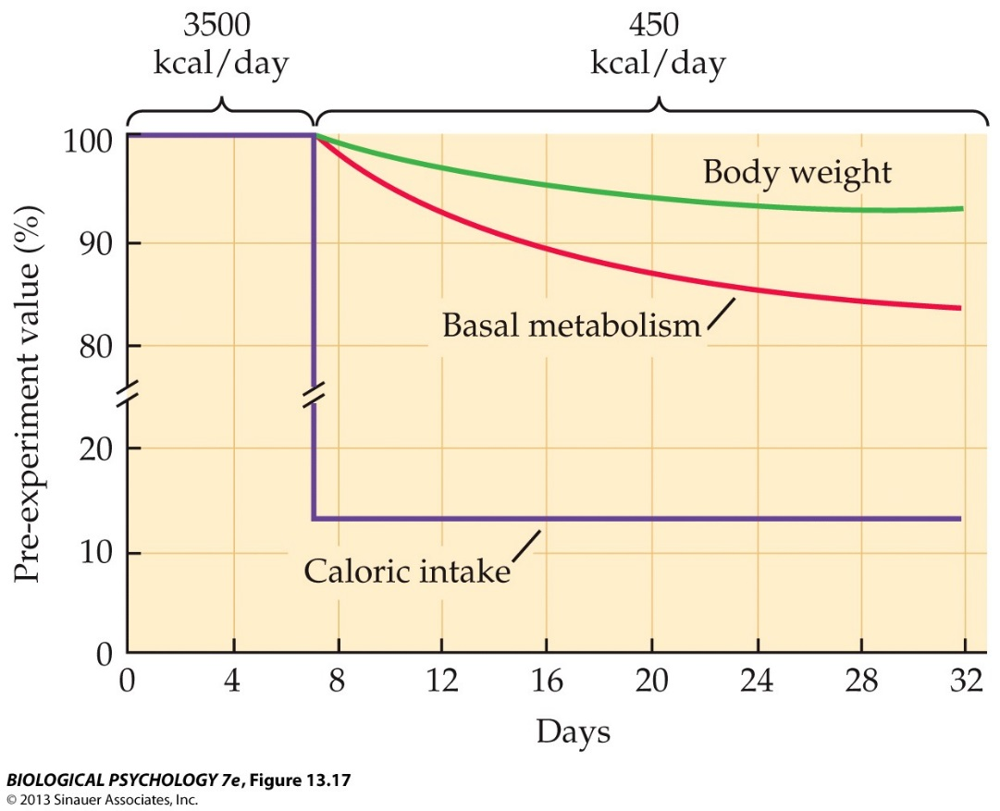


---
template: 12-5-10

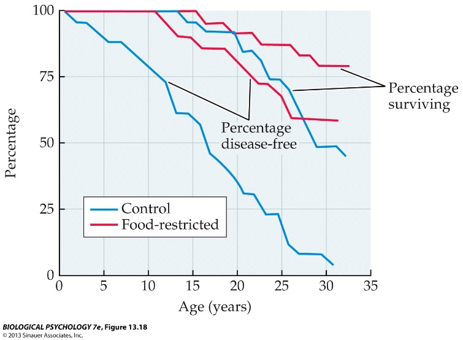


---
template: 12-5-11

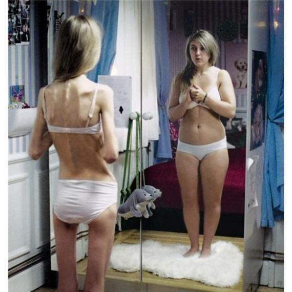


---
template: 12-5-12

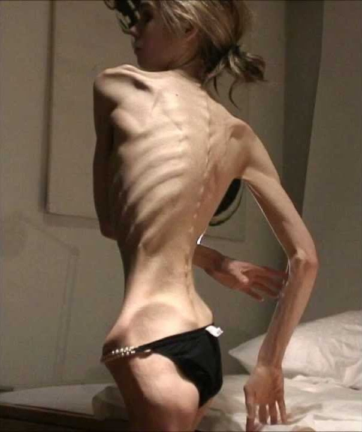


---
template: 12-5-13

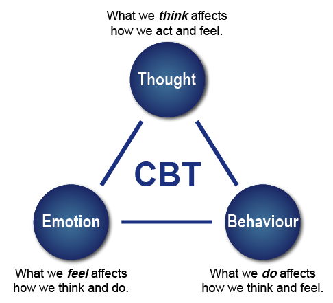

---
template: 12-5-14

---
template: 12-5-15