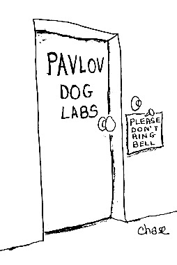
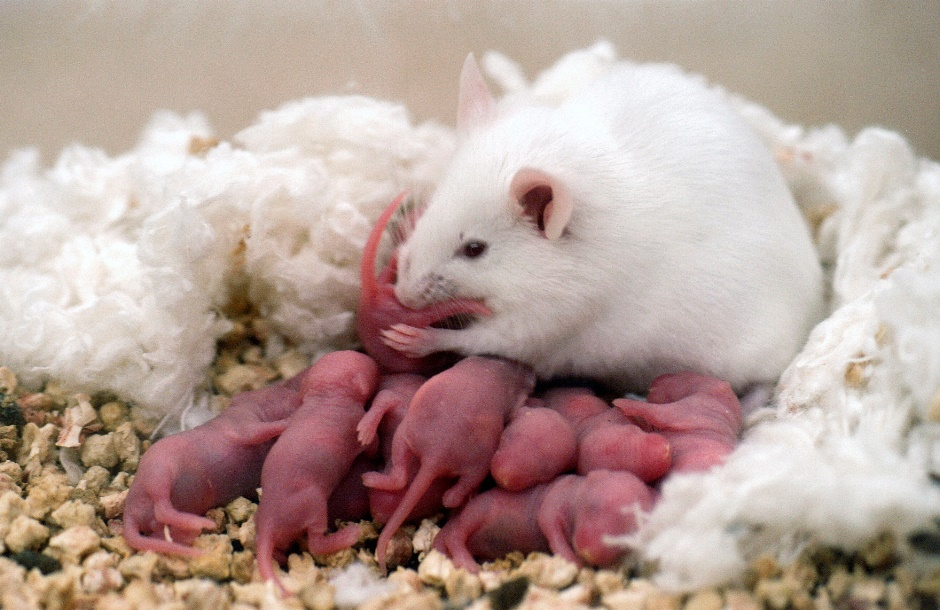
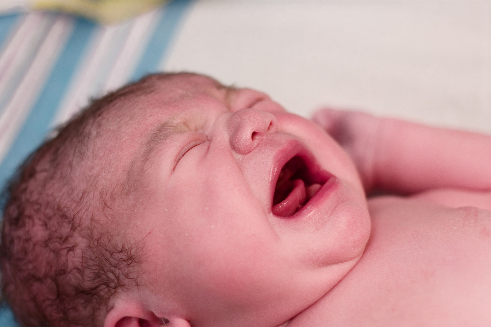
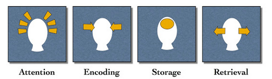

```{r setup, include=FALSE}
options(htmltools.dir.version = FALSE)
```


# Chapter 13:  Learning and Memory

#### The Nature of Learning</br>Four Principal Types of Learning</br>Two Principal Types of Memory</br>Memory Consolidation</br>Synaptic Plasticity</br>.tiny[<i class="em em-black_small_square"></i>Electrophysiological mechanisms]</br>.tiny[<i class="em em-black_small_square"></i>Biochemical mechanisms]</br>Neurobiological Mechanisms</br>Disorders


---
name: 13-1-2
layout: true

# Chapter 13:  Learning and Memory

#### .bold[The Nature of Learning]</br>Four Principal Types of Learning</br>Two Principal Types of Memory</br>Memory Consolidation</br>Synaptic Plasticity</br>.tiny[Electrophysiological mechanisms]</br>.tiny[Biochemical mechanisms]</br>Neurobiological Mechanisms</br>Disorders


---
name: 13-1-3
layout: true

# The Nature of Learning
### Toward a Definition of Learning and Memory. 
.pull-left[
- primary function is to acquire behaviors that allow adaptation to constantly-changing, hostile environment
	- find food, water, shelter, companions, mates
	- avoid physical threats / injuries
]

---
name: 13-1-4
layout: true

# The Nature of Learning
### Toward a Definition of Learning and Memory. 
- modification of behavior, knowledge, or potential to react, based upon individual experience
- lasting change, distinguishing it from transient reactions to sensory stimuli
- does not include injury, fatigue, poisoning, or genetically predetermined developmental changes.

---
name: 13-1-5
layout: true

# The Nature of Learning
### Toward a Definition of Learning and Memory. 
- Learning: experience-dependent generation or modification of enduring internal representations
- neuronally-encoded structures and functions which could potentially guide behavior
- Memory: retention of experience-dependent representations over time
- Retrieval: use of memory in neuronal and behavioral operations

---
name: 13-1-6
layout: true

# Image Credits

- title slide 2:	https://s-media-cache-ak0.pinimg.com/736x/a3/78/2f/a3782fe130d1c36b7dbfa630199a3549.jpg
- slide 3:	http://www.lanephotoworkshops.com/wp-content/uploads/2012/02/Newborn-fawn.jpg
	http://www.hdnicewallpapers.com/Walls/Big/Mouse/White_Rat_With_Cute_Pups_Wallpaper.jpg
	http://cutebabywallpapers.com/wp-content/uploads/2014/09/bigstock_Newborn_Baby_ Crying_In_Deliver.jpg
- slide 4:	http://upload.wikimedia.org/wikipedia/commons/5/5b/A_Bonobo_at_the_San_Diego_Zoo “fishing”_for_termites.jpg
	http://users.ox.ac.uk/~kgroup/tools/photos/lateral1.jpg
- slide 5:	http://urlnextdoor.com/wordpress/wp-content/uploads/2014/06/8-5-2014-4-02-44-PM.png


---
template: 13-1-2




---
template: 13-1-3

.polaroid[

]

.rotate-right.polaroid[

]


---
template: 13-1-3
count:false

.polaroid[

]

.rotate-right.polaroid[

]

.rotate-right.polaroid[

]

---
template: 13-1-4

.rotate-left.polaroid[

]

.rotate-right.polaroid[

]

---
template: 13-1-5


---
template: 13-1-6
