```{r setup, include=FALSE}
options(htmltools.dir.version = FALSE)
```


# Chapter 13:  Learning and Memory

#### The Nature of Learning</br>.bold[Four Principal Types of Learning]</br>Two Principal Types of Memory</br>Memory Consolidation</br>Synaptic Plasticity</br>.tiny[<i class="em em-black_small_square"></i>Electrophysiological mechanisms]</br>.tiny[<i class="em em-black_small_square"></i>Biochemical mechanisms]</br>Neurobiological Mechanisms</br>Disorders


---
name: 13-2-2
layout: true

# The Four Principal Types of Learning
### 1) Perceptual Learning. 
- Learning to recognize stimulus
- Identify and characterize stimuli
- Every sensory system is capable

---
name: 13-2-3
layout: true

# The Four Principal Types of Learning
### 1) Perceptual Learning. 
- Learning may be automatic and unconscious

---
name: 13-2-4
layout: true

# The Four Principal Types of Learning
### 2) Motor Learning. 
.pull-left[
- Learning to make a new response
- Changes in a neural circuit that controls a particular behavior, or alteration in ability to perform a motor task
]

---
name: 13-2-5
layout: true

# The Four Principal Types of Learning
### 3) Stimulus/Response (S/R) Learning. 
.pull-left[
- Learning to make a response in presence of a stimulus, changes in connections in sensory-motor circuits
- **Non-associative learning** (habituation/sensitization/dishabituation)
- **Habituation** = attenuated response after exposure to one or more presentations of stimulus
]

---
name: 13-2-6
layout: true

# The Four Principal Types of Learning
### 3) Stimulus/Response (S/R) Learning. 
.pull-left[
- **Non-associative learning** (habituation/sensitization/dishabituation)
- **Sensitization** = exaggerated response after exposure to one or more stimuli
]

---
name: 13-2-7
layout: true

# The Four Principal Types of Learning
### 3) Stimulus/Response (S/R) Learning. 
.pull-left[
- **Non-associative learning** (habituation/sensitization/dishabituation)
- **Dishabituation** = robust response that was previously habituated, after exposure to a dishabituating (usually noxious) stimulus
]

---
name: 13-2-8
layout: true

# The Four Principal Types of Learning
### 3) Stimulus/Response (S/R) Learning. 
.pull-left[
- **Associative learning** (classical/operant conditioning)
- **Classical conditioning** = adaptation in which an unimportant stimulus acquires importance
    - calls upon automatic species-typical responses
    - requires association between two stimuli
]

<!--
CS (neutral)
US
CS

CS (neutral)
US
-->

---
name: 13-2-9
layout: true

# The Four Principal Types of Learning
### 3) Stimulus/Response (S/R) Learning. 
.pull-left[
- **Associative learning** (classical/operant conditioning)
- **CS+** is initially unimportant stimulus paired with meaningful stimulus
- **CS-** is unpaired stimulus
]
<!--
CS+ siphon 
stimulation
US tailshock
CS- mantle
stimulation
time →

160
+
CS-
CS+
140
120

classical
conditioning

pre-conditioning
baseline
}
100
withdrawal (% baseline)
-->

---
name: 13-2-10
layout: true

# The Four Principal Types of Learning
### 3) Stimulus/Response (S/R) Learning. 
- **Classical Conditioning**

<!--
somatosensory 
neuron from tail
synapse T from tail
(strong)
tail shock
(US)

defensive
withdrawal
(CR)
siphon
touch
(CS+)

synapse S from siphon
(weak)
somatosensory 
neuron from siphon
-->

---
name: 13-2-11
layout: true

# The Four Principal Types of Learning
### 3) Stimulus/Response (S/R) Learning. 
.pull-left[
- Learning to make a response in presence of a stimulus, changes in connections in sensory-motor circuits
- **Associative learning** (classical/operant conditioning)
- **Operant** or **instrumental conditioning** = adaptation in which organism acquires information about consequences of actions
    - calls for learned behaviors
    - requires association between stimulus and response
]

---
name: 13-2-12
layout: true

# The Four Principal Types of Learning
### 3) Stimulus/Response (S/R) Learning. 
.pull-left[
- **Operant conditioning**:
- **Reinforcement** = appetitive stimulus (e.g. food) increases probability or intensity of specific behavior
- **Punishment** = aversive stimulus (e.g. electric shock) decreases probability or intensity of specific behavior
- **Negative Reinforcement** = aversive stimulus is delivered in absence of particular behavior, but is omitted in presence of behavior
]

---
name: 13-2-13
layout: true

# The Four Principal Types of Learning
### 3) Stimulus/Response (S/R) Learning. 
- **Operant Conditioning**
- sensory input yields perception of rf+-relevant cues
- activates motor neurons that produce specific behavior
- reinforcement activates system that strengthens association between sensory input and motor output
- behavior reoccurs

---
name: 13-2-14
layout: true

# The Four Principal Types of Learning
### 4) Relational Learning. 
.pull-left[
- the most complex form of learning
- includes ability to recognize objects through more than one sensory modality, recognizing relative locations of objects within the environment, remembering the sequence of events in an episode
]

---
name: 13-2-15
layout: true

# Image Credits

- slide 2:	http://funlava.com/wp-content/uploads/2013/05/abraham-lincoln.jpg
	coloured shapes drawn by D.P. Devine
- slide 3:	http://www.mrc-cbu.cam.ac.uk/people/matt-davis/personal/sine-wave-speech/
	http://www.mrc-cbu.cam.ac.uk//personal/matt.davis/personal/sine-wave-speech/frog.jpg
- slide 4:	http://sciencenordic.com/sites/default/files/imagecache/300x/football.jpg
 	http://www.edublox.com/learning_disabilities/images/shoelaces.gif
	https://lupusadventurebetweenthelines.files.wordpress.com/2011/06/00409063.jpg
- slide 5:	http://brembs.net/learning/aplysia/aplysia.jpg
	http://i.kinja-img.com/gawker-media/image/upload/s--zEjLes6X--/18325m17imnoujpg.jpg
	Pinel, J.P.J. (1997). Biopsychology, 4th ed. Allyn and Bacon.
	http://gcuonline.georgian.edu/field_ps432_40/images/Habituation.gif
- slide 6:	Pinel, J.P.J. (1997). Biopsychology, 4th ed. Allyn and Bacon.
	http://gcuonline.georgian.edu/field_ps432_40/images/sensitization.gif
- slide 7:	Pinel, J.P.J. (1997). Biopsychology, 4th ed. Allyn and Bacon.
	http://gcuonline.georgian.edu/field_ps432_40/images/Spontaneous_Recovery_Habituation.gif
- slide 8:	http://careforreactivedogs.com/wp-content/uploads/2014/04/counter-conditioning.jpg
- slide 9:	Pinel, J.P.J. (1997). Biopsychology, 4th ed. Allyn and Bacon.
	graphs drawn by D.P. Devine


---
name: 13-2-16
layout: true

# Image Credits

- slide 10:	Carlson, N.R. (2012). Physiology of Behavior, 11th ed. Pearson Publishing
- slide 11:	http://cdn-5.simplypsychology.org/skinner box.jpg
- slide 12:	Breedlove, S.M., Watson, N.V. (2013). Biological Psychology: An Introduction to Behavioral, Cognitive, and Clinical Neuroscience, 7th ed. Sinauer Associates, Inc.
- slide 13:	Carlson, N.R. (2012). Physiology of Behavior, 11th ed. Pearson Publishing
- slide 14:	http://www.nature.com/scientificamericanmind/journal/v19/n4/images/scientificamericanmind 0808-22-I1.jpg


---
template: 13-2-2

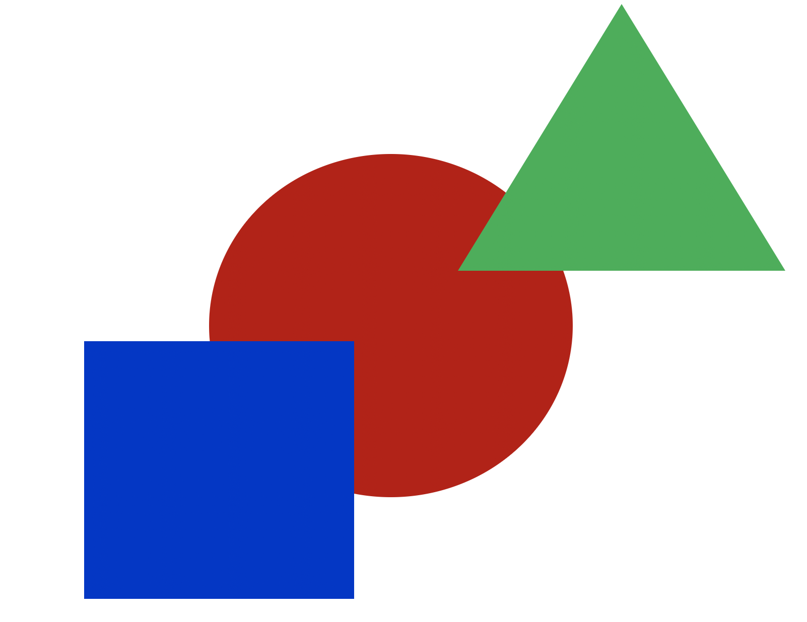

---
template: 13-2-2
count: false

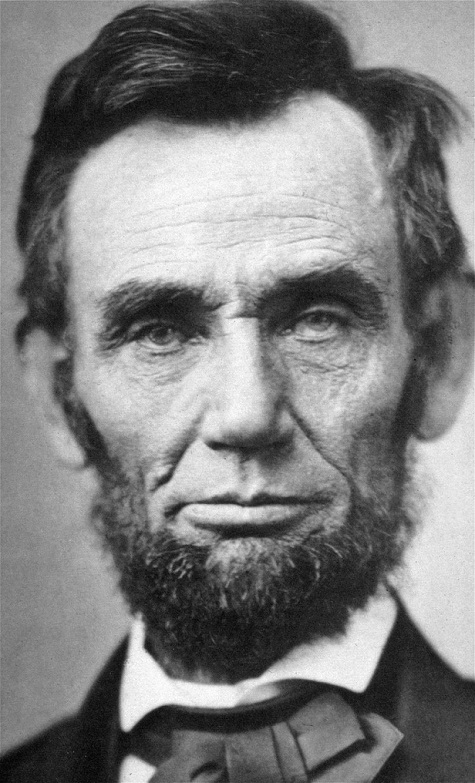


---
template: 13-2-3

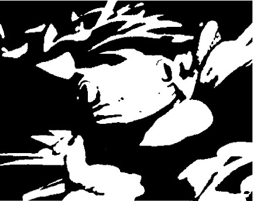


---
template: 13-2-3
count: false

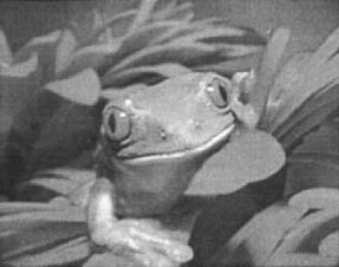

---
template: 13-2-3
count: false


---
template: 13-2-4

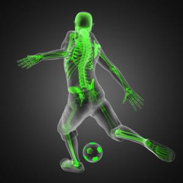
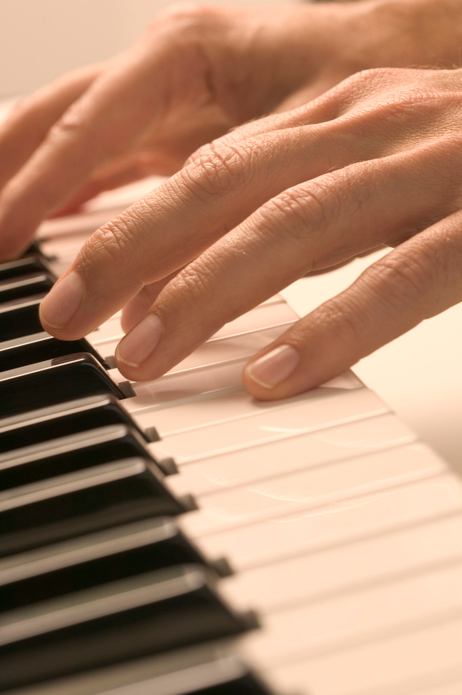
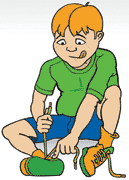

---
template: 13-2-5

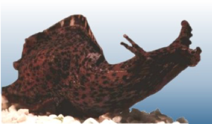
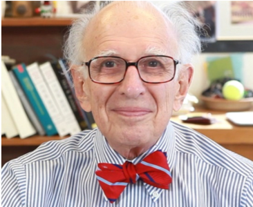


---
template: 13-2-5
count: false


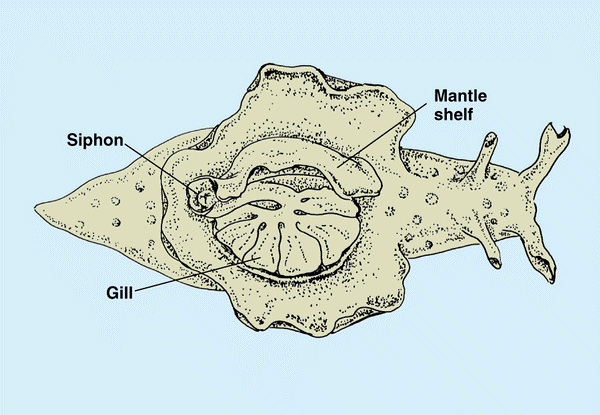
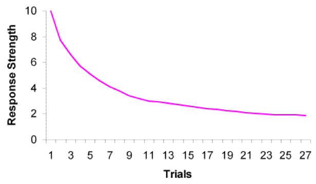


---
template: 13-2-6

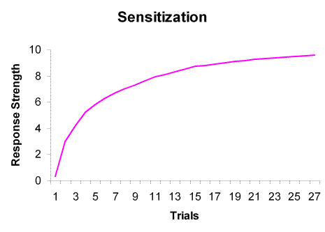


---
template: 13-2-7

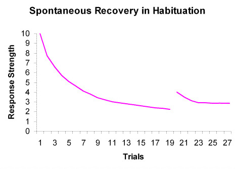


---
template: 13-2-8

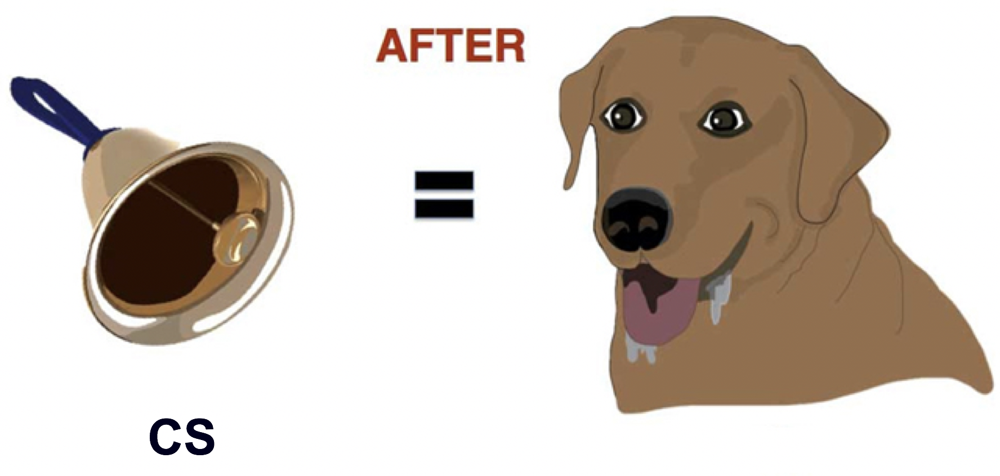

---
template: 13-2-9

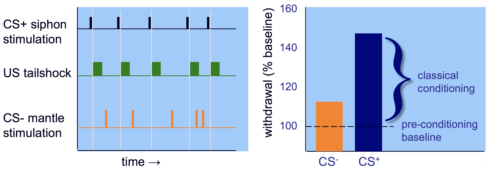


---
template: 13-2-10

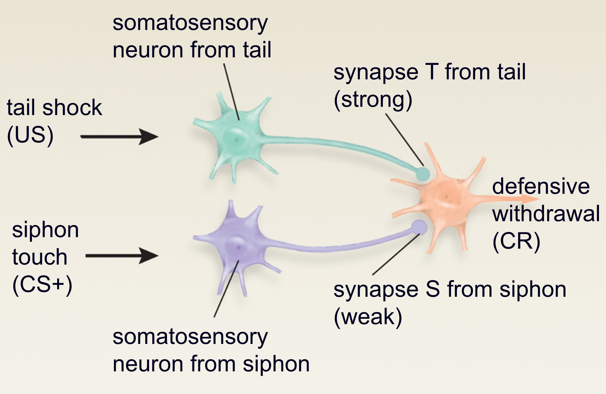

---
template: 13-2-10
count:false

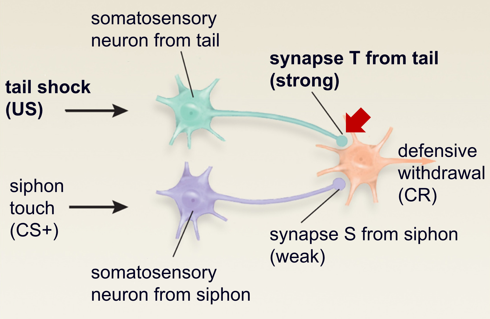


---
template: 13-2-10
count:false

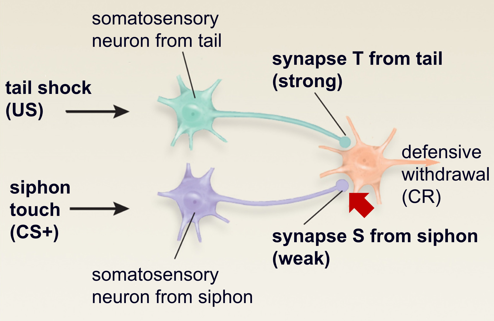


---
template: 13-2-11
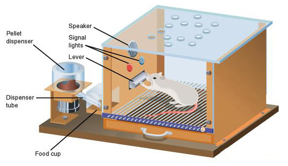


---
template: 13-2-12
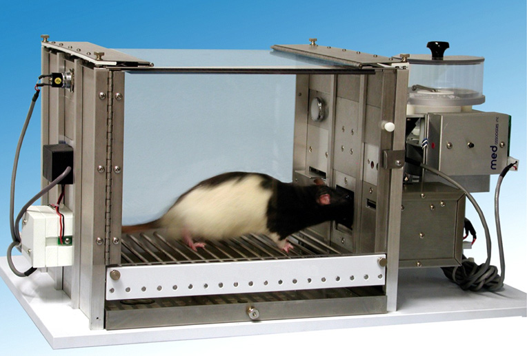


---
template: 13-2-13
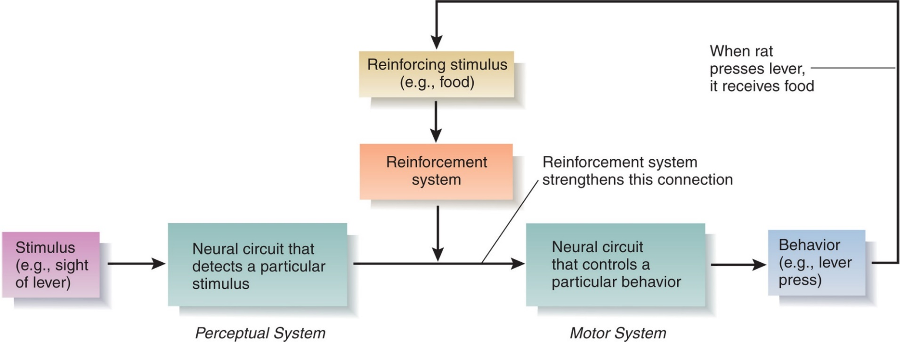


---
template: 13-2-14

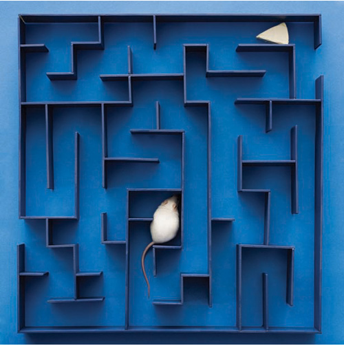

---
template: 13-2-15

---
template: 13-2-16