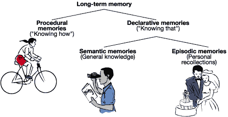
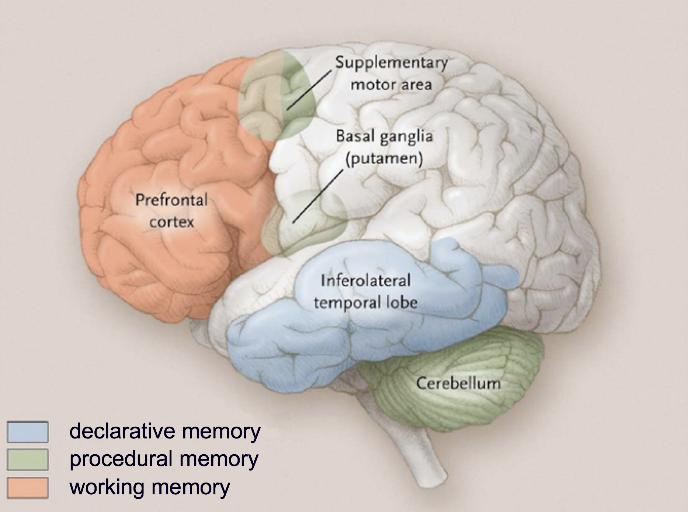
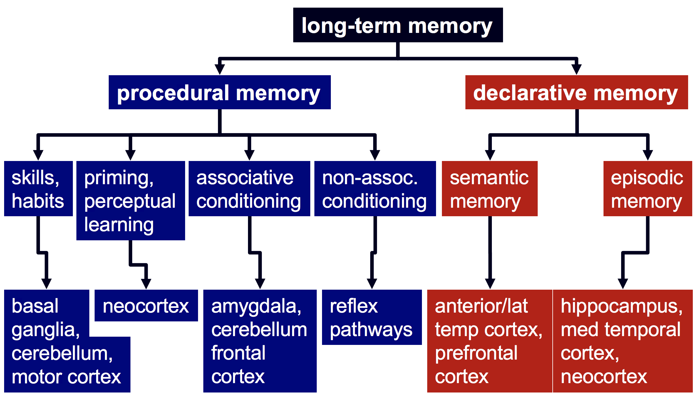
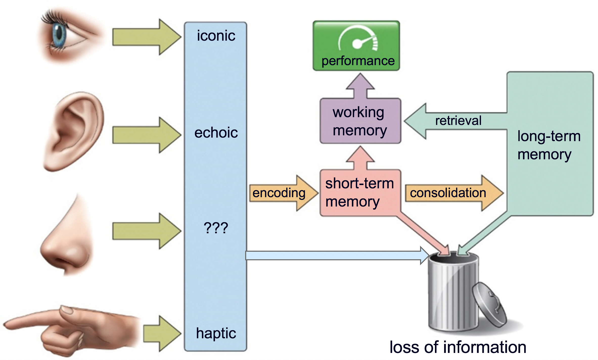
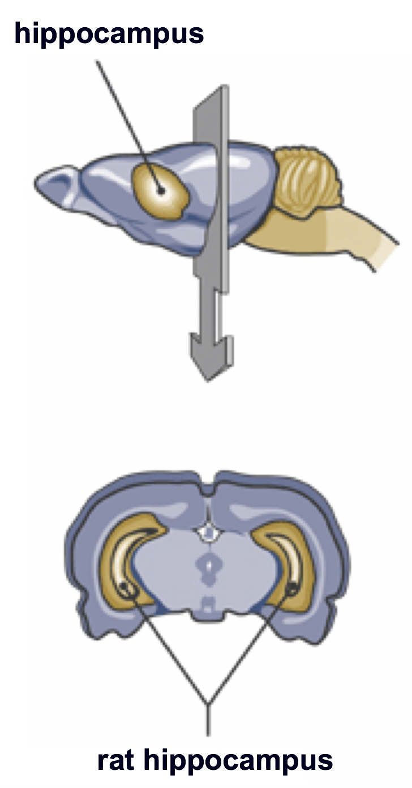
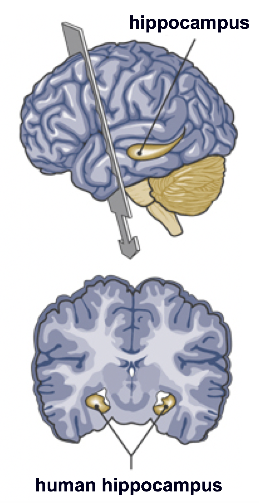
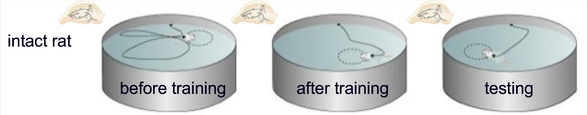
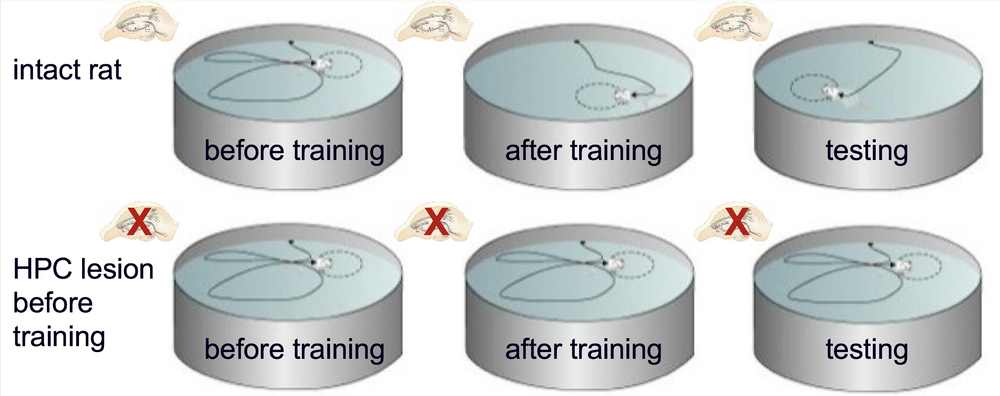
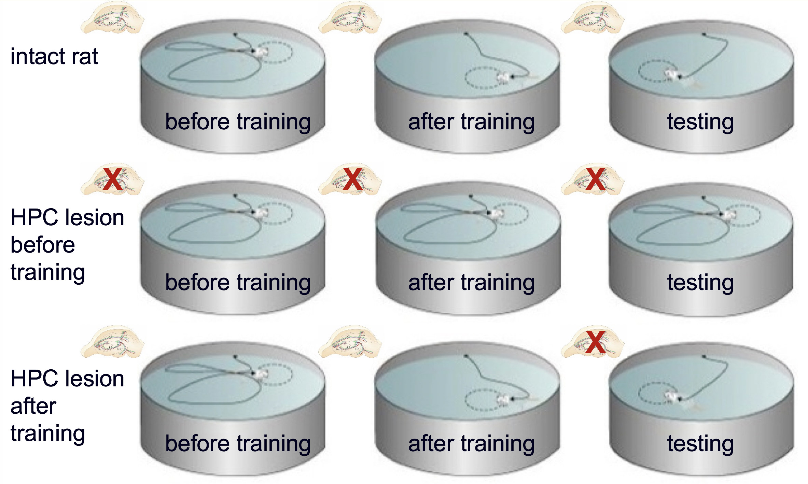

```{r setup, include=FALSE}
options(htmltools.dir.version = FALSE)
```


# Chapter 13:  Learning and Memory

#### The Nature of Learning</br>Four Principal Types of Learning</br>.bold[Two Principal Types of Memory]</br>.bold[Memory Consolidation]</br>Synaptic Plasticity</br>.tiny[<i class="em em-black_small_square"></i>Electrophysiological mechanisms]</br>.tiny[<i class="em em-black_small_square"></i>Biochemical mechanisms]</br>Neurobiological Mechanisms</br>Disorders


---
name: 13-3-2
layout: true

# The Two Principal Types of Learning
### Declarative Memory. 
.pull-left[
- **explicit knowledge** that can be described in words
- general memory, of which we are aware
- **semantic memory**: knowledge that does not include information about where or when you learned it
- **episodic memory**: autobiographical
]

<!--
Who
What
When
Where
Why
What
-->

---
name: 13-3-3
layout: true

# The Two Principal Types of Learning
### Non-declarative Memory. 
- **implicit information** demonstrated by performance
- **skills**: performance at challenging tasks
- **priming**: change in processing with exposure to stimulus

---
name: 13-3-4
layout: true

# The Two Principal Types of Learning
### Brain Regions. 
- different regions implicated as </br> principal mediators of:
    - declarative memories
    - non-declarative memories

---
name: 13-3-5
layout: true

# The Two Principal Types of Learning
### Brain Regions. 
- different regions implicated as principal mediators of declarative and non-declarative types of memories

---
name: 13-3-6
layout: true

# Memory Consolidation
### Stages of Memory Consolidation. 
- sensory memory → short-term memory → intermediate-term memory → long-term memory


<!--
iconic
performance
working
memory
retrieval
echoic
long-term
memory
short-term
memory
encoding
consolidation
?
haptic
loss of information
-->


---
name: 13-3-7
layout: true

# Memory Consolidation
### Role of the Hippocampus. 
- hippocampus implicated in consolidation of declarative memory

---
name: 13-3-8
layout: true

# Memory Consolidation
### Role of the Hippocampus. 
- For declarative learning </br>hippocampus necessary for 
    - acquisition 
    - *not* retrieval

<!--
before training
after training
testing
intact rat
before training
after training
testing
HPC lesion
after
training
X
before training
testing
HPC lesion
before
training
after training
X
X
X
-->

---
name: 13-3-9
layout: true

# Image Credits

- slide 2-3:	http://readfast.co.uk/wp-content/uploads/2013/01/Decrative-Memory-2.gif
- slide 4:	http://www.discoverymedicine.com/Andrew-E-Budson/files/2009/08/budson_26_fig2.jpg
- slide 5:	drawn by D.P. Devine
- slide 6:	Breedlove, S.M., Watson, N.V. (2013). Biological Psychology: An Introduction to Behavioral, Cognitive, and Clinical Neuroscience, 7th ed. Sinauer Associates, Inc.
- slide 7:	http://pubs.niaaa.nih.gov/publications/arh284/images/swart1.gif
	http://upload.wikimedia.org/wikipedia/commons/9/99/Hippocampus.gif
- slide 8:	http://mikeclaffey.com/psyc170/notes/images/memory-water-maze-lesions.jpg


---
template: 13-3-2




---
template: 13-3-3


---
template: 13-3-4




---
template: 13-3-5



---
template: 13-3-6




---
template: 13-3-7





---
template: 13-3-8



---
template: 13-3-8
count: false



---
template: 13-3-8
count: false



---
template: 13-3-9
