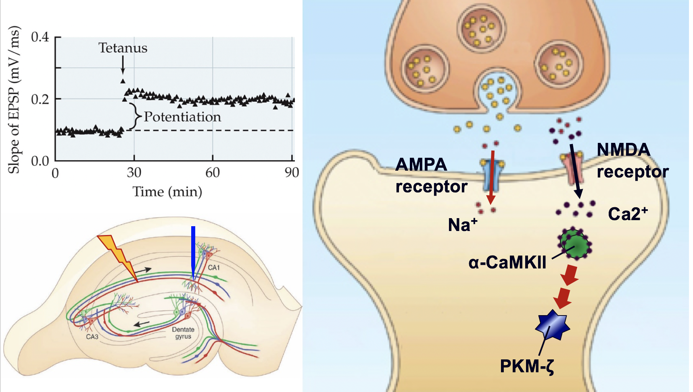
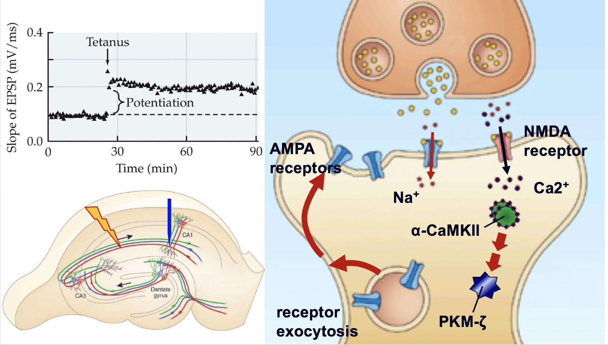
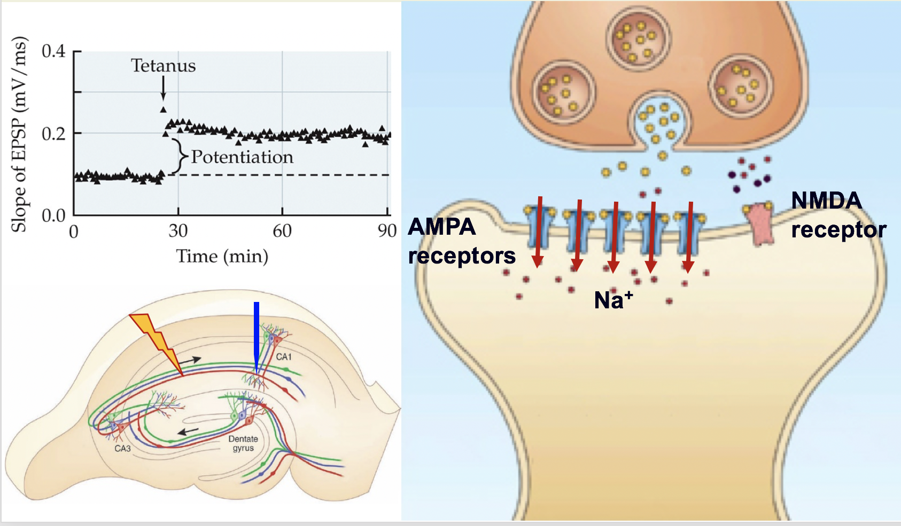
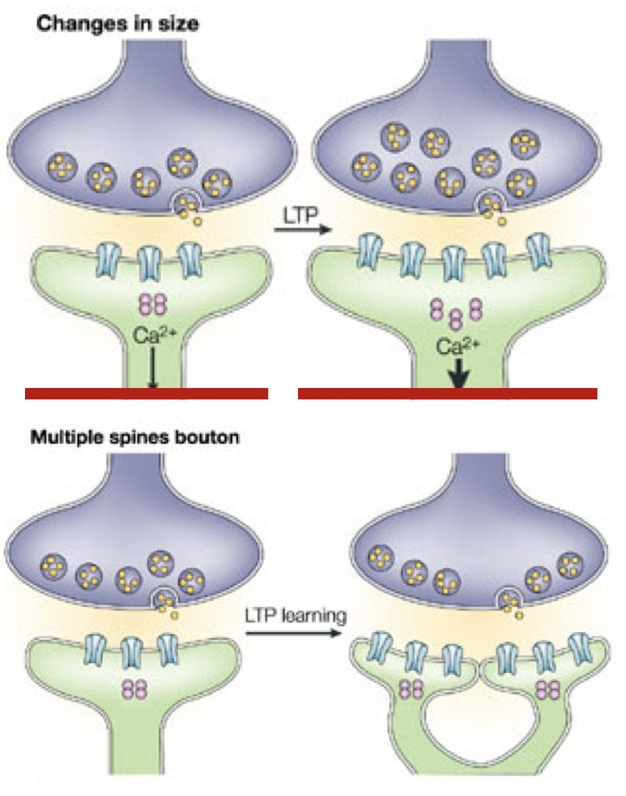
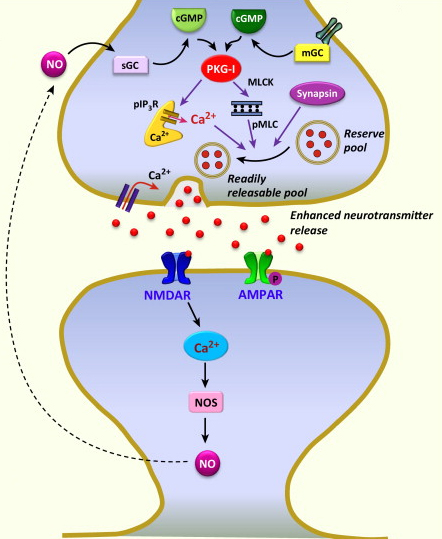
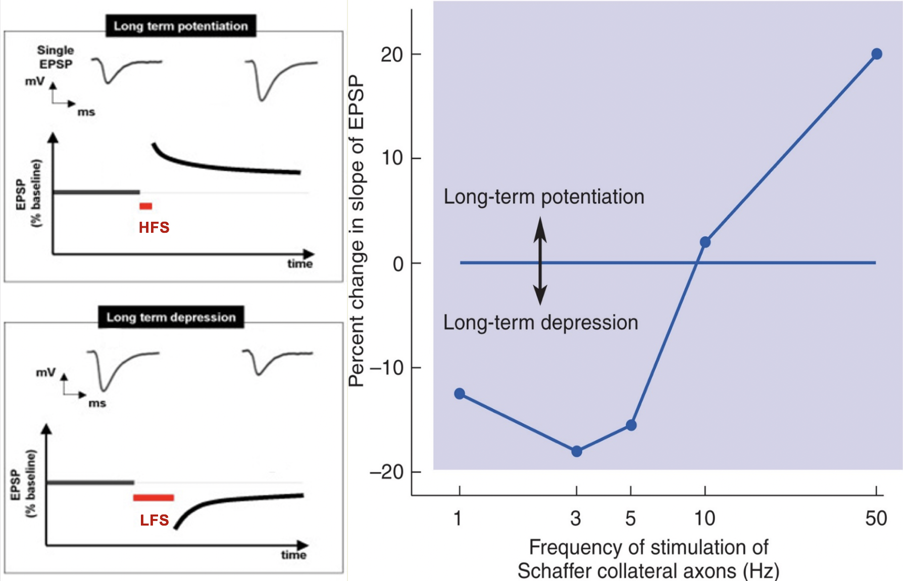
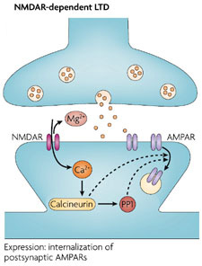
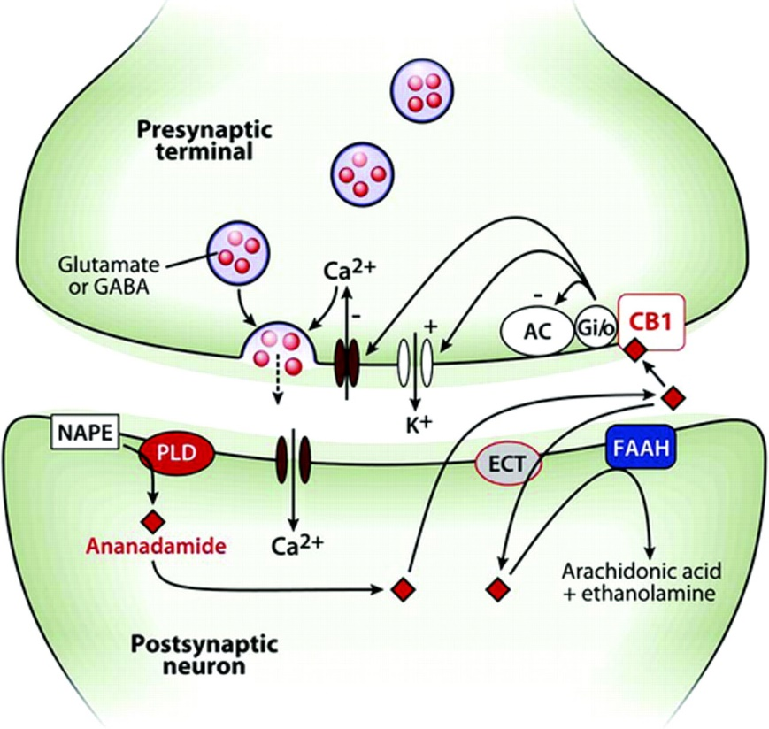

```{r setup, include=FALSE}
options(htmltools.dir.version = FALSE)
```


# Chapter 13:  Learning and Memory

#### The Nature of Learning</br>Four Principal Types of Learning</br>Two Principal Types of Memory</br>Memory Consolidation</br>Synaptic Plasticity</br>.tiny[<i class="em em-black_small_square"></i>Electrophysiological mechanisms]</br>.tiny[<i class="em em-black_small_square"></i>Biochemical mechanisms]</br>.bold[Neurobiological Mechanisms]</br>Disorders


---
name: 13-5-2
layout: true

# Neurobiological Mechanisms
### Long-Term Potentiation - NMDA and AMPA Receptors. 
**Step 1**: 
- activate Ca2+-dependent enzymes </br>including protein kinase α-CAMKII </br>(Ca2+/calmodulin-dependent kinase)
- recruitment of additional enzymes </br> like PKM-zeta 

<!--
NMDA
receptor
AMPA
receptor
Ca2+
Na+
α-CaMKII
PKM-ζ
-->


---
name: 13-5-3
layout: true

# Neurobiological Mechanisms
### Long-Term Potentiation - NMDA and AMPA Receptors. 
**Step 2**: 
- activated enzymes induce functional</br> changes in postsynaptic structures </br>of the stimulated synapse
- increased postsynaptic </br>AMPA receptor insertion

<!--
NMDA
receptor

AMPA
receptors
Ca2+

Na+
receptor
exocytosis


α-CaMKII
PKM-ζ
-->

---
name: 13-5-4
layout: true

# Neurobiological Mechanisms
### Long-Term Potentiation - NMDA and AMPA Receptors. 
**Step 2** (continued): 
-  increased AMPA receptor expression</br> enhances response to glutamate </br> inputs without need for</br> postsynaptic depolarization

<!--
NMDA
receptor

AMPA
receptors
Na+
-->

---
name: 13-5-5
layout: true

# Neurobiological Mechanisms
### Long-Term Potentiation - Postsynaptic Structural Changes. 
**Step 3** 
- activated enzymes induce structural changes 
- remodel spines
- new functional spines
- requires protein synthesis

---
name: 13-5-6
layout: true

# Neurobiological Mechanisms
### Long-Term Potentiation - Presynaptic Structural Changes. 
- increase in size of active zone
- increased release of neurotransmitter
- NO signaling

---
name: 13-5-7
layout: true

# Neurobiological Mechanisms
### Long-Term Depression. 
- LFS-induced depression, </br>usually dependent on NMDAR


---
name: 13-5-8
layout: true

# Neurobiological Mechanisms
### Long-Term Depression - NMDA and AMPA Receptors. 
- **Step 1**:  
    - contiguous presynaptic glutamate release and very small amounts of postsynaptic depolarization
    - very small amounts of Ca2+ influx through NMDAR
    - activation of Ca2+-dependent enzymes including 
  calcineurin, a protein phosphatase

<!--
LTP
[Ca2+] > 5 mM

LTD
[Ca2+] < 5 mM
α-CaMKII
NMDA
receptor

AMPA
receptor
Na+
Ca2+
PKM-ζ

-->

---
name: 13-5-9
layout: true

# Neurobiological Mechanisms
### Long-Term Depression - NMDA and AMPA Receptors. 
.pull-left[
- **Step 2**: 
    - activated enzymes induce functional changes in postsynaptic structures of depressed synapse
    - dephosphorylation of 
  proteins causes 
  internalization of AMPA 
  receptors from postsynaptic
   density
   
- **Step 3**:  
    - decreased expression
   of AMPA receptors decreases
   overall response to glutamate 
]

---
name: 13-5-10
layout: true

# Neurobiological Mechanisms
### Long-Term Depression - Presynaptic Structural Changes. 
- decreased release of neurotransmitter
- eCB signaling

---
name: 13-5-11
layout: true

# Image Credits

- slide 2-4:	http://o.quizlet.com/FUOS6IJbPRjqKVs5.PlGOw_m.png
- slide 5:	http://www.nature.com/nrn/journal/v5/n1/images/nrn1301-f2.jpg
	http://jn.physiology.org/content/jn/87/6/2770/F1.large.jpg
- slide 6:	http://www.cell.com/cms/attachment/2014555194/2035957008/gr3.jpg
- slide 7:	http://www.molecularbrain.com/content/figures/1756-6606-3-2-2.jpg
	Carlson, N.R. (2012). Physiology of Behavior, 11th ed. Pearson Publishing
- slide 8:	http://o.quizlet.com/FUOS6IJbPRjqKVs5.PlGOw_m.png
- slide 9:	http://www.nature.com/nrn/journal/v8/n11/images/nrn2234-f2.jpg
- slide 10:	http://www.neurology.org/content/vol69/issue3/images/large/13FF1.jpeg


---
template: 13-5-2




---
template: 13-5-3




---
template: 13-5-4




---
template: 13-5-5




---
template: 13-5-6




---
template: 13-5-7




---
template: 13-5-8


---
template: 13-5-9



---
template: 13-5-10


---
template: 13-5-11

